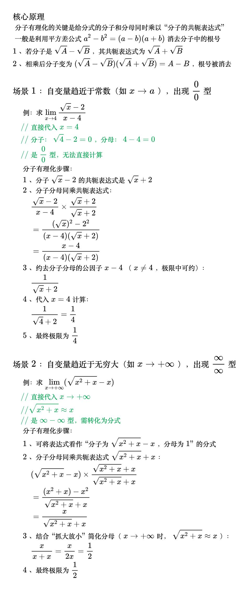

# 分子有理化

<!--
\begin{align}
& {\large 核心原理} \\
& 分子有理化的关键是给分式的分子和分母同时乘以“分子的共轭表达式” \\
& 一般是利用平方差公式 a^2 - b^2 = (a - b)(a + b) 消去分子中的根号 \\
& 1、若分子是 \sqrt{A} - \sqrt{B}，其共轭表达式为 \sqrt{A} + \sqrt{B} \\
& 2、相乘后分子变为 (\sqrt{A} - \sqrt{B})(\sqrt{A} + \sqrt{B}) = A - B，根号被消去 \\
\\
& {\large 场景1：自变量趋近于常数（如 x\to a），出现\frac{0}{0}型} \\
& \quad 例：求 \lim_{x \to 4} \frac{\sqrt{x} - 2}{x - 4} \\
& \quad {\color{Green} // 直接代入 x=4} \\
& \quad {\color{Green} // 分子：\sqrt{4} - 2 = 0，分母：4 - 4 = 0} \\
& \quad {\color{Green} // 是\frac{0}{0}型，无法直接计算} \\
& \quad 分子有理化步骤： \\
& \quad\; 1、分子 \sqrt{x} - 2 的共轭表达式是 \sqrt{x} + 2 \\
& \quad\; 2、分子分母同乘共轭表达式： \\
& \quad\;\quad \frac{\sqrt{x} - 2}{x - 4} \times \frac{\sqrt{x} + 2}{\sqrt{x} + 2} \\
& \quad\;\quad = \frac{(\sqrt{x})^2 - 2^2}{(x - 4)(\sqrt{x} + 2)} \\
& \quad\;\quad = \frac{x - 4}{(x - 4)(\sqrt{x} + 2)} \\
& \quad\; 3、约去分子分母的公因子 x - 4（x\ne4，极限中可约）： \\
& \quad\;\quad \frac{1}{\sqrt{x} + 2} \\
& \quad\; 4、代入 x=4 计算： \\
& \quad\;\quad \frac{1}{\sqrt{4} + 2} = \frac{1}{4} \\
& \quad\; 5、最终极限为 \frac{1}{4} \\
\\
& {\large 场景2：自变量趋近于无穷大（如 x\to +\infty），出现\frac{\infty}{\infty}型} \\
& \quad 例：求 \lim_{x \to +\infty} (\sqrt{x^2 + x} - x) \\
& \quad {\color{Green} // 直接代入 x\to+\infty} \\
& \quad {\color{Green} // \sqrt{x^2 + x}\approx x} \\
& \quad {\color{Green} // 是\infty-\infty型，需转化为分式} \\
& \quad 分子有理化步骤： \\
& \quad\; 1、可将表达式看作“分子为\sqrt{x^2 + x} - x，分母为 1”的分式 \\
& \quad\; 2、分子分母同乘共轭表达式\sqrt{x^2 + x} + x： \\
& \quad\;\quad (\sqrt{x^2 + x} - x) \times \frac{\sqrt{x^2 + x} + x}{\sqrt{x^2 + x} + x} \\
& \quad\;\quad = \frac{(x^2 + x) - x^2}{\sqrt{x^2 + x} + x} \\
& \quad\;\quad = \frac{x}{\sqrt{x^2 + x} + x} \\
& \quad\; 3、结合“抓大放小”简化分母（x\to+\infty 时，\sqrt{x^2 + x} \approx x）： \\
& \quad\;\quad \frac{x}{x + x} = \frac{x}{2x} = \frac{1}{2} \\
& \quad\; 4、最终极限为 \frac{1}{2} \\
\end{align}
-->

