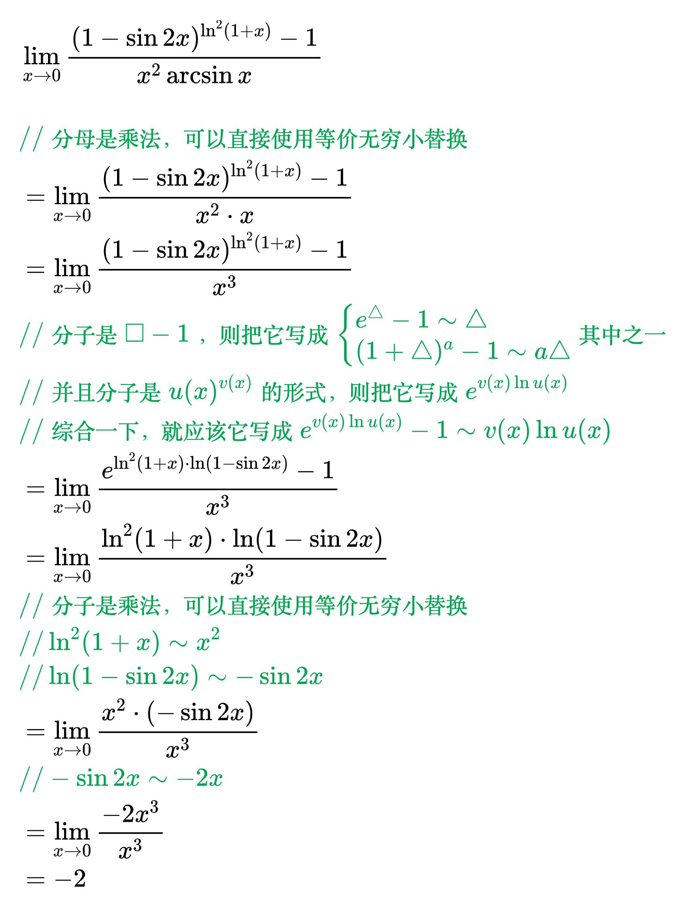

# 不定型

## 零比零型

<!--
\begin{align}
& 常用的方法：等价无穷小替换、洛必达法则 \\
\\
& 习惯动作：\\
& 1、见到 u(x)^{v(x)}，则把它写成 e^{v(x) \ln u(x)} \\
& 2、见到 \ln \Box，且 \Box 的极限是1，则把它写成 \ln (1 + \triangle) \sim \triangle \\
& 3、见到 \Box - 1，则把它写成 \begin{cases}
e^{\triangle} - 1 \sim \triangle \\
(1 + \triangle)^a - 1 \sim a \triangle
\end{cases}其中之一 \\
\\
& x \to 0 时, 常用的等价无穷小 \\
& 1、x \sim \sin x \sim \tan x \sim \arcsin x \sim \arctan x \sim e^{x} - 1 \sim \ln (1 + x) \\
& 2、1 - \cos x \sim \frac{1}{2} x^2 \\
& 3、(1 + x)^{a} - 1 \sim ax \\
\\
& x \to 0 时, 无穷小的阶：\\
& 1、x 是1阶无穷小，x^2 是2阶无穷小，x^n 是n阶无穷小 \\
& 2、\sin x 和 x 是等价无穷小，所以 \sin x 也是1阶无穷小 \\
& 3、\sin x^2 和 x^2 是等价无穷小，所以 \sin x^2 也是2阶无穷小 \\
& 4、1 - \cos x 和 \frac{1}{2} x^2 是等价无穷小，所以 1 - \cos x 也是2阶无穷小 \\
& 5、x，\sin x，\tan x，\arcsin x，\arctan x 中的任意两个之差是3阶无穷小 \\
& 6、x - \ln(1 + x) 是2阶无穷小 \\
\\
& 加法的时候，如果精确度够，也可以用等价无穷小替换：\\
& \lim_{x \to 0} \frac{e^{x^2} + \cos x - 2}{x \arctan x} \\
& {\color{Green} // 分母是乘法，可以直接使用等价无穷小替换} \\
& = \lim_{x \to 0} \frac{e^{x^2} + \cos x - 2}{x^2} \\
& = \lim_{x \to 0} \frac{e^{x^2} + \cos x - 1 - 1}{x^2} \\
& = \lim_{x \to 0} \frac{(e^{x^2} - 1) - (1 - \cos x)}{x^2} \\
& {\color{Green} // e^{x^2} - 1 \sim x^2，是2阶无穷小} \\
& {\color{Green} // 1 - \cos x \sim \frac{1}{2} x^2，也是2阶无穷小} \\
& {\color{Green} // 分子是加法，但所有项和分母相同都是2阶，也可以用等价无穷小替换} \\
& = \lim_{x \to 0} \frac{x^2 - \frac{1}{2} x^2}{x^2} \\
& = \frac{1}{2} \\
\\
& \lim_{x \to 0} \frac{x - \sin x}{x \ln ^2(1 + 2x)} \\
& {\color{Green} // 分母是乘法，可以直接使用等价无穷小替换} \\
& = \lim_{x \to 0} \frac{x - \sin x}{x (2x)^2} \\
& = \frac{1}{4} \lim_{x \to 0} \frac{x - \sin x}{x^3} \\
& {\color{Green} // x 是1阶无穷小} \\
& {\color{Green} // \sin x \sim x，也是1阶无穷小} \\
& {\color{Green} // 分子是加法，所有项都是1阶，} \\
& {\color{Green} // 但分母是3阶，不能用等价无穷小替换} \\
& {\color{Green} // 用洛必达法则：分子分母求导} \\
& = \frac{1}{4} \lim_{x \to 0} \frac{1 - \cos x}{3x^2} \\
& {\color{Green} // 1 - \cos x \sim \frac{1}{2} x^2，是2阶无穷小} \\
& {\color{Green} // 分子把 1 - \cos x 看成整体，不是加法了，可以用等价无穷小替换} \\
& = \frac{1}{4} \lim_{x \to 0} \frac{\frac{1}{2} x^2}{3x^2} \\
& = \frac{1}{24} \\
\end{align}
-->

<!--
\begin{align}
& \lim_{x \to 0} \frac{(1 - \sin 2x)^{\ln ^2(1 + x)} - 1}{x^2 \arcsin x} \\
& {\color{Green} // 分母是乘法，可以直接使用等价无穷小替换} \\
& = \lim_{x \to 0} \frac{(1 - \sin 2x)^{\ln ^2(1 + x)} - 1}{x^2 \cdot x} \\
& = \lim_{x \to 0} \frac{(1 - \sin 2x)^{\ln ^2(1 + x)} - 1}{x^3} \\
& {\color{Green} // 分子是 \Box - 1，则把它写成 \begin{cases}
e^{\triangle} - 1 \sim \triangle \\
(1 + \triangle)^a - 1 \sim a \triangle
\end{cases}其中之一} \\
& {\color{Green} // 并且分子是 u(x)^{v(x)} 的形式，则把它写成 e^{v(x) \ln u(x)}} \\
& {\color{Green} // 综合一下，就应该它写成 e^{v(x) \ln u(x)} - 1 \sim v(x) \ln u(x)} \\
& = \lim_{x \to 0} \frac{e^{\ln ^2(1 + x) \cdot \ln (1 - \sin 2x)} - 1}{x^3} \\
& = \lim_{x \to 0} \frac{\ln ^2(1 + x) \cdot \ln (1 - \sin 2x)}{x^3} \\
& {\color{Green} // 分子是乘法，可以直接使用等价无穷小替换} \\
& {\color{Green} // \ln ^2(1 + x) \sim x^2} \\
& {\color{Green} // \ln (1 - \sin 2x) \sim - \sin 2x} \\
& = \lim_{x \to 0} \frac{x^2 \cdot (- \sin 2x)}{x^3} \\
& {\color{Green} // - \sin 2x \sim -2x} \\
& = \lim_{x \to 0} \frac{- 2x^3}{x^3} \\
& = -2 \\
\end{align}
-->

