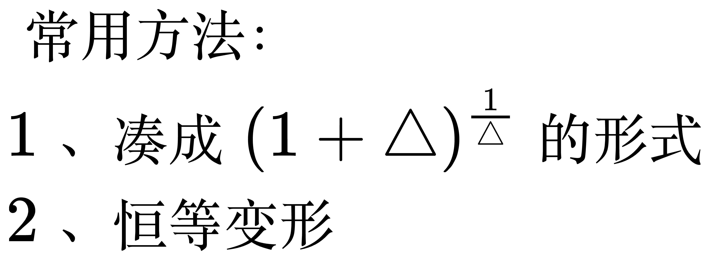
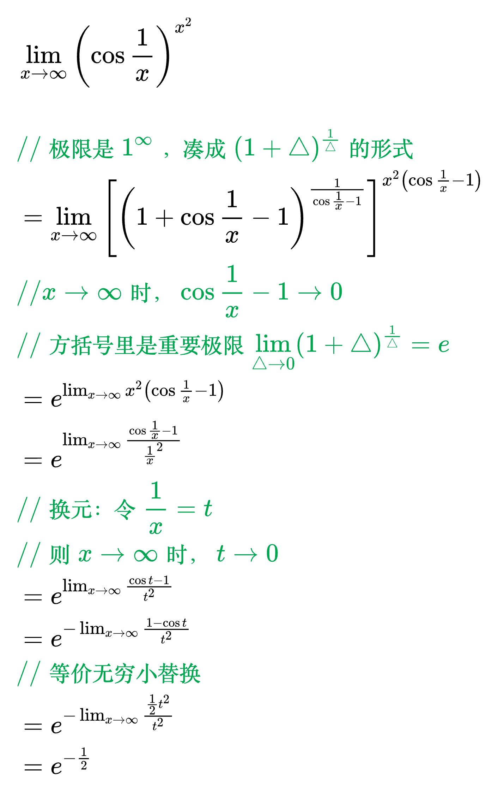
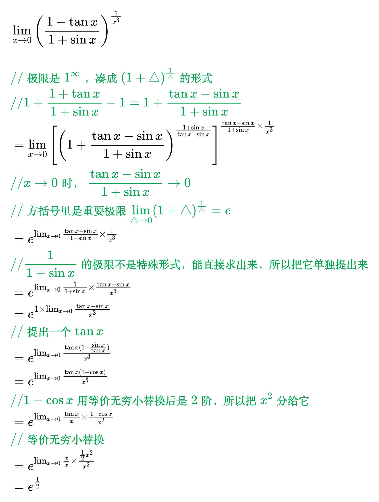

# 一的无穷大次方型

<!--
\begin{align}
& 常用方法：\\
& 1、凑成 (1 + \triangle)^{\frac{1}{\triangle}} 的形式 \\
& 2、恒等变形 \\
\end{align}
-->

<!--
\begin{align}
& \lim_{x \to \infty} \left ( \cos \frac{1}{x} \right ) ^{x^2} \\
\\
& {\color{Green} // 极限是 1^{\infty}，凑成 (1 + \triangle)^{\frac{1}{\triangle}} 的形式} \\
& = \lim_{x \to \infty} \left [ \left ( 1 + \cos \frac{1}{x} - 1 \right ) ^{\frac{1}{\cos \frac{1}{x} - 1}} \right ]  ^{x^2 \left ( \cos \frac{1}{x} - 1 \right )} \\
& {\color{Green} // x \to \infty 时，\cos \frac{1}{x} - 1 \to 0} \\
& {\color{Green} // 方括号里是重要极限 \lim_{\triangle \to 0} (1 + \triangle)^{\frac{1}{\triangle}} = e} \\
& = e^{\lim_{x \to \infty} x^2 \left ( \cos \frac{1}{x} - 1 \right )} \\
& = e^{\lim_{x \to \infty} \frac{\cos \frac{1}{x} - 1}{\frac{1}{x}^2}} \\
& {\color{Green} // 换元：令 \frac{1}{x} = t} \\
& {\color{Green} // 则 x \to \infty 时，t \to 0} \\
& = e^{\lim_{x \to \infty} \frac{\cos t - 1}{t^2}} \\
& = e^{- \lim_{x \to \infty} \frac{1 - \cos t}{t^2}} \\
& {\color{Green} // 等价无穷小替换} \\
& = e^{- \lim_{x \to \infty} \frac{\frac{1}{2} t^2}{t^2}} \\
& = e^{- \frac{1}{2}} \\
\end{align}
-->

<!--
\begin{align}
& \lim_{x \to 0} \left ( \frac{1 + \tan x}{1 + \sin x} \right ) ^{\frac{1}{x^3}} \\
\\
& {\color{Green} // 极限是 1^{\infty}，凑成 (1 + \triangle)^{\frac{1}{\triangle}} 的形式} \\
& {\color{Green} // 1 + \frac{1 + \tan x}{1 + \sin x} - 1 = 1 + \frac{\tan x- \sin x}{1 + \sin x}} \\
& = \lim_{x \to 0} \left [ \left ( 1 + \frac{\tan x- \sin x}{1 + \sin x} \right ) ^{\frac{1 + \sin x}{\tan x- \sin x}} \right ]  ^{\frac{\tan x- \sin x}{1 + \sin x} \times \frac{1}{x^3}} \\
& {\color{Green} // x \to 0 时，\frac{\tan x- \sin x}{1 + \sin x} \to 0} \\
& {\color{Green} // 方括号里是重要极限 \lim_{\triangle \to 0} (1 + \triangle)^{\frac{1}{\triangle}} = e} \\
& = e^{\lim_{x \to 0} \frac{\tan x- \sin x}{1 + \sin x} \times \frac{1}{x^3}} \\
& {\color{Green} // \frac{1}{1 + \sin x}的极限不是特殊形式，能直接求出来，所以把它单独提出来} \\
& = e^{\lim_{x \to 0} \frac{1}{1 + \sin x} \times \frac{\tan x- \sin x}{x^3}} \\
& = e^{1 \times \lim_{x \to 0} \frac{\tan x- \sin x}{x^3}} \\
& {\color{Green} // 提出一个 \tan x} \\
& = e^{\lim_{x \to 0} \frac{\tan x (1 - \frac{\sin x}{\tan x})}{x^3}} \\
& = e^{\lim_{x \to 0} \frac{\tan x (1 - \cos x)}{x^3}} \\
& {\color{Green} // 1 - \cos x 用等价无穷小替换后是2阶，所以把x^2分给它} \\
& = e^{\lim_{x \to 0} \frac{\tan x}{x} \times \frac{1 - \cos x}{x^2}} \\
& {\color{Green} // 等价无穷小替换} \\
& = e^{\lim_{x \to 0} \frac{x}{x} \times \frac{\frac{1}{2} x^2}{x^2}} \\
& = e^{\frac{1}{2}} \\
\end{align}
-->

