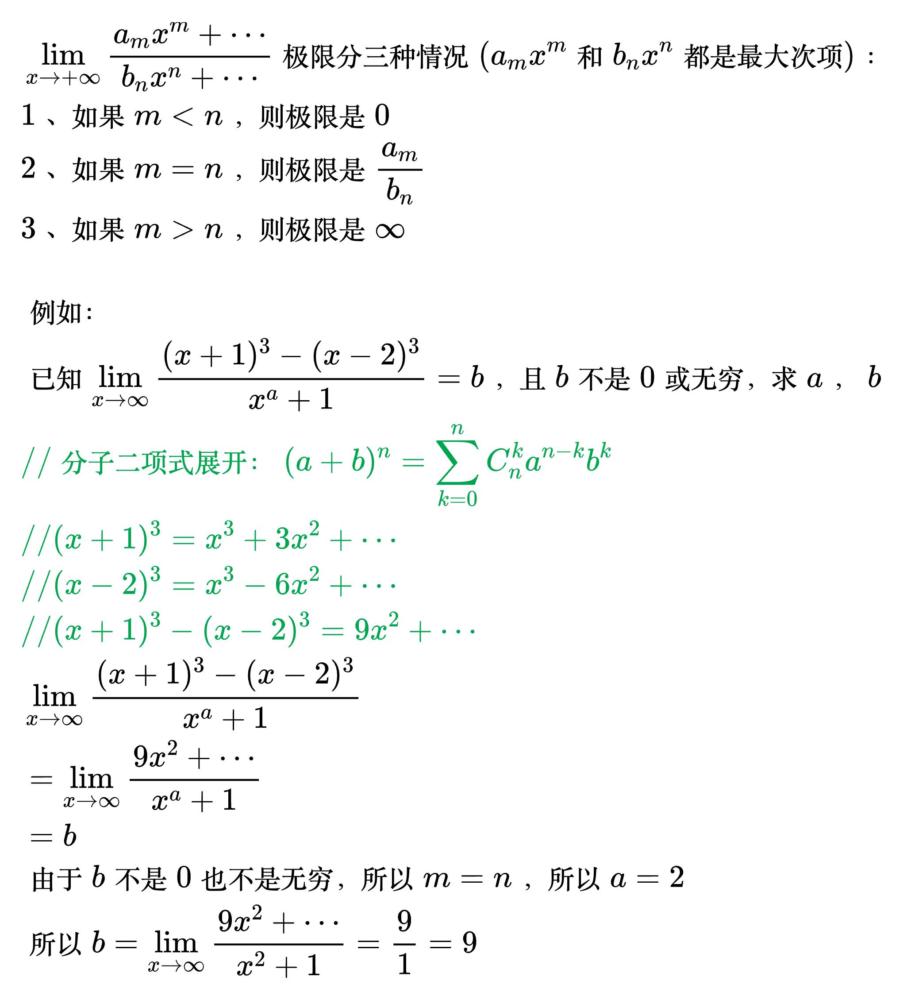
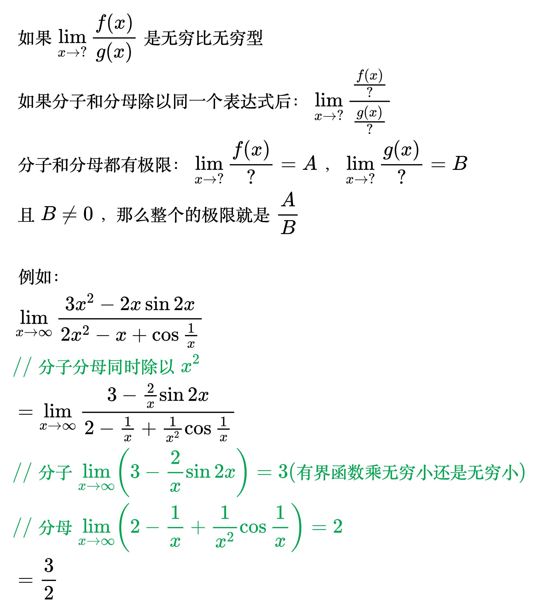

# 无穷比无穷型

<!--
\begin{align}
& \;\, x \to + \infty 时，\begin{cases}
对数函数：& \ln ^a x, & a > 0 \\
幂函数：& x^b, & b > 0 \\
指数函数：& c^x, & c > 1
\end{cases} 都是趋于 + \infty 的，\\
& 但它们趋于 + \infty 的速度不同：c^x快于 x^b 快于 \ln ^a x \\
\\
& 例如：\lim_{x \to +\infty} \frac{\ln ^{100} x}{\sqrt{x}} \\
& \; \ln ^{100} x 是对数函数，\sqrt{x}是幂函数，\\
& 因为对数函数趋于 + \infty 的速度更慢，所以极限是 0 \\
& 再比如：\lim_{x \to +\infty} \frac{x^{50}}{e^x} \\
& \; x^{50} 是幂函数，e^x 是指数函数，\\
& 因为幂函数趋于 + \infty 的速度更慢，所以极限是 0 \\
\end{align}
-->

<!--
\begin{align}
& \lim_{x \to +\infty} \frac{a_m x^m + \cdots}{b_n x^n + \cdots} 极限分三种情况
(a_m x^m和b_n x^n都是最大次项)：\\
& 1、如果 m < n，则极限是 0 \\
& 2、如果 m = n，则极限是 \frac{a_m}{b_n} \\
& 3、如果 m > n，则极限是 \infty \\
\\
& 例如：\\
& 已知 \lim_{x \to \infty} \frac{(x + 1)^3 - (x - 2)^3}{x^a + 1} = b，且 b 不是0或无穷，求a，b \\
& {\color{Green} // 分子二项式展开：(a + b)^n=\sum_{k = 0}^{n}C_{n}^{k}a^{n - k}b^{k}} \\
& {\color{Green} // (x + 1)^3 = x^3 + 3x^2 + \cdots} \\
& {\color{Green} // (x - 2)^3 = x^3 - 6x^2 + \cdots} \\
& {\color{Green} // (x + 1)^3 - (x - 2)^3 = 9x^2 + \cdots} \\
& \lim_{x \to \infty} \frac{(x + 1)^3 - (x - 2)^3}{x^a + 1} \\
& = \lim_{x \to \infty} \frac{9x^2 + \cdots}{x^a + 1} \\
& = b \\
& 由于b 不是0也不是无穷，所以 m = n，所以 a = 2 \\
& 所以 b = \lim_{x \to \infty} \frac{9x^2 + \cdots}{x^2 + 1} = \frac{9}{1} = 9 \\
\end{align}
-->

<!--
\begin{align}
& 如果 \lim_{x \to ?} \frac{f(x)}{g(x)} 是无穷比无穷型 \\
& 如果分子和分母除以同一个表达式后： \lim_{x \to ?} \frac{\frac{f(x)}{?}}{\frac{g(x)}{?}} \\
& 分子和分母都有极限： \lim_{x \to ?} \frac{f(x)}{?} = A，\lim_{x \to ?} \frac{g(x)}{?} = B \\
& 且 B \ne 0，那么整个的极限就是 \frac{A}{B} \\
\\
& 例如：\\
& \lim_{x \to \infty} \frac{3x^2 - 2x \sin 2x}{2x^2 - x + \cos \frac{1}{x}} \\
& {\color{Green} // 分子分母同时除以 x^2} \\
& = \lim_{x \to \infty} \frac{3 - \frac{2}{x} \sin 2x}{2 - \frac{1}{x} + \frac{1}{x^2}\cos \frac{1}{x}} \\
& {\color{Green} // 分子 \lim_{x \to \infty} \left ( 3 - \frac{2}{x} \sin 2x \right ) = 3 (有界函数乘无穷小还是无穷小)} \\
& {\color{Green} // 分母 \lim_{x \to \infty} \left ( 2 - \frac{1}{x} + \frac{1}{x^2}\cos \frac{1}{x} \right ) = 2} \\
& = \frac{3}{2} \\
\end{align}
-->

<!--
\begin{align}
& \lim_{x \to \infty} \frac{\ln (3x^2 + 4x + 1)}{\ln (6x^4 + x^2 + 3)} \\
& {\color{Green} // 洛必达法则} \\
& = \lim_{x \to \infty} \frac{\frac{6x+4}{3x^2+4x+1}}{\frac{24x^3+2x}{6x^4+x^2+3}} \\
& = \lim_{x \to \infty} \frac{6x+4}{3x^2+4x+1} \cdot \frac{6x^4+x^2+3}{24x^3+2x} \\
& = \lim_{x \to \infty} \frac{36x^5 + \cdots}{72x^5 + \cdots} \\
& {\color{Green} // a_m x^m和b_n x^n都是最大次项，} \\
& {\color{Green} // 且 m = n = 5，} \\
& {\color{Green} // 则极限是 \frac{a_m}{b_n}} \\
& = \frac{36}{72} \\
& = \frac{1}{2} \\
\end{align}
-->
