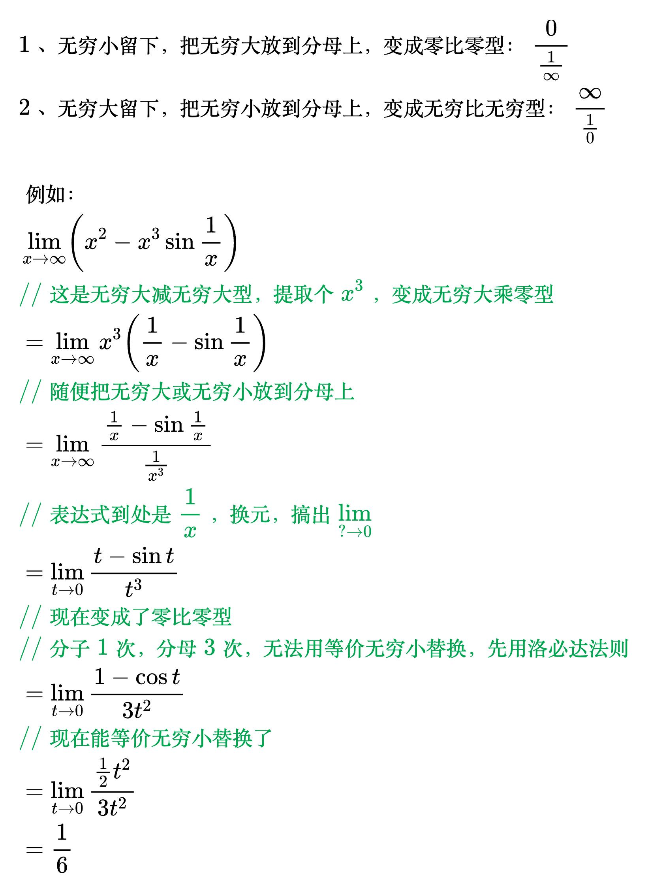

# 无穷大乘零型

<!--
\begin{align}
& 1、无穷小留下，把无穷大放到分母上，变成零比零型：\frac{0}{\frac{1}{\infty}} \\
& 2、无穷大留下，把无穷小放到分母上，变成无穷比无穷型：\frac{\infty}{\frac{1}{0}} \\
\\
& 例如：\\
& \lim_{x \to \infty} \left ( x^2 - x^3 \sin \frac{1}{x} \right ) \\
& {\color{Green} // 这是无穷大减无穷大型，提取个x^3，变成无穷大乘零型} \\
& = \lim_{x \to \infty} x^3 \left ( \frac{1}{x} - \sin \frac{1}{x} \right ) \\
& {\color{Green} // 随便把无穷大或无穷小放到分母上} \\
& = \lim_{x \to \infty} \frac{\frac{1}{x} - \sin \frac{1}{x}}{\frac{1}{x^3}} \\
& {\color{Green} // 表达式到处是\frac{1}{x}，换元，搞出\lim_{? \to 0}} \\
& = \lim_{t \to 0} \frac{t - \sin t}{t^3} \\
& {\color{Green} // 现在变成了零比零型} \\
& {\color{Green} // 分子1次，分母3次，无法用等价无穷小替换，先用洛必达法则} \\
& = \lim_{t \to 0} \frac{1 - \cos t}{3t^2} \\
& {\color{Green} // 现在能等价无穷小替换了} \\
& = \lim_{t \to 0} \frac{\frac{1}{2} t^2}{3t^2} \\
& = \frac{1}{6} \\
\end{align}
-->

