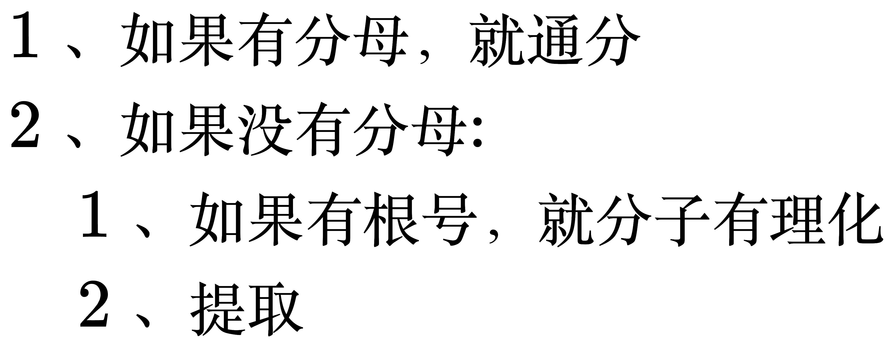
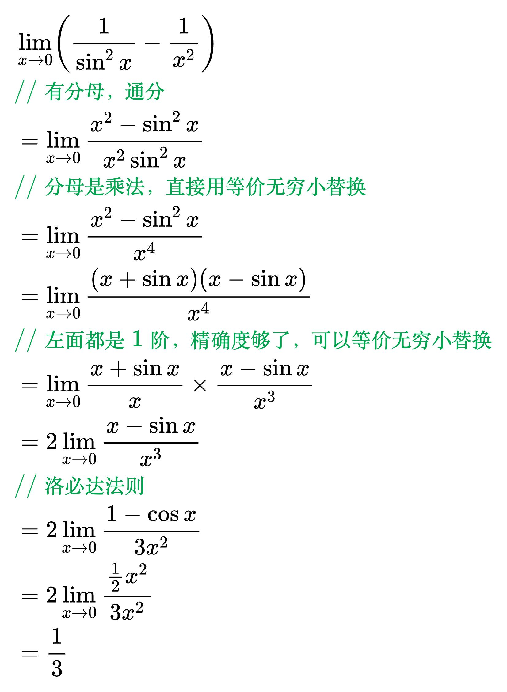
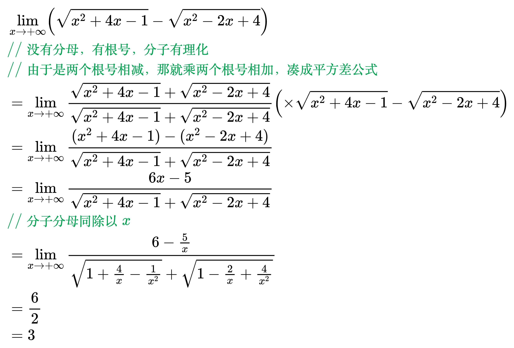

# 无穷大减无穷大型

<!--
\begin{align}
& 1、如果有分母，就通分 \\
& 2、如果没有分母: \\
& \quad 1、如果有根号，就分子有理化 \\
& \quad 2、提取 \\
\end{align}
-->

<!--
\begin{align}
& \lim_{x \to 0} \left ( \frac{1}{\sin ^2x} - \frac{1}{x^2} \right ) \\
& {\color{Green} // 有分母，通分} \\
& = \lim_{x \to 0} \frac{x^2 - \sin ^2x}{x^2 \sin ^2x} \\
& {\color{Green} // 分母是乘法，直接用等价无穷小替换} \\
& = \lim_{x \to 0} \frac{x^2 - \sin ^2x}{x^4} \\
& = \lim_{x \to 0} \frac{(x + \sin x)(x - \sin x)}{x^4} \\
& {\color{Green} // 左面都是1阶，精确度够了，可以等价无穷小替换} \\
& = \lim_{x \to 0} \frac{x + \sin x}{x} \times \frac{x - \sin x}{x^3} \\
& = 2 \lim_{x \to 0} \frac{x - \sin x}{x^3} \\
& {\color{Green} // 洛必达法则} \\
& = 2 \lim_{x \to 0} \frac{1 - \cos x}{3x^2} \\
& = 2 \lim_{x \to 0} \frac{\frac{1}{2} x^2}{3x^2} \\
& = \frac{1}{3} \\
\end{align}
-->

<!--
\begin{align}
& \lim_{x \to + \infty} \left ( \sqrt{x^2+4x-1} - \sqrt{x^2-2x+4} \right ) \\
& {\color{Green} // 没有分母，有根号，分子有理化} \\
& {\color{Green} // 由于是两个根号相减，那就乘两个根号相加，凑成平方差公式} \\
& = \lim_{x \to + \infty} \frac{\sqrt{x^2+4x-1} + \sqrt{x^2-2x+4}}{\sqrt{x^2+4x-1} + \sqrt{x^2-2x+4}}
\left ( \times \sqrt{x^2+4x-1} - \sqrt{x^2-2x+4} \right ) \\
& = \lim_{x \to + \infty} \frac{(x^2+4x-1) - (x^2-2x+4)}{\sqrt{x^2+4x-1} + \sqrt{x^2-2x+4}} \\
& = \lim_{x \to + \infty} \frac{6x-5}{\sqrt{x^2+4x-1} + \sqrt{x^2-2x+4}} \\
& {\color{Green} // 分子分母同除以x} \\
& = \lim_{x \to + \infty} \frac{6-\frac{5}{x}}{\sqrt{1+\frac{4}{x}-\frac{1}{x^2}} +
\sqrt{1-\frac{2}{x}+\frac{4}{x^2}}} \\
& = \frac{6}{2} \\
& = 3 \\
\end{align}
-->

