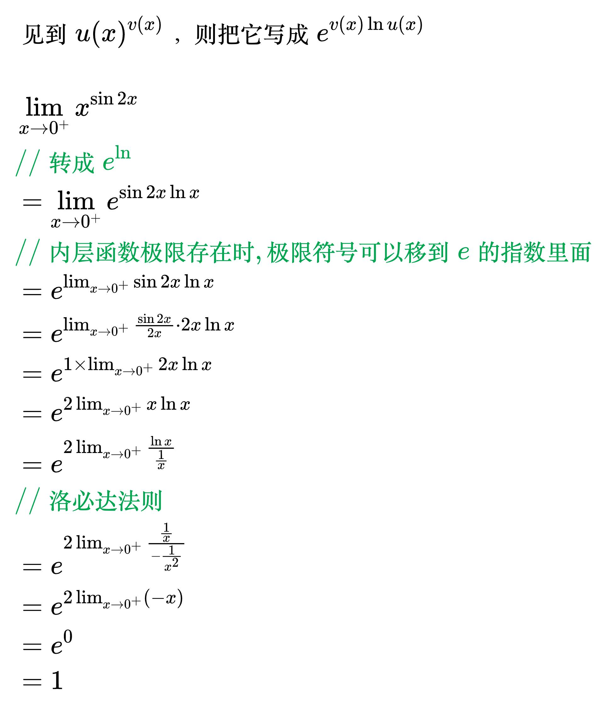

# 无穷的零次方和零的零次方型

<!--
\begin{align}
& 见到 u(x)^{v(x)}，则把它写成 e^{v(x) \ln u(x)} \\
\\
& \lim_{x \to 0^+} x^{\sin 2x} \\
& {\color{Green} // 转成 e^{\ln}} \\
& = \lim_{x \to 0^+} e^{\sin 2x \ln x} \\
& {\color{Green} // 内层函数极限存在时,极限符号可以移到e的指数里面} \\
& = e^{\lim_{x \to 0^+} \sin 2x \ln x} \\
& = e^{\lim_{x \to 0^+} \frac{\sin 2x}{2x} \cdot 2x \ln x} \\
& = e^{1 \times \lim_{x \to 0^+} 2x \ln x} \\
& = e^{2 \lim_{x \to 0^+} x \ln x} \\
& = e^{2 \lim_{x \to 0^+} \frac{\ln x}{\frac{1}{x}}} \\
& {\color{Green} // 洛必达法则} \\
& = e^{2 \lim_{x \to 0^+} \frac{\frac{1}{x}}{- \frac{1}{x^2}}} \\
& = e^{2 \lim_{x \to 0^+} (-x)} \\
& = e^0 \\
& = 1 \\
\end{align}
-->

