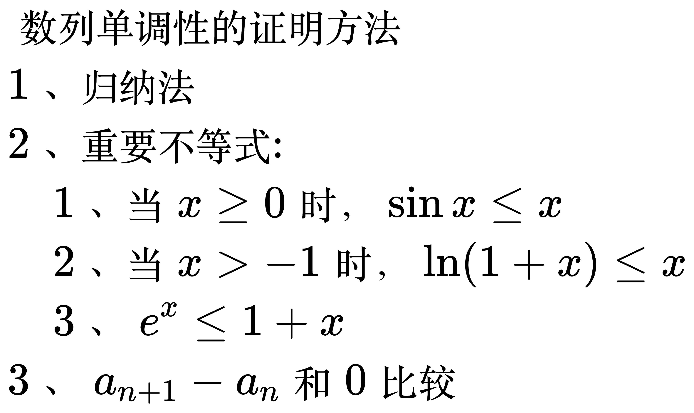
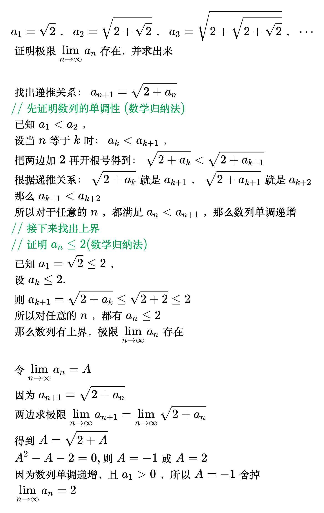
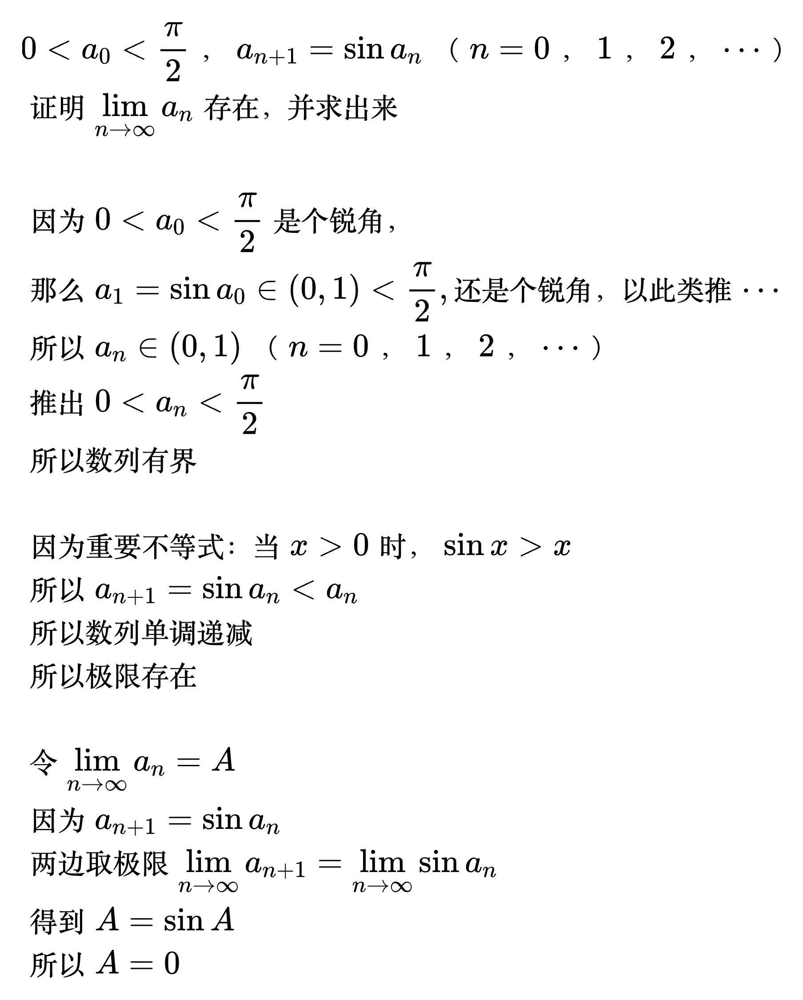
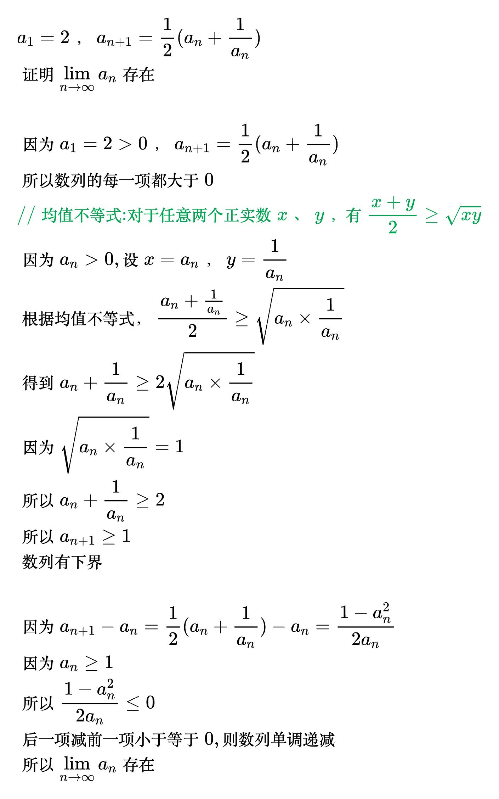

# 证明数列极限存在

<!--
\begin{align}
& 数列单调性的证明方法 \\
& 1、归纳法 \\
& 2、重要不等式: \\
& \quad 1、当 x \ge 0 时，\sin x \le x \\
& \quad 2、当 x > -1 时，\ln (1+x) \le x \\
& \quad 3、e^x \le 1+x \\
& 3、a_{n+1}-a_n 和0比较 \\
\end{align}
-->

<!--
\begin{align}
& a_1=\sqrt{2}，a_2=\sqrt{2+\sqrt{2}}，a_3=\sqrt{2+\sqrt{2+\sqrt{2}}}，\cdots \\
& 证明极限\lim_{n \to \infty} a_n存在，并求出来 \\
\\
& 找出递推关系：a_{n+1}=\sqrt{2+a_n} \\
& {\color{Green} // 先证明数列的单调性(数学归纳法)} \\
& 已知a_1<a_2，\\
& 设当n等于k时：a_k<a_{k+1}，\\
& 把两边加2再开根号得到：\sqrt{2+a_k}<\sqrt{2+a_{k+1}} \\
& 根据递推关系：\sqrt{2+a_k}就是a_{k+1}，\sqrt{2+a_{k+1}}就是a_{k+2} \\
& 那么a_{k+1}<a_{k+2} \\
& 所以对于任意的n，都满足a_n<a_{n+1}，那么数列单调递增 \\
& {\color{Green} // 接下来找出上界} \\
& {\color{Green} // 证明a_n\le2(数学归纳法)} \\
& 已知 a_1=\sqrt{2}\le2，\\
& 设a_k\le2. \\
& 则a_{k+1}=\sqrt{2+a_k}\le\sqrt{2+2}\le2 \\
& 所以对任意的n，都有a_n\le2 \\
& 那么数列有上界，极限\lim_{n \to \infty} a_n存在 \\
\\
& 令\lim_{n \to \infty} a_n=A \\
& 因为a_{n+1}=\sqrt{2+a_n} \\
& 两边求极限\lim_{n \to \infty}a_{n+1}=\lim_{n \to \infty}\sqrt{2+a_n} \\
& 得到 A=\sqrt{2+A} \\
& \; A^2-A-2=0, 则A=-1或A=2\\
& 因为数列单调递增，且a_1>0，所以A=-1舍掉 \\
& \; \lim_{n \to \infty} a_n=2 \\
\end{align}
-->

<!--
\begin{align}
& 0<a_0<\frac{\pi}{2}，a_{n+1}=\sin a_n（n=0，1，2，\cdots）\\
& 证明 \lim_{n \to \infty}a_n存在，并求出来 \\
\\
& 因为0<a_0<\frac{\pi}{2}是个锐角，\\
& 那么a_1=\sin a_0\in (0, 1)<\frac{\pi}{2}, 还是个锐角，以此类推\cdots \\
& 所以a_n\in (0, 1)（n=0，1，2，\cdots）\\
& 推出 0<a_n<\frac{\pi}{2} \\
& 所以数列有界 \\
\\
& 因为重要不等式：当 x > 0 时，\sin x > x \\
& 所以 a_{n+1}=\sin a_n<a_n \\
& 所以数列单调递减 \\
& 所以极限存在 \\
\\
& 令 \lim_{n \to \infty}a_n=A \\
& 因为a_{n+1}=\sin a_n \\
& 两边取极限 \lim_{n \to \infty}a_{n+1}=\lim_{n \to \infty}\sin a_n \\
& 得到 A=\sin A \\
& 所以A=0 \\
\end{align}
-->

<!--
\begin{align}
& a_1=2，a_{n+1}=\frac{1}{2}(a_n+\frac{1}{a_n}) \\
& 证明 \lim_{n \to \infty}a_n存在 \\
\\
& 因为a_1=2>0，a_{n+1}=\frac{1}{2}(a_n+\frac{1}{a_n}) \\
& 所以数列的每一项都大于0 \\
& {\color{Green} // 均值不等式: 对于任意两个正实数x、y，有\frac{x + y}{2}\geq\sqrt{xy}} \\
& 因为a_n > 0, 设 x = a_n，y=\frac{1}{a_n} \\
& 根据均值不等式，\frac{a_n+\frac{1}{a_n}}{2} \ge \sqrt{a_n \times \frac{1}{a_n}} \\
& 得到 a_n+\frac{1}{a_n} \ge 2\sqrt{a_n \times \frac{1}{a_n}} \\
& 因为 \sqrt{a_n \times \frac{1}{a_n}} = 1 \\
& 所以 a_n+\frac{1}{a_n} \ge 2 \\
& 所以 a_{n+1} \ge 1 \\
& 数列有下界 \\
\\
& 因为 a_{n+1}-a_n=\frac{1}{2}(a_n+\frac{1}{a_n})-a_n = \frac{1-a_n^2}{2a_n} \\
& 因为 a_n \ge 1 \\
& 所以\frac{1-a_n^2}{2a_n}\le0 \\
& 后一项减前一项小于等于0, 则数列单调递减 \\
& 所以\lim_{n \to \infty}a_n存在 \\
\end{align}
-->

<!--
\begin{align}
& 0<a_1<2，a_{n+1}=\sqrt{a_n(2-a_n)} \\
& 证明 \lim_{n \to \infty}a_n存在 \\
\\
& {\color{Green} // 均值不等式: 对于任意两个正实数x、y，有\frac{x + y}{2}\geq\sqrt{xy}} \\
& 令 x=a_n，y=2-a_n \\
& 则 \frac{a_n+(2-a_n)}{2}\ge\sqrt{a_n(2-a_n)} \\
& 所以 \frac{a_n+(2-a_n)}{2}\ge a_{n+1} \\
& 因为 \frac{a_n+(2-a_n)}{2} = 1 \\
& 所以a_{n+1}\le1 \\
& 数列有上界 \\
\\
& 计算 a_{n+1}-a_n \\
& =\sqrt{a_n(2-a_n)}-a_n \\
& = \frac{\sqrt{a_n(2-a_n)}+a_n}{\sqrt{a_n(2-a_n)}+a_n} \times (\sqrt{a_n(2-a_n)}-a_n) \\
& = \frac{(\sqrt{a_n(2-a_n)}+a_n) \times (\sqrt{a_n(2-a_n)}-a_n)}{\sqrt{a_n(2-a_n)}+a_n} \\
& = \frac{a_n(2-a_n)-a_n^2}{\sqrt{a_n(2-a_n)}+a_n} \\
& = \frac{2a_n-2a_n^2}{\sqrt{a_n(2-a_n)}+a_n} \\
& = \frac{2(1-2a_n)}{\sqrt{a_n(2-a_n)}+a_n} \\
& 因为a_n\le1 \\
& 所以 a_{n+1}-a_n\ge0 \\
& 数列单调递增 \\
& 所以\lim_{n \to \infty}a_n存在 \\
\end{align}
-->

<!--
\begin{align}
& \; f(x) \in C[a,b]，p>0，q>0 \\
& 证明 存在 \xi \in [a,b]，使得pf(a)+qf(b)=(p+q)f(\xi) \\
\\
&
\end{align}
-->
