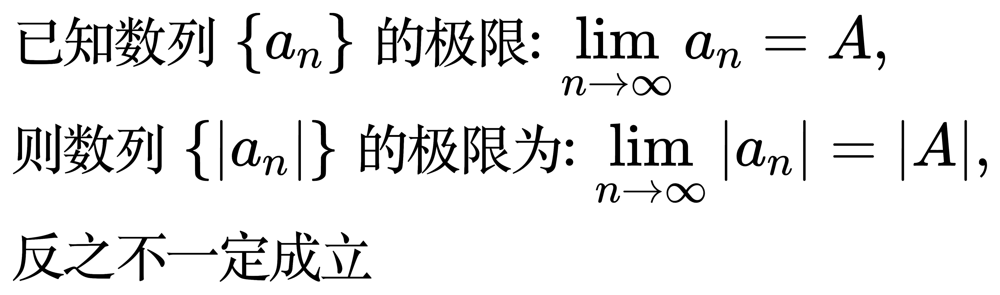

# 数列的极限

<!--
\begin{align}
& 如果一个数列的项越来越接近某个特定的值, \\
& 那么这个值就被称为该数列的极限 \\
\\
& 定义: \\
& 有一个数列 \left \{ a_{n} \right \}, 其中a_{n} 表示数列的第n项, \\
& 如果对于任意一个(要多小有多小的)正数 \varepsilon , \\
& 都存在一个正整数 N, \\
& 使得当 n \gt N 时, |a_{n} - A| \lt \varepsilon \\
& 则数列 \left \{ a_{n} \right \} 以 A 为极限, 记作: \lim_{n \to \infty} a_{n} = A \\
\\
& 数列的项a_{n}可以无限接近A, 但并不要求a_{n}必须等于A \\
\end{align}
-->

推论:

<!--
\begin{align}
& 已知数列 \left \{ a_{n} \right \} 的极限: \lim_{n \to \infty} a_{n} = A, \\
& 则数列 \left \{ |a_{n}| \right \} 的极限为: \lim_{n \to \infty} |a_{n}| = |A|, \\
& 反之不一定成立 \\
\end{align}
-->

证明:

<!--
\begin{align}
& 由于\lim_{x \to \infty} a_{n} = A \\
& 根据极限的定义, 对任意的 \varepsilon \gt 0, 总存在 N \gt 0, \\
& 使得, 当 n \gt N 时, |a_{n} - A| \lt \varepsilon, \\
& 根据三角不等式: ||a_{n}| - |A|| \le |a_{n} - A| \\
& 所以, 对任意的 \varepsilon  \gt 0, 也总存在 N \gt 0, \\
& 使得, 当 n \gt N 时, ||a_{n}| - |A|| \lt \varepsilon \\
& 所以 \lim_{x \to \infty} |a_{n}| = |A| \\
\\
& 证明反之不成立: \\
& 假设 a_{n} = (-1)^{n}, 则 \lim_{x \to \infty} a_{n} 不存在, 但是 \lim_{x \to \infty} |a_{n}| = 1 \\
& 所以反之不成立 \\
\end{align}
-->

