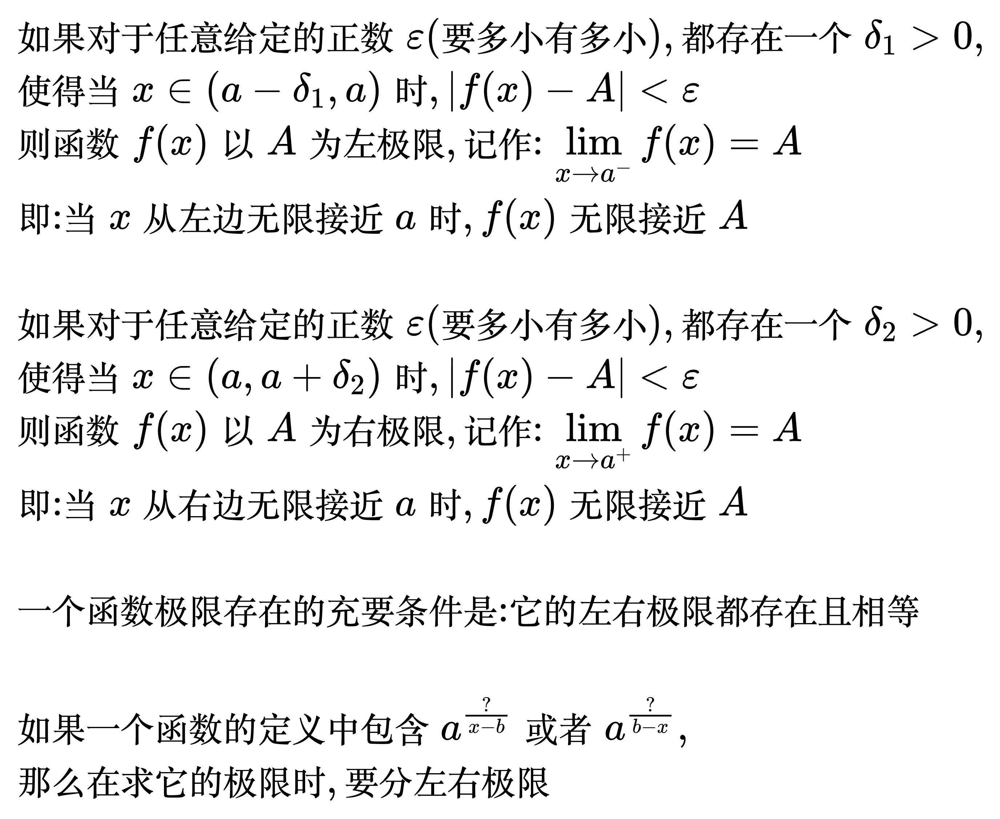
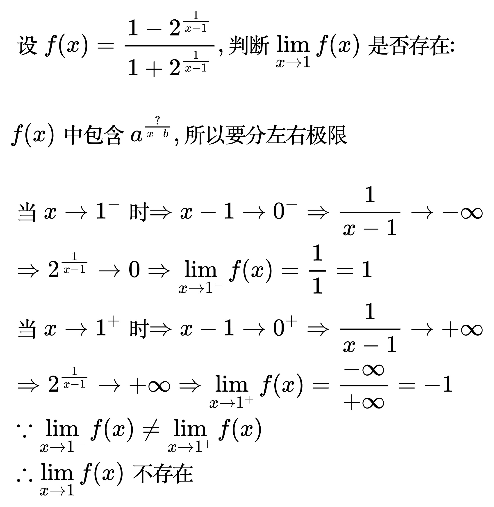

# 左右极限

<!--
\begin{align}
& 如果对于任意给定的正数 \varepsilon (要多小有多小), 都存在一个 \delta_{1} > 0, \\
& 使得当 x \in (a - \delta_{1}, a) 时, |f(x) - A| \lt \varepsilon \\
& 则函数 f(x) 以 A 为左极限, 记作: \lim_{x \to a^{-}} f(x) = A \\
& 即: 当 x 从左边无限接近 a 时, f(x) 无限接近 A \\
\\
& 如果对于任意给定的正数 \varepsilon (要多小有多小), 都存在一个 \delta_{2} > 0, \\
& 使得当 x \in (a, a + \delta_{2}) 时, |f(x) - A| \lt \varepsilon \\
& 则函数 f(x) 以 A 为右极限, 记作: \lim_{x \to a^{+}} f(x) = A \\
& 即: 当 x 从右边无限接近 a 时, f(x) 无限接近 A \\
\\
& 一个函数极限存在的充要条件是: 它的左右极限都存在且相等 \\
\\
& 如果一个函数的定义中包含 a^{\frac{?}{x - b}} 或者 a^{\frac{?}{b - x}}, \\
& 那么在求它的极限时, 要分左右极限 \\
\end{align}
-->

例题:

<!--
\begin{align}
& 设 f(x) = \frac{1 - 2^{\frac{1}{x - 1}}}{1 + 2^{\frac{1}{x - 1}}}, 判断 \lim_{x \to 1}f(x) 是否存在: \\
\\
& f(x) 中包含 a^{\frac{?}{x - b}}, 所以要分左右极限 \\
\\
& 当 x \to 1^{-} 时 \Rightarrow  x - 1 \to 0^{-} \Rightarrow \frac{1}{x - 1} \to -\infty \\
& \Rightarrow 2^{\frac{1}{x - 1}} \to 0 \Rightarrow \lim_{x \to 1^{-}}f(x) = \frac{1}{1} = 1 \\
& 当 x \to 1^{+} 时 \Rightarrow  x - 1 \to 0^{+} \Rightarrow \frac{1}{x - 1} \to +\infty \\
& \Rightarrow 2^{\frac{1}{x - 1}} \to +\infty \Rightarrow \lim_{x \to 1^{+}}f(x) = \frac{-\infty}{+\infty} = -1 \\
& \because \lim_{x \to 1^{-}}f(x) \ne \lim_{x \to 1^{+}}f(x) \\
& \therefore \lim_{x \to 1}f(x) 不存在 \\
\end{align}
-->

