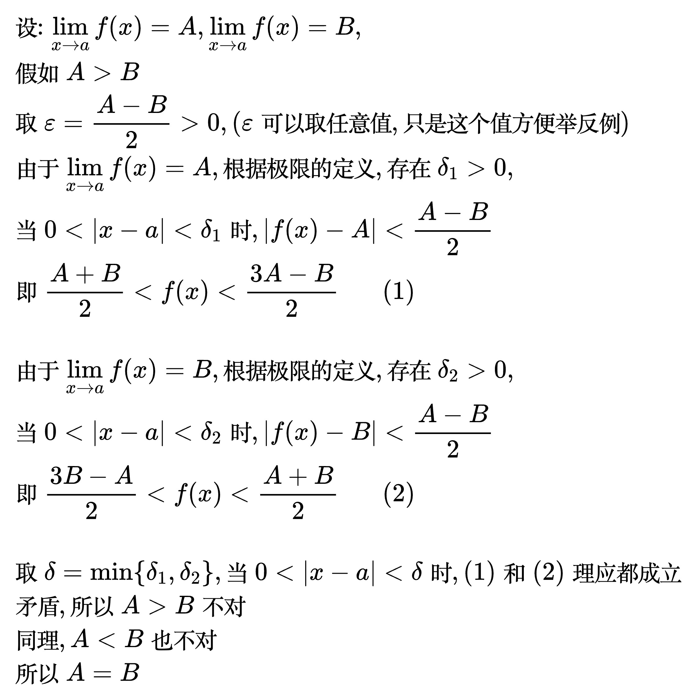
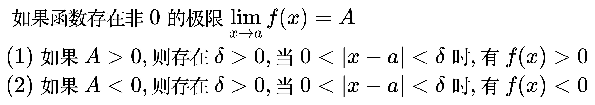
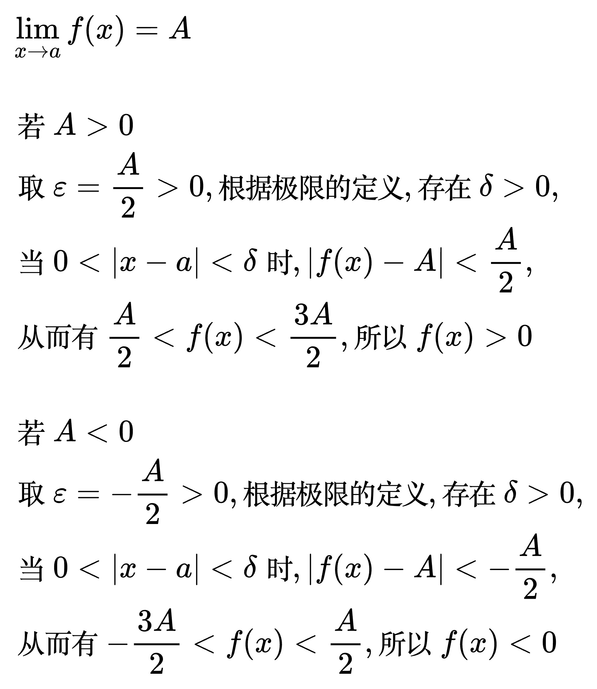
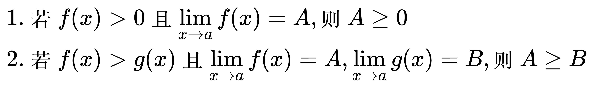
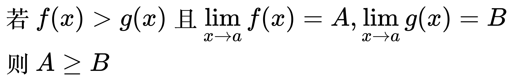
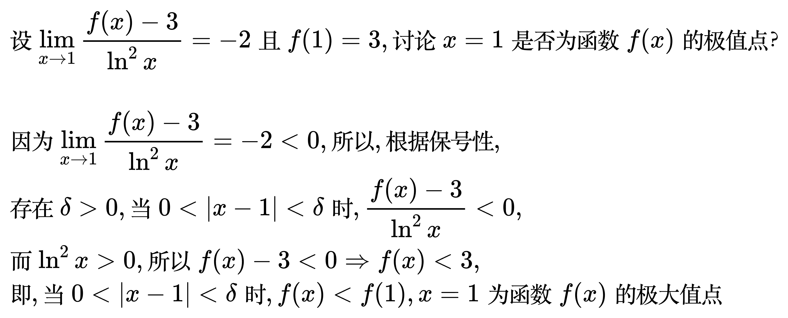
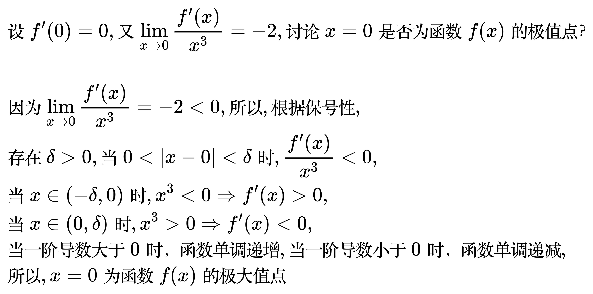
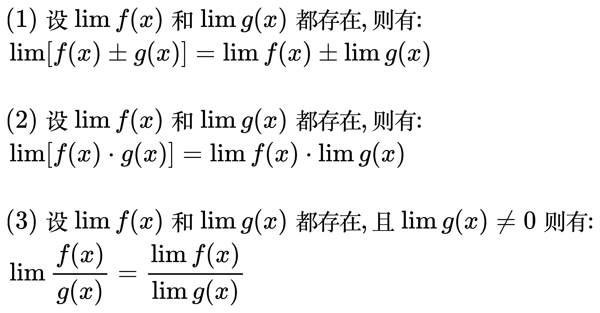
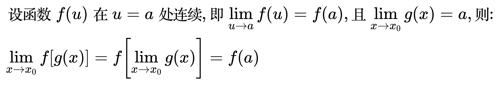

# 极限的性质

## 唯一性

对于任意极限, 如果存在, 那么它必唯一。

证明:

<!--
\begin{align}
& 设: \lim_{x \to a} f(x) = A, \lim_{x \to a} f(x) = B, \\
& 假如 A \gt B \\
& 取 \varepsilon = \frac{A - B}{2} \gt 0, (\varepsilon 可以取任意值, 只是这个值方便举反例) \\
& 由于 \lim_{x \to a} f(x) = A, 根据极限的定义, 存在 \delta_{1} \gt 0, \\
& 当 0 \lt |x - a| \lt \delta_{1} 时, |f(x) - A| \lt \frac{A - B}{2} \\
& 即 \frac{A + B}{2} \lt f(x) \lt \frac{3A - B}{2} \;\;\;\;\;\; (1) \\
\\
& 由于 \lim_{x \to a} f(x) = B, 根据极限的定义, 存在 \delta_{2} \gt 0, \\
& 当 0 \lt |x - a| \lt \delta_{2} 时, |f(x) - B| \lt \frac{A - B}{2} \\
& 即 \frac{3B - A}{2} \lt f(x) \lt \frac{A + B}{2} \;\;\;\;\;\; (2) \\
\\
& 取 \delta = \min \left \{ \delta_{1},\delta_{2} \right \}, 当 0 \lt |x - a| \lt \delta 时, (1)和(2) 理应都成立 \\
& 矛盾, 所以 A \gt B 不对 \\
& 同理, A \lt B 也不对 \\
& 所以 A = B \\
\end{align}
-->

## 有界性

如果数列的极限存在，那么这个数列一定是有界, 反之不对。

## 保号性

如果一个函数在某一点的极限是正数或负数，那么在这一点的一个小邻域内，函数值的符号与极限的符号相同。

<!--
\begin{align}
& 如果函数存在非0的极限 \lim_{x \to a} f(x) = A \\
& (1) 如果 A \gt 0, 则存在 \delta \gt 0, 当 0 \lt |x - a| \lt \delta 时, 有 f(x) \gt 0 \\
& (2) 如果 A \lt 0, 则存在 \delta \gt 0, 当 0 \lt |x - a| \lt \delta 时, 有 f(x) \lt 0 \\
\end{align}
-->

证明:

<!--
\begin{align}
& \lim_{x \to a} f(x) = A \\
\\
& 若 A \gt 0 \\
& 取 \varepsilon = \frac{A}{2} \gt 0, 根据极限的定义, 存在 \delta \gt 0, \\
& 当 0 \lt |x - a| \lt \delta 时, |f(x) - A| \lt \frac{A}{2}, \\
& 从而有 \frac{A}{2} \lt f(x) \lt \frac{3A}{2}, 所以 f(x) \gt 0 \\
\\
& 若 A \lt 0 \\
& 取 \varepsilon = -\frac{A}{2} \gt 0, 根据极限的定义, 存在 \delta \gt 0, \\
& 当 0 \lt |x - a| \lt \delta 时, |f(x) - A| \lt -\frac{A}{2}, \\
& 从而有 -\frac{3A}{2} \lt f(x) \lt \frac{A}{2}, 所以 f(x) \lt 0 \\
\end{align}
-->

推论 1:

<!--
\begin{align}
& 若 f(x) \gt 0 且 \lim_{x \to a} f(x) = A \\
& 则 A \ge 0 \\
\end{align}
-->

推论 2:

<!--
\begin{align}
& 若 f(x) \gt g(x) 且 \lim_{x \to a} f(x) = A, \lim_{x \to a} g(x) = B \\
& 则 A \ge B \\
\end{align}
-->

例题 1:

<!--
\begin{align}
& 设 \lim_{x \to 1} \frac{f(x) - 3}{\ln^{2}x} = -2 且 f(1) = 3, 讨论 x = 1 是否为函数 f(x) 的极值点？ \\
\\
& 因为 \lim_{x \to 1} \frac{f(x) - 3}{\ln^{2}x} = -2 \lt 0, 所以, 根据保号性, \\
& 存在 \delta \gt 0, 当 0 \lt |x - 1| \lt \delta 时, \frac{f(x) - 3}{\ln^{2}x} \lt 0, \\
& 而 \ln^{2}x \gt 0, 所以 f(x) - 3 \lt 0 \Rightarrow f(x) \lt 3, \\
& 即, 当 0 \lt |x - 1| \lt \delta 时, f(x) \lt f(1), x = 1 为函数 f(x) 的极大值点
\end{align}
-->

例题 2:

<!--
\begin{align}
& 设 f^\prime(0) = 0, 又 \lim_{x \to 0} \frac{f^\prime(x)}{x^{3}} = -2, 讨论 x = 0 是否为函数 f(x) 的极值点？ \\
\\
& 因为 \lim_{x \to 0} \frac{f^\prime(x)}{x^{3}} = -2 \lt 0, 所以, 根据保号性, \\
& 存在 \delta \gt 0, 当 0 \lt |x - 0| \lt \delta 时, \frac{f^\prime(x)}{x^{3}} \lt 0, \\
& 当 x \in (-\delta, 0) 时, x^{3} \lt 0 \Rightarrow f^\prime(x) \gt 0, \\
& 当 x \in (0, \delta) 时, x^{3} \gt 0 \Rightarrow f^\prime(x) \lt 0, \\
& 当一阶导数大于0时，函数单调递增, 当一阶导数小于0时，函数单调递减, \\
& 所以, x = 0 为函数 f(x) 的极大值点
\end{align}
-->

## 四则运算性质

<!--
\begin{align}
& (1) 设 \lim f(x) 和 \lim g(x) 都存在, 则有: \\
& \lim \left [ f(x) \pm g(x) \right ] = \lim f(x) \pm \lim g(x) \\
\\
& (2) 设 \lim f(x) 和 \lim g(x) 都存在, 则有: \\
& \lim \left [ f(x) \cdot g(x) \right ] = \lim f(x) \cdot \lim g(x) \\
\\
& (3) 设 \lim f(x) 和 \lim g(x) 都存在, 且 \lim g(x) \ne 0 则有: \\
& \lim \frac{f(x)}{g(x)} = \frac{\lim f(x)}{\lim g(x)} \\
\end{align}
-->

## 复合运算性质

<!--
\begin{align}
& 设函数 f(u) 在 u = a 处连续, 即 \lim_{u \to a} f(u) = f(a), 且 \lim_{x \to x_{0}} g(x) = a, 则: \\
& \lim_{x \to x_{0}} f \left [ g(x) \right ] = f \left [ \lim_{x \to x_{0}} g(x) \right ] = f(a) \\
\end{align}
-->

