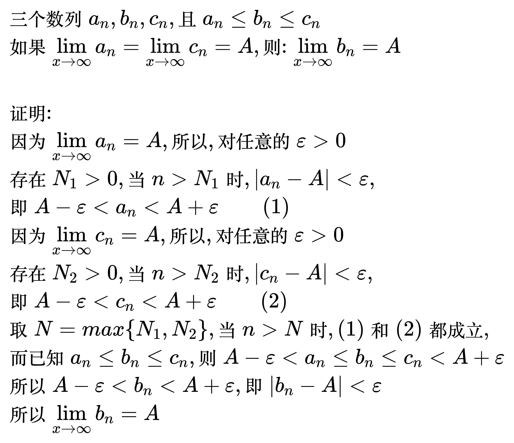
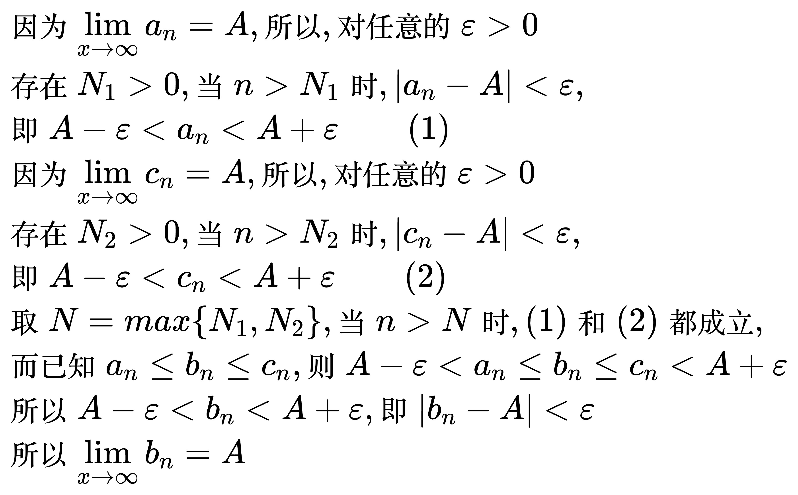
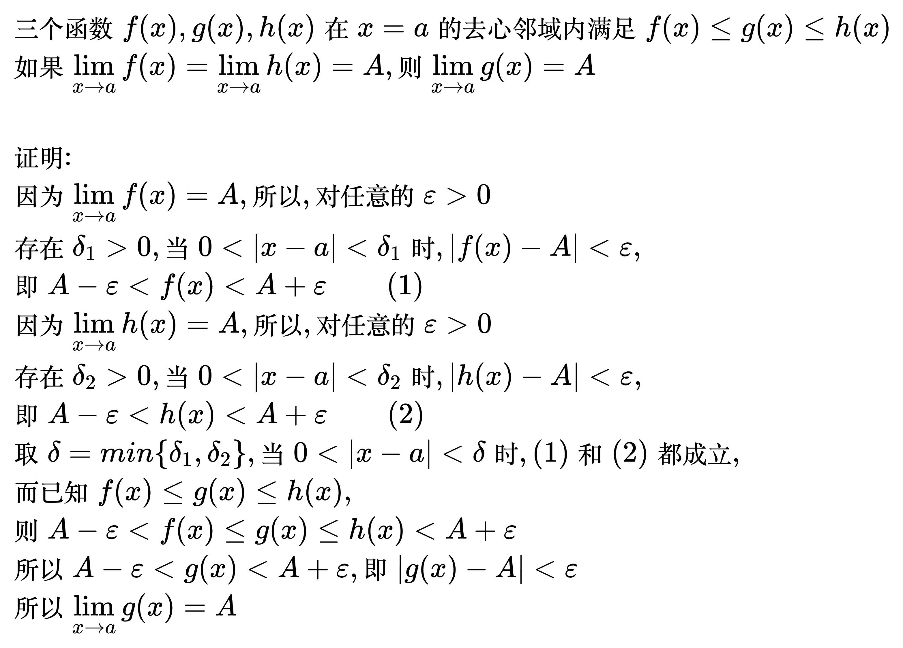
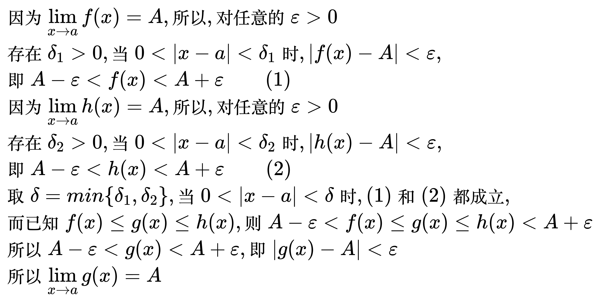
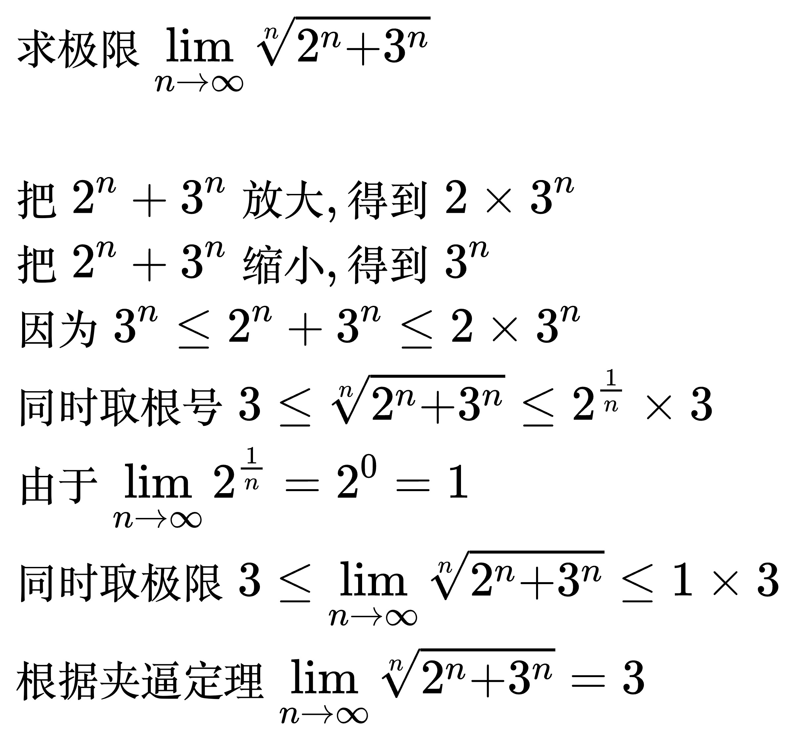
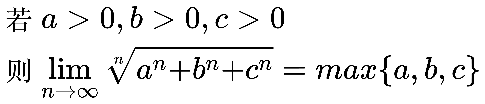
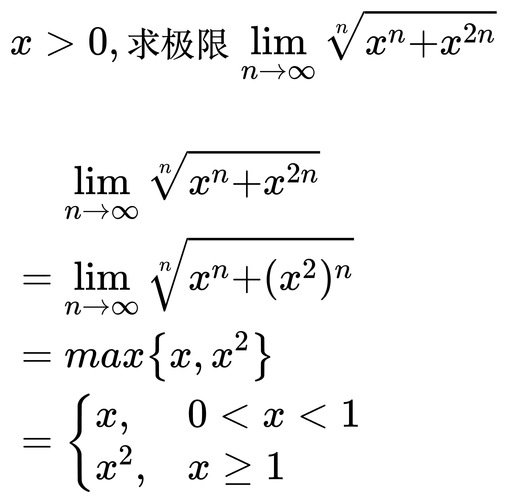
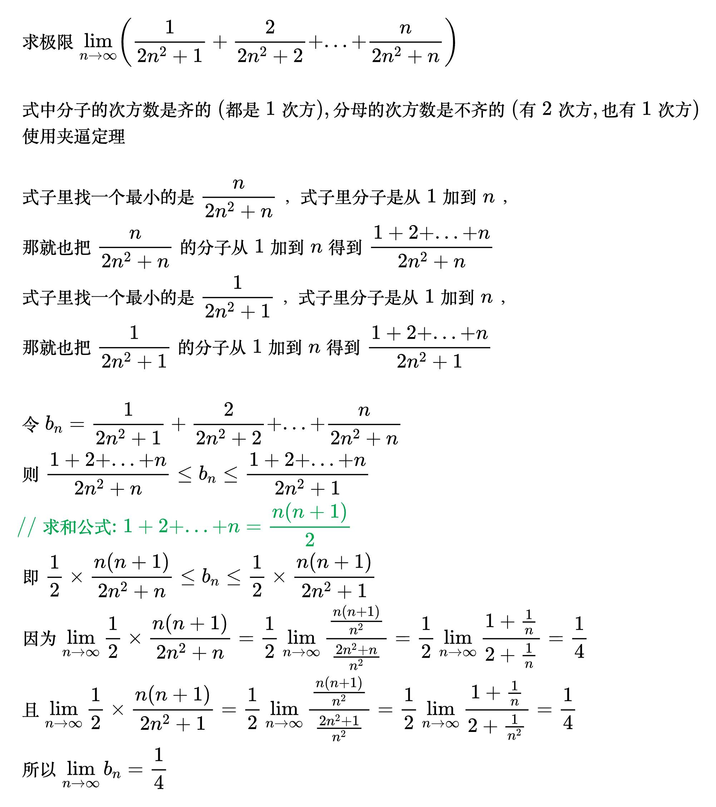
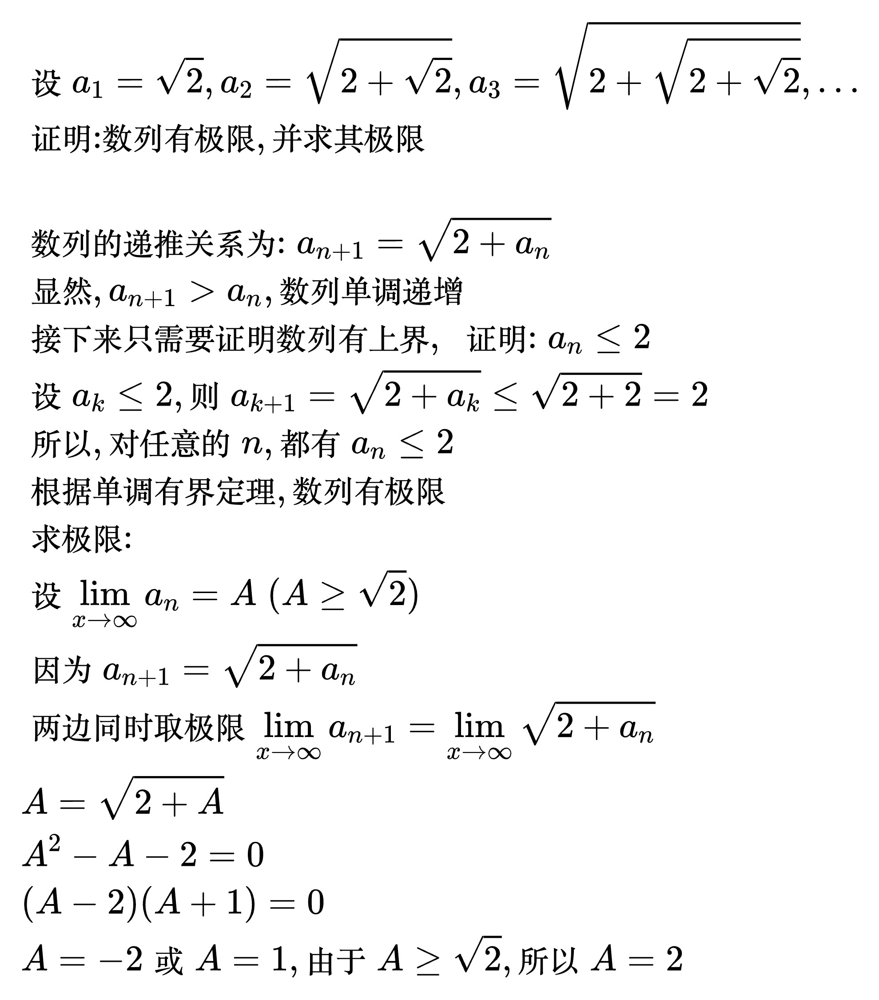
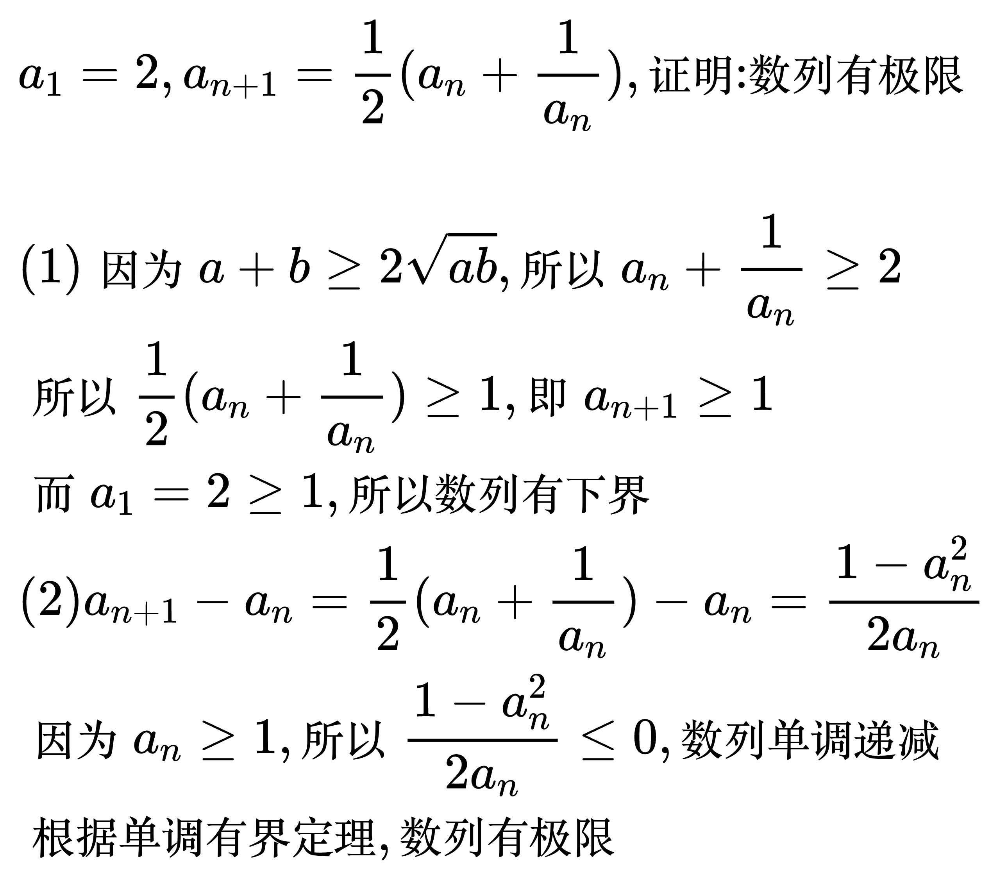

# 极限存在准则

## 极限存在定理

### 夹逼定理(数列型)

<!--
\begin{align}
& 三个数列 a_{n}, b_{n}, c_{n}, 且 a_{n} \le b_{n} \le c_{n} \\
& 如果 \lim_{x \to \infty} a_{n} = \lim_{x \to \infty} c_{n} = A, 则: \lim_{x \to \infty} b_{n} = A \\
\end{align}
-->

证明

<!--
\begin{align}
& 因为 \lim_{x \to \infty} a_{n} = A, 所以, 对任意的 \varepsilon \gt 0 \\
& 存在 N_{1} \gt 0, 当 n \gt N_{1} 时, |a_{n} - A| \lt \varepsilon, \\
& 即 A - \varepsilon \lt a_{n} \lt A + \varepsilon \qquad (1)\\
& 因为 \lim_{x \to \infty} c_{n} = A, 所以, 对任意的 \varepsilon \gt 0 \\
& 存在 N_{2} \gt 0, 当 n \gt N_{2} 时, |c_{n} - A| \lt \varepsilon, \\
& 即 A - \varepsilon \lt c_{n} \lt A + \varepsilon \qquad (2)\\
& 取 N = max\left \{ N_{1}, N_{2} \right \} , 当 n \gt N 时, (1) 和 (2) 都成立, \\
& 而已知 a_{n} \le b_{n} \le c_{n}, 则 A - \varepsilon \lt a_{n} \le b_{n} \le c_{n} \lt A + \varepsilon \\
& 所以 A - \varepsilon \lt b_{n} \lt A + \varepsilon, 即 |b_{n} - A| \lt \varepsilon \\
& 所以 \lim_{x \to \infty} b_{n} = A \\
\end{align}
-->

### 夹逼定理(函数型)

<!--
\begin{align}
& 三个函数 f(x), g(x), h(x) 在 x = a 的去心邻域内满足 f(x) \le g(x) \le h(x) \\
& 如果 \lim_{x \to a} f(x) = \lim_{x \to a} h(x) = A, 则 \lim_{x \to a} g(x) = A \\
\end{align}
-->

证明

<!--
\begin{align}
& 因为 \lim_{x \to a} f(x) = A, 所以, 对任意的 \varepsilon \gt 0 \\
& 存在 \delta_{1} \gt 0, 当 0 \lt |x - a| \lt \delta_{1} 时, |f(x) - A| \lt \varepsilon, \\
& 即 A - \varepsilon \lt f(x) \lt A + \varepsilon \qquad (1)\\
& 因为 \lim_{x \to a} h(x) = A, 所以, 对任意的 \varepsilon \gt 0 \\
& 存在 \delta_{2} \gt 0, 当 0 \lt |x - a| \lt \delta_{2} 时, |h(x) - A| \lt \varepsilon, \\
& 即 A - \varepsilon \lt h(x) \lt A + \varepsilon \qquad (2)\\
& 取 \delta = min\left \{ \delta_{1}, \delta_{2} \right \} , 当 0 \lt |x - a| \lt \delta 时, (1) 和 (2) 都成立, \\
& 而已知 f(x) \le g(x) \le h(x), 则 A - \varepsilon \lt f(x) \le g(x) \le h(x) \lt A + \varepsilon \\
& 所以 A - \varepsilon \lt g(x) \lt A + \varepsilon, 即 |g(x) - A| \lt \varepsilon \\
& 所以 \lim_{x \to a} g(x) = A \\
\end{align}
-->

例题 1

<!--
\begin{align}
& 求极限 \lim_{n \to \infty} \sqrt[n]{2^{n} + 3^{n}} \\
\\
& 把 2^{n} + 3^{n} 放大, 得到 2 \times 3^{n} \\
& 把 2^{n} + 3^{n} 缩小, 得到 3^{n} \\
& 因为 3^{n} \le 2^{n} + 3^{n} \le 2 \times 3^{n} \\
& 同时取根号 3 \le \sqrt[n]{2^{n} + 3^{n}} \le 2^{\frac{1}{n}} \times 3 \\
& 由于 \lim_{n \to \infty} 2^{\frac{1}{n}} = 2^{0} = 1 \\
& 同时取极限 3 \le \lim_{n \to \infty} \sqrt[n]{2^{n} + 3^{n}} \le 1 \times 3 \\
& 根据夹逼定理 \lim_{n \to \infty} \sqrt[n]{2^{n} + 3^{n}} = 3 \\
\end{align}
-->

推论

<!--
\begin{align}
& 若 a \gt 0, b \gt 0, c \gt 0 \\
& 则 \lim_{n \to \infty} \sqrt[n]{a^{n} + b^{n} + c^{n}} = max \left \{ a, b, c \right \}  \\
\end{align}
-->

例题

<!--
\begin{align}
& x \gt 0, 求极限 \lim_{n \to \infty} \sqrt[n]{x^{n} + x^{2n}} \\
\\
& \quad\, \lim_{n \to \infty} \sqrt[n]{x^{n} + x^{2n}} \\
& = \lim_{n \to \infty} \sqrt[n]{x^{n} + (x^{2})^{n}} \\
& = max \left \{ x, x^{2} \right \} \\
& = \begin{cases}
x, & 0 \lt x \lt 1 \\
x^{2}, & x \ge 1
\end{cases}
\end{align}
-->

例题 2

<!--
\begin{align}
& 求极限 \lim_{n \to \infty} \left ( \frac{1}{2n^{2} + 1} + \frac{2}{2n^{2} + 2} + ... + \frac{n}{2n^{2} + n} \right )  \\
\\
& 式中分子的次方数是齐的(都是1次方), 分母的次方数是不齐的(有2次方, 也有1次方) \\
& 放大和缩小的规则: 齐的部分不变, 不齐的变 \\
& \frac{1}{2n^{2} + 1} + \frac{2}{2n^{2} + 2} + ... + \frac{n}{2n^{2} + n} 的通用格式可以表示成 \frac{i}{2n^{2} + i}, 其中 1 \le i \le n \\
& 把 \frac{i}{2n^{2} + i} 放大, 得到 \frac{i}{2n^{2} + 1} \\
& 把 \frac{i}{2n^{2} + i} 缩小, 得到 \frac{i}{2n^{2} + n} \\
& 因为 \frac{i}{2n^{2} + n} \le \frac{i}{2n^{2} + i} \le \frac{i}{2n^{2} + 1} \\
& 所以 \frac{1 + 2 + ... + n}{2n^{2} + n} \le
\frac{1}{2n^{2} + 1} + \frac{2}{2n^{2} + 2} + ... + \frac{n}{2n^{2} + n} \le
\frac{1 + 2 + ... + n}{2n^{2} + 1} \\
& 即 \frac{1}{2} \frac{n(n + 1)}{2n^{2} + n} \le
\frac{1}{2n^{2} + 1} + \frac{2}{2n^{2} + 2} + ... + \frac{n}{2n^{2} + n} \le
\frac{1}{2} \frac{n(n + 1)}{2n^{2} + 1} \\
& 同时取极限, 不等式左边: \lim_{n \to \infty} \frac{1}{2} \frac{n(n + 1)}{2n^{2} + n}
= \frac{1}{2} \lim_{n \to \infty} \frac{\frac{n(n + 1)}{n^{2}}}{\frac{2n^{2} + n}{n^{2}}}
= \frac{1}{2} \lim_{n \to \infty} \frac{1 + \frac{1}{n}}{2 + \frac{1}{n}}
= \frac{1}{4} \\
& 不等式右边: \lim_{n \to \infty} \frac{1}{2} \frac{n(n + 1)}{2n^{2} + 1}
= \frac{1}{2} \lim_{n \to \infty} \frac{\frac{n(n + 1)}{n^{2}}}{\frac{2n^{2} + 1}{n^{2}}}
= \frac{1}{2} \lim_{n \to \infty} \frac{1 + \frac{1}{n}}{2 + \frac{1}{n^{2}}}
= \frac{1}{4} \\
& 根据夹逼定理 \lim_{n \to \infty} \left ( \frac{1}{2n^{2} + 1} + \frac{2}{2n^{2} + 2} + ... + \frac{n}{2n^{2} + n} \right ) = \frac{1}{4} \\
\end{align}
-->

### 单调有界定理

单调有界的数列必有极限。

例题 1

<!--
\begin{align}
& 设 a_{1} = \sqrt{2}, a_{2} = \sqrt{2 + \sqrt{2}}, a_{3} = \sqrt{2 + \sqrt{2 + \sqrt{2}}}, ... \\
& 证明: 数列有极限, 并求其极限 \\
\\
& 数列的递推关系为: a_{n + 1} = \sqrt{2 + a_{n}} \\
& 显然, a_{n + 1} \gt a_{n}, 数列单调递增 \\
& 接下来只需要证明数列有上界, \; 证明: a_{n} \le 2 \\
& 设 a_{k} \le 2, 则 a_{k + 1} = \sqrt{2 + a_{k}} \le \sqrt{2 + 2} = 2 \\
& 所以, 对任意的n, 都有 a_{n} \le 2 \\
& 根据单调有界定理, 数列有极限 \\
& 求极限: \\
& 设 \lim_{x \to \infty} a_{n} = A \; (A \ge \sqrt{2}) \\
& 因为 a_{n + 1} = \sqrt{2 + a_{n}} \\
& 两边同时取极限 \lim_{x \to \infty} a_{n + 1} = \lim_{x \to \infty} \sqrt{2 + a_{n}} \\
& A = \sqrt{2 + A} \\
& A^{2} - A - 2 = 0 \\
& (A - 2)(A + 1) = 0 \\
& A = -2 或 A = 1, 由于A \ge \sqrt{2}, 所以 A = 2 \\
\end{align}
-->

例题 2

<!--
\begin{align}
& a_{1} = 2, a_{n + 1} = \frac{1}{2}(a_{n} + \frac{1}{a_{n}}), 证明: 数列有极限 \\
\\
& (1) 因为 a + b \ge 2\sqrt{ab}, 所以 a_{n} + \frac{1}{a_{n}} \ge 2 \\
& 所以 \frac{1}{2}(a_{n} + \frac{1}{a_{n}}) \ge 1, 即 a_{n + 1} \ge 1 \\
& 而 a_{1} = 2 \ge 1, 所以数列有下界 \\
& (2) a_{n + 1} - a_{n} = \frac{1}{2}(a_{n} + \frac{1}{a_{n}}) - a_{n} = \frac{1 - a_{n}^{2}}{2a_{n}} \\
& 因为 a_{n} \ge 1, 所以 \frac{1 - a_{n}^{2}}{2a_{n}} \le 0, 数列单调递减 \\
& 根据单调有界定理, 数列有极限 \\
\end{align}
-->

