# 中值定理

极值点的导数要么等于 0 要么不存在。

费马定理

<!--
\begin{align}
& 设函数 f(x) 可导, 且在 x = a 处取极值, \\
& 则 f'(a) = 0, 反之不对 \\
\end{align}
-->

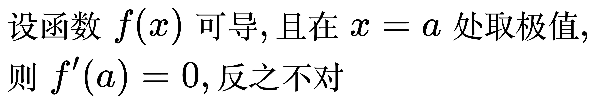

## 罗尔定理

<!--
\begin{align}
& 设函数 f(x) 满足: \\
& \; 1. f(x) 在 [a, b] 上连续 \\
& \; 2. f(x) 在 (a, b) 内可导 \\
& \; 3. f(a) = f(b) \\
& 则存在 \xi \in (a, b), 使得 f'(\xi) = 0 \\
\end{align}
-->

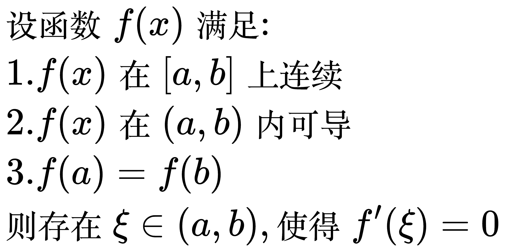

例题 1

<!--
\begin{align}
& 验证函数 f(x) = x^{2} - 2x + 4 在 [0, 2] 上满足罗尔定理的条件, 并求驻点 \xi \\
\\
& \;\, // 驻点是导数等于0的点 \\
& \;\, f(x)是多项式, 多项式函数不仅在每一点连续, 而且在任何有限区间上都可导 \\
& \;\, f(0) = f(2) = 4 \\
& 所以存在 \xi \in (0, 2), 使 f'(\xi) = 0 \\
& f'(x) = 2x - 2 \\
& 所以 \xi = 1 \\
\\
& 多项式的格式: \\
& \;\, p(x) = a_n x^n + a_{n-1} x^{n-1} + \ldots + a_2 x^2 + a_1 x + a_0 \\
& 其中 a_n, a_{n-1}, \ldots, a_1, a_0 是常数, n 是非负整数。\\
\end{align}
-->

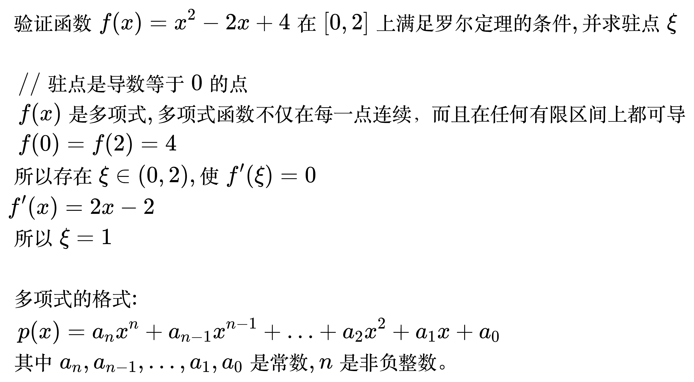

例题 2

<!--
\begin{align}
& 设 f(x) 在 [0, 2] 上连续, 在 (0, 2) 内可导, 且 f(0) = 1, f(1) + f(2) = 2, \\
& 证明: 存在 \xi \in (0, 2), 使得 f'(\xi) = 0 \\
\\
& \;\, // 闭区间连续, 函数值相加 \Rightarrow 使用介值定理 \\
& 因为 f(x) 在 [0, 2] 上连续, 所以存在最大值 M 和最小值 m \\
& \;\, 2m \le f(1) + f(2) \le 2M \\
& 因为 f(1) + f(2) = 2 \\
& 所以 2m \le 2 \le 2M \Rightarrow m \le 1 \le M \\
& 所以 1 是介值 \\
& 所以存在 c \in [1, 2], 使 f(c) = 1 \\
& 因为 f(0) = 1 \\
& 所以 f(0) = f(c) \\
& 而 c \ne 0 \\
& 根据罗尔定理, 存在 \xi \in (0, c), 使 f'(\xi) = 0 \\
\end{align}
-->

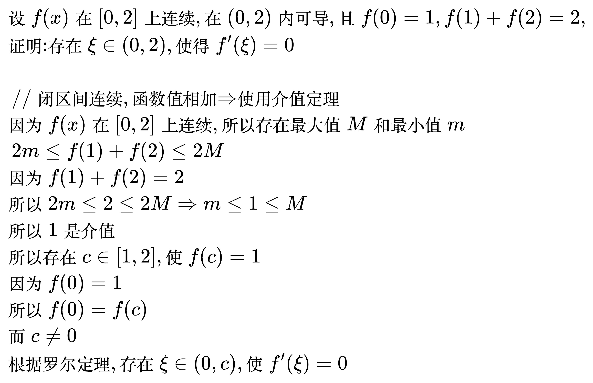

## 拉格朗日中值定理

<!--
\begin{align}
& 设函数 f(x) 满足: \\
& \; 1. f(x) 在 [a, b] 上连续 \\
& \; 2. f(x) 在 (a, b) 内可导 \\
& 则存在 \xi \in (a, b), \\
& 使得 f'(\xi) = \frac{f(b) - f(a)}{b - a} \\
\end{align}
-->

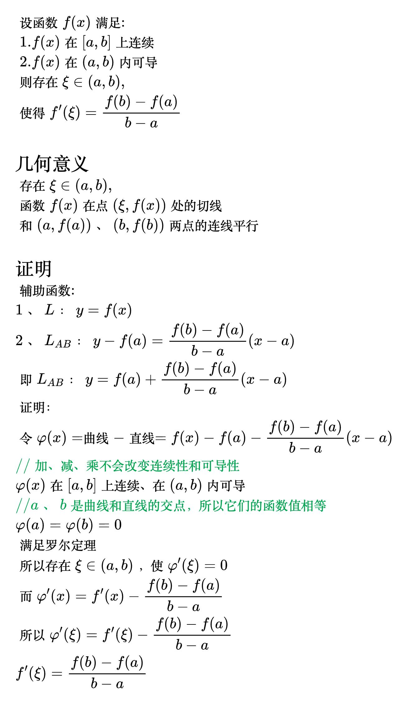

<!--
\begin{align}
& 当 f(a) = f(b) 时, 拉格朗日中值定理即为罗尔定理, 即罗尔定理是拉格朗日中值定理的特例 \\
& 拉格朗日中值定理的等价形式: \\
& \;\, 1. f(b) - f(a) = f'(\xi)(b - a) \\
& \;\, 2. f(b) - f(a) = f'[a + \theta(b - a)](b - a), \; 0 \lt \theta \lt 1 \\
\end{align}
-->

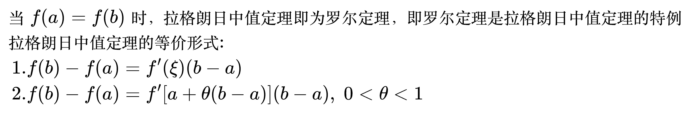

例题 1

<!--
\begin{align}
& 设 f(x) 二阶可导, 且 f''(x) > 0, 判断 f'(0), f'(1), f(1) - f(0) 的大小 \\
\\
& \;\, // 看到 f(b) - f(a), 使用拉格朗日定理 \\
& \;\, f(1) - f(0) = f'(c)(1 - 0) = f'(c), \; 0 < c < 1 \\
& 因为 f''(x) > 0, 所以 f'(x) 单调递增 \\
& 因为 0 < c < 1, 所以 f'(0) < f'(c) < f'(1) \\
& 所以 f'(0) < f(1) - f(0) < f'(1) \\
\end{align}
-->

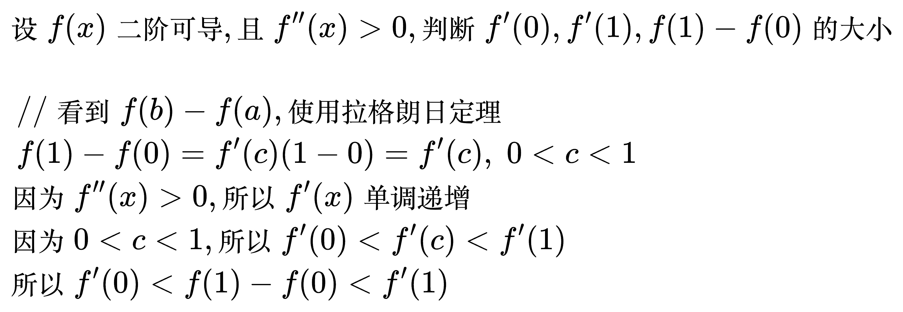

例题 2

<!--
\begin{align}
& 设 f(x) 可导, 且 \lim_{x \to \infty} f'(x) = e, 求 \lim_{x \to \infty} [f(x + 2) - f(x - 1)] \\
\\
& \;\, // 看到 f(b) - f(a), 使用拉格朗日定理 \\
& \;\, f(x + 2) - f(x - 1) = f'(c)(x + 2 - x + 1) = 3f'(c), \; x - 1 < c < x + 2 \\
& \;\, \lim_{x \to \infty} [f(x + 2) - f(x - 1)] = \lim_{x \to \infty} [3f'(c)]
= 3 \lim_{x \to \infty} f'(c) = 3e \\
\end{align}
-->

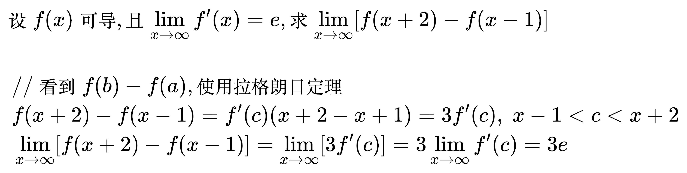

例题 3

<!--
\begin{align}
& 求 \lim_{x \to +\infty} x^{2}(\sin \frac{1}{x - 1} - \sin \frac{1}{x + 1}) \\
\\
& \;\, // 看到 f(b) - f(a), 使用拉格朗日定理 \\
& 令 f(t) = \sin t, 则 f'(t) = \cos t \\
& 则 \sin \frac{1}{x - 1} - \sin \frac{1}{x + 1} = f(\frac{1}{x - 1}) - f(\frac{1}{x + 1}) \\
& \;\, f(\frac{1}{x - 1}) - f(\frac{1}{x + 1}) = f'(\xi)(\frac{1}{x - 1} - \frac{1}{x + 1}) \\
& \;\, = \frac{2}{x^{2} - 1} \cos \xi, \quad \frac{1}{x - 1} < \xi < \frac{1}{x + 1} \\
& \;\, \lim_{x \to +\infty} x^{2}(\sin \frac{1}{x - 1} - \sin \frac{1}{x + 1}) \\
& \;\, = \lim_{x \to +\infty} x^{2}(\frac{2}{x^{2} - 1} \cos \xi) \\
& \;\, = \lim_{x \to +\infty} \frac{2x^{2}}{x^{2} - 1} \cos \xi \\
& \;\, = 2 \lim_{x \to +\infty} \cos \xi \\
& \;\, x 趋于 +\infty 时, \frac{1}{x - 1} 和 \frac{1}{x + 1} 都趋于 0, 所以 \xi 也趋于 0 \\
& 所以 2 \lim_{x \to +\infty} \cos \xi = 2 \times 1 = 2 \\
\end{align}
-->

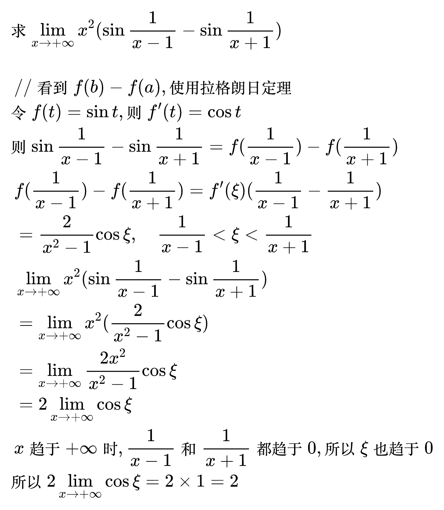

例题 4

<!--
\begin{align}
& 设 f(x) 二阶可导, \lim_{x \to 0} \frac{f(x) - 1}{x} = 1, f(1) = 2,
证明: 存在 \xi \in (0, 1), 使 f''(\xi) = 0 \\
\\
& \;\, \lim_{x \to 0} \frac{f(x) - 1}{x} = 1 \\
& \;\, x \to 0 时, 分母趋于 0, 而极限值是1, 所以分子一定也趋于 0 \\
& 所以 \lim_{x \to 0} [f(x) - 1] = 0 \\
& \;\, \lim_{x \to 0} f(x) = 1 \\
& 又因为 f(x) 二阶可导, 所以 f(x) 一阶可导, 所以 f(x) 连续, 极限值等于函数值 \\
& 所以 f(0) = 1 \\
& \;\, f'(0) = \lim_{x \to 0} \frac{f(x) - f(0)}{x - 0}
= \lim_{x \to 0} \frac{f(x) - 1}{x} = 1 \\
& \;\, // f(0) = 1, f(1) = 2, 使用拉格朗日中值定理 \\
& 存在 c \in (0, 1), 使 f'(c) = \frac{f(1) - f(0)}{1 - 0} = 1 \\
& 因为 f(x) 二阶可导, 所以一阶导数连续, 又因为 f'(0) = f'(c) = 1 \\
& \;\, // 使用罗尔定理 \\
& 所以, 存在 \xi \in (0, c), 使 f''(\xi) = 0, \quad (0, 1) 包含 (0, c) \\
\end{align}
-->

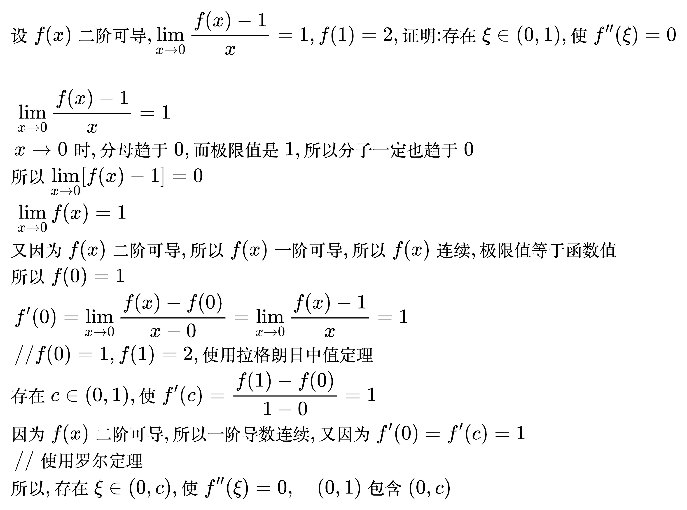

## 柯西中值定理

<!--
\begin{align}
& 设函数 f(x), g(x) 满足: \\
& \; 1. f(x), g(x) 在 [a, b] 上连续 \\
& \; 2. f(x), g(x) 在 (a, b) 内可导 \\
& \; 3. g'(x) \ne 0, \quad a < x < b \\
& 则存在 \xi \in (a, b), \\
& 使得 \frac{f(b) - f(a)}{g(b) - g(a)} = \frac{f'(\xi)}{g'(\xi)} \\
\end{align}
-->

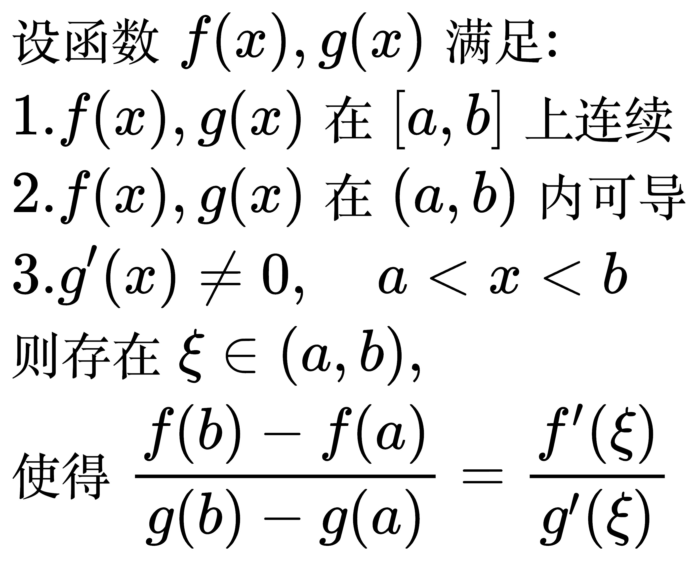

当 g(x) = x 时, 柯西中值定理即为拉格朗日中值定理, 即拉格朗日中值定理是柯西中值定理的特例。

例题 1

<!--
\begin{align}
& 设函数 f(x) 在 [0, 1] 上连续, (0, 1) 内可导, f(1) = 0, \\
& 证明: 存在 \xi \in (0, 1), 使 \xi f'(\xi) + 2 f(\xi) = 0 \\
\\
& \;\, // 构造辅助函数, 把 \xi 换成 x \\
& \;\, \quad \,\, x f'(x) + 2 f(x) = 0 \\
& \;\, // 两边同除 xf(x) \\
& \;\, = \frac{f'(x)}{f(x)} + \frac{2}{x} = 0 \\
& \;\, // 把导数还原: [\ln f(x)]' = \frac{f'(x)}{f(x)}, (\ln x^{2})' = \frac{2}{x} \\
& \;\, = [\ln f(x)]' + (\ln x^{2})' = 0 \\
& \;\, // 加减的导数等于导数的加减 \\
& \;\, = [\ln f(x) + \ln x^{2}]' = 0 \\
& \;\, = [\ln x^{2} f(x)]' = 0 \\
& 令 \varphi (x) = x^{2} f(x) \\
& 因为 \varphi (1) = 1 \times f(1) = 0 \\
& 所以 \varphi (0) = \varphi (1) = 0 \\
& 根据罗尔定理, 存在 \xi \in (0, 1) \\
& 使 \varphi '(\xi) = 0 \\
& 而 \varphi '(x) = 2xf(x) + x^{2}f'(x) \\
& 所以 \varphi '(\xi) = 2\xi f(\xi) + \xi ^{2}f'(\xi) = 0 \\
& 因为 \xi \ne, 所以 约掉一个 \xi \\
& 所以 2 f(\xi) + \xi f'(\xi) = 0 \\
\end{align}
-->

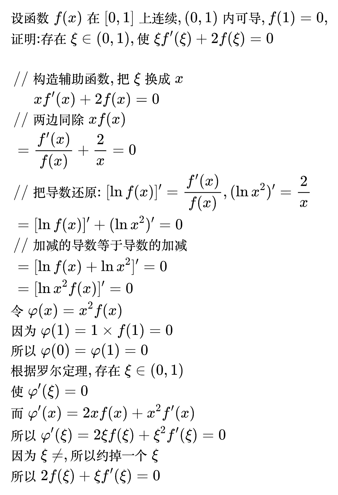

例题 2

<!--
\begin{align}
& 设函数 f(x) 在 [a, b] 上连续, (a, b) 内可导, f(a) = f(b) = 0, \\
& 证明: 存在 \xi \in (a, b), 使 f'(\xi) - f(\xi) = 0 \\
\\
& \;\, // 只有一个中值 \xi, 两项导数差一阶, 和例题1是同一个题型 \\
& \;\, // 构造辅助函数, 把 \xi 换成 x \\
& \;\, \quad \,\, f'(x) - f(x) = 0 \\
& \;\, // 制造分子比分母多一阶导数: 两边同除 f(x) \\
& \;\, = \frac{f'(x)}{f(x)} - 1 = 0 \\
& \;\, // 把导数还原: [\ln f(x)]' = \frac{f'(x)}{f(x)}, (-x)' = -1 \\
& \;\, = [\ln f(x)]' + (-x)' = 0 \\
& \;\, // 需要把加号两边合起来, 所以把 -x 写成 \ln e^{-x} \\
& \;\, = [\ln f(x)]' + (\ln e^{-x})' = 0 \\
& \;\, // 加减的导数等于导数的加减 \\
& \;\, = [\ln e^{-x} f(x)]' = 0 \\
\\
& 令 \varphi (x) = e^{-x} f(x) \\
& 因为 f(a) = f(b) = 0 \\
& 所以 \varphi (a) = \varphi (b) = 0 \\
& 根据罗尔定理, 存在 \xi \in (a, b) \\
& 使 \varphi '(\xi) = 0 \\
& 而 \varphi '(x) = e^{-x}[f'(x) - f(x)] \\
& 而且 e^{-x} \ne 0 \\
& 所以 f'(\xi) - f(\xi) 一定等于0 \\
\end{align}
-->

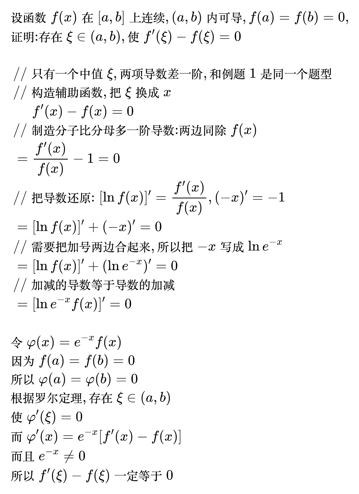
