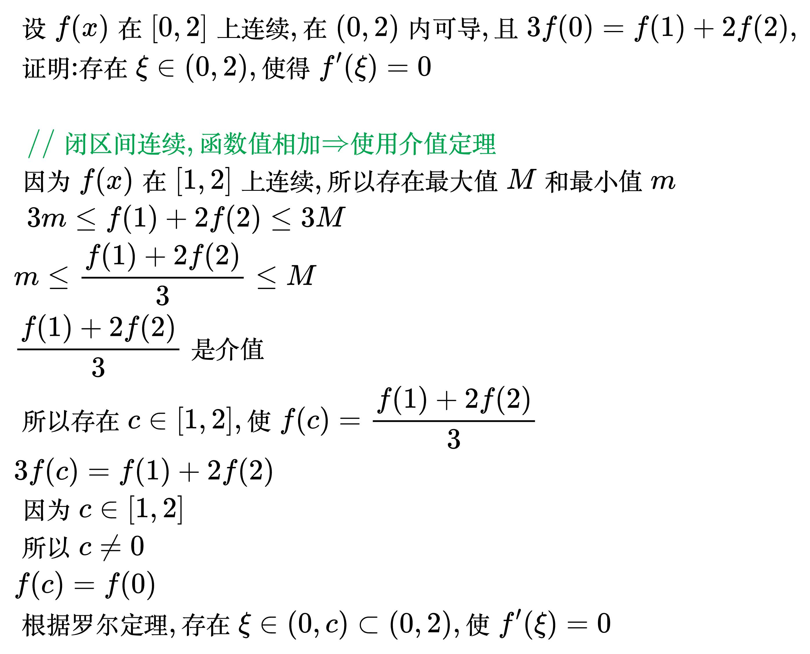
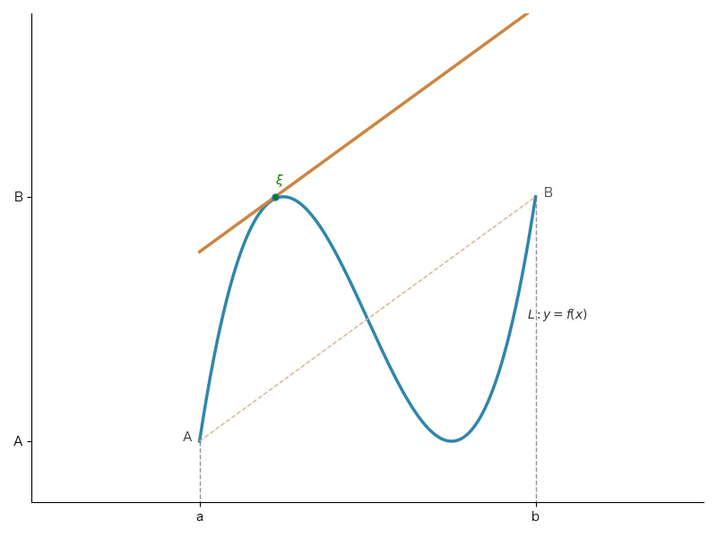
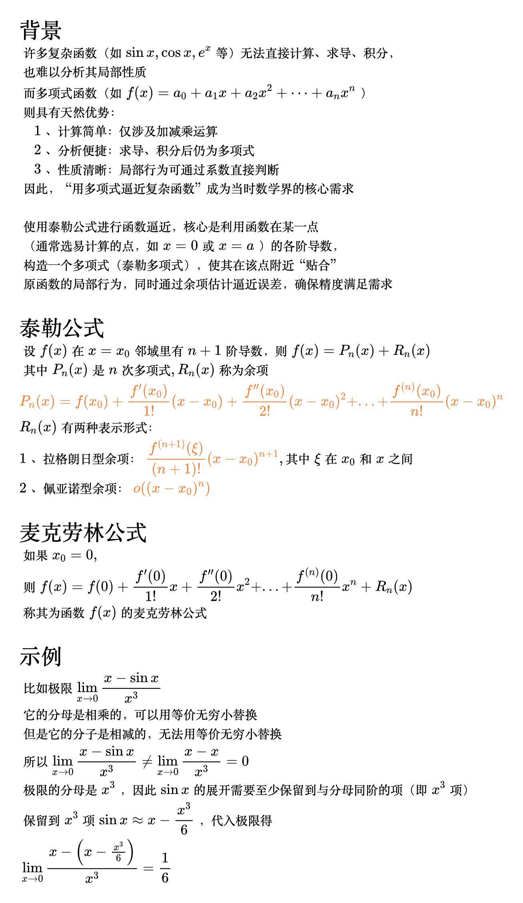
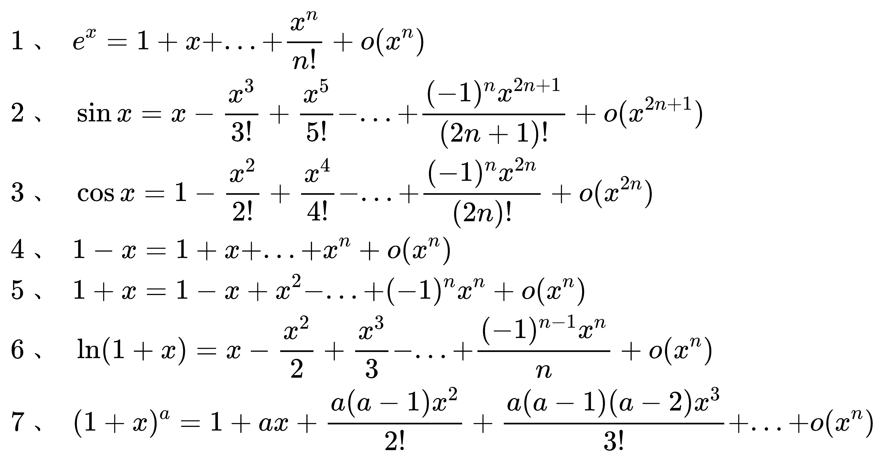
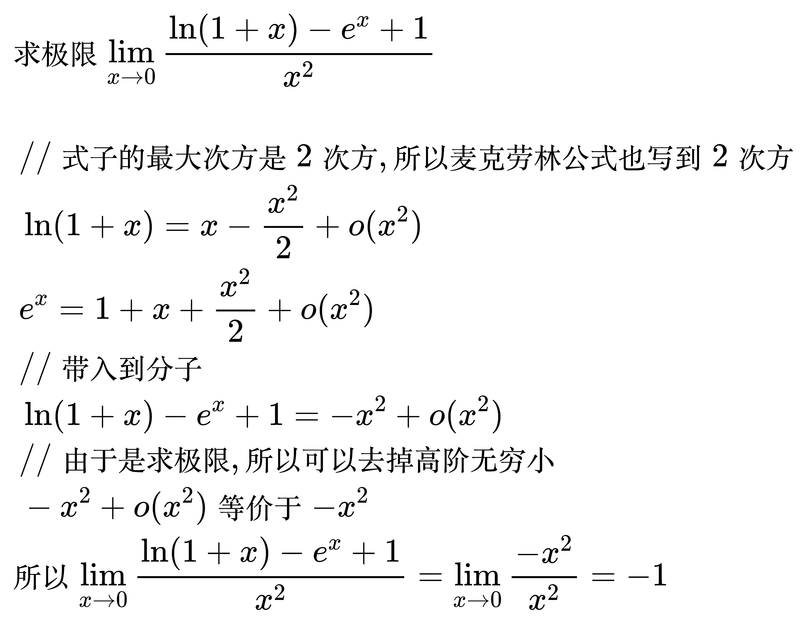
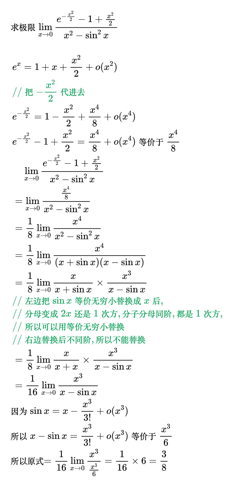
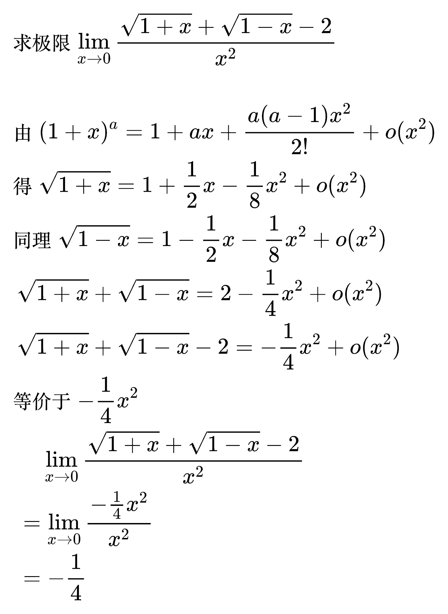

# 中值定理

极值点的导数要么等于 0 要么不存在。

费马定理

<!--
\begin{align}
& 设函数 f(x) 可导, 且在 x = a 处取极值, \\
& 则 f'(a) = 0, 反之不对 \\
\end{align}
-->

## 罗尔定理

<!--
\begin{align}
& 设函数 f(x) 满足: \\
& \; 1. f(x) 在 [a, b] 上连续 \\
& \; 2. f(x) 在 (a, b) 内可导 \\
& \; 3. f(a) = f(b) \\
& 则存在 \xi \in (a, b), 使得 f'(\xi) = 0 \\
\end{align}
-->

### 例题

<!--
\begin{align}
& 验证函数 f(x) = x^{2} - 2x + 4 在 [0, 2] 上满足罗尔定理的条件, 并求驻点 \xi \\
\\
& \;\, {\color{Green} // 驻点是导数等于0的点} \\
& \;\, f(x)是多项式, 多项式函数不仅在每一点连续, 而且在任何有限区间上都可导 \\
& \;\, f(0) = f(2) = 4 \\
& 所以存在 \xi \in (0, 2), 使 f'(\xi) = 0 \\
& f'(x) = 2x - 2 \\
& 所以 \xi = 1 \\
\\
& 多项式的格式: \\
& \;\, p(x) = a_n x^n + a_{n-1} x^{n-1} + \ldots + a_2 x^2 + a_1 x + a_0 \\
& 其中 a_n, a_{n-1}, \ldots, a_1, a_0 是常数, n 是非负整数。\\
\end{align}
-->

<!--
\begin{align}
& 设 f(x) 在 [0, 2] 上连续, 在 (0, 2) 内可导, 且 f(0) = 1, f(1) + f(2) = 2, \\
& 证明: 存在 \xi \in (0, 2), 使得 f'(\xi) = 0 \\
\\
& \;\, {\color{Green} // 闭区间连续, 函数值相加 \Rightarrow 使用介值定理} \\
& 因为 f(x) 在 [0, 2] 上连续, 所以存在最大值 M 和最小值 m \\
& \;\, 2m \le f(1) + f(2) \le 2M \\
& 因为 f(1) + f(2) = 2 \\
& 所以 2m \le 2 \le 2M \Rightarrow m \le 1 \le M \\
& 所以 1 是介值 \\
& 所以存在 c \in [1, 2], 使 f(c) = 1 \\
& 因为 f(0) = 1 \\
& 所以 f(0) = f(c) \\
& 而 c \ne 0 \\
& 根据罗尔定理, 存在 \xi \in (0, c), 使 f'(\xi) = 0 \\
\end{align}
-->

<!--
\begin{align}
& 设 f(x) 在 [0, 2] 上连续, 在 (0, 2) 内可导, 且 3f(0)=f(1)+2f(2), \\
& 证明: 存在 \xi \in (0, 2), 使得 f'(\xi) = 0 \\
\\
& \;\, {\color{Green} // 闭区间连续, 函数值相加 \Rightarrow 使用介值定理} \\
& 因为 f(x) 在 [1, 2] 上连续, 所以存在最大值 M 和最小值 m \\
& \;\, 3m \le f(1) + 2f(2) \le 3M \\
& m \le \frac{f(1) + 2f(2)}{3} \le M \\
& \frac{f(1) + 2f(2)}{3} 是介值 \\
& 所以存在 c \in [1, 2], 使 f(c)=\frac{f(1) + 2f(2)}{3} \\
& 3f(c)=f(1)+2f(2) \\
& 因为 c \in [1, 2] \\
& 所以 c \ne 0 \\
& f(c)=f(0) \\
& 根据罗尔定理, 存在 \xi \in (0, c) \subset (0, 2), 使 f'(\xi) = 0 \\
\end{align}
-->

## 拉格朗日中值定理

<!--
\begin{align}
& 设函数 f(x) 满足: \\
& \; 1. f(x) 在 [a, b] 上连续 \\
& \; 2. f(x) 在 (a, b) 内可导 \\
& 则存在 \xi \in (a, b), \\
& 使得 f'(\xi) = \frac{f(b) - f(a)}{b - a} \\
\\
& {\Large 几何意义}\\
& 存在 \xi \in (a, b), \\
& 函数f(x)在点(\xi,f(x))处的切线 \\
& 和(a,f(a))、(b,f(b))两点的连线平行 \\
\\
& {\Large 证明} \\
& 辅助函数: \\
& 1、L：y=f(x) \\
& 2、L_{AB}：y-f(a)=\frac{f(b)-f(a)}{b-a}(x-a) \\
& 即 L_{AB}：y=f(a)+\frac{f(b)-f(a)}{b-a}(x-a) \\
& 证明：\\
& 令 \varphi (x)=曲线-直线=f(x)-f(a)-\frac{f(b)-f(a)}{b-a}(x-a) \\
& {\color{Green} // 加、减、乘不会改变连续性和可导性} \\
& \varphi (x) 在 [a, b] 上连续、在 (a, b) 内可导 \\
& {\color{Green} // a、b是曲线和直线的交点，所以它们的函数值相等} \\
& \varphi (a)=\varphi (b)=0 \\
& 满足罗尔定理 \\
& 所以存在 \xi \in (a, b)，使\varphi '(\xi)=0 \\
& 而\varphi '(x)=f'(x)-\frac{f(b)-f(a)}{b-a} \\
& 所以 \varphi '(\xi) =f'(\xi)-\frac{f(b)-f(a)}{b-a} \\
& f'(\xi)=\frac{f(b)-f(a)}{b-a} \\
\end{align}
-->

<!--
import numpy as np
import matplotlib.pyplot as plt

plt.rcParams['font.sans-serif'] = ['Hiragino Sans GB']
plt.rcParams['axes.unicode_minus'] = False

def f(x):
    return x ** 3 - 3 * x ** 2 + 2

# 曲线
x_start = -1
x_end = 3
x = np.linspace(x_start, x_end, 2000)  # x范围覆盖两个极值点，2000个点确保曲线平滑
y = f(x)

# 斜率
x1 = x_end
x0 = x_start
y1 = f(x1)
y0 = f(x0)
k = (y1 - y0) / (x1 - x0)

# 首尾连线
x_l = np.linspace(x_start, x_end, 2000)
y_l = k * x_l - k * x0 + y0

y_l2 = k * x_l + 2.1

# 创建画布
plt.figure(figsize=(8, 6))

# 绘制函数曲线
plt.plot(x, y, color='#2E86AB', linewidth=2.5)
plt.plot(x_l, y_l, color='#D2B48C', linewidth=1, linestyle='dashed')
plt.plot(x_l, y_l2, color='#CD853F', linewidth=2.5)
plt.plot(-0.1, 2, mfc='green', markersize=5.0, marker='o')
plt.text(-0.1, 2.2, r'$\xi$', fontsize=10, color='green')
plt.text(x_end-0.1, 0, '$L: y=f(x)$', fontsize=10, color='#333333')
plt.text(x_start - 0.2, f(x_start), 'A', fontsize=10, color='#333333')
plt.text(x_end + 0.1, f(x_end), 'B', fontsize=10, color='#333333')

# 坐标轴范围
plt.xlim(-3, 5)
plt.ylim(-3, 5)

# 添加注释线
plt.plot([x_start, x_start], [f(x_start), -3], color='#666666', linestyle='--', linewidth=1, alpha=0.7)
plt.plot([x_end, x_end], [f(x_end), -3], color='#666666', linestyle='--', linewidth=1, alpha=0.7)

# 不绘制坐标轴, 把左下边框作为坐标轴

# 设置刻度
plt.xticks([x_start, x_end], ['a', 'b'])
plt.yticks([f(x_start), f(x_end)], ['A', 'B'])
# 获取当前坐标轴对象
ax = plt.gca()
ax.spines['top'].set_visible(False)  # 隐藏顶部边框
ax.spines['right'].set_visible(False)  # 隐藏右侧边框

# 调整布局并显示
plt.tight_layout()
plt.show()
-->

<!--
\begin{align}
& 当 f(a) = f(b) 时, 拉格朗日中值定理即为罗尔定理, 即罗尔定理是拉格朗日中值定理的特例 \\
& 拉格朗日中值定理的等价形式: \\
& \;\, 1. f(b) - f(a) = f'(\xi)(b - a) \\
& \;\, 2. f(b) - f(a) = f'[a + \theta(b - a)](b - a), \; 0 \lt \theta \lt 1 \\
\end{align}
-->

### 例题

<!--
\begin{align}
& 设 f(x) 二阶可导, 且 f''(x) > 0, 判断 f'(0), f'(1), f(1) - f(0) 的大小 \\
\\
& \;\, {\color{Green} // 看到 f(b) - f(a), 使用拉格朗日定理} \\
& \;\, f(1) - f(0) = f'(c)(1 - 0) = f'(c), \; 0 < c < 1 \\
& 因为 f''(x) > 0, 所以 f'(x) 单调递增 \\
& 因为 0 < c < 1, 所以 f'(0) < f'(c) < f'(1) \\
& 所以 f'(0) < f(1) - f(0) < f'(1) \\
\end{align}
-->

<!--
\begin{align}
& 设 f(x) 可导, 且 \lim_{x \to \infty} f'(x) = e, 求 \lim_{x \to \infty} [f(x + 2) - f(x - 1)] \\
\\
& \;\, {\color{Green} // 看到 f(b) - f(a), 使用拉格朗日定理} \\
& \;\, f(x + 2) - f(x - 1) = f'(c)(x + 2 - x + 1) = 3f'(c), \; x - 1 < c < x + 2 \\
& \;\, \lim_{x \to \infty} [f(x + 2) - f(x - 1)] = \lim_{x \to \infty} [3f'(c)]
= 3 \lim_{x \to \infty} f'(c) = 3e \\
\end{align}
-->

<!--
\begin{align}
& 求 \lim_{x \to +\infty} x^{2}(\sin \frac{1}{x - 1} - \sin \frac{1}{x + 1}) \\
\\
& \;\, {\color{Green} // 看到 f(b) - f(a), 使用拉格朗日定理} \\
& 令 f(t) = \sin t, 则 f'(t) = \cos t \\
& 则 \sin \frac{1}{x - 1} - \sin \frac{1}{x + 1} = f(\frac{1}{x - 1}) - f(\frac{1}{x + 1}) \\
& \;\, f(\frac{1}{x - 1}) - f(\frac{1}{x + 1}) = f'(\xi)(\frac{1}{x - 1} - \frac{1}{x + 1}) \\
& \;\, = \frac{2}{x^{2} - 1} \cos \xi, \quad \frac{1}{x - 1} < \xi < \frac{1}{x + 1} \\
& \;\, \lim_{x \to +\infty} x^{2}(\sin \frac{1}{x - 1} - \sin \frac{1}{x + 1}) \\
& \;\, = \lim_{x \to +\infty} x^{2}(\frac{2}{x^{2} - 1} \cos \xi) \\
& \;\, = \lim_{x \to +\infty} \frac{2x^{2}}{x^{2} - 1} \cos \xi \\
& \;\, = 2 \lim_{x \to +\infty} \cos \xi \\
& \;\, x 趋于 +\infty 时, \frac{1}{x - 1} 和 \frac{1}{x + 1} 都趋于 0, 所以 \xi 也趋于 0 \\
& 所以 2 \lim_{x \to +\infty} \cos \xi = 2 \times 1 = 2 \\
\end{align}
-->

<!--
\begin{align}
& 设 f(x) 二阶可导, \lim_{x \to 0} \frac{f(x) - 1}{x} = 1, f(1) = 2,
证明: 存在 \xi \in (0, 1), 使 f''(\xi) = 0 \\
\\
& \;\, \lim_{x \to 0} \frac{f(x) - 1}{x} = 1 \\
& \;\, x \to 0 时, 分母趋于 0, 而极限值是1, 所以分子一定也趋于 0 \\
& 所以 \lim_{x \to 0} [f(x) - 1] = 0 \\
& \;\, \lim_{x \to 0} f(x) = 1 \\
& 又因为 f(x) 二阶可导, 所以 f(x) 一阶可导, 所以 f(x) 连续, 极限值等于函数值 \\
& 所以 f(0) = 1 \\
& \;\, f'(0) = \lim_{x \to 0} \frac{f(x) - f(0)}{x - 0}
= \lim_{x \to 0} \frac{f(x) - 1}{x} = 1 \\
& \;\, {\color{Green} // f(0) = 1, f(1) = 2, 看到 f(a) \ne f(b), 使用拉格朗日中值定理} \\
& 存在 c \in (0, 1), 使 f'(c) = \frac{f(1) - f(0)}{1 - 0} = 1 \\
& 因为 f(x) 二阶可导, 所以一阶导数连续, 又因为 f'(0) = f'(c) = 1 \\
& \;\, {\color{Green} // 使用罗尔定理} \\
& 所以, 存在 \xi \in (0, c), 使 f''(\xi) = 0, \quad (0, 1) 包含 (0, c) \\
\end{align}
-->

## 柯西中值定理

<!--
\begin{align}
& 设函数 f(x), g(x) 满足: \\
& \; 1. f(x), g(x) 在 [a, b] 上连续 \\
& \; 2. f(x), g(x) 在 (a, b) 内可导 \\
& \; 3. g'(x) \ne 0, \quad a < x < b \\
& 则存在 \xi \in (a, b), \\
& 使得 \frac{f(b) - f(a)}{g(b) - g(a)}=\frac{f'(\xi)}{g'(\xi)} \\
\\
& 当 g(x)=x 时, 柯西中值定理即为拉格朗日中值定理, \\
& 即拉格朗日中值定理是柯西中值定理的特例 \\
\\
& 证明拉格朗日时的辅助函数：\\
& \varphi (x)=f(x)-f(a)-\frac{f(b)-f(a)}{b-a}(x-a) \\
& 那么证明柯西时需要的辅助函数就是把x还原回g(x)：\\
& \varphi (x)=f(x)-f(a)-\frac{f(b)-f(a)}{g(b)-g(a)}\left [ g(x)-g(a) \right ]  \\
& 证明：\\
& {\color{Green} // 加、减、乘不会改变连续性和可导性} \\
& \varphi (x) 在 [a, b] 上连续、在 (a, b) 内可导 \\
& \varphi (a)=f(a)-f(a)-\frac{f(b)-f(a)}{g(b)-g(a)}\left [ g(a)-g(a) \right ]=0 \\
& \varphi (b)=f(b)-f(a)-\frac{f(b)-f(a)}{g(b)-g(a)}\left [ g(b)-g(a) \right ]\\
& =f(b)-f(a)-\left [ f(b)-f(a) \right ]=0 \\
& 满足罗尔定理 \\
& 所以存在 \xi \in (a, b)，使\varphi '(\xi)=0 \\
& 而\varphi '(x)=f'(x)-\frac{f(b)-f(a)}{g(b)-g(a)}g'(x) \\
& 所以 \varphi '(\xi)=f'(\xi)-\frac{f(b)-f(a)}{g(b)-g(a)}g'(\xi) = 0 \\
& \frac{f'(\xi)}{g'(\xi)}=\frac{f(b)-f(a)}{g(b)-g(a)} \\
\end{align}
-->

### 例题

<!--
\begin{align}
& 设函数 f(x) 在 [0, 1] 上连续, (0, 1) 内可导, f(1) = 0, \\
& 证明: 存在 \xi \in (0, 1), 使 \xi f'(\xi) + 2 f(\xi) = 0 \\
\\
& \;\, {\color{Green} // 构造辅助函数, 把 \xi 换成 x} \\
& \;\, \quad \,\, x f'(x) + 2 f(x) = 0 \\
& \;\, {\color{Green} // 两边同除 xf(x)} \\
& \;\, = \frac{f'(x)}{f(x)} + \frac{2}{x} = 0 \\
& \;\, {\color{Green} // 把导数还原: [\ln f(x)]' = \frac{f'(x)}{f(x)}, (\ln x^{2})' = \frac{2}{x}} \\
& \;\, = [\ln f(x)]' + (\ln x^{2})' = 0 \\
& \;\, {\color{Green} // 加减的导数等于导数的加减} \\
& \;\, = [\ln f(x) + \ln x^{2}]' = 0 \\
& \;\, = [\ln x^{2} f(x)]' = 0 \\
& 令 \varphi (x) = x^{2} f(x) \\
& 因为 \varphi (1) = 1 \times f(1) = 0 \\
& 所以 \varphi (0) = \varphi (1) = 0 \\
& 根据罗尔定理, 存在 \xi \in (0, 1) \\
& 使 \varphi '(\xi) = 0 \\
& 而 \varphi '(x) = 2xf(x) + x^{2}f'(x) \\
& 所以 \varphi '(\xi) = 2\xi f(\xi) + \xi ^{2}f'(\xi) = 0 \\
& 因为 \xi \ne, 所以 约掉一个 \xi \\
& 所以 2 f(\xi) + \xi f'(\xi) = 0 \\
\end{align}
-->

<!--
\begin{align}
& 设函数 f(x) 在 [a, b] 上连续, (a, b) 内可导, f(a) = f(b) = 0, \\
& 证明: 存在 \xi \in (a, b), 使 f'(\xi) - f(\xi) = 0 \\
\\
& \;\, {\color{Green} // 只有一个中值 \xi, 两项导数差一阶, 和例题1是同一个题型} \\
& \;\, {\color{Green} // 构造辅助函数, 把 \xi 换成 x} \\
& \;\, \quad \,\, f'(x) - f(x) = 0 \\
& \;\, {\color{Green} // 制造分子比分母多一阶导数: 两边同除 f(x)} \\
& \;\, = \frac{f'(x)}{f(x)} - 1 = 0 \\
& \;\, {\color{Green} // 把导数还原: [\ln f(x)]' = \frac{f'(x)}{f(x)}, (-x)' = -1} \\
& \;\, = [\ln f(x)]' + (-x)' = 0 \\
& \;\, {\color{Green} // 需要把加号两边合起来, 所以把 -x 写成 \ln e^{-x}} \\
& \;\, = [\ln f(x)]' + (\ln e^{-x})' = 0 \\
& \;\, {\color{Green} // 加减的导数等于导数的加减} \\
& \;\, = [\ln e^{-x} f(x)]' = 0 \\
\\
& 令 \varphi (x) = e^{-x} f(x) \\
& 因为 f(a) = f(b) = 0 \\
& 所以 \varphi (a) = \varphi (b) = 0 \\
& 根据罗尔定理, 存在 \xi \in (a, b) \\
& 使 \varphi '(\xi) = 0 \\
& 而 \varphi '(x) = e^{-x}[f'(x) - f(x)] \\
& 而且 e^{-x} \ne 0 \\
& 所以 f'(\xi) - f(\xi) 一定等于0 \\
\end{align}
-->

<!--
\begin{align}
& 设函数 f(x) 在 [a, b] 上连续, (a, b) 内可导, a > 0 \\
& 证明: 存在 \xi \in (a, b), 使 f(b) - f(a) = \xi f'(\xi) \ln \frac{b}{a} \\
\\
& \;\, {\color{Green} // 有中值 \xi, 有 a 和 b, 而且 \xi 和 a, b 可以分开} \\
& \;\, {\color{Green} // 如果可以变形成 \frac{f(b) - f(a)}{b - a}, 则使用拉格朗日定理} \\
& \;\, {\color{Green} // 如果可以变形成 \frac{f(b) - f(a)}{g(b) - g(a)}, 则使用柯西定理} \\
& \;\, f(b) - f(a) = \xi f'(\xi) \ln \frac{b}{a} \\
& \Rightarrow \frac{f(b) - f(a)}{\ln \frac{b}{a}} = \xi f'(\xi) \\
& \Rightarrow \frac{f(b) - f(a)}{\ln b - \ln a} = \xi f'(\xi) \\
& \;\, {\color{Green} // 使用柯西定理} \\
& 令 g(x) = \ln x, g'(x) = \frac{1}{x} \ne 0 \\
& 所以存在 \xi \in (a, b), 使 \frac{f(b) - f(a)}{g(b) - g(a)} = \frac{f'(\xi)}{g'(\xi)}
= \frac{f'(\xi)}{\frac{1}{\xi}} = \xi f'(\xi) \\
& \;\, f(b) - f(a) = \xi f'(\xi) [g(b) - g(a)]= \xi f'(\xi) \ln \frac{b}{a} \\
\end{align}
-->

## 泰勒公式

<!--
\begin{align}
& 背景：\\
&
\\
& 设 f(x) 在 x = x_{0} 邻域里有 n+1 阶导数, \\
& 则 f(x) = P_{n}(x) + R_{n}(x) \\
& 其中 P_{n}(x) 是 n 次多项式, R_{n}(x) 称为余项 \\
& P_{n}(x) = f(x_{0}) + \frac{f'(x_{0})}{1!} (x - x_{0}) +
\frac{f''(x_{0})}{2!} (x - x_{0})^{2} + ... +
\frac{f^{(n)}(x_{0})}{n!} (x - x_{0})^{n} \\
& R_{n}(x) 有两种形式 \begin{cases}
\frac{f^{(n + 1)}(\xi)}{(n + 1)!} (x - x_{0})^{n + 1} , 其中 \xi 在 x_{0} 和 x 之间, & 拉格朗日型余项 \\
o((x - x_{0})^{n}), & 佩亚诺型余项
\end{cases} \\
\\
& 如果 x_{0} = 0, \\
& 则 f(x) = f(0) + \frac{f'(0)}{1!} x + \frac{f''(0)}{2!} x^{2} + ... +
\frac{f^{(n)}(0)}{n!} x^{n} + R_{n}(x) \\
& 称其为函数 f(x) 的麦克劳林公式 \\
\end{align}
-->

### 常用的麦克劳林公式

<!--
\begin{align}
& 1、 \; e^{x} = 1 + x + ... + \frac{x^{n}}{n!} + o(x^{n}) \\
& 2、 \; \sin x = x - \frac{x^{3}}{3!} + \frac{x^{5}}{5!} - ... + \frac{(-1)^{n} x^{2n + 1}}{(2n + 1)!} + o(x^{2n + 1}) \\
& 3、 \; \cos x = 1 - \frac{x^{2}}{2!} + \frac{x^{4}}{4!} - ... + \frac{(-1)^{n} x^{2n}}{(2n)!} + o(x^{2n}) \\
& 4、 \; 1 - x = 1 + x + ... + x^{n} + o(x^{n}) \\
& 5、 \; 1 + x = 1 - x + x^{2} - ... + (-1)^{n} x^{n} + o(x^{n}) \\
& 6、 \; \ln(1 + x) = x - \frac{x^{2}}{2} + \frac{x^{3}}{3} - ... + \frac{(-1)^{n - 1}x^{n}}{n} + o(x^{n}) \\
& 7、 \; (1 + x)^{a} = 1 + ax + \frac{a(a - 1)x^{2}}{2!} + \frac{a(a - 1)(a- 2)x^{3}}{3!} + ... + o(x^{n}) \\
\end{align}
-->

### 例题

<!--
\begin{align}
& 求极限 \lim_{x \to 0} \frac{\ln(1 + x) - e^{x} + 1}{x^{2}} \\
\\
& \;\, {\color{Green} // 式子的最大次方是2次方, 所以麦克劳林公式也写到2次方} \\
& \;\, \ln(1 + x) = x - \frac{x^{2}}{2} + o(x^{2}) \\
& \;\, e^{x} = 1 + x + \frac{x^{2}}{2} + o(x^{2}) \\
& \;\, {\color{Green} // 带入到分子} \\
& \;\, \ln(1 + x) - e^{x} + 1 = -x^{2} + o(x^{2}) \\
& \;\, {\color{Green} // 由于是求极限, 所以可以去掉高阶无穷小} \\
& \;\, -x^{2} + o(x^{2}) 等价于 -x^{2} \\
& 所以 \lim_{x \to 0} \frac{\ln(1 + x) - e^{x} + 1}{x^{2}}
= \lim_{x \to 0} \frac{-x^{2}}{x^{2}} = -1 \\
\end{align}
-->

<!--
\begin{align}
& 求极限 \lim_{x \to 0} \frac{e^{- \frac{x^{2}}{2}} - 1 + \frac{x^{2}}{2}}{x^{2} - \sin ^{2} x} \\
\\
& \;\, e^{x} = 1 + x + \frac{x^{2}}{2} + o(x^{2}) \\
& \;\, {\color{Green} // 把 - \frac{x^{2}}{2} 代进去} \\
& \;\, e^{- \frac{x^{2}}{2}} = 1 - \frac{x^{2}}{2} + \frac{x^{4}}{8} + o(x^{4}) \\
& \;\, e^{- \frac{x^{2}}{2}} - 1 + \frac{x^{2}}{2} = \frac{x^{4}}{8} + o(x^{4}) 等价于 \frac{x^{4}}{8} \\
& \;\,\;\,\;\,\, \lim_{x \to 0} \frac{e^{- \frac{x^{2}}{2}} - 1 + \frac{x^{2}}{2}}{x^{2} - \sin ^{2} x} \\
& \;\, = \lim_{x \to 0} \frac{\frac{x^{4}}{8}}{x^{2} - \sin ^{2} x} \\
& \;\, = \frac{1}{8} \lim_{x \to 0} \frac{x^{4}}{x^{2} - \sin ^{2} x} \\
& \;\, = \frac{1}{8} \lim_{x \to 0} \frac{x^{4}}{(x + \sin x)(x - \sin x)} \\
& \;\, = \frac{1}{8} \lim_{x \to 0} \frac{x}{x + \sin x} \times \frac{x^{3}}{x - \sin x} \\
& \;\, {\color{Green} // 左边把 \sin x 等价无穷小替换成 x 后,} \\
& \;\, {\color{Green} // 分母变成 2x 还是1次方, 分子分母同阶, 都是1次方,} \\
& \;\, {\color{Green} // 所以可以用等价无穷小替换} \\
& \;\, {\color{Green} // 右边替换后不同阶, 所以不能替换} \\
& \;\, = \frac{1}{8} \lim_{x \to 0} \frac{x}{x + x} \times \frac{x^{3}}{x - \sin x} \\
& \;\, = \frac{1}{16} \lim_{x \to 0} \frac{x^{3}}{x - \sin x} \\
& 因为 \sin x = x - \frac{x^{3}}{3!} + o(x^{3}) \\
& 所以 x - \sin x = \frac{x^{3}}{3!} + o(x^{3}) 等价于 \frac{x^{3}}{6} \\
& 所以原式 = \frac{1}{16} \lim_{x \to 0} \frac{x^{3}}{\frac{x^{3}}{6}} = \frac{1}{16} \times 6 = \frac{3}{8} \\
\end{align}
-->

<!--
\begin{align}
& 求极限 \lim_{x \to 0} \frac{\sqrt{1 + x} + \sqrt{1 - x} - 2}{x^{2}} \\
\\
& 由 (1 + x)^{a} = 1 + ax + \frac{a(a - 1)x^{2}}{2!} + o(x^{2}) \\
& 得 \sqrt{1 + x} = 1 + \frac{1}{2} x - \frac{1}{8} x^{2} + o(x^{2}) \\
& 同理 \sqrt{1 - x} = 1 - \frac{1}{2} x - \frac{1}{8} x^{2} + o(x^{2}) \\
& \;\, \sqrt{1 + x} + \sqrt{1 - x} = 2 - \frac{1}{4} x^{2} + o(x^{2}) \\
& \;\, \sqrt{1 + x} + \sqrt{1 - x} - 2 = - \frac{1}{4} x^{2} + o(x^{2}) \\
& 等价于 - \frac{1}{4} x^{2} \\
& \;\,\;\,\;\,\, \lim_{x \to 0} \frac{\sqrt{1 + x} + \sqrt{1 - x} - 2}{x^{2}} \\
& \;\, = \lim_{x \to 0} \frac{- \frac{1}{4} x^{2}}{x^{2}} \\
& \;\, = - \frac{1}{4} \\
\end{align}
-->

