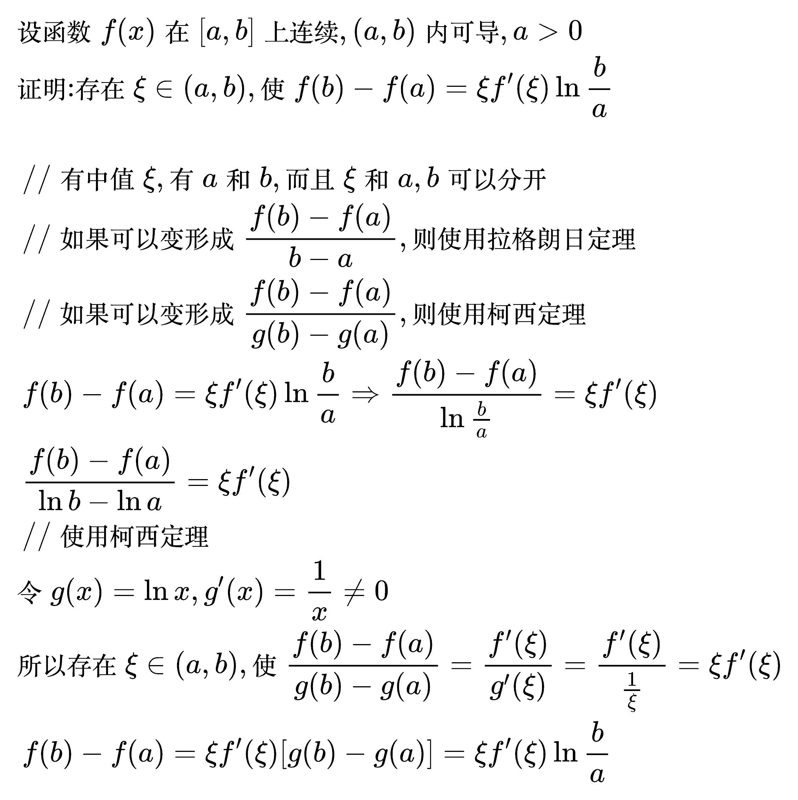

# 柯西中值定理

<!--
\begin{align}
& 设函数 f(x), g(x) 满足: \\
& \; 1. f(x), g(x) 在 [a, b] 上连续 \\
& \; 2. f(x), g(x) 在 (a, b) 内可导 \\
& \; 3. g'(x) \ne 0, \quad a < x < b \\
& 则存在 \xi \in (a, b), \\
& 使得 \frac{f(b) - f(a)}{g(b) - g(a)}=\frac{f'(\xi)}{g'(\xi)} \\
\\
& 当 g(x)=x 时, 柯西中值定理即为拉格朗日中值定理, \\
& 即拉格朗日中值定理是柯西中值定理的特例 \\
\\
& 证明拉格朗日时的辅助函数：\\
& \varphi (x)=f(x)-f(a)-\frac{f(b)-f(a)}{b-a}(x-a) \\
& 那么证明柯西时需要的辅助函数就是把x还原回g(x)：\\
& \varphi (x)=f(x)-f(a)-\frac{f(b)-f(a)}{g(b)-g(a)}\left [ g(x)-g(a) \right ]  \\
& 证明：\\
& {\color{Green} // 加、减、乘不会改变连续性和可导性} \\
& \varphi (x) 在 [a, b] 上连续、在 (a, b) 内可导 \\
& \varphi (a)=f(a)-f(a)-\frac{f(b)-f(a)}{g(b)-g(a)}\left [ g(a)-g(a) \right ]=0 \\
& \varphi (b)=f(b)-f(a)-\frac{f(b)-f(a)}{g(b)-g(a)}\left [ g(b)-g(a) \right ]\\
& =f(b)-f(a)-\left [ f(b)-f(a) \right ]=0 \\
& 满足罗尔定理 \\
& 所以存在 \xi \in (a, b)，使\varphi '(\xi)=0 \\
& 而\varphi '(x)=f'(x)-\frac{f(b)-f(a)}{g(b)-g(a)}g'(x) \\
& 所以 \varphi '(\xi)=f'(\xi)-\frac{f(b)-f(a)}{g(b)-g(a)}g'(\xi) = 0 \\
& \frac{f'(\xi)}{g'(\xi)}=\frac{f(b)-f(a)}{g(b)-g(a)} \\
\end{align}
-->

### 例题

<!--
\begin{align}
& 设函数 f(x) 在 [0, 1] 上连续, (0, 1) 内可导, f(1) = 0, \\
& 证明: 存在 \xi \in (0, 1), 使 \xi f'(\xi) + 2 f(\xi) = 0 \\
\\
& \;\, {\color{Green} // 构造辅助函数, 把 \xi 换成 x} \\
& \;\, \quad \,\, x f'(x) + 2 f(x) = 0 \\
& \;\, {\color{Green} // 两边同除 xf(x)} \\
& \;\, = \frac{f'(x)}{f(x)} + \frac{2}{x} = 0 \\
& \;\, {\color{Green} // 把导数还原: [\ln f(x)]' = \frac{f'(x)}{f(x)}, (\ln x^{2})' = \frac{2}{x}} \\
& \;\, = [\ln f(x)]' + (\ln x^{2})' = 0 \\
& \;\, {\color{Green} // 加减的导数等于导数的加减} \\
& \;\, = [\ln f(x) + \ln x^{2}]' = 0 \\
& \;\, = [\ln x^{2} f(x)]' = 0 \\
& 令 \varphi (x) = x^{2} f(x) \\
& 因为 \varphi (1) = 1 \times f(1) = 0 \\
& 所以 \varphi (0) = \varphi (1) = 0 \\
& 根据罗尔定理, 存在 \xi \in (0, 1) \\
& 使 \varphi '(\xi) = 0 \\
& 而 \varphi '(x) = 2xf(x) + x^{2}f'(x) \\
& 所以 \varphi '(\xi) = 2\xi f(\xi) + \xi ^{2}f'(\xi) = 0 \\
& 因为 \xi \ne, 所以 约掉一个 \xi \\
& 所以 2 f(\xi) + \xi f'(\xi) = 0 \\
\end{align}
-->

<!--
\begin{align}
& 设函数 f(x) 在 [a, b] 上连续, (a, b) 内可导, f(a) = f(b) = 0, \\
& 证明: 存在 \xi \in (a, b), 使 f'(\xi) - f(\xi) = 0 \\
\\
& \;\, {\color{Green} // 只有一个中值 \xi, 两项导数差一阶, 和例题1是同一个题型} \\
& \;\, {\color{Green} // 构造辅助函数, 把 \xi 换成 x} \\
& \;\, \quad \,\, f'(x) - f(x) = 0 \\
& \;\, {\color{Green} // 制造分子比分母多一阶导数: 两边同除 f(x)} \\
& \;\, = \frac{f'(x)}{f(x)} - 1 = 0 \\
& \;\, {\color{Green} // 把导数还原: [\ln f(x)]' = \frac{f'(x)}{f(x)}, (-x)' = -1} \\
& \;\, = [\ln f(x)]' + (-x)' = 0 \\
& \;\, {\color{Green} // 需要把加号两边合起来, 所以把 -x 写成 \ln e^{-x}} \\
& \;\, = [\ln f(x)]' + (\ln e^{-x})' = 0 \\
& \;\, {\color{Green} // 加减的导数等于导数的加减} \\
& \;\, = [\ln e^{-x} f(x)]' = 0 \\
\\
& 令 \varphi (x) = e^{-x} f(x) \\
& 因为 f(a) = f(b) = 0 \\
& 所以 \varphi (a) = \varphi (b) = 0 \\
& 根据罗尔定理, 存在 \xi \in (a, b) \\
& 使 \varphi '(\xi) = 0 \\
& 而 \varphi '(x) = e^{-x}[f'(x) - f(x)] \\
& 而且 e^{-x} \ne 0 \\
& 所以 f'(\xi) - f(\xi) 一定等于0 \\
\end{align}
-->

<!--
\begin{align}
& 设函数 f(x) 在 [a, b] 上连续, (a, b) 内可导, a > 0 \\
& 证明: 存在 \xi \in (a, b), 使 f(b) - f(a) = \xi f'(\xi) \ln \frac{b}{a} \\
\\
& \;\, {\color{Green} // 有中值 \xi, 有 a 和 b, 而且 \xi 和 a, b 可以分开} \\
& \;\, {\color{Green} // 如果可以变形成 \frac{f(b) - f(a)}{b - a}, 则使用拉格朗日定理} \\
& \;\, {\color{Green} // 如果可以变形成 \frac{f(b) - f(a)}{g(b) - g(a)}, 则使用柯西定理} \\
& \;\, f(b) - f(a) = \xi f'(\xi) \ln \frac{b}{a} \\
& \Rightarrow \frac{f(b) - f(a)}{\ln \frac{b}{a}} = \xi f'(\xi) \\
& \Rightarrow \frac{f(b) - f(a)}{\ln b - \ln a} = \xi f'(\xi) \\
& \;\, {\color{Green} // 使用柯西定理} \\
& 令 g(x) = \ln x, g'(x) = \frac{1}{x} \ne 0 \\
& 所以存在 \xi \in (a, b), 使 \frac{f(b) - f(a)}{g(b) - g(a)} = \frac{f'(\xi)}{g'(\xi)}
= \frac{f'(\xi)}{\frac{1}{\xi}} = \xi f'(\xi) \\
& \;\, f(b) - f(a) = \xi f'(\xi) [g(b) - g(a)]= \xi f'(\xi) \ln \frac{b}{a} \\
\end{align}
-->

## 使用场景

<!--
\begin{align}
& 1、遇到题目中有：f(b)-f(a)或者f(a)\ne f(b) \\
& 解法：使用拉格朗日中值定理 \\
& 2、见到题目中有类似 \xi f'(\xi) + 2f(\xi)（只有中值 \xi 且导数差一阶） \\
& 解法： \\
& \quad 1、 把 \xi 换成 x 得到：x f'(x) + 2f(x) \\
& \quad 2、 构造成分子比分母多一阶导数的形式：\frac{f'(x)}{f(x)} + ... = 0 \\
& \quad 3、 导数还原：[\ln f(x)]' + (...)' = 0 \\
& \quad 4、 取\ln 的内部作为 \varphi (x)得到：\varphi (x) = ... \\
& 3、有中值 \xi, 有边界 a 和 b, 且 \xi 和 a, b 可以分开 \\
& 解法： \\
& \quad 1、 把 \xi 和 a, b 分开 \\
& \quad 2、 如果 a，b 这一侧可以变形成 \frac{f(b) - f(a)}{b - a}, 则使用拉格朗日中值定理 \\
& \quad 3、 如果 a，b 这一侧可以变形成 \frac{f(b) - f(a)}{g(b) - g(a)}, 则使用柯西中值定理 \\
\end{align}
-->

