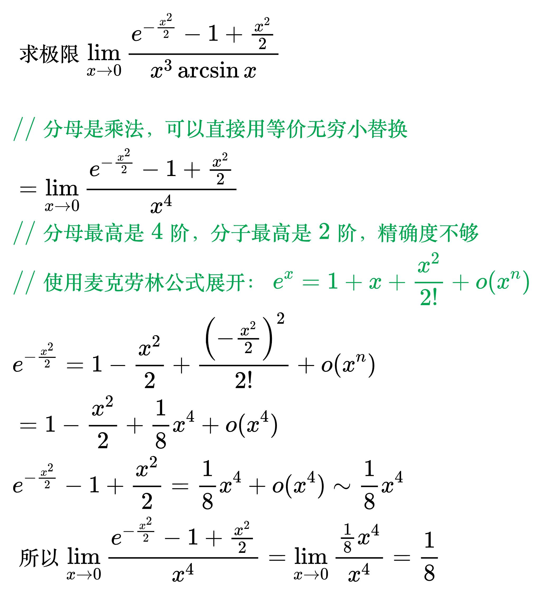

# 泰勒公式

<!--
\begin{align}
& {\LARGE 背景} \\
& 许多复杂函数（如 \sin x, \cos x, e^x 等）无法直接计算、求导、积分，\\
& 也难以分析其局部性质 \\
& 而多项式函数（如 f(x) = a_0 + a_1x + a_2x^2 + \dots + a_nx^n）\\
& 则具有天然优势：\\
& \quad 1、计算简单：仅涉及加减乘运算 \\
& \quad 2、分析便捷：求导、积分后仍为多项式 \\
& \quad 3、性质清晰：局部行为可通过系数直接判断 \\
& 因此，“用多项式逼近复杂函数” 成为当时数学界的核心需求 \\
\\
& 使用泰勒公式进行函数逼近，核心是利用函数在某一点 \\
& （通常选易计算的点，如 x=0 或 x=a）的各阶导数，\\
& 构造一个多项式（泰勒多项式），使其在该点附近 “贴合” \\
& 原函数的局部行为，同时通过余项估计逼近误差，确保精度满足需求 \\
\\
& {\LARGE 泰勒公式} \\
& 设 f(x) 在 x = x_{0} 邻域里有 n+1 阶导数，则 f(x) = P_{n}(x) + R_{n}(x) \\
& 其中 P_{n}(x) 是 n 次多项式, R_{n}(x) 称为余项 \\
& {\color{Orange}
P_{n}(x) = f(x_{0}) + \frac{f'(x_{0})}{1!} (x - x_{0}) +
\frac{f''(x_{0})}{2!} (x - x_{0})^{2} + ... +
\frac{f^{(n)}(x_{0})}{n!} (x - x_{0})^{n}
} \\
& R_{n}(x) 有两种表示形式：\\
& 1、拉格朗日型余项：{\color{Orange}\frac{f^{(n + 1)}(\xi)}{(n + 1)!} (x - x_{0})^{n + 1}} , 其中 \xi 在 x_{0} 和 x 之间 \\
& 2、佩亚诺型余项：{\color{Orange}o((x - x_{0})^n)} \\
\\
& {\LARGE 麦克劳林公式} \\
& 如果 x_{0} = 0, \\
& 则 f(x) = f(0) + \frac{f'(0)}{1!} x + \frac{f''(0)}{2!} x^{2} + ... +
\frac{f^{(n)}(0)}{n!} x^{n} + R_{n}(x) \\
& 称其为函数 f(x) 的麦克劳林公式 \\
\\
& {\LARGE 示例} \\
& 比如极限 \lim_{x \to 0}\frac{x-\sin x}{x^3} \\
& 它的分母是相乘的，可以用等价无穷小替换 \\
& 但是它的分子是相减的，无法用等价无穷小替换 \\
& 所以 \lim_{x \to 0}\frac{x-\sin x}{x^3}\ne\lim_{x \to 0}\frac{x-x}{x^3}=0 \\
& 极限的分母是 x^3，因此 \sin x 的展开需要至少保留到与分母同阶的项（即 x^3 项）\\
& 保留到 x^3 项 \sin x \approx x - \frac{x^3}{6}，代入极限得 \\
& \lim_{x \to 0}\frac{x - \left(x - \frac{x^3}{6}\right)}{x^3} = \frac{1}{6} \\
\end{align}
-->

## 常用的麦克劳林公式

<!--
\begin{align}
& 1、e^{x} = 1+x+\frac{x^2}{2!}+\cdots+\frac{x^n}{n!}+o(x^n) \\
\\
& 2、\sin x = x-\frac{x^3}{3!}+\frac{x^5}{5!}-\frac{x^7}{7!}\cdots+
\frac{(-1)^n}{(2n+1)!}x^{2n+1}+o(x^{2n+1}) \\
\\
& 3、\cos x = 1-\frac{x^2}{2!}+\frac{x^4}{4!}-\frac{x^6}{6!}\cdots+
\frac{(-1)^{n}}{(2n)!}x^{2n}+o(x^{2n}) \\
\\
& 4、\frac{1}{1-x} = 1+x+x^2+\cdots+x^n+o(x^n) \\
\\
& 5、\frac{1}{1+x} = 1-x+x^2-x^3+\cdots+(-1)^nx^n+o(x^n) \\
\\
& 6、\ln(1+x) = x-\frac{x^2}{2}+\frac{x^3}{3}-\cdots+\frac{(-1)^{n-1}x^n}{n}+o(x^n) \\
\\
& 7、(1+x)^a = 1+ax+\frac{a(a-1)}{2!}x^2+\cdots+\frac{a(a-1)(a-2)\cdots(a-n+1)}{n!}x^n+o(x^n) \\
\end{align}
-->

### 例题

<!--
\begin{align}
& 求极限 \lim_{x \to 0} \frac{\ln(1 + x) - e^{x} + 1}{x^{2}} \\
\\
& \;\, {\color{Green} // 式子的最大次方是2次方} \\
& \;\, {\color{Green} // 所以麦克劳林公式也写到2次方} \\
& \;\, \ln(1 + x) = x - \frac{x^{2}}{2} + o(x^{2}) \\
& \;\, e^{x} = 1 + x + \frac{x^{2}}{2} + o(x^{2}) \\
& \;\, {\color{Green} // 带入到分子} \\
& \;\, \ln(1 + x) - e^{x} + 1 = -x^{2} + o(x^{2}) \\
& \;\, {\color{Green} // 由于是求极限, 所以可以去掉高阶无穷小} \\
& \;\, -x^{2} + o(x^{2}) 等价于 -x^{2} \\
& 所以 \lim_{x \to 0} \frac{\ln(1 + x) - e^{x} + 1}{x^{2}} \\
& = \lim_{x \to 0} \frac{-x^{2}}{x^{2}} \\
& = -1 \\
\end{align}
-->

<!--
\begin{align}
& 求极限 \lim_{x\to0}\frac{e^{-\frac{x^2}{2}}-1+\frac{x^2}{2}}{x^3\arcsin x} \\
\\
& {\color{Green} // 分母是乘法，可以直接用等价无穷小替换} \\
& =\lim_{x\to0}\frac{e^{-\frac{x^2}{2}}-1+\frac{x^2}{2}}{x^4} \\
& {\color{Green} // 分母最高是4阶，分子最高是2阶，精确度不够} \\
& {\color{Green} // 使用麦克劳林公式展开：e^{x} = 1+x+\frac{x^2}{2!}+o(x^n)} \\
& e^{-\frac{x^2}{2}}=1-\frac{x^2}{2}+\frac{\left ( -\frac{x^2}{2} \right ) ^2}{2!}+o(x^n) \\
& =1-\frac{x^2}{2}+\frac{1}{8}x^4+o(x^4) \\
& e^{-\frac{x^2}{2}}-1+\frac{x^2}{2}=\frac{1}{8}x^4+o(x^4) \sim \frac{1}{8}x^4 \\
& 所以 \lim_{x\to0}\frac{e^{-\frac{x^2}{2}}-1+\frac{x^2}{2}}{x^4}
=\lim_{x\to0}\frac{\frac{1}{8}x^4}{x^4}=\frac{1}{8} \\
\end{align}
-->

<!--
\begin{align}
& 求极限 \lim_{x \to 0} \frac{e^{- \frac{x^{2}}{2}} - 1 + \frac{x^{2}}{2}}{x^{2} - \sin ^{2} x} \\
\\
& \;\, e^{x} = 1 + x + \frac{x^{2}}{2} + o(x^{2}) \\
& \;\, {\color{Green} // 把 - \frac{x^{2}}{2} 代进去} \\
& \;\, e^{- \frac{x^{2}}{2}} = 1 - \frac{x^{2}}{2} + \frac{x^{4}}{8} + o(x^{4}) \\
& \;\, e^{- \frac{x^{2}}{2}} - 1 + \frac{x^{2}}{2} = \frac{x^{4}}{8} + o(x^{4}) 等价于 \frac{x^{4}}{8} \\
& \;\,\;\,\;\,\, \lim_{x \to 0} \frac{e^{- \frac{x^{2}}{2}} - 1 + \frac{x^{2}}{2}}{x^{2} - \sin ^{2} x} \\
& \;\, = \lim_{x \to 0} \frac{\frac{x^{4}}{8}}{x^{2} - \sin ^{2} x} \\
& \;\, = \frac{1}{8} \lim_{x \to 0} \frac{x^{4}}{x^{2} - \sin ^{2} x} \\
& \;\, = \frac{1}{8} \lim_{x \to 0} \frac{x^{4}}{(x + \sin x)(x - \sin x)} \\
& \;\, = \frac{1}{8} \lim_{x \to 0} \frac{x}{x + \sin x} \times \frac{x^{3}}{x - \sin x} \\
& \;\, {\color{Green} // 左边把 \sin x 等价无穷小替换成 x 后,} \\
& \;\, {\color{Green} // 分母变成 2x 还是1次方, 分子分母同阶, 都是1次方,} \\
& \;\, {\color{Green} // 所以可以用等价无穷小替换} \\
& \;\, {\color{Green} // 右边替换后不同阶, 所以不能替换} \\
& \;\, = \frac{1}{8} \lim_{x \to 0} \frac{x}{x + x} \times \frac{x^{3}}{x - \sin x} \\
& \;\, = \frac{1}{16} \lim_{x \to 0} \frac{x^{3}}{x - \sin x} \\
& 因为 \sin x = x - \frac{x^{3}}{3!} + o(x^{3}) \\
& 所以 x - \sin x = \frac{x^{3}}{3!} + o(x^{3}) 等价于 \frac{x^{3}}{6} \\
& 所以原式 = \frac{1}{16} \lim_{x \to 0} \frac{x^{3}}{\frac{x^{3}}{6}} = \frac{1}{16} \times 6 = \frac{3}{8} \\
\end{align}
-->

<!--
\begin{align}
& 求极限 \lim_{x \to 0} \frac{\sqrt{1 + x} + \sqrt{1 - x} - 2}{x^{2}} \\
\\
& 由 (1 + x)^{a} = 1 + ax + \frac{a(a - 1)x^{2}}{2!} + o(x^{2}) \\
& 得 \sqrt{1 + x} = 1 + \frac{1}{2} x - \frac{1}{8} x^{2} + o(x^{2}) \\
& 同理 \sqrt{1 - x} = 1 - \frac{1}{2} x - \frac{1}{8} x^{2} + o(x^{2}) \\
& \;\, \sqrt{1 + x} + \sqrt{1 - x} = 2 - \frac{1}{4} x^{2} + o(x^{2}) \\
& \;\, \sqrt{1 + x} + \sqrt{1 - x} - 2 = - \frac{1}{4} x^{2} + o(x^{2}) \\
& 等价于 - \frac{1}{4} x^{2} \\
& \;\,\;\,\;\,\, \lim_{x \to 0} \frac{\sqrt{1 + x} + \sqrt{1 - x} - 2}{x^{2}} \\
& \;\, = \lim_{x \to 0} \frac{- \frac{1}{4} x^{2}}{x^{2}} \\
& \;\, = - \frac{1}{4} \\
\end{align}
-->

