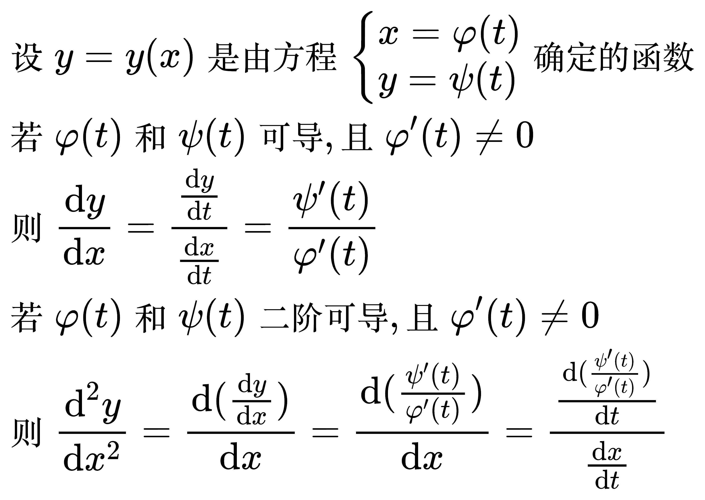
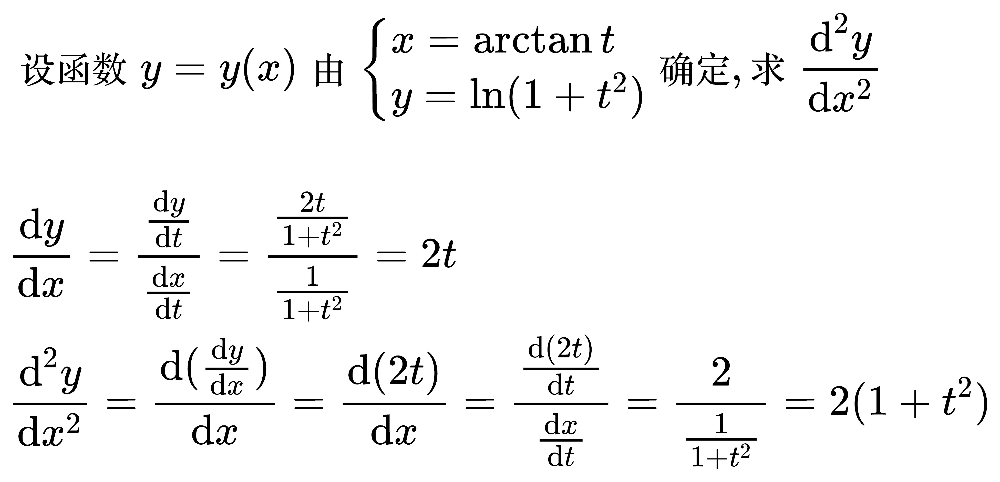
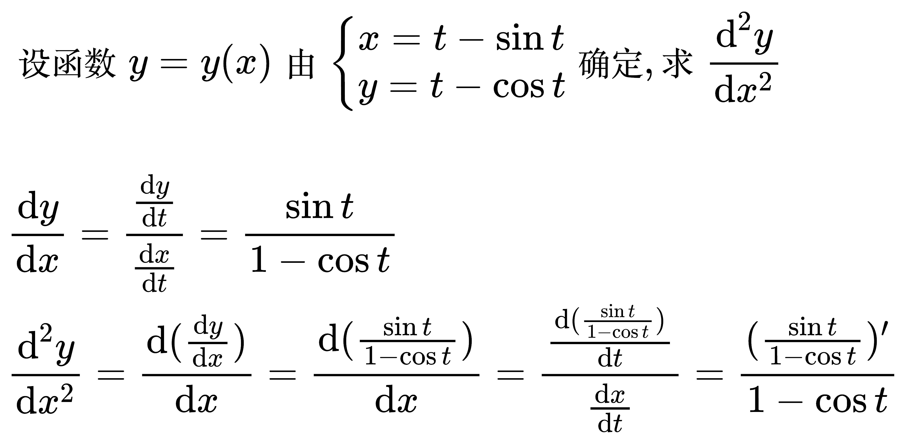

# 参数方程

<!--
\begin{align}
& 设 y = y(x) 是由方程 \begin{cases}
x = \varphi (t) \\
y = \psi (t)
\end{cases} 确定的函数 \\
& 若 \varphi (t) 和 \psi (t) 可导, 且 \varphi '(t) \ne 0 \\
& 则 \frac{\mathrm{d} y}{\mathrm{d} x}
= \frac{\frac{\mathrm{d} y}{\mathrm{d} t}}{\frac{\mathrm{d} x}{\mathrm{d} t}}
= \frac{\psi '(t)}{\varphi '(t)} \\
& 若 \varphi (t) 和 \psi (t) 二阶可导, 且 \varphi '(t) \ne 0 \\
& 则 \frac{\mathrm{d}^{2} y}{\mathrm{d} x^{2}}
=  \frac{\mathrm{d} (\frac{\mathrm{d} y}{\mathrm{d} x})}{\mathrm{d} x}
=  \frac{\mathrm{d} (\frac{\psi '(t)}{\varphi '(t)})}{\mathrm{d} x}
=  \frac{\frac{\mathrm{d} (\frac{\psi '(t)}{\varphi '(t)})}{\mathrm{d} t}}{\frac{\mathrm{d} x}{\mathrm{d} t}} \\
\end{align}
-->

例题 1

<!--
\begin{align}
& 设函数 y = y(x) 由 \begin{cases}
x = \arctan t \\
y = \ln (1 + t^{2})
\end{cases} 确定, 求 \frac{\mathrm{d}^{2} y}{\mathrm{d} x^{2}} \\
\\
& \frac{\mathrm{d} y}{\mathrm{d} x}
= \frac{\frac{\mathrm{d} y}{\mathrm{d} t}}{\frac{\mathrm{d} x}{\mathrm{d} t}}
= \frac{\frac{2t}{1 + t^{2}}}{\frac{1}{1 + t^{2}}} = 2t \\
& \frac{\mathrm{d}^{2} y}{\mathrm{d} x^{2}}
= \frac{\mathrm{d} (\frac{\mathrm{d} y}{\mathrm{d} x})}{\mathrm{d} x}
= \frac{\mathrm{d} (2t)}{\mathrm{d} x}
=  \frac{\frac{\mathrm{d} (2t)}{\mathrm{d} t}}{\frac{\mathrm{d} x}{\mathrm{d} t}}
= \frac{2}{\frac{1}{1 + t^{2}}}
= 2(1 + t^{2}) \\
\end{align}
-->

例题 2

<!--
\begin{align}
& 设函数 y = y(x) 由 \begin{cases}
x = t - \sin t \\
y = t - \cos t
\end{cases} 确定, 求 \frac{\mathrm{d}^{2} y}{\mathrm{d} x^{2}} \\
\\
& \frac{\mathrm{d} y}{\mathrm{d} x}
= \frac{\frac{\mathrm{d} y}{\mathrm{d} t}}{\frac{\mathrm{d} x}{\mathrm{d} t}}
= \frac{\sin t}{1 - \cos t} \\
& \frac{\mathrm{d}^{2} y}{\mathrm{d} x^{2}}
= \frac{\mathrm{d} (\frac{\mathrm{d} y}{\mathrm{d} x})}{\mathrm{d} x}
= \frac{\mathrm{d} (\frac{\sin t}{1 - \cos t})}{\mathrm{d} x}
=  \frac{\frac{\mathrm{d} (\frac{\sin t}{1 - \cos t})}{\mathrm{d} t}}{\frac{\mathrm{d} x}{\mathrm{d} t}}
= \frac{(\frac{\sin t}{1 - \cos t})'}{1 - \cos t}\\
\end{align}
-->

