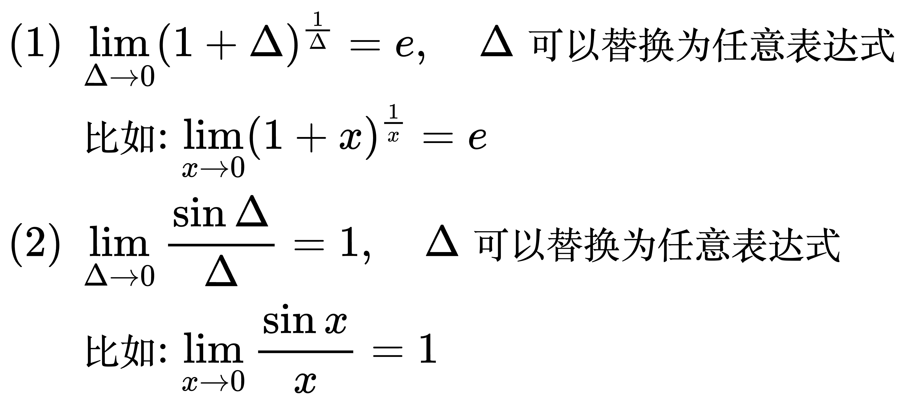
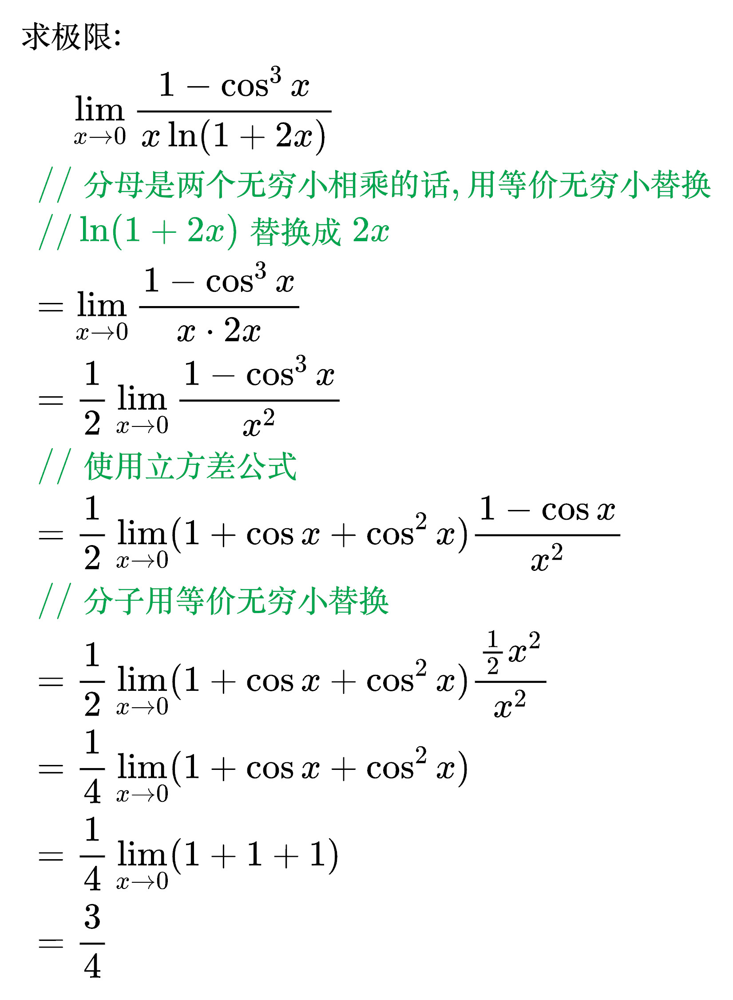
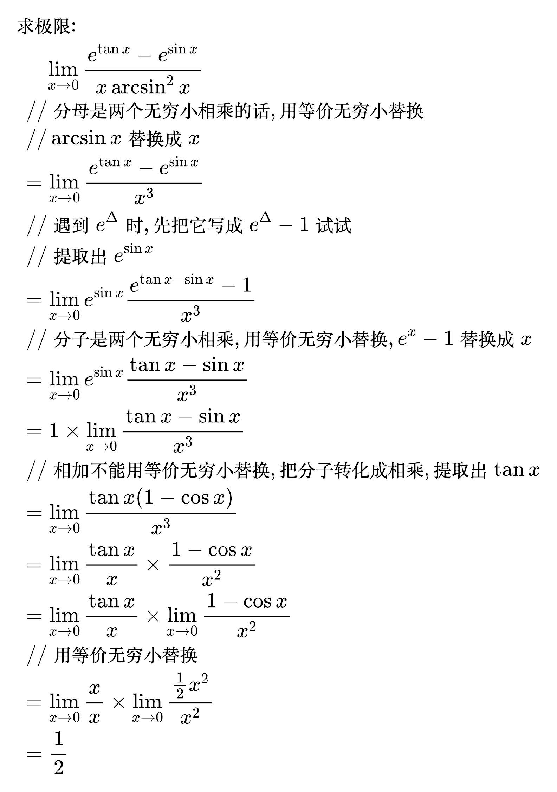
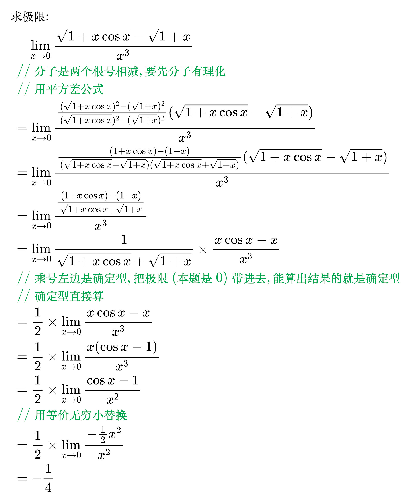
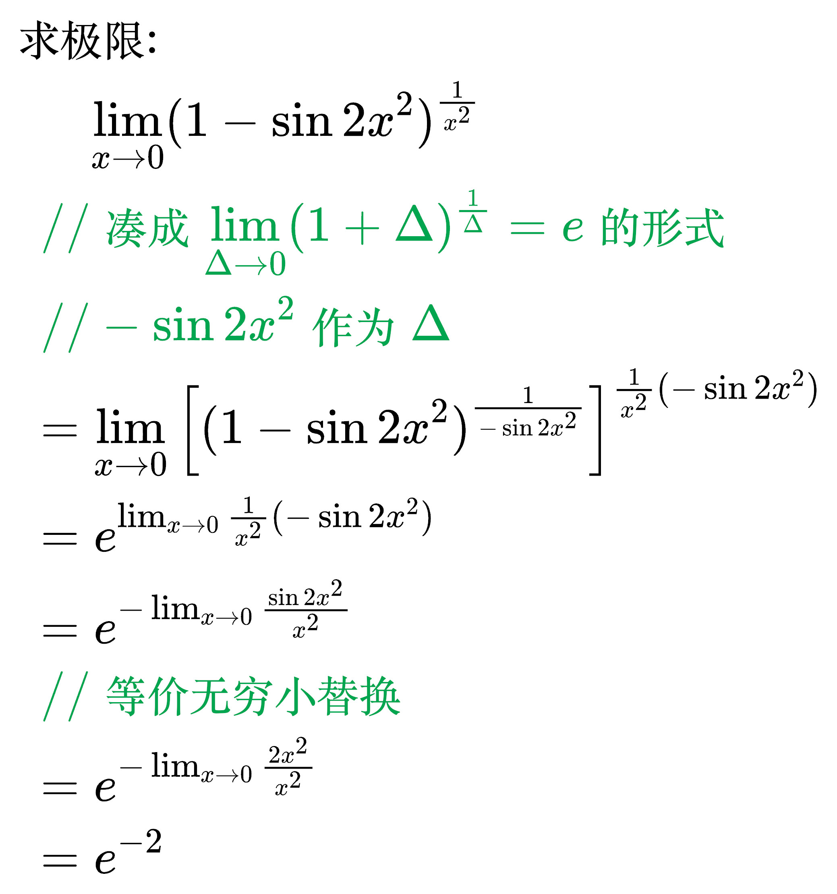
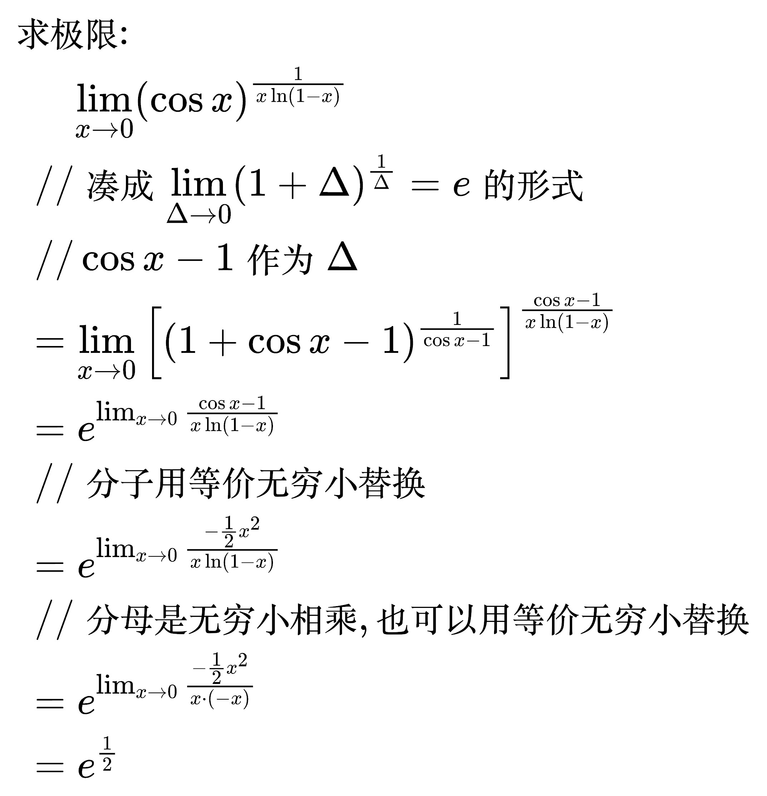
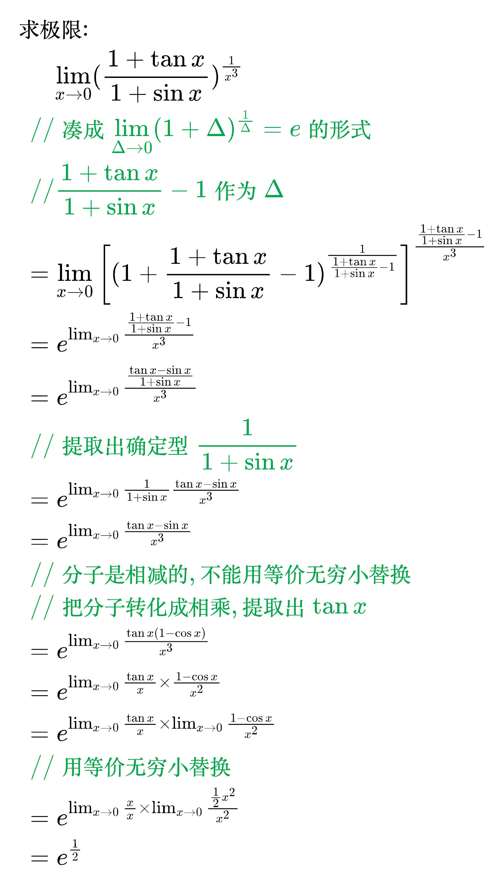

# 两个重要极限

<!--
\begin{align}
& (1) \; \lim_{\Delta \to 0} (1 + \Delta)^{\frac{1}{\Delta}} = e, \quad \Delta 可以替换为任意表达式 \\
& \quad \;\, 比如: \lim_{x \to 0} (1 + x)^{\frac{1}{x}} = e \\
& (2) \; \lim_{\Delta \to 0} \frac{\sin \Delta}{\Delta} = 1, \quad \Delta 可以替换为任意表达式 \\
& \quad \;\, 比如: \lim_{x \to 0} \frac{\sin x}{x} = 1 \\
\end{align}
-->

例题 1

<!--
\begin{align}
& 求极限: \\
& \quad\;\; \lim_{x \to 0} \frac{1 - \cos ^{3} x}{x \ln (1 + 2x)} \\
& \; \, \; // 分母是两个无穷小相乘的话, 用等价无穷小替换 \\
& \; \, \; // \ln (1 + 2x) 替换成 2x \\
& \; \, = \lim_{x \to 0} \frac{1 - \cos ^{3} x}{x \cdot 2x} \\
& \; \, = \frac{1}{2} \lim_{x \to 0} \frac{1 - \cos ^{3} x}{x^{2}} \\
& \; \, \; // 使用立方差公式 \\
& \; \, = \frac{1}{2} \lim_{x \to 0} (1 + \cos x + \cos ^{2} x) \frac{1 - \cos x}{x^{2}} \\
& \; \, \; // 分子用等价无穷小替换 \\
& \; \, = \frac{1}{2} \lim_{x \to 0} (1 + \cos x + \cos ^{2} x) \frac{\frac{1}{2}x^{2}}{x^{2}} \\
& \; \, = \frac{1}{4} \lim_{x \to 0} (1 + \cos x + \cos ^{2} x) \\
& \; \, = \frac{1}{4} \lim_{x \to 0} (1 + 1 + 1) \\
& \; \, = \frac{3}{4} \\
\end{align}
-->

例题 2

<!--
\begin{align}
& 求极限: \\
& \quad\;\; \lim_{x \to 0} \frac{e^{\tan x} - e^{\sin x}}{x \arcsin ^{2} x} \\
& \; \, \; // 分母是两个无穷小相乘的话, 用等价无穷小替换 \\
& \; \, \; // \arcsin x 替换成 x \\
& \; \, = \lim_{x \to 0} \frac{e^{\tan x} - e^{\sin x}}{x^{3}} \\
& \; \, \; // 遇到 e^{\Delta} 时, 先把它写成 e^{\Delta} - 1 试试 \\
& \; \, \; // 提取出 e^{\sin x} \\
& \; \, = \lim_{x \to 0} e^{\sin x} \frac{e^{\tan x - \sin x} - 1}{x^{3}} \\
& \; \, \; // 分子是两个无穷小相乘, 用等价无穷小替换, e^{x} - 1 替换成 x \\
& \; \, = \lim_{x \to 0} e^{\sin x} \frac{\tan x - \sin x}{x^{3}} \\
& \; \, = 1 \times \lim_{x \to 0} \frac{\tan x - \sin x}{x^{3}} \\
& \; \, \; // 相加不能用等价无穷小替换, 把分子转化成相乘, 提取出 \tan x \\
& \; \, = \lim_{x \to 0} \frac{\tan x (1 - \cos x)}{x^{3}} \\
& \; \, = \lim_{x \to 0} \frac{\tan x}{x} \times \frac{1 - \cos x}{x^{2}} \\
& \; \, = \lim_{x \to 0} \frac{\tan x}{x} \times \lim_{x \to 0} \frac{1 - \cos x}{x^{2}} \\
& \; \, \; // 用等价无穷小替换 \\
& \; \, = \lim_{x \to 0} \frac{x}{x} \times \lim_{x \to 0} \frac{\frac{1}{2} x^{2}}{x^{2}} \\
& \; \, = \frac{1}{2} \\
\end{align}
-->

例题 3

<!--
\begin{align}
& 求极限: \\
& \quad\;\; \lim_{x \to 0} \frac{\sqrt{1 + x \cos x} - \sqrt{1 + x}}{x^{3}} \\
& \; \, \; // 分子是两个根号相减, 要先分子有理化 \\
& \; \, \; // 用平方差公式 \\
& \; \, = \lim_{x \to 0} \frac{\frac{(\sqrt{1 + x \cos x})^{2} - (\sqrt{1 + x})^2}{(\sqrt{1 + x \cos x})^{2} - (\sqrt{1 + x})^2} (\sqrt{1 + x \cos x} - \sqrt{1 + x})}{x^{3}} \\
& \; \, = \lim_{x \to 0} \frac{\frac{(1 + x \cos x) - (1 + x)}{(\sqrt{1 + x \cos x} - \sqrt{1 + x})(\sqrt{1 + x \cos x} + \sqrt{1 + x})} (\sqrt{1 + x \cos x} - \sqrt{1 + x})}{x^{3}} \\
& \; \, = \lim_{x \to 0} \frac{\frac{(1 + x \cos x) - (1 + x)}{\sqrt{1 + x \cos x} + \sqrt{1 + x}}}{x^{3}} \\
& \; \, = \lim_{x \to 0} \frac{1}{\sqrt{1 + x \cos x} + \sqrt{1 + x}} \times \frac{x \cos x - x}{x^{3}} \\
& \; \, \; // 乘号左边是确定型, 把极限(本题是0)带进去, 能算出结果的就是确定型 \\
& \; \, \; // 确定型直接算 \\
& \; \, = \frac{1}{2} \times \lim_{x \to 0} \frac{x \cos x - x}{x^{3}} \\
& \; \, = \frac{1}{2} \times \lim_{x \to 0} \frac{x (\cos x - 1)}{x^{3}} \\
& \; \, = \frac{1}{2} \times \lim_{x \to 0} \frac{\cos x - 1}{x^{2}} \\
& \; \, \; // 用等价无穷小替换 \\
& \; \, = \frac{1}{2} \times \lim_{x \to 0} \frac{- \frac{1}{2} x^{2}}{x^{2}} \\
& \; \, = - \frac{1}{4} \\
\end{align}
-->

例题 4

<!--
\begin{align}
& 求极限: \\
& \quad\;\; \lim_{x \to 0} (1 - \sin 2x^{2})^{{\frac{1}{x^2}}} \\
& \; \, \; // 凑成 \lim_{\Delta \to 0} (1 + \Delta)^{\frac{1}{\Delta}} = e 的形式 \\
& \; \, \; // - \sin 2x^{2} 作为 \Delta \\
& \; \, = \lim_{x \to 0} \left [ (1 - \sin 2x^{2})^{\frac{1}{- \sin 2x^{2}}} \right ] ^{{\frac{1}{x^2}}(- \sin 2x^{2})} \\
& \; \, = e^{\lim_{x \to 0} {\frac{1}{x^2}}(- \sin 2x^{2})} \\
& \; \, = e^{- \lim_{x \to 0} {\frac{\sin 2x^{2}}{x^2}}} \\
& \; \, \; // 等价无穷小替换 \\
& \; \, = e^{- \lim_{x \to 0} {\frac{2x^{2}}{x^2}}} \\
& \; \, = e^{-2} \\
\end{align}
-->

例题 5

<!--
\begin{align}
& 求极限: \\
& \quad\;\; \lim_{x \to 0} (\cos x)^{\frac{1}{x \ln (1 - x)}} \\
& \; \, \; // 凑成 \lim_{\Delta \to 0} (1 + \Delta)^{\frac{1}{\Delta}} = e 的形式 \\
& \; \, \; // \cos x - 1 作为 \Delta \\
& \; \, = \lim_{x \to 0} \left [ (1 + \cos x - 1)^{\frac{1}{\cos x - 1}} \right ] ^{\frac{\cos x - 1}{x \ln (1 - x)}} \\
& \; \, = e^{\lim_{x \to 0} \frac{\cos x - 1}{x \ln (1 - x)}} \\
& \; \, \; // 分子用等价无穷小替换 \\
& \; \, = e^{\lim_{x \to 0} \frac{- \frac{1}{2} x^{2}}{x \ln (1 - x)}} \\
& \; \, \; // 分母是无穷小相乘, 也可以用等价无穷小替换 \\
& \; \, = e^{\lim_{x \to 0} \frac{- \frac{1}{2} x^{2}}{x \cdot (-x)}} \\
& \; \, = e^{\frac{1}{2}} \\
\end{align}
-->

例题 6

<!--
\begin{align}
& 求极限: \\
& \quad\;\; \lim_{x \to 0} (\frac{1 + \tan x}{1 + \sin x})^{\frac{1}{x^{3}}} \\
& \; \, \; // 凑成 \lim_{\Delta \to 0} (1 + \Delta)^{\frac{1}{\Delta}} = e 的形式 \\
& \; \, \; // \frac{1 + \tan x}{1 + \sin x} - 1 作为 \Delta \\
& \; \, = \lim_{x \to 0} \left [ (1 + \frac{1 + \tan x}{1 + \sin x} - 1)^{\frac{1}{\frac{1 + \tan x}{1 + \sin x} - 1}} \right ] ^{\frac{\frac{1 + \tan x}{1 + \sin x} - 1}{x^{3}}} \\
& \; \, = e^{\lim_{x \to 0} \frac{\frac{1 + \tan x}{1 + \sin x} - 1}{x^{3}}} \\
& \; \, = e^{\lim_{x \to 0} \frac{\frac{\tan x - \sin x}{1 + \sin x}}{x^{3}}} \\
& \; \, \; // 提取出确定型 \frac{1}{1 + \sin x} \\
& \; \, = e^{\lim_{x \to 0} \frac{1}{1 + \sin x} \frac{\tan x - \sin x}{x^{3}}} \\
& \; \, = e^{\lim_{x \to 0} \frac{\tan x - \sin x}{x^{3}}} \\
& \; \, \; // 分子是相减的, 不能用等价无穷小替换 \\
& \; \, \; // 把分子转化成相乘, 提取出 \tan x \\
& \; \, = e^{\lim_{x \to 0} \frac{\tan x (1 - \cos x)}{x^{3}}} \\
& \; \, = e^{\lim_{x \to 0} \frac{\tan x}{x} \times \frac{1 - \cos x}{x^{2}}} \\
& \; \, = e^{\lim_{x \to 0} \frac{\tan x}{x} \times \lim_{x \to 0} \frac{1 - \cos x}{x^{2}}} \\
& \; \, \; // 用等价无穷小替换 \\
& \; \, = e^{\lim_{x \to 0} \frac{x}{x} \times \lim_{x \to 0} \frac{\frac{1}{2} x^{2}}{x^{2}}} \\
& \; \, = e^{\frac{1}{2}} \\
\end{align}
-->

