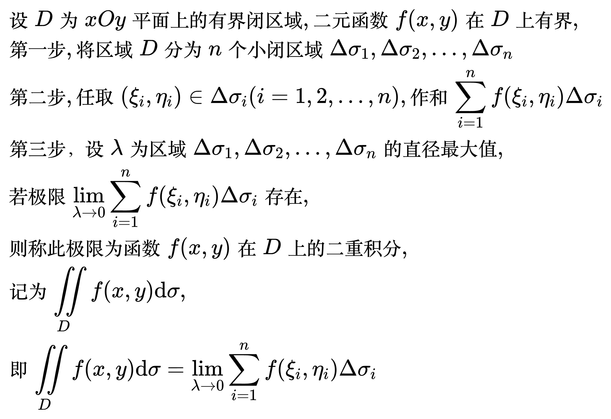

# 二重积分

<!--
\begin{align}
& 设 D 为 xOy 平面上的有界闭区域, 二元函数 f(x, y) 在 D 上有界, \\
& 第一步, 将区域 D 分为 n 个小闭区域 \Delta \sigma _1, \Delta \sigma _2, ..., \Delta \sigma _n \\
& 第二步, 任取 (\xi _i, \eta _i) \in \Delta \sigma _i (i = 1, 2, ..., n), 作和
\sum_{i = 1}^{n} f(\xi _i, \eta _i) \Delta \sigma _i \\
& 第三步，设 \lambda 为区域 \Delta \sigma _1, \Delta \sigma _2, ..., \Delta \sigma _n 的直径最大值, \\
& 若极限 \lim_{\lambda \to 0} \sum_{i = 1}^{n} f(\xi _i, \eta _i) \Delta \sigma _i 存在, \\
& 则称此极限为函数 f(x, y) 在 D 上的二重积分, \\
& 记为 \iint\limits_{D} f(x, y) \mathrm{d}\sigma, \\
& 即 \iint\limits_{D} f(x, y) \mathrm{d}\sigma =
\lim_{\lambda \to 0} \sum_{i = 1}^{n} f(\xi _i, \eta _i) \Delta \sigma _i \\
\end{align}
-->

