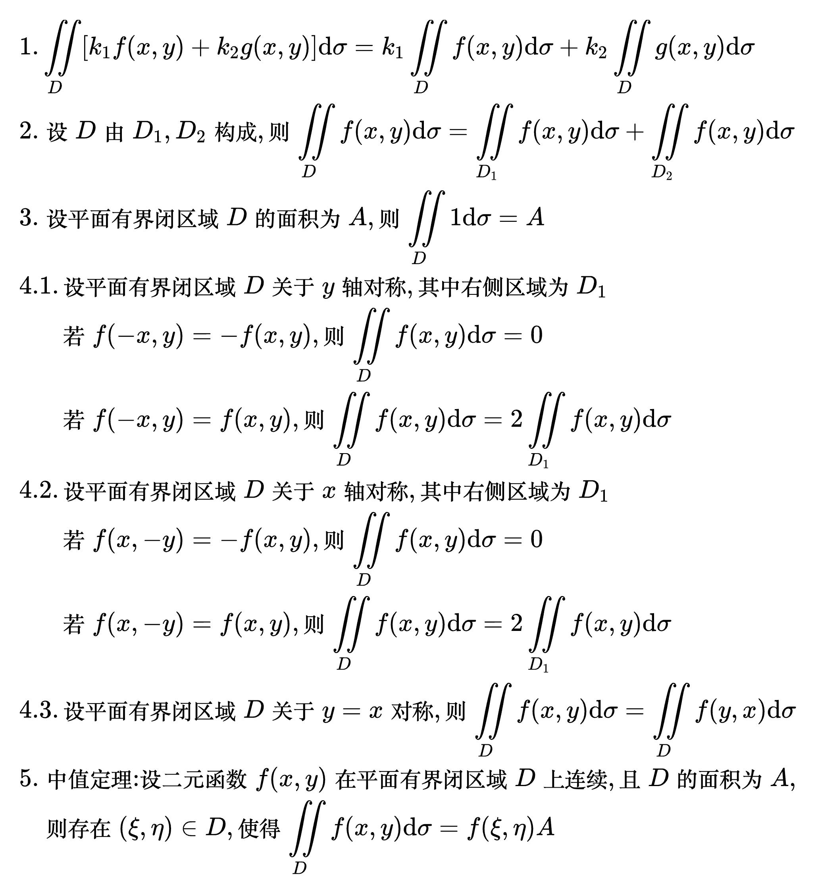

# 二重积分

<!--
\begin{align}
& 设 D 为 xOy 平面上的有界闭区域, 二元函数 f(x, y) 在 D 上有界, \\
& 第一步, 将区域 D 分为 n 个小闭区域 \Delta \sigma _1, \Delta \sigma _2, ..., \Delta \sigma _n \\
& 第二步, 任取 (\xi _i, \eta _i) \in \Delta \sigma _i (i = 1, 2, ..., n), 作和
\sum_{i = 1}^{n} f(\xi _i, \eta _i) \Delta \sigma _i \\
& 第三步，设 \lambda 为区域 \Delta \sigma _1, \Delta \sigma _2, ..., \Delta \sigma _n 的直径最大值, \\
& 若极限 \lim_{\lambda \to 0} \sum_{i = 1}^{n} f(\xi _i, \eta _i) \Delta \sigma _i 存在, \\
& 则称此极限为函数 f(x, y) 在 D 上的二重积分, \\
& 记为 \iint\limits_{D} f(x, y) \mathrm{d}\sigma, \\
& 即 \iint\limits_{D} f(x, y) \mathrm{d}\sigma =
\lim_{\lambda \to 0} \sum_{i = 1}^{n} f(\xi _i, \eta _i) \Delta \sigma _i \\
\end{align}
-->

## 重积分的性质

<!--
\begin{align}
& 1. \iint\limits_{D} \left [ k_1 f(x, y) + k_2 g(x, y) \right ] \mathrm{d}\sigma
= k_1 \iint\limits_{D} f(x, y) \mathrm{d}\sigma + k_2 \iint\limits_{D} g(x, y) \mathrm{d}\sigma \\
& 2. 设 D 由 D_1, D_2 构成, 则 \iint\limits_{D} f(x, y) \mathrm{d}\sigma
= \iint\limits_{D_1} f(x, y) \mathrm{d}\sigma + \iint\limits_{D_2} f(x, y) \mathrm{d}\sigma \\
& 3. 设平面有界闭区域 D 的面积为 A, 则 \iint\limits_{D} 1 \mathrm{d}\sigma = A \\
& 4.1. 设平面有界闭区域 D 关于 y 轴对称, 其中右侧区域为 D_1 \\
& \;\;\;\;\,\, 若 f(-x, y) = - f(x, y), 则 \iint\limits_{D} f(x, y) \mathrm{d}\sigma = 0 \\
& \;\;\;\;\,\, 若 f(-x, y) = f(x, y), 则 \iint\limits_{D} f(x, y) \mathrm{d}\sigma
= 2 \iint\limits_{D_1} f(x, y) \mathrm{d}\sigma \\
& 4.2. 设平面有界闭区域 D 关于 x 轴对称, 其中右侧区域为 D_1 \\
& \;\;\;\;\,\, 若 f(x, -y) = - f(x, y), 则 \iint\limits_{D} f(x, y) \mathrm{d}\sigma = 0 \\
& \;\;\;\;\,\, 若 f(x, -y) = f(x, y), 则 \iint\limits_{D} f(x, y) \mathrm{d}\sigma
= 2 \iint\limits_{D_1} f(x, y) \mathrm{d}\sigma \\
& 4.3. 设平面有界闭区域 D 关于 y = x 对称, 则 \iint\limits_{D} f(x, y) \mathrm{d}\sigma
= \iint\limits_{D} f(y, x) \mathrm{d}\sigma \\
& 5. 中值定理: 设二元函数 f(x, y) 在平面有界闭区域 D 上连续, 且 D 的面积为 A, \\
& \;\,\,\, 则存在 (\xi, \eta) \in D, 使得 \iint\limits_{D} f(x, y) \mathrm{d}\sigma
= f(\xi, \eta) A \\
\end{align}
-->

