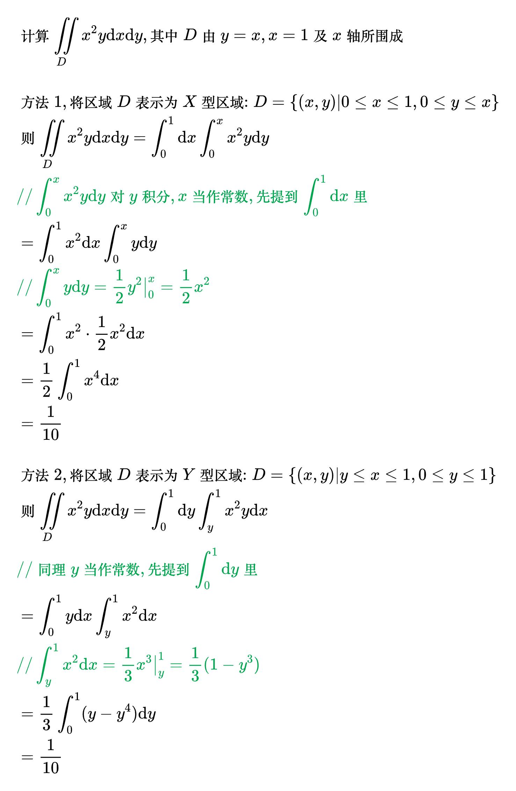

# 积分法

## 直角坐标法

<!--
\begin{align}
& X 型区域 \\
& 对 \iint\limits_{D} f(x, y) \mathrm{d}x \mathrm{d}y, 将区域 D 向 x 轴投影, 若区域 D 可表示为 \\
& \; D = \left \{ (x, y) | a \le x \le b, \varphi _1(x) \le y \le \varphi _2(x) \right \}, \\
& 则称其为 X 型区域, 且有 \iint\limits_{D} f(x, y) \mathrm{d}x \mathrm{d}y =
\int_{a}^{b} \mathrm{d}x \int_{\varphi _1(x)}^{\varphi _2(x)} f(x, y) \mathrm{d}y \\
\\
& Y 型区域 \\
& 对 \iint\limits_{D} f(x, y) \mathrm{d}x \mathrm{d}y, 将区域 D 向 y 轴投影, 若区域 D 可表示为 \\
& \; D = \left \{ (x, y) | \psi _1(y) \le x \le \psi _2(y), c \le y \le d \right \}, \\
& 则称其为 Y 型区域, 且有 \iint\limits_{D} f(x, y) \mathrm{d}x \mathrm{d}y =
\int_{c}^{d} \mathrm{d}y \int_{\psi _1(y)}^{\psi _2(y)} f(x, y) \mathrm{d}x \\
\end{align}
-->

例题 1

<!--
\begin{align}
& 计算 \iint\limits_{D} x^2 y \mathrm{d}x \mathrm{d}y, 其中 D 由 y = x, x = 1 及 x 轴所围成 \\
\\
& 方法1, 将区域 D 表示为 X 型区域:
D = \left \{ (x, y) | 0 \le x \le 1, 0 \le y \le x \right \} \\
& 则 \iint\limits_{D} x^2 y \mathrm{d}x \mathrm{d}y =
\int_{0}^{1} \mathrm{d}x \int_{0}^{x} x^2 y \mathrm{d}y \\
& {\color{Green} // \int_{0}^{x} x^2 y \mathrm{d}y 对 y 积分, x 当作常数,
先提到 \int_{0}^{1} \mathrm{d}x 里} \\
& = \int_{0}^{1} x^2 \mathrm{d}x \int_{0}^{x} y \mathrm{d}y \\
& {\color{Green} // \int_{0}^{x} y \mathrm{d}y = \frac{1}{2}y^2 \big|_{0}^{x} = \frac{1}{2}x^2} \\
& = \int_{0}^{1} x^2 \cdot \frac{1}{2}x^2 \mathrm{d}x \\
& = \frac{1}{2} \int_{0}^{1} x^4 \mathrm{d}x \\
& = \frac{1}{10} \\
\\
& 方法2, 将区域 D 表示为 Y 型区域:
D = \left \{ (x, y) | y \le x \le 1, 0 \le y \le 1 \right \} \\
& 则 \iint\limits_{D} x^2 y \mathrm{d}x \mathrm{d}y =
\int_{0}^{1} \mathrm{d}y \int_{y}^{1} x^2 y \mathrm{d}x \\
& {\color{Green} // 同理 y 当作常数,
先提到 \int_{0}^{1} \mathrm{d}y 里} \\
& = \int_{0}^{1} y \mathrm{d}x \int_{y}^{1} x^2 \mathrm{d}x \\
& {\color{Green} // \int_{y}^{1} x^2 \mathrm{d}x = \frac{1}{3}x^3 \big|_{y}^{1}
= \frac{1}{3}(1 - y^3)} \\
& = \frac{1}{3} \int_{0}^{1} (y - y^4) \mathrm{d}y \\
& = \frac{1}{10} \\
\end{align}
-->

例题 2

<!--

-->
