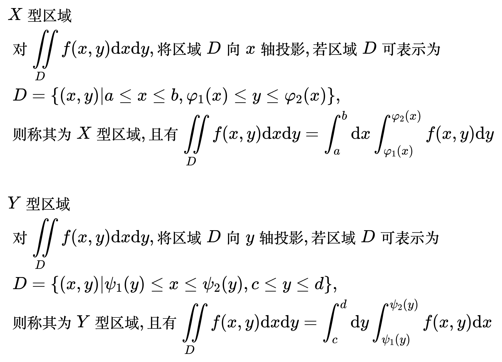
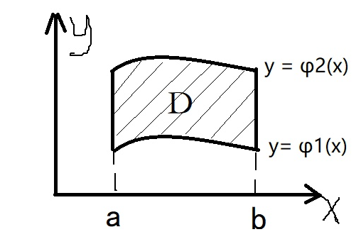
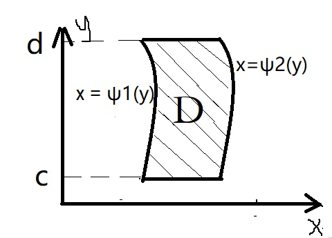

# 积分法

## 直角坐标法

<!--
\begin{align}
& X 型区域 \\
& 对 \iint\limits_{D} f(x, y) \mathrm{d}x \mathrm{d}y, 将区域 D 向 x 轴投影, 若区域 D 可表示为 \\
& \; D = \left \{ (x, y) | a \le x \le b, \varphi _1(x) \le y \le \varphi _2(x) \right \}, \\
& 则称其为 X 型区域, 且有 \iint\limits_{D} f(x, y) \mathrm{d}x \mathrm{d}y =
\int_{a}^{b} \mathrm{d}x \int_{\varphi _1(x)}^{\varphi _2(x)} f(x, y) \mathrm{d}y \\
\\
& Y 型区域 \\
& 对 \iint\limits_{D} f(x, y) \mathrm{d}x \mathrm{d}y, 将区域 D 向 y 轴投影, 若区域 D 可表示为 \\
& \; D = \left \{ (x, y) | \psi _1(y) \le x \le \psi _2(y), c \le y \le d \right \}, \\
& 则称其为 Y 型区域, 且有 \iint\limits_{D} f(x, y) \mathrm{d}x \mathrm{d}y =
\int_{c}^{d} \mathrm{d}y \int_{\psi _1(y)}^{\psi _2(y)} f(x, y) \mathrm{d}x \\
\end{align}
-->

