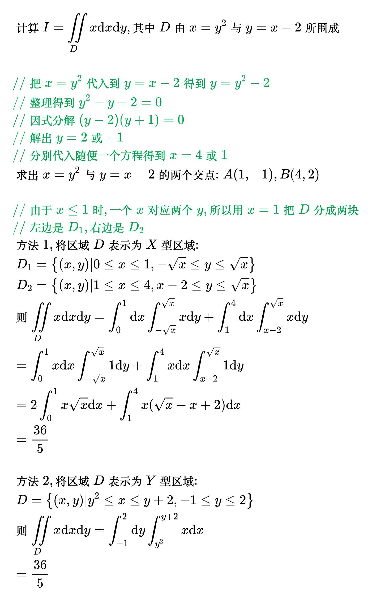
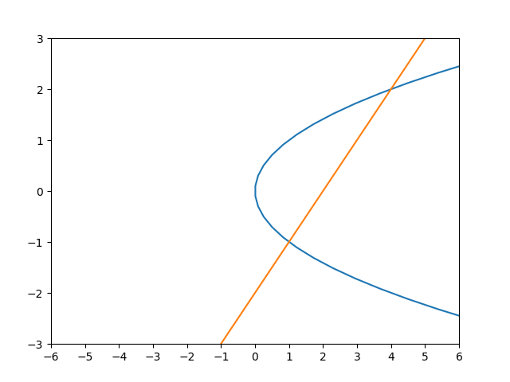
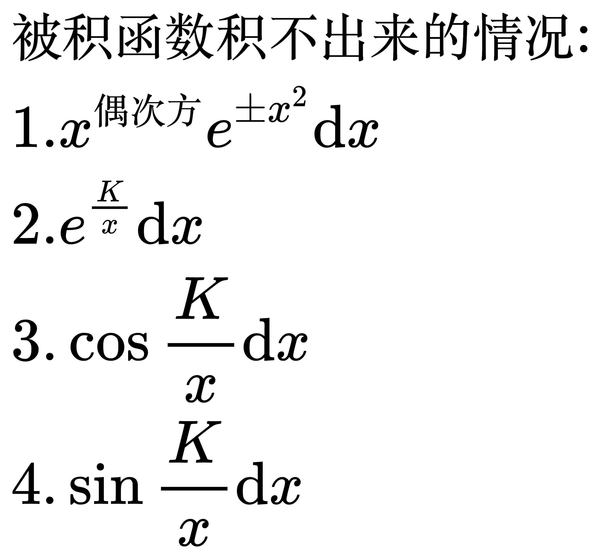
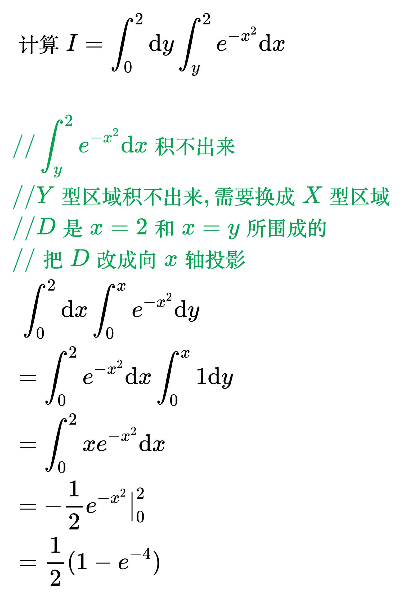
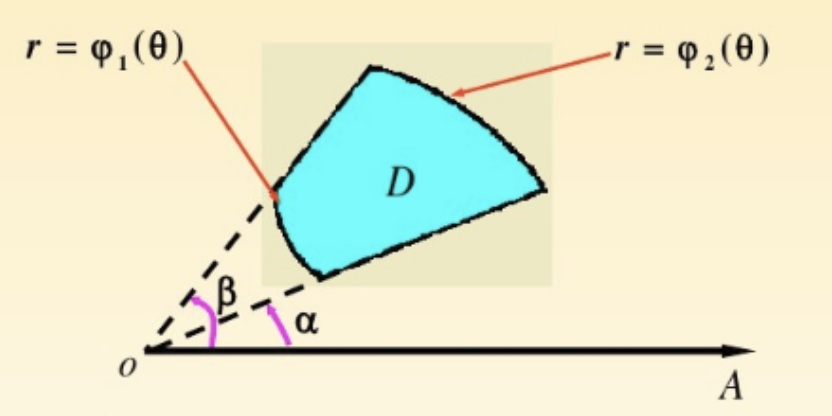

# 积分法

## 直角坐标法

<!--
\begin{align}
& X 型区域 \\
& 对 \iint\limits_{D} f(x, y) \mathrm{d}x \mathrm{d}y, 将区域 D 向 x 轴投影, 若区域 D 可表示为 \\
& \; D = \left \{ (x, y) | a \le x \le b, \varphi _1(x) \le y \le \varphi _2(x) \right \}, \\
& 则称其为 X 型区域, 且有 \iint\limits_{D} f(x, y) \mathrm{d}x \mathrm{d}y =
\int_{a}^{b} \mathrm{d}x \int_{\varphi _1(x)}^{\varphi _2(x)} f(x, y) \mathrm{d}y \\
\\
& Y 型区域 \\
& 对 \iint\limits_{D} f(x, y) \mathrm{d}x \mathrm{d}y, 将区域 D 向 y 轴投影, 若区域 D 可表示为 \\
& \; D = \left \{ (x, y) | \psi _1(y) \le x \le \psi _2(y), c \le y \le d \right \}, \\
& 则称其为 Y 型区域, 且有 \iint\limits_{D} f(x, y) \mathrm{d}x \mathrm{d}y =
\int_{c}^{d} \mathrm{d}y \int_{\psi _1(y)}^{\psi _2(y)} f(x, y) \mathrm{d}x \\
\end{align}
-->

例题 1

<!--
\begin{align}
& 计算 \iint\limits_{D} x^2 y \mathrm{d}x \mathrm{d}y, 其中 D 由 y = x, x = 1 及 x 轴所围成 \\
\\
& 方法1, 将区域 D 表示为 X 型区域:
D = \left \{ (x, y) | 0 \le x \le 1, 0 \le y \le x \right \} \\
& 则 \iint\limits_{D} x^2 y \mathrm{d}x \mathrm{d}y =
\int_{0}^{1} \mathrm{d}x \int_{0}^{x} x^2 y \mathrm{d}y \\
& {\color{Green} // \int_{0}^{x} x^2 y \mathrm{d}y 对 y 积分, x 当作常数,
先提到 \int_{0}^{1} \mathrm{d}x 里} \\
& = \int_{0}^{1} x^2 \mathrm{d}x \int_{0}^{x} y \mathrm{d}y \\
& {\color{Green} // \int_{0}^{x} y \mathrm{d}y = \frac{1}{2}y^2 \big|_{0}^{x} = \frac{1}{2}x^2} \\
& = \int_{0}^{1} x^2 \cdot \frac{1}{2}x^2 \mathrm{d}x \\
& = \frac{1}{2} \int_{0}^{1} x^4 \mathrm{d}x \\
& = \frac{1}{10} \\
\\
& 方法2, 将区域 D 表示为 Y 型区域:
D = \left \{ (x, y) | y \le x \le 1, 0 \le y \le 1 \right \} \\
& 则 \iint\limits_{D} x^2 y \mathrm{d}x \mathrm{d}y =
\int_{0}^{1} \mathrm{d}y \int_{y}^{1} x^2 y \mathrm{d}x \\
& {\color{Green} // 同理 y 当作常数,
先提到 \int_{0}^{1} \mathrm{d}y 里} \\
& = \int_{0}^{1} y \mathrm{d}x \int_{y}^{1} x^2 \mathrm{d}x \\
& {\color{Green} // \int_{y}^{1} x^2 \mathrm{d}x = \frac{1}{3}x^3 \big|_{y}^{1}
= \frac{1}{3}(1 - y^3)} \\
& = \frac{1}{3} \int_{0}^{1} (y - y^4) \mathrm{d}y \\
& = \frac{1}{10} \\
\end{align}
-->

例题 2

<!--
\begin{align}
& 计算 I = \iint\limits_{D} x \mathrm{d}x \mathrm{d}y, 其中 D 由 x = y^2 与 y = x - 2 所围成 \\
\\
& {\color{Green} // 把 x = y^2 代入到 y = x - 2 得到 y = y^2 - 2} \\
& {\color{Green} // 整理得到 y^2 - y - 2 = 0} \\
& {\color{Green} // 因式分解 (y - 2)(y + 1) = 0} \\
& {\color{Green} // 解出 y = 2 或 -1} \\
& {\color{Green} // 分别代入随便一个方程得到 x = 4 或 1} \\
& 求出 x = y^2 与 y = x - 2 的两个交点: A (1, -1), B (4, 2) \\
\\
& {\color{Green} // 由于 x \le 1 时, 一个 x 对应两个 y, 所以用 x = 1 把 D 分成两块} \\
& {\color{Green} // 左边是 D_1, 右边是 D_2} \\
& 方法1, 将区域 D 表示为 X 型区域: \\
& \; D_1 = \left \{ (x, y) | 0 \le x \le 1, - \sqrt{x} \le y \le \sqrt{x} \right \} \\
& \; D_2 = \left \{ (x, y) | 1 \le x \le 4, x - 2 \le y \le \sqrt{x} \right \} \\
& 则 \iint\limits_{D} x \mathrm{d}x \mathrm{d}y =
\int_{0}^{1} \mathrm{d}x \int_{- \sqrt{x}}^{\sqrt{x}} x \mathrm{d}y +
\int_{1}^{4} \mathrm{d}x \int_{x - 2}^{\sqrt{x}} x \mathrm{d}y \\
& = \int_{0}^{1} x \mathrm{d}x \int_{- \sqrt{x}}^{\sqrt{x}} 1 \mathrm{d}y +
\int_{1}^{4} x \mathrm{d}x \int_{x - 2}^{\sqrt{x}} 1 \mathrm{d}y \\
& = 2 \int_{0}^{1} x \sqrt{x} \mathrm{d}x + \int_{1}^{4} x(\sqrt{x} - x + 2) \mathrm{d}x \\
& = \frac{36}{5} \\
\\
& 方法2, 将区域 D 表示为 Y 型区域: \\
& \; D = \left \{ (x, y) | y^2 \le x \le y + 2, -1 \le y \le 2 \right \} \\
& 则 \iint\limits_{D} x \mathrm{d}x \mathrm{d}y =
\int_{-1}^{2} \mathrm{d}y \int_{y^2}^{y + 2} x \mathrm{d}x \\
& = \frac{36}{5} \\
\end{align}
-->

<!--
\begin{align}
& 被积函数积不出来的情况: \\
& \; 1. x^{偶次方} e^{\pm x^2} \mathrm{d}x \\
& \; 2. e^{\frac{K}{x}} \mathrm{d}x \\
& \; 3. \cos \frac{K}{x} \mathrm{d}x \\
& \; 4. \sin \frac{K}{x} \mathrm{d}x \\
\end{align}
-->

例题 3

<!--
\begin{align}
& 计算 I = \int_{0}^{2} \mathrm{d}y \int_{y}^{2} e^{-x^2} \mathrm{d}x \\
\\
& {\color{Green} // \int_{y}^{2} e^{-x^2} \mathrm{d}x 积不出来} \\
& {\color{Green} // Y 型区域积不出来, 需要换成 X 型区域} \\
& {\color{Green} // D 是 x = 2 和 x = y 所围成的} \\
& {\color{Green} // 把 D 改成向 x 轴投影} \\
& \; \int_{0}^{2} \mathrm{d}x \int_{0}^{x} e^{-x^2} \mathrm{d}y \\
& = \int_{0}^{2} e^{-x^2} \mathrm{d}x \int_{0}^{x} 1 \mathrm{d}y \\
& = \int_{0}^{2} x e^{-x^2} \mathrm{d}x \\
& = - \frac{1}{2} e^{-x^2} \big|_{0}^{2} \\
& = \frac{1}{2} (1 - e^{-4}) \\
\end{align}
-->

## 极坐标法

<!--
\begin{align}
& 计算二重积分时, 若具有如下两个特征之一, 一般使用极坐标法: \\
& \; 1. 积分区域 D 的边界曲线含 x^2 + y^2 \\
& \; 2. 被积函数 f(x, y) 中含 x^2 + y^2 \\
\\
& 令 \begin{cases}
x = r \cos \theta \\
y = r \sin \theta
\end{cases}, (\alpha \le \theta \le \beta, \varphi _1(\theta) \le r \le \varphi _2(\theta)) \\
& 则 \iint\limits_{D} f(x, y) \mathrm{d}\sigma =
\int_{\alpha}^{\beta} \mathrm{d}\theta \int_{\varphi _1(\theta)}^{\varphi _2(\theta)}
f(r \cos \theta, r \sin \theta) r \mathrm{d}r \\
\end{align}
-->

例题 1

<!--
\begin{align}
& 计算 I = \iint\limits_{D} f(x, y) \mathrm{d}\sigma, 其中 D 为圆域 x^2 + y^2 \le 4 \\
\\

\end{align}
-->
