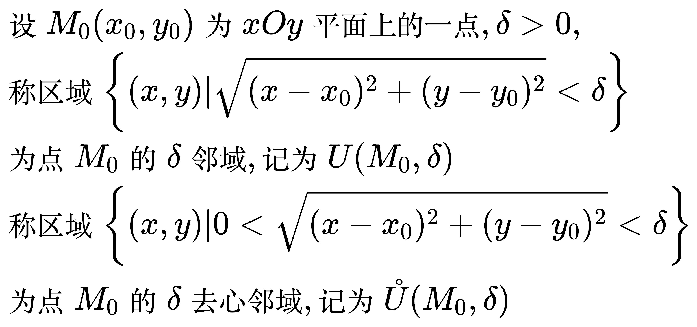
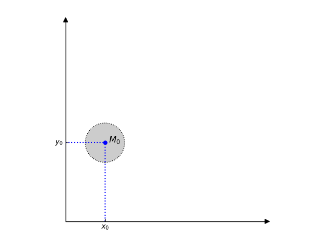
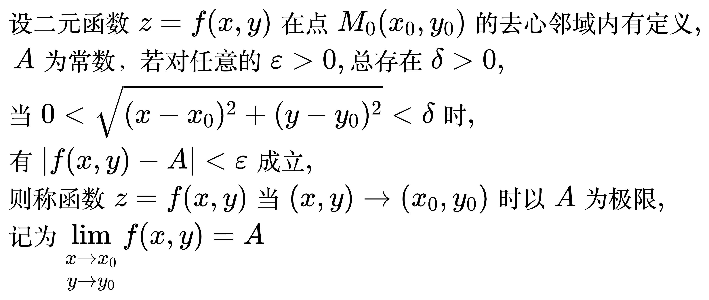
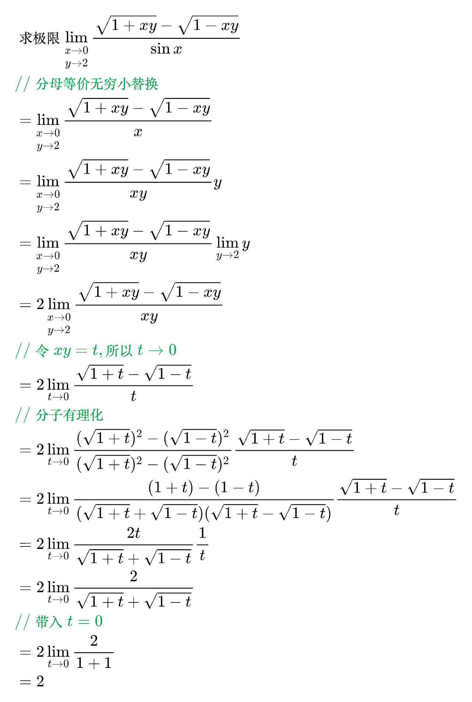
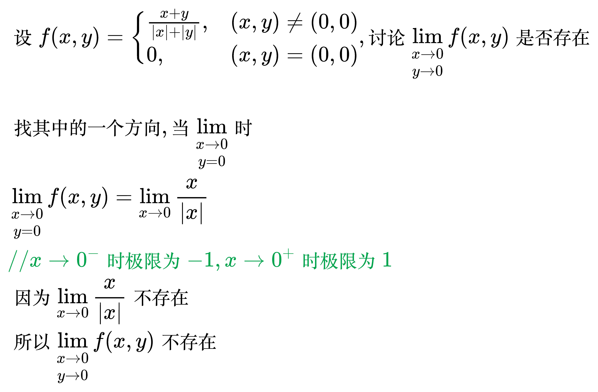
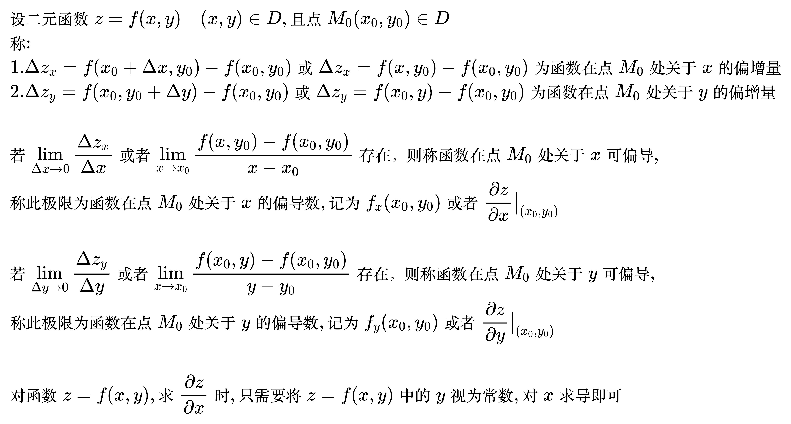

# 多元函数微分学

<!--
\begin{align}
& 设 M_0 (x_0, y_0) 为 xOy 平面上的一点, \delta > 0, \\
& 称区域 \left \{ (x, y) | \sqrt{(x - x_0)^2 + (y - y_0)^2} < \delta \right \} \\
& 为点 M_0 的 \delta 邻域, 记为 U(M_0,\delta) \\
& 称区域 \left \{ (x, y) | 0 < \sqrt{(x - x_0)^2 + (y - y_0)^2} < \delta \right \} \\
& 为点 M_0 的 \delta 去心邻域, 记为 \mathring{U}(M_0,\delta) \\
\end{align}
-->

<!--
import matplotlib.pyplot as plt
import numpy as np
import mpl_toolkits.axisartist as AA

circle = plt.Circle((1, 2), 0.5, fill=True, facecolor='#CCCCCC', edgecolor='black', lw=1, ls='dotted')

x = np.linspace(1, 2, 1)
y = x * 2

fig = plt.figure()

# 添加一个坐标轴
ax_main = fig.add_axes((0.1, 0.1, 0.8, 0.8), axes_class=AA.Axes)
ax_main.set_xlim(left=0, right=5)
ax_main.set_ylim(bottom=0, top=5)
# 隐藏顶部及右侧坐的标轴
ax_main.axis["right"].set_visible(False)
ax_main.axis["top"].set_visible(False)
# 设置底部及左侧坐标轴的样式
ax_main.axis["bottom"].set_axisline_style("-|>", size=1.5)
ax_main.axis["left"].set_axisline_style("-|>", size=1.5)

# 设置x轴的刻度
ax_main.set_xticks([1])
# 设置每个刻度对应的标签
ax_main.set_xticklabels([r'$x_0$'])

# 设置y轴的刻度
ax_main.set_yticks([2])
# 设置每个刻度对应的标签
ax_main.set_yticklabels([r'$y_0$'])

# 绘制到x轴的注释线
ax_main.vlines(x=1, ymin=0, ymax=2, color='b', linestyles='dotted')
# 绘制到y轴的注释线
ax_main.hlines(y=2, xmin=0, xmax=1, color='b', linestyles='dotted')

# 绘制图像
ax_main.plot(x, y, ms=5, marker='o', color='b')
ax_main.text(1.1, 2, r'$M_0$', fontsize=12, color='black')

# 将圆形添加到坐标轴中
ax_main.add_artist(circle)
# 令x轴和y轴长度相同, 保证圆形的形状正确
ax_main.set_aspect('equal')

plt.show()
-->

## 二元函数的极限

<!--
\begin{align}
& 设二元函数 z = f(x, y) 在点 M_0(x_0, y_0) 的去心邻域内有定义, \\
& \;\, A 为常数，若对任意的 \varepsilon > 0, 总存在 \delta > 0, \\
& 当 0 < \sqrt{(x - x_0)^2 + (y - y_0)^2} < \delta 时, \\
& 有 | f(x, y) - A | < \varepsilon 成立, \\
& 则称函数 z = f(x, y) 当 (x, y) \to (x_0, y_0) 时以 A 为极限, \\
& 记为 \lim\limits_{\substack{x \to x_0 \\ y \to y_0}} f(x, y) = A \\
\end{align}
-->

例题 1

<!--
\begin{align}
& 求极限 \lim\limits_{\substack{x \to 0 \\ y \to 2}} \frac{\sqrt{1 + xy} - \sqrt{1 - xy}}{\sin x} \\
& {\color{Green} // 分母等价无穷小替换} \\
& = \lim\limits_{\substack{x \to 0 \\ y \to 2}} \frac{\sqrt{1 + xy} - \sqrt{1 - xy}}{x} \\
& = \lim\limits_{\substack{x \to 0 \\ y \to 2}} \frac{\sqrt{1 + xy} - \sqrt{1 - xy}}{xy} y \\
& = \lim\limits_{\substack{x \to 0 \\ y \to 2}} \frac{\sqrt{1 + xy} - \sqrt{1 - xy}}{xy} \lim_{y \to 2} y \\
& = 2 \lim\limits_{\substack{x \to 0 \\ y \to 2}} \frac{\sqrt{1 + xy} - \sqrt{1 - xy}}{xy} \\
& {\color{Green} // 令 xy = t, 所以 t \to 0} \\
& = 2 \lim_{t \to 0} \frac{\sqrt{1 + t} - \sqrt{1 - t}}{t} \\
& {\color{Green} // 分子有理化} \\
& = 2 \lim_{t \to 0} \frac{(\sqrt{1 + t})^2 - (\sqrt{1 - t})^2}{(\sqrt{1 + t})^2 - (\sqrt{1 - t})^2}
\frac{\sqrt{1 + t} - \sqrt{1 - t}}{t} \\
& = 2 \lim_{t \to 0} \frac{(1 + t) - (1 - t)}{(\sqrt{1 + t} + \sqrt{1 - t})(\sqrt{1 + t} - \sqrt{1 - t})}
\frac{\sqrt{1 + t} - \sqrt{1 - t}}{t} \\
& = 2 \lim_{t \to 0} \frac{2t}{\sqrt{1 + t} + \sqrt{1 - t}} \frac{1}{t} \\
& = 2 \lim_{t \to 0} \frac{2}{\sqrt{1 + t} + \sqrt{1 - t}} \\
& {\color{Green} // 带入 t = 0} \\
& = 2 \lim_{t \to 0} \frac{2}{1 + 1} \\
& = 2 \\
\end{align}
-->

例题 2

<!--
\begin{align}
& 设 f(x, y) = \begin{cases}
\frac{x + y}{|x| + |y|} , & (x, y) \ne (0, 0) \\
0, & (x, y) = (0, 0)
\end{cases}, 讨论 \lim\limits_{\substack{x \to 0 \\ y \to 0}} f(x, y) 是否存在 \\
\\
& 找其中的一个方向, 当 \lim\limits_{\substack{x \to 0 \\ y = 0}} 时 \\
& \lim\limits_{\substack{x \to 0 \\ y = 0}} f(x, y) = \lim_{x \to 0} \frac{x}{|x|} \\
& {\color{Green} // x \to 0^- 时极限为 -1, x \to 0^+ 时极限为 1} \\
& 因为 \lim_{x \to 0} \frac{x}{|x|} 不存在 \\
& 所以 \lim\limits_{\substack{x \to 0 \\ y \to 0}} f(x, y) 不存在 \\
\end{align}
-->

## 偏导数

<!--
\begin{align}
& 设二元函数 z = f(x, y) \quad (x, y) \in D, 且点 M_0 (x_0, y_0) \in D \\
& 称: \\
& \; 1. \Delta z_x = f(x_0 + \Delta x, y_0) - f(x_0, y_0) 或 
\Delta z_x = f(x, y_0) - f(x_0, y_0) 为函数在点 M_0 处关于 x 的偏增量 \\
& \; 2. \Delta z_y = f(x_0, y_0 + \Delta y) - f(x_0, y_0) 或 
\Delta z_y = f(x_0, y) - f(x_0, y_0) 为函数在点 M_0 处关于 y 的偏增量 \\
\\
& 若 \lim_{\Delta x \to 0} \frac{\Delta z_x}{\Delta x} 或者 
\lim_{ x \to x_0} \frac{f(x, y_0) - f(x_0, y_0)}{x - x_0} 存在，则称函数在点 M_0 处关于 x 可偏导, \\
& 称此极限为函数在点 M_0 处关于 x 的偏导数, 记为 f_x(x_0, y_0) 或者 
\frac{\partial z}{\partial x} \big|_{(x_0, y_0)} \\
\\
& 若 \lim_{\Delta y \to 0} \frac{\Delta z_y}{\Delta y} 或者 
\lim_{ x \to x_0} \frac{f(x_0, y) - f(x_0, y_0)}{y - y_0} 存在，则称函数在点 M_0 处关于 y 可偏导, \\
& 称此极限为函数在点 M_0 处关于 y 的偏导数, 记为 f_y(x_0, y_0) 或者 
\frac{\partial z}{\partial y} \big|_{(x_0, y_0)} \\
\\
& 对函数 z = f(x, y), 求 \frac{\partial z}{\partial x} 时, 只需要将 z = f(x, y) 中的 y 视为常数, 对 x 求导即可 \\
\end{align}
-->

