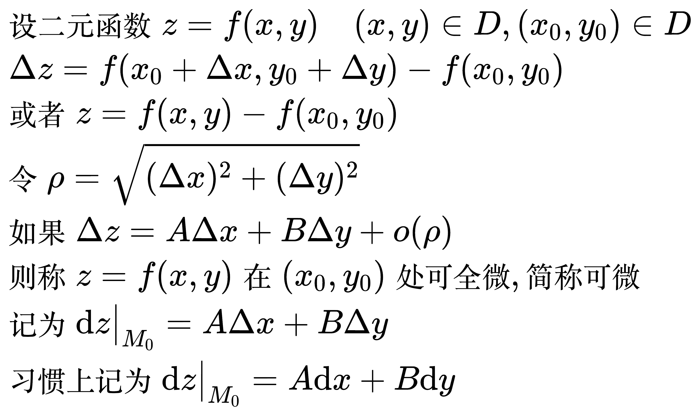

# 全微分

<!--
\begin{align}
& 设二元函数 z = f(x, y) \quad (x, y) \in D, (x_0, y_0) \in D \\
& \; \Delta z = f(x_0 + \Delta x, y_0 + \Delta y) - f(x_0, y_0) \\
& 或者 z = f(x, y) - f(x_0, y_0) \\
& 令 \rho = \sqrt{(\Delta x)^2 + (\Delta y)^2} \\
& 如果 \Delta z = A \Delta x + B \Delta y + o(\rho) \\
& 则称 z = f(x, y) 在 (x_0, y_0) 处可全微, 简称可微 \\
& 记为 \mathrm{d}z \big|_{M_0} = A \Delta x + B \Delta y \\
& 习惯上记为 \mathrm{d}z \big|_{M_0} = A \mathrm{d}x + B \mathrm{d}y \\
\end{align}
-->

