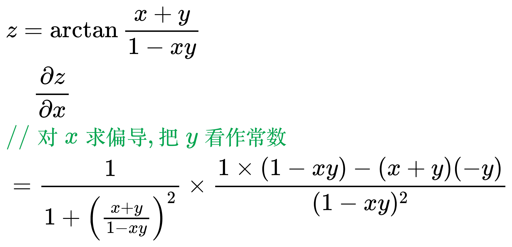
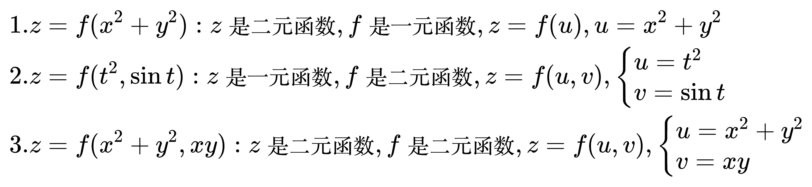

# 求偏导法则

显函数求偏导:

<!--
\begin{align}
& z = \arctan \frac{x + y}{1 - xy} \\
& \;\;\;\; \frac{\partial z}{\partial x} \\
& {\color{Green} // 对 x 求偏导, 把 y 看作常数} \\
& = \frac{1}{1 + \left ( \frac{x + y}{1 - xy} \right ) ^2} \times
\frac{1 \times (1 - xy) - (x + y)(-y)}{(1 - xy)^2} \\
\end{align}
-->

## 复合函数求偏导

<!--
\begin{align}
& 1. z = f(x^2 + y^2): z是二元函数, f是一元函数, z = f(u), u = x^2 + y^2 \\
& 2. z = f(t^2, \sin t): z是一元函数, f是二元函数, z = f(u, v), \begin{cases}
u = t^2 \\
v = \sin t
\end{cases} \\
& 3. z = f(x^2 + y^2, xy): z是二元函数, f是二元函数, z = f(u, v), \begin{cases}
u = x^2 + y^2 \\
v = xy
\end{cases} \\
\end{align}
-->

