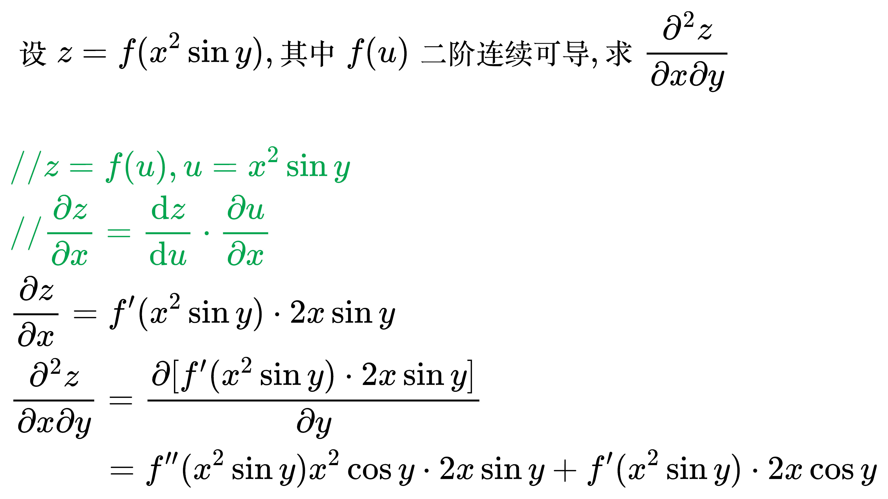
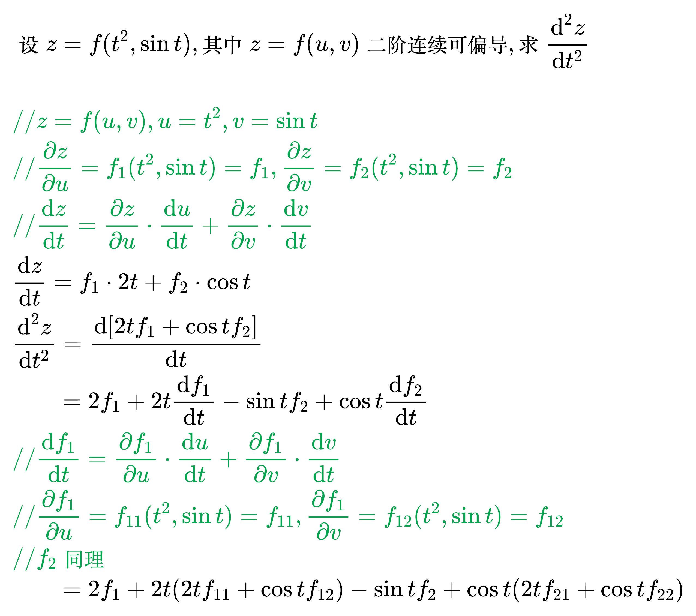
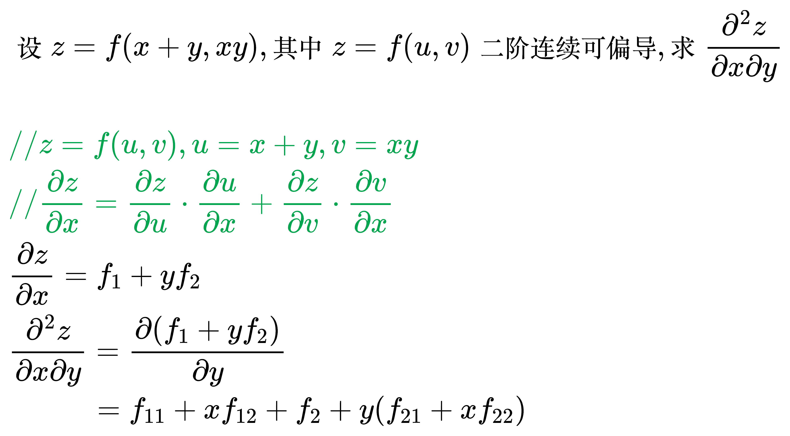
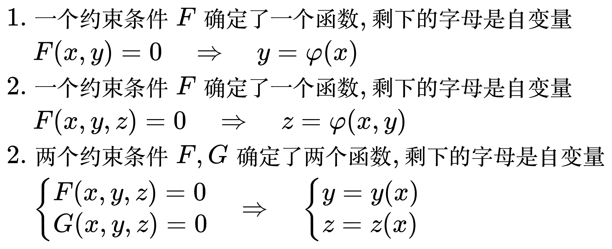
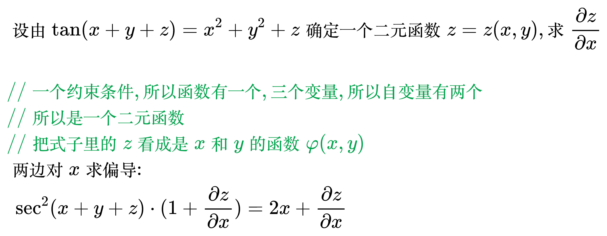
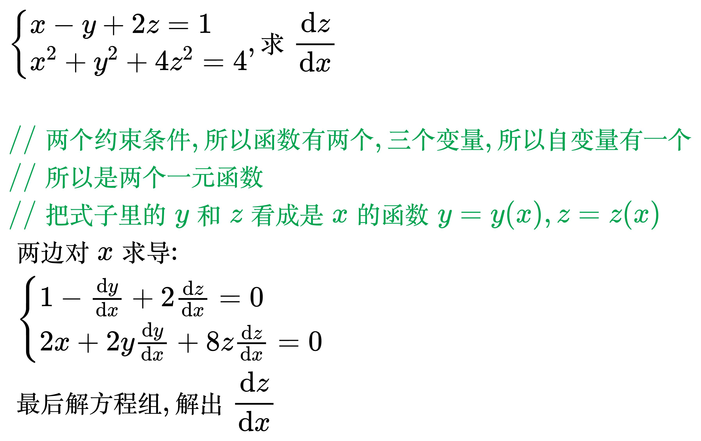

# 求偏导法则

显函数求偏导:

<!--
\begin{align}
& z = \arctan \frac{x + y}{1 - xy} \\
& \;\;\;\; \frac{\partial z}{\partial x} \\
& {\color{Green} // 对 x 求偏导, 把 y 看作常数} \\
& = \frac{1}{1 + \left ( \frac{x + y}{1 - xy} \right ) ^2} \times
\frac{1 \times (1 - xy) - (x + y)(-y)}{(1 - xy)^2} \\
\end{align}
-->

## 复合函数求偏导

<!--
\begin{align}
& 1. z = f(x^2 + y^2): z是二元函数, f是一元函数, z = f(u), u = x^2 + y^2 \\
& 2. z = f(t^2, \sin t): z是一元函数, f是二元函数, z = f(u, v), \begin{cases}
u = t^2 \\
v = \sin t
\end{cases} \\
& 3. z = f(x^2 + y^2, xy): z是二元函数, f是二元函数, z = f(u, v), \begin{cases}
u = x^2 + y^2 \\
v = xy
\end{cases} \\
\end{align}
-->

例题 1

<!--
\begin{align}
& 设 z = f(x^2 \sin y), 其中 f(u) 二阶连续可导, 求 \frac{\partial ^2 z}{\partial x \partial y} \\
\\
& {\color{Green} // z = f(u), u = x^2 \sin y} \\
& {\color{Green} // \frac{\partial z}{\partial x} = \frac{\mathrm{d} z}{\mathrm{d} u} \cdot \frac{\partial u}{\partial x}} \\
& \frac{\partial z}{\partial x} = f'(x^2 \sin y) \cdot 2x \sin y \\
& \frac{\partial ^2 z}{\partial x \partial y} = \frac{\partial [f'(x^2 \sin y) \cdot 2x \sin y]}{\partial y} \\
& \qquad \,\,\,\, = f''(x^2 \sin y) x^2 \cos y \cdot 2x \sin y + f'(x^2 \sin y) \cdot 2x \cos y \\
\end{align}
-->

例题 2

<!--
\begin{align}
& 设 z = f(t^2, \sin t), 其中 z = f(u, v) 二阶连续可偏导, 求 \frac{\mathrm{d} ^2z}{\mathrm{d} t^2} \\
\\
& {\color{Green} // z = f(u, v), u = t^2, v = \sin t} \\
& {\color{Green} // \frac{\partial z}{\partial u} = f_1(t^2, \sin t) = f_1,
\frac{\partial z}{\partial v} = f_2(t^2, \sin t) = f_2} \\
& {\color{Green} // \frac{\mathrm{d} z}{\mathrm{d} t} =
\frac{\partial z}{\partial u} \cdot \frac{\mathrm{d} u}{\mathrm{d} t} +
\frac{\partial z}{\partial v} \cdot \frac{\mathrm{d} v}{\mathrm{d} t}} \\
& \frac{\mathrm{d} z}{\mathrm{d} t} = f_1 \cdot 2t + f_2 \cdot \cos t \\
& \frac{\mathrm{d} ^2z}{\mathrm{d} t^2} = \frac{\mathrm{d} [2t f_1 + \cos t f_2]}{\mathrm{d} t} \\
& \quad \,\,\,\,\, = 2 f_1 + 2t \frac{\mathrm{d} f_1}{\mathrm{d} t}
- \sin t f_2 + \cos t \frac{\mathrm{d} f_2}{\mathrm{d} t} \\
& {\color{Green} // \frac{\mathrm{d} f_1}{\mathrm{d} t} =
\frac{\partial f_1}{\partial u} \cdot \frac{\mathrm{d} u}{\mathrm{d} t} +
\frac{\partial f_1}{\partial v} \cdot \frac{\mathrm{d} v}{\mathrm{d} t}} \\
& {\color{Green} // \frac{\partial f_1}{\partial u} = f_{11}(t^2, \sin t) = f_{11},
\frac{\partial f_1}{\partial v} = f_{12}(t^2, \sin t) = f_{12}} \\
& {\color{Green} // f_2 同理} \\
& \quad \,\,\,\,\, = 2 f_1 + 2t (2t f_{11} + \cos t f_{12})
- \sin t f_2 + \cos t (2t f_{21} + \cos t f_{22}) \\
\end{align}
-->

例题 3

<!--
\begin{align}
& 设 z = f(x + y, xy), 其中 z = f(u, v) 二阶连续可偏导, 求 \frac{\partial ^2 z}{\partial x \partial y} \\
\\
& {\color{Green} // z = f(u, v), u = x + y , v = xy} \\
& {\color{Green} // \frac{\partial z}{\partial x} = \frac{\partial z}{\partial u} \cdot \frac{\partial u}{\partial x} +
\frac{\partial z}{\partial v} \cdot \frac{\partial v}{\partial x}} \\
& \frac{\partial z}{\partial x} = f_1 + y f_2 \\
& \frac{\partial ^2 z}{\partial x \partial y} = \frac{\partial (f_1 + y f_2)}{\partial y} \\
& \qquad \,\,\,\, = f_{11} + x f_{12} + f_2 + y(f_{21} + x f_{22}) \\
\end{align}
-->

## 隐函数(组)求偏导

<!--
\begin{align}
& 1. 一个约束条件 F 确定了一个函数, 剩下的字母是自变量 \\
& \;\;\;\, F(x, y) = 0 \quad \Rightarrow \quad y = \varphi (x) \\
& 2. 一个约束条件 F 确定了一个函数, 剩下的字母是自变量 \\
& \;\;\;\, F(x, y, z) = 0 \quad \Rightarrow \quad z = \varphi (x, y) \\
& 2. 两个约束条件 F, G 确定了两个函数, 剩下的字母是自变量 \\
& \;\;\;\, \begin{cases}
F(x, y, z) = 0 \\
G(x, y, z) = 0
\end{cases} \quad \Rightarrow \quad \begin{cases}
y = y(x) \\
z = z(x)
\end{cases} \\
\end{align}
-->

例题 1

<!--
\begin{align}
& 设由 \tan (x + y + z) = x^2 + y^2 + z 确定一个二元函数 z = z(x, y), 求 \frac{\partial z}{\partial x} \\
\\
& {\color{Green} // 一个约束条件, 所以函数有一个, 三个变量, 所以自变量有两个} \\
& {\color{Green} // 所以是一个二元函数} \\
& {\color{Green} // 把式子里的 z 看成是 x 和 y 的函数 \varphi (x, y)} \\
& 两边对x求偏导: \\
& \; \sec ^2(x + y + z) \cdot (1 + \frac{\partial z}{\partial x}) = 2x + \frac{\partial z}{\partial x} \\
\end{align}
-->

例题 2

<!--
\begin{align}
& \begin{cases}
x - y + 2z = 1 \\
x^2 + y^2 + 4z^2 = 4
\end{cases}, 求 \frac{\mathrm{d} z}{\mathrm{d} x} \\
\\
& {\color{Green} // 两个约束条件, 所以函数有两个, 三个变量, 所以自变量有一个} \\
& {\color{Green} // 所以是两个一元函数} \\
& {\color{Green} // 把式子里的 y 和 z 看成是 x 的函数 y = y(x), z = z(x)} \\
& 两边对x求导: \\
& \; \begin{cases}
1 - \frac{\mathrm{d} y}{\mathrm{d} x} + 2 \frac{\mathrm{d} z}{\mathrm{d} x} = 0 \\
2x + 2y \frac{\mathrm{d} y}{\mathrm{d} x} + 8z \frac{\mathrm{d} z}{\mathrm{d} x} = 0
\end{cases} \\
& 最后解方程组, 解出 \frac{\mathrm{d} z}{\mathrm{d} x} \\
\end{align}
-->

例题 3

<!--
\begin{align}
& 设由 \begin{cases}
xu + yv = 1 \\
xv - y^2u = e^{x + y}
\end{cases}, 确定两个二元函数 u = u(x, y), v = v(x, y), \\
& 求 \frac{\partial u}{\partial x}, \frac{\partial v}{\partial y} \\
\\

\end{align}
-->
