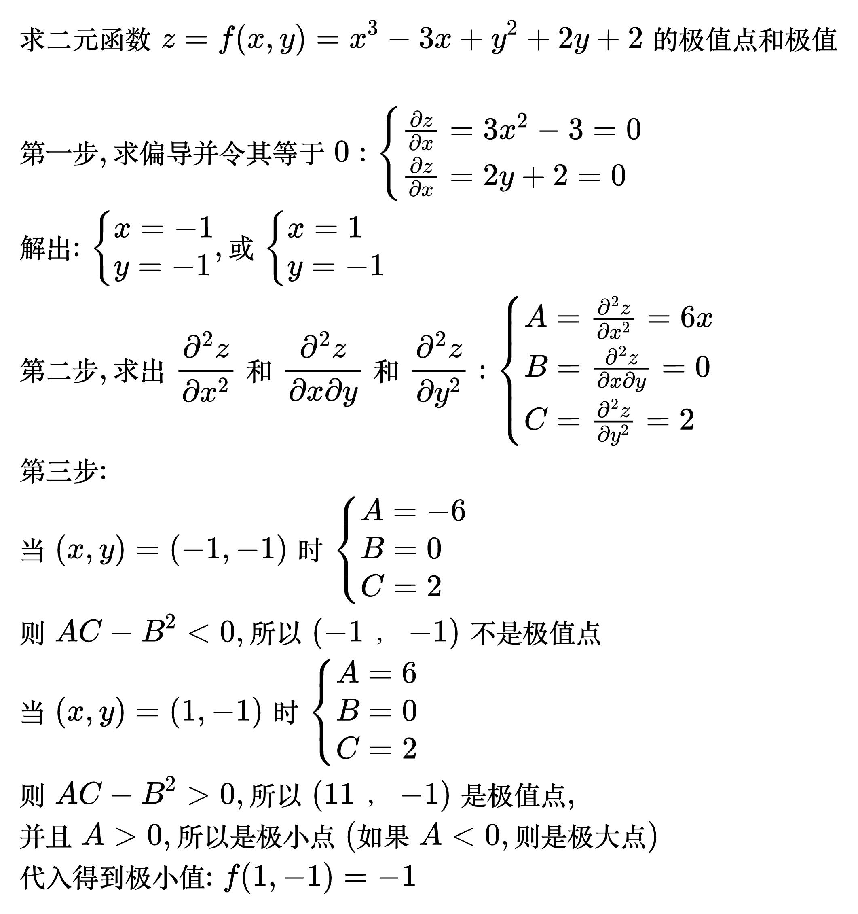

# 多元函数的极值

<!--
\begin{align}
& 设函数 z = f(x, y) \quad (x, y) \in D, (x_0, y_0) \in D, \\
& 若存在 \delta > 0, 当 0 < \sqrt{(x - x_0)^2 + (y - y_0)^2} < \delta 时, \\
& 有 f(x, y) < f(x_0, y_0), 则称 (x_0, y_0) 为函数的极大值点, \\
& \; f(x_0, y_0) 为函数的极大值, 反之是极小值点和极小值 \\
\end{align}
-->

## 无条件极值

<!--
\begin{align}
& 给定二元函数 z = f(x, y), 其中定义域 D 为开区域, \\
& 求函数 z = f(x, y) 在 D 上的极值即为无条件极值 \\
\end{align}
-->

例题

<!--
\begin{align}
& 求二元函数 z = f(x, y) = x^3 - 3x + y^2 +2y +2 的极值点和极值 \\
\\
& 第一步, 求偏导并令其等于 0 : \begin{cases}
\frac{\partial z}{\partial x} = 3x^2 - 3 = 0 \\
\frac{\partial z}{\partial x} = 2y + 2 = 0
\end{cases} \\
& 解出: \begin{cases}
x = -1 \\
y = -1
\end{cases}, 或 \begin{cases}
x = 1 \\
y = -1
\end{cases} \\
& 第二步, 求出 \frac{\partial ^2z}{\partial x^2} 和 \frac{\partial ^2z}{\partial x \partial y} 和 \frac{\partial ^2z}{\partial y^2} : \begin{cases}
A = \frac{\partial ^2z}{\partial x^2} = 6x \\
B = \frac{\partial ^2z}{\partial x \partial y} = 0 \\
C = \frac{\partial ^2z}{\partial y^2} = 2
\end{cases} \\
& 第三步: \\
& 当 (x, y) = (-1, -1) 时 \begin{cases}
A = -6 \\
B = 0 \\
C = 2
\end{cases} \\
& 则 AC - B^2 < 0, 所以 (-1， -1) 不是极值点 \\
& 当 (x, y) = (1, -1) 时 \begin{cases}
A = 6 \\
B = 0 \\
C = 2
\end{cases} \\
& 则 AC - B^2 > 0, 所以 (11， -1) 是极值点, \\
& 并且 A > 0, 所以 是极小点(如果 A < 0, 则是极大点) \\
& 代入得到极小值: f(1, -1) = -1 \\
\end{align}
-->

