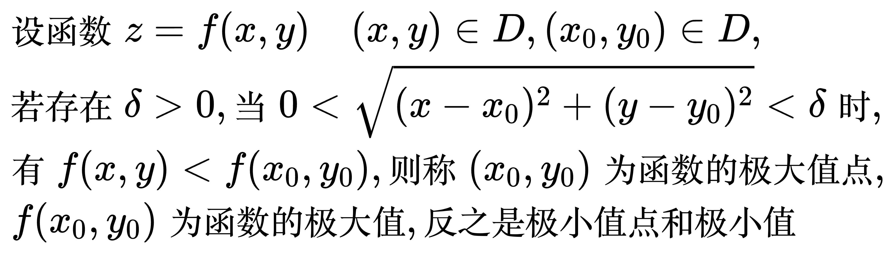

# 多元函数的极值

<!--
\begin{align}
& 设函数 z = f(x, y) \quad (x, y) \in D, (x_0, y_0) \in D, \\
& 若存在 \delta > 0, 当 0 < \sqrt{(x - x_0)^2 + (y - y_0)^2} < \delta 时, \\
& 有 f(x, y) < f(x_0, y_0), 则称 (x_0, y_0) 为函数的极大值点, \\
& \; f(x_0, y_0) 为函数的极大值, 反之是极小值点和极小值 \\
\end{align}
-->

## 无条件极值

<!--
\begin{align}
& 给定二元函数 z = f(x, y), 其中定义域 D 为开区域, \\
& 求函数 z = f(x, y) 在 D 上的极值即为无条件极值 \\
\\
\end{align}
-->
