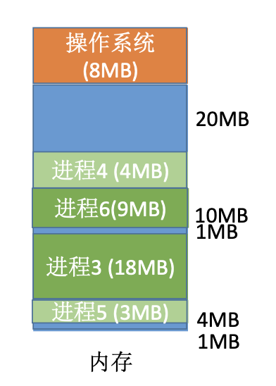

# 内存分配方式

## 单一连续分配

在单一连续分配方式中, 内存被分为系统区和用户区。系统区通常位于内存的低地址部分, 用于存放操作系统相关数据。用户区用于存放用户进程相关数据。

内存中只能有一道用户程序, 用户程序独占整个用户区空间。

优点: 实现简单, 无外部碎片, 可以采用覆盖技术扩充内存, 不一定需要采取内存保护。

缺点: 只能用于单用户单任务的操作系统中, 有内部碎片, 存储器利用率极低。

## 固定分区分配

20 世纪 60 年代出现了支持多道程序的系统, 为了能在内存中装入多道程序, 且这些程序之间又不会相互干扰, 于是将整个用户空间划分为若干个固定大小的分区, 在每个分区中只装入一道作业, 这样就形成了最简单的一种可运行多道程序的内存管理方式。

固定分区分配分为两种:

- 分区大小相等: 缺乏灵活性, 但是很适合用于用一台计算机控制多个相同对象的场合(比如:钢铁厂有 n 个相同的炼钢炉, 就可把内存分为 n 个大小相等的区域存放 n 个炼钢炉控制程序)
- 分区大小不等: 增加了灵活性, 可以满足不同大小的进程需求。根据常在系统中运行的作业大小情况进行划分(比如:划分多个小分区, 适量中等分区, 少量大分区)

操作系统需要建立一个分区说明表, 来实现各个分区的分配与回收。每一条记录对应一个分区, 通常按分区大小排列。每个表项包括对应分区的大小, 起始地址, 状态(是否已分配)。

优点: 实现简单, 无外部碎片。

缺点: 当用户程序太大时, 可能所有的分区都不能满足需求, 此时不得不采用覆盖技术来解决, 但这又会降低性能。会产生内部碎片, 内存利用率低。

## 动态分区分配

动态分区分配又称为可变分区分配。这种分配方式不会预先划分内存分区, 而是在进程装入内存时, 根据进程的大小动态地建立分区, 并使分区的大小正好适合进程的需要。因此系统分区的大小和数目是可变的。

系统可以使用两种数据结构记录内存的使用情况:

- 空闲分区表: 每个空闲分区对应一个表项。表项中包含分区号, 分区大小, 分区起始地址等信息
- 空闲分区链表: 每个分区的起始部分和末尾部分分别设置前向指针和后向指针。起始部分处还可记录分区大小等信息

动态分区分配没有内部碎片, 但是有外部碎片。

- 内部碎片, 分配给某进程的内存区域中, 如果有些部分没有用上, 这些部分就是内部碎片
- 外部碎片, 是指内存中的某些空闲分区由于太小而无法利用。即使内存中空闲空间的总和可以满足某进程的要求, 但由于进程需要的是一整块连续的内存空间, 因此这些碎片不能满足进程的需求。可以通过紧凑(拼凑, Compaction)技术来解决外部碎片, 类似于标记-压缩算法

动态分区分配算法:

- 首次适应算法
- 最佳适应算法
- 最坏适应算法
- 邻近适应算法

## 首次适应算法

每次都从低地址开始查找, 找到第一个能满足大小的空闲分区。

空闲分区以地址递增的次序排列。每次分配内存时顺序查找空闲分区链(或空闲分区表), 找到大小能满足要求的第一个空闲分区。

## 最佳适应算法

由于动态分区分配是一种连续分配方式, 为各进程分配的空间必须是连续的一整片区域。因此为了保证当“大进程”到来时能有连续的大片空间, 可以尽可能多地留下大片的空闲区, 即, 优先使用更小的空闲区。

空闲分区按容量递增次序排列。每次分配内存时顺序查找空闲分区链(或空闲分区表), 找到大小能满足要求的第一个空闲分区。

缺点: 每次都选最小的分区进行分配, 会留下越来越多的, 很小的, 难以利用的内存块。因此这种方法会产生很多的外部碎片。

## 最坏适应算法(最大适应算法)

为了解决最佳适应算法的问题—: 即留下太多难以利用的小碎片, 可以在每次分配时 优先使用最大的连续空闲区, 这样分配后剩余的空闲区就不会太小, 更方便使用。

空闲分区按容量递减次序排列。每次分配内存时顺序查找空闲分区链(或空闲分区 表), 找到大小能满足要求的第一个空闲分区。

缺点: 每次都选最大的分区进行分配, 虽然可以让分配后留下的空闲区更大, 更可用, 但是这种方式会导致较大的连续空闲区被迅速用完。如果之后有“大进程”到达, 就没有内存分区可用了。

## 邻近适应算法

首次适应算法每次都从链头开始查找的。这可能会导致低地址部分出现很多小的空闲分区, 而每次分配查找时, 都要经过这些分区, 因此也增加了查找的开销。如果每次都从上次查找结束的位置开始检索, 就能解决上述问题。

空闲分区以地址递增的顺序排列(可排成一个循环链表)。每次分配内存时从上次查找结束的位置开始查找空闲分区链(或空闲分区表), 找到大小能满足要求的第一个空闲分区。

邻近适应算法的规则可能会导致无论低地址, 高地址部分的空闲分区都有相同的概率被使用, 也就导致了高地址部分的大分区更可能被使用, 划分为小分区, 最后导致无大分区可用。

综合来看, 四种算法中, 首次适应算法的效果反而更好。
