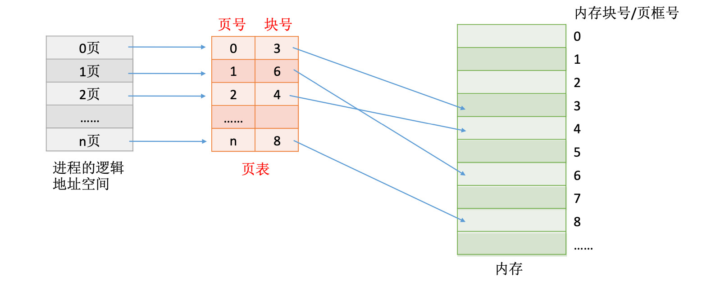

# 分页存储管理

将内存空间分为一个个大小相等的分区(比如:每个分区 4KB)，每个分区就是一个“页框”或“内存块”。每个页框有一个编号，即“页框号”，页框号从 0 开始。

将进程的逻辑地址空间也分为与页框大小相等的一个个部分，每个部分称为一个“页”或“页面”。每个页面也有一个编号，即“页号”，页号也是从 0 开始。

操作系统以页框为单位为各个进程分配内存空间。进程的每个页面分别放入一个页框中。也就是说，进程的页面与内存的页框有一一对应的关系。各个页面不必连续存放，可以放到不相邻的各个页框中。

## 页表

为了能知道进程的每个页面在内存中存放的位置，操作系统要为每个进程建立一张页表。

1. 一个进程对应一张页表
2. 进程的每个页面对应一个页表项
3. 每个页表项由“页号”和“块号”组成
4. 页表记录进程页面和实际存放的内存块之间的映射关系
5. 每个页表项的长度是相同的



注意：页表记录的只是内存块号，而不是内存块的起地址。i 号内存块的起始地址为： `i * 内存块大小`。

## 每个页表项占多少字节

假设某系统物理内存大小为 4GB，页面大小为 4KB，则每个页表项至少应该为多少字节?

块号至少占用的字节:

1. 内存块大小=页面大小=4KB= 2^12 B
2. 4GB 的内存总共会被分为 2^32 / 2^12 = 2^20 个内存块
3. 内存块号的范围应该是 0 ~ 2^20 -1
4. 内存块号至少要用 20 bit 来表示, 即至少要用 3B 来表示块号(3\*8=24bit)

页表项连续存放，因此页号可以是隐含的，不占存储空间(类比数组的索引)

## 如何实现地址的转换

逻辑地址转换到物理地址:

1. 确定逻辑地址对应的页号: `页号 = 逻辑地址 / 页面长度` (取除法的整数部分)
2. 确定逻辑地址对应的页内偏移量: `页内偏移量 = 逻辑地址 % 页面长度` (取除法的余数部分)
3. 确定页号对应的块号: 查询页表
4. 计算物理地址: `物理地址 = 块号 * 页面长度 + 页内偏移量`

例: 在某计算机系统中，页面大小是 50B。某进程逻辑地址空间大小为 200B，则逻辑地址 110 对应 的页号、页内偏移量是多少?

1. 页号 = 110 / 50 = 2
2. 页内偏移量 = 110 % 50 = 10

在计算机内部，地址是用二进制表示的，如果页面大小是 2 的整数幂，则计算机硬件可以很快速的把逻辑地址拆分出页号和页内偏移量。

如果每个页面大小为 2^K 字节，用二进制数表示逻辑地址，则末尾 K 位即为页内偏移量，其余部分就是页号。并且只需把页表中记录的块号拼接上页内偏移量就能得到对应的物理地址。

例如: 页面大小为 4KB = 2^12 字节 = 4096 字节, 则逻辑地址 4097 的页号和页内偏移量:

1. 4097 用二进制表示 `00000000000000000001 000000000001`
2. 页内偏移量是后 12 位: `000000000001`, 等于 `4097 / 4096 = 1`
3. 页号是其余部分: `00000000000000000001`, 等于 `4097 % 4096 = 1`
4. 假设页号 1 在页表中对应的块号是 9(二进制 1001), 则物理地址为: `1001 000000000001`

## 基本地址变换机构

基本地址变换机构可以借助进程的页表将逻辑地址转换为物理地址。

通常会在系统中设置一个页表寄存器(PTR)，存放页表在内存中的起始地址 F 和页表长度 M。 进程未执行时，页表的始址 和 页表长度 放在进程控制块(PCB)中，当进程被调度时，操作系 统内核会把它们放到页表寄存器中。

逻辑地址 A 到物理地址 E 的变换过程如下:

1. 从 PC 寄存器中取出逻辑地址 A
2. 从逻辑地址中拆分出页号 P 和页内偏移量 W
3. 检查页号 P 的合法性: 如果大于等于页表长度 M, 会抛出越界中断
4. 根据起始地址 F 找到页表
5. 找出页号 P 在页表中对应的内存块号 B
6. 根据内存块号 B 和页内偏移量 W 拼接出物理地址 E

## 快表

快表，又称联想寄存器(translation lookaside buffer, TLB)，是一种访问速度比内存快很多的高速缓存，用来存放最近访问的页表项的副本，可以加速地址变换的速度。与此对应，内存中的页表称为慢表。

引入快表后，地址的变换过程:

1. 从 PC 寄存器中取出逻辑地址 A
2. 从逻辑地址中拆分出页号 P 和页内偏移量 W
3. 检查页号 P 的合法性: 如果大于等于页表长度 M, 会抛出越界中断
4. 在快表中查询页号 P
   - 如果快表中存在页号 P
     1. 找出页号 P 在快表中对应的内存块号 B
     2. 根据内存块号 B 和页内偏移量 W 拼接出物理地址 E
   - 如果快表中不存在页号 P
     1. 根据起始地址 F 找到页表
     2. 找出页号 P 在页表中对应的内存块号 B
     3. 把这条记录复制到快表中, 如果快表满了, 需要淘汰掉快表中的一部分页表项
     4. 根据内存块号 B 和页内偏移量 W 拼接出物理地址 E

例: 访问一次快表耗时 1 微秒，访问一次内存耗时 100 微秒。若快表的命中率为 90%，那么访问一个逻辑地址的平均耗时是多少？

```js
// (访问快表 + 访问目标物理地址) * 90% + (访问快表 + 访问慢表 + 访问目标物理地址) * 10%
(1 + 100) * 0.9 + (1 + 100 + 100) * 0.1 = 111 微秒
```

有的系统支持快表和慢表同时查找，如果是这样, 访问一个逻辑地址的平均耗时是多少？

```js
// (访问快表 + 访问目标物理地址) * 90% + (访问慢表 + 访问目标物理地址) * 10%
(1 + 100) * 0.9 + (100 + 100) * 0.1 = 110.9 微秒
```

## 局部性原理

时间局部性:如果执行了程序中的某条指令，那么不久后这条指令很有可能再次执行;如果某个数据被访问过，不久之后该数据很可能再
次被访问(因为程序中存在大量的循环)。

空间局部性:一旦程序访问了某个存储单元，在不久之后，其附近的存储单元也很有可能被访问。(因为很多数据在内存中都是连续存放
的)。

由于局部性原理，可能连续很多次查到的都是同一个页表项, 所以快表可以大幅提高系统运行效率。
