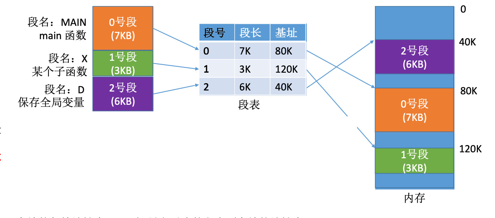

# 分段存储管理

进程的地址空间按照不同的功能划分为若干个段，每个段都有一个段名，每段从 0 开始编址。内存空间以段为单位进行分配，每个段在内存中占据连续空间，但各段之间可以不相邻。由于段是按逻辑功能模块划分，所以用户编程更方便，程序的可读性更高。

分段系统的逻辑地址结构由段号(编译器会将段名转换为段号)和段内地址(段内偏移量)所组成。段号的位数决定了每个进程最多可以分几个段。段内地址位数决定了每个段的最大长度是多少。

逻辑地址的结构:

```
[  段号  |  段内偏移量  ]
```

如果段号占 16 位，则每个进程最多有 2^16 = 64K 个段。如果段内地址占 16 位，则每个段的最大长度是 2^16 = 64KB。

程序分多个段，各段离散地装入内存，为了保证程序能正常运行，就必须能从物理内存中找到各个段的存放位置。为此，需为每个进程建立一张段映射表，简称段表。



每个段对应一个段表项，其中记录了该段在内存中的起始位置(又称基址)和段的长度。

各个段表项的长度是相同的。例如: 某系统按字节寻址，采用分段存储管理，逻辑地址结构为(段号 16 位, 段内地址 16 位)，因此用 16 位 即可表示最大段长。物理内存大小为 4GB(可用 32 位表示整个物理内存地址空间)。因此，可以让每个段表项占 16 + 32 = 48 位，即 6 字节。由于段表项长度相同，因此段号可以是隐含的，不占存储空间。若段表存放的起始地址为 M，则 K 号段对应的段表项存放的地址为 `M + K * 6`。

## 地址变换

逻辑地址转换到物理地址:

1. 根据逻辑地址得到段号和段内地址
2. 检查段号的合法性: 如果大于等于段表长度, 会抛出越界中断
