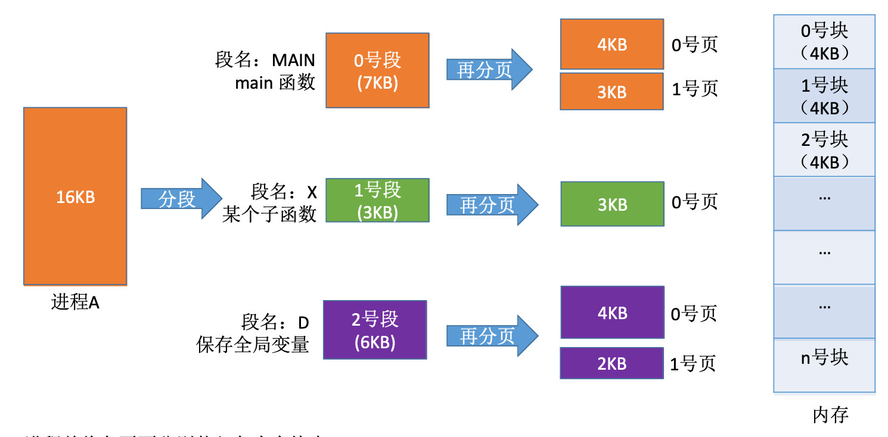

# 基本段页式管理

分页、分段的优缺点分析

- 分页管理
  - 优点: 内存空间利用率高, 不会产生外部碎片, 只会有少量的页内碎片
  - 缺点: 不方便按照逻辑模块实现信息的共享和保护
- 分段管理
  - 优点: 很方便按照逻辑模块实现信息的共享和保护
  - 缺点: 如果段长过大, 为其分配很大的连续空间会很不方便。另外, 段式管理会产生外部碎片

## 分段+分页

将进程按逻辑模块分段, 再将每个段分页。将内存空间分为大小相同的内存块, 将各页面分别装入各内存块中。



逻辑地址的结构:

```
[  段号  |  页号 | 页内偏移量  ]
```

- 段号的位数决定了每个进程最多可以分几个段
- 页号位数决定了每个段最大有多少页
- 页内偏移量决定了页面大小(内存块大小)是多少

例: 段号占 16 位, 因此每个进程最多有 2^16 = 64K 个段。页号占 4 位, 因此每个段最多有 2^4 = 16 页。页内偏移量占 12 位, 因此每个内存块大小为 2^12=4096=4KB。

每个段对应一个段表项, 每个段表项由段号、页表长度、页表存放块号(页表的起始地址)组成。每个段表项长度相等, 段号是隐含的。每个页面对应一个页表项, 每个页表项由页号、页面存放的内存块号组成。每个页表项长度相等, 页号是隐含的。

## 地址变换

逻辑地址转换到物理地址(进程获得 CPU 时间后, 它的段表起始地址和段表长度会从 PCB 中复制到段表寄存器中):

1. 根据逻辑地址得到段号、页号、页内偏移量
2. 检查段号的合法性: 如果大于等于段表长度, 会抛出越界中断
3. 查询段表, 找到对应的段表项, 段表项的存放地址为 `段表起始地址 + 段号 * 段表项长度`
4. 检查页号是否越界, 若页号大于等于页表长度, 会抛出越界中断
5. 根据页号和段表项中的页表存放块号查询页表, 找到对应页表项
6. 根据内存块号、页内偏移量得到最终的物理地址

也可引入快表, 用段号和页号作为查询快表的关键字。若快表命中则仅需一次访存。
