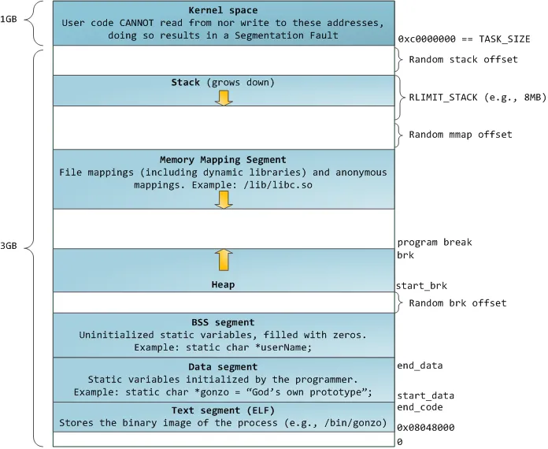

# 进程的内存布局

对于 32 位 X86 架构上运行的 Linux 而言， 其虚拟地址空间的寻址范围从 0 ~ 4G，内核将这块空间划分为两个部分，将最高的 1G 字节 0xC0000000 ~ 0xFFFFFFFF 称为“内核空间”， 提供给内核使用。而将较低 3G 字节 0x00000000 ~ 0xBFFFFFFF 称为“用户空间”，即提供给各个运行的进程使用。

另外，用户进程也是无法访问 0x00000000 ~ 0x08048000 这一段虚拟内存地址的，在这段地址上有诸多例如 C 库，动态加载器如 ld.so 和 VDSO 等的映射地址。 如果用户进程访问到该区间会返回段错误。

## 栈

用户空间中最顶部的段叫做栈，他被用于存放函数参数和动态局部变量。调用一个方法或函数会将一个新的栈帧(stack frame)压入到栈中，这个栈帧会在函数返回时被清理掉。X86 系统进程中栈都向下增长的。

## mmap

在栈段的低一段便是 mmap(内存映射)段，mmap 是一种高效便捷的文件 I/O 方式，内核将文件内容映射在此段内存中，常见情形便是加载动态链接库。任何应用程序都可以通过 Linux 的 mmap() 系统调用请求这种映射。另外，在 Linux 中，如果通过 malloc 申请一块大于 MMAP_THRESHOLD(通常默认为 128KB， 可用 mallopt()修改)大小的堆空间时， glibc 会返回一块匿名的 mmap 内存块而非一块堆内存。

## 堆

在 mmap 段下面便是堆段了，堆段同栈段一样，都是为进程运行提供动态的内存分配，但是其和栈的区别在于堆上分配的内存只有在对应进程通过系统调用主动释放或进程结束后才会释放。

## BSS 段和数据段

堆段再往下便是 BSS 段和 数据(DATA)段这两个静态内存区域，这两段都是用来存储静态局部或静态全局变量，其在编译期间便确定了大小。区别是 DATA 段存放的是已经初始化的变量, 而 BSS 段则存放的是未初始化的变量。

比如：`static int a;`, a 的内容就会保存在 BSS 中。`static int b = 1;`，b 的内容就保存在 DATA 中。

## TEXT

BSS 和 DATA 段下是代码段(TEXT)，这段中存有程序的指令代码。Text 段是通过只读的方式加载到内存中的，它在多个进程中是可以被安全共享的。
