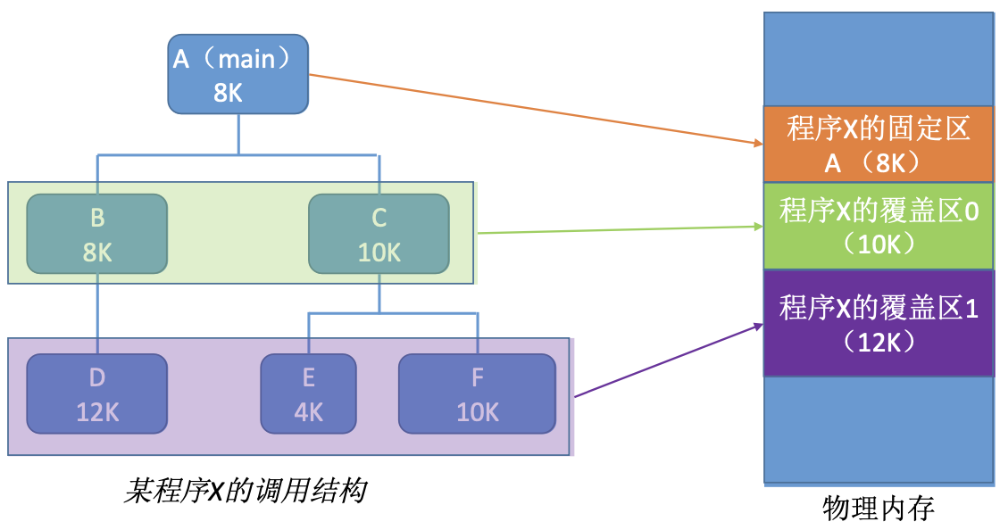

# 内存覆盖与交换

早期的计算机内存很小，因此经常会出现内存大小不够的情况。所以引入了覆盖技术，用来解决程序大小超过物理内存总和的问题。

覆盖技术将程序分为多个段(多个模块)。常用的段常驻内存，不常用的段在需要时调入内存。内存中分为一个“固定区”和若干个“覆盖区”。需要常驻内存的段放在“固定区”中，调入后就不再调出(直到运行结束)。不常用的段放在“覆盖区”，需要用到时调入内存，用不到时调出内存。

这种模式必须由程序员声明覆盖结构，操作系统才能完成自动覆盖。缺点:对用户不透明，增加了用户编程负担。

覆盖技术只用于早期的操作系统中，现在已成为历史。

## 交换技术

交换(对换)技术的设计思想:内存空间紧张时，系统将内存中某些进程暂时换出外存，把外存中某些已具备运行条件的进程换入内存(进程在内存与磁盘之间动态调度)。注意: PCB 会常驻内存，不会被换出外存。

暂时换出外存等待的进程状态为挂起状态(suspend), 挂起态又可以进一步细分为就绪挂起、阻塞挂起两种状态。

具有对换功能的操作系统中，通常把磁盘空间分为文件区和对换区两部分。文件区主要用于存放文件，主要追求存储空间的利用率，因此对文件区空间的管理采用离散分配方式。对换区空间只占磁盘空间的小部分，被换出的进程数据就存放在对换区。由于对换的速度直接影响到系统的整体速度，因此对换区空间的管理主要追求换入换出速度，因此通常对换区采用连续分配方式。总之，对换区的 I/O 速度比文件区的更快。

交换通常在许多进程运行且内存吃紧时进行，而系统负荷降低就暂停。例如在发现许多进程运行时经常发生缺页，就说明内存紧张，此时可以换出一些进程。如果缺页率明显下降，就可以暂停换出。
