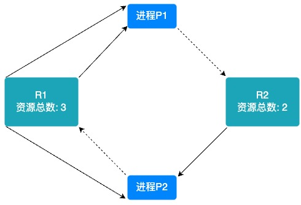
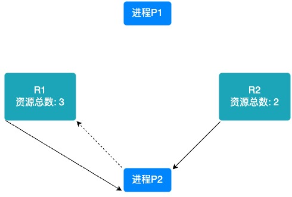

# 死锁

死锁（Deadlock）指的是两个或多个进程在执行过程中，因争夺资源而造成的一种僵局。在这种僵局中，每个进程都持有一定的资源并等待其他进程释放它们所需的资源，若无外力作用，这些进程都将无法继续向前推进。

## 死锁产生的必要条件

死锁具有以下四个基本特征，通常被称为死锁的四个必要条件：

1. **互斥条件**（Mutual Exclusion）：进程对所分配到的资源进行排他性使用，即在一段时间内某资源只能被一个进程占用
2. **占有和等待条件**（Hold and Wait）：进程至少持有一个资源，并且在等待获取其他进程持有的资源
3. **不可剥夺条件**（No Preemption）：已经分配给一个进程的资源，在未使用完之前，不能被强行剥夺，只能由该进程自己释放
4. **循环等待条件**（Circular Wait）：存在一种进程资源的循环等待关系，即进程间形成一种头尾相接的循环链，每个资源至少被链条上的下一个进程所等待

## 死锁的预防

通过破坏死锁的四个必要条件之一来预防死锁的发生。

### 破坏互斥条件

如果把只能互斥使用的资源改造为允许共享使用，则系统不会进入死锁状态。

缺点: 并不是所有的资源都可以改造成可共享使用的资源。并且为了系统安全，很多地方还必须保护这种互斥性。因此，很多时候都无法破坏互斥条件。

### 破坏占有和等待条件

可以采用静态分配方法，即进程在运行前一次申请完它所需要的全部资源，在它的资源未满足前，不让它投入运行。一旦投入运行后，这些资源就一直归它所有，该进程就不会再请求别的任何资源了。

缺点: 有些资源可能只需要用很短的时间，因此如果进程的整个运行期间都一直保持着所有资源，就会造成严重的资源浪费，资源利用率极低。另外，该策略也有可能导致某些进程饥饿。

### 破坏不可剥夺条件

1. 方案 1: 当某个进程请求新的资源得不到满足时，它必须立即释放持有的所有资源，待以后需要时再重新申请。也就是说，即使某些已有的资源尚未使用完，也需要主动释放，从而破坏了不可剥夺条件
2. 方案 2: 当某个进程需要的资源被其他进程所占有的时候，可以由操作系统协助，将想要的资源强行剥夺。这种方式一般需要考虑各进程的优先级

缺点:

1. 实现起来比较复杂
2. 释放已获得的资源可能造成前一阶段工作的失效。因此这种方法一般只适用于易保存和恢复状态的资源，如 CPU
3. 反复地申请和释放资源会增加系统开销，降低系统吞吐量
4. 若采用方案 1，意味着只要暂时得不到某个资源，之前获得的那些资源就都需要放弃，以后再重 新申请。如果一直发生这样的情况，就会导致进程饥饿

### 破坏循环等待条件

可采用顺序资源分配法。首先给系统中的资源编号，规定每个进程必须按编号递增的顺序请求资源，同类资源一次申请完。一个进程只有已占有小编号的资源时，才有资格申请更大编号的资源。按此规则，已持有大编号资源的进程不可能逆向地回来申请小编号的资源，从而就不会产生循环等待的现象。

缺点:

1. 不方便增加新的设备，因为可能需要重新分配所有的编号
2. 进程实际使用资源的顺序可能和编号递增顺序不一致，会导致资源浪费
3. 必须按规定次序申请资源，用户编程麻烦

## 银行家算法

安全序列: 所谓安全序列，就是指如果系统按照这种序列分配资源，则每个进程都能顺利完成。

只要能找出一个安全序列，系统就是安全状态。安全序列可能有多个。如果分配了资源之后，系统中找不出任何一个安全序列，系统就进入了不安全状态。这就意味着之后可能所有进程都无法顺利的执行下去。当然，如果有进程提前归还了一些资源，那系统也有可能重新回到安全状态，不过我们在分配资源之前总是要考虑到最坏的情况。

如果系统处于安全状态，就一定不会发生死锁。如果系统进入不安全状态，就可能发生死锁。因此可以在资源分配之前预先判断这次分配是否会导致系统进入不安全状态，以此决定是否答应资源分配请求。这也是“银行家算法”的核心思想。

银行家算法的设计灵感来源于银行处理贷款申请的方式。银行在批准贷款前会评估申请人的财务状况，确保贷款后银行的资金安全。类似地，银行家算法在分配资源前评估系统的资源分配状态，以确保系统的安全状态。

银行家算法中, 进程需要包含 3 个属性：

1. 进程需求资源的最大数量 Max
2. 已分配给该进程的资源数量 Allocation
3. 还需要申请的资源数量 Need, Need = Max - Allocation

操作系统需要维护 1 个属性:

1. Available: 空闲的资源数量，即资源池

假设进程 P1 申请资源，操作系统先检查当前资源池中的资源数量够不够，若 P1 申请的资源数量小于等于 Available，就会接着判断分配给 P1 后, 剩余的资源能不能使进程队列的某个进程执行完毕，若剩余的资源不够任何一个进程执行完毕，则系统处于不安全状态（即此时没有一个进程能够完成并释放资源，随时间推移，系统终将处于死锁状态）。

若存在可以执行完毕的进程 P2 (可能不止 1 个, 以 1 个为例)，那么操作系统会假设回收已分配给 P2 的资源，把 P2 进程标记为可完成，并继续判断队列中的其它进程，如果所有进程都能执行完毕，则系统处于安全状态，并根据可完成进程的分配顺序生成安全序列（如{P0，P3，P2，P1}表示将申请后的剩余资源 Work 先分配给 P0–>回收（Work+已分配给 P0 的 A0=Work）–>分配给 P3–>回收（Work+A3=Work）–>分配给 P2–>······满足所有进程）。

如此就可避免系统存在潜在死锁的风险。

## 检测死锁

通过化简资源分配图检测:

1. 先看系统还剩下多少资源没分配，再看有哪些进程是不阻塞的（系统有足够的空闲资源分配给它）
2. 把不阻塞的进程的所有边都去掉，形成一个孤立的点，再把系统分配给这个进程的资源回收回来
3. 看剩下的进程有哪些是不阻塞的，然后又把它们逐个变成孤立的点
4. 最后，所有的资源和进程都变成孤立的点。这样的图就叫做“可完全简化”

如果一个图可完全简化，则不会产生死锁；如果一个图不可完全简化（图中还有“边”存在），则会产生死锁。

下图, 实线表示已分配给进程的资源, 虚线表示进程正在申请的资源。

1. 先看 R1 资源，它一共给进程分配了 3 个资源，此时，R1 没有空闲的资源剩余
2. 再看 R2 资源，它一共给进程分配了 1 个资源，此时，R2 还剩余一个空闲的资源没分配
3. 看完资源，再来看进程，先看进程 P2，它只申请一个 R1 资源，但此时 R1 资源已经用光了，所以，进程 P2 进入阻塞状态，因此，进程 P2 暂时不能化简成孤立的点
4. 再看进程 P1，它只申请一个 R2 资源，此时，系统还剩余一个 R2 资源没分配，因此，可以满足 P1 的申请。这样，进程 P1 便得到了它的全部所需资源，所以它不会进入阻塞状态，可以一直运行，等它运行完后，我们再把它的所有的资源释放。
5. 进程 P1 运行完后，释放其所占有的资源，把 P1 的所有的边去掉，变成一个孤立的点

6. 系统回收这些资源后，空闲的资源便变成 2 个 R1 资源和 1 个 R2 资源，由于进程 P2 一直在申请一个 R1 资源，所以此时，系统能满足它的申请。这样，进程 P2 便得到了它的全部所需资源，所以它不会进入阻塞状态，可以一直运行，等它运行完后，再把它的所有的资源释放。
7. 把 P2 的所有的边都去掉，化成一个孤立的点

8. 由于这个资源分配图可完全简化，因此，不会产生死锁

## 解除死锁

一旦检测出死锁的发生，就应该立即解除死锁。用死锁检测算法化简资源分配图后，还连着边的那些进程就是死锁进程。

解除死锁的主要方法：

1. 资源剥夺法: 挂起某些死锁进程，并抢占它的资源，将这些资源分配给其他的死锁进程。但是应防止被挂起的进程长时间得不到资源而饥饿
2. 撤销进程法(或称终止进程法): 强制撤销部分、甚至全部死锁进程，并剥夺这些进程的资源。这种方式的优点是实现简单，但所付出的代价可能会很大。因为有些进程可能已经运行了很长时间，已经接近结束了，一旦被终止后还得从头再来
3. 进程回退法: 让一个或多个死锁进程回退到足以避免死锁的地步。这就要求系统要记录进程的历史信息，设置还原点
