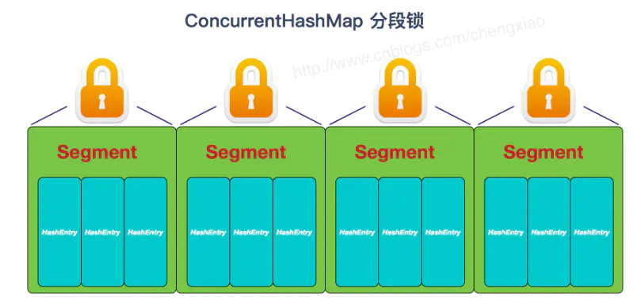
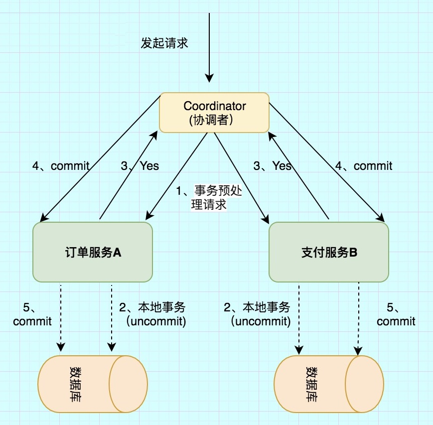
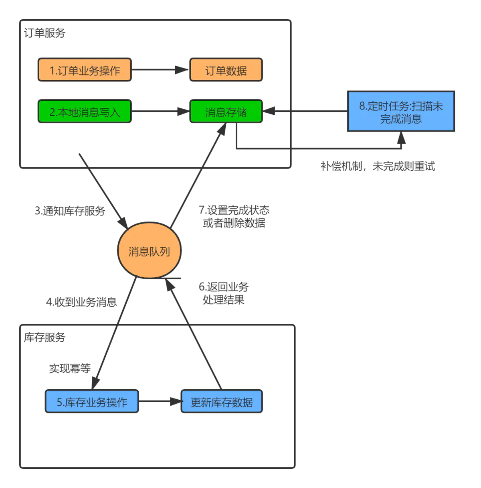

# 红黑树和AVL树对比

- 红黑树只保证黑色节点是绝对平衡的，算上红色节点的话平衡因子（节点左右子树的高度差）可能大于1
- 红黑树添加和删除占优势，红黑树只要求部分地达到平衡要求，降低了对旋转的要求，从而提高了性能
- AVL树查询占优势
- 红黑树增删改查综合性能更好

# 快速排序

选中第一个元素v，调整数组使得左边的元素小于v，中间的元素等于v，右边的元素大于v，使v所在的中间部分将原数组在逻辑上分割为左右两个子数组，
不断重复这个操作，直到分割后的所有子数组长度都等于4，此时排序已经完成

## 调整步骤

- 随机取数组中的一个元素作为V，把V和第一个元素交换，使V成为数组第一个元素
- j指向数组第一个元素V
- k指向数组最后的元素
- i指向数组第二个元素
- 从i开始遍历整个数组
- 把i指向的元素和V比较，如果大于V，就把i指向的元素和k指向的元素交换，i不变，k--
- 如果小于V，就把i指向的元素和j+1指向的元素交换，i++，j++
- 如果等于V，i++
- 以此类推，直到i和k相等。最后把V和j指向的元素交换
- 此时：`[left,j-1]<V`，
- `[k+1,right]>V`，
- `[j,k]==V`

# CAS

CAS操作包含三个操作数：内存位置（V）、预期原值（A）和新值(B)。 如果内存位置的值与预期原值相匹配，那么将该位置的值更新为新值。否则，说明已经有其他线程做了更改，不做任何操作。最后，CAS返回当前内存位置的值。

## ABA问题

一个线程将数值A改成了B，接着又改成了A，此时CAS认为是没有变化，其实是已经变化过了，这种过程就叫ABA问题。

解决ABA问题：使用版本号，每操作一次版本号就加一。

# ConcurrentHashMap

## JDK1.7及以前

ConcurrentHashMap由Segment数组组成，每个Segment又包含一个HashEntry数组，数组中的每一个HashEntry既是一个键值对，也是一个链表的头节点。

ConcurrentHashMap定位一个元素的过程需要进行两次Hash操作。第一次Hash定位到Segment，第二次Hash定位到元素所在的链表的头部。

ConcurrentHashMap使用分段锁技术，将数据分成一段一段的存储（Segment数组），然后给每一段数据配一把锁（ReentrantLock），当一个线程占用锁访问其中一个段的时候，其他段的数据也能被其他线程访问，在保证线程安全的同时降低了锁的粒度，让并发操作效率更高。



## JDK1.8

去除Segment+HashEntry的实现，改为Synchronized+CAS+Node数组的实现。用Synchronized+CAS代替Segment，这样锁的粒度更小了，并且不是每次都要加锁，只有CAS尝试失败了再加锁。

# synchronized锁升级的原理

在对象的对象头里有一个ThreadId字段，在第一次被线程访问的时候ThreadId为空，jvm让其持有偏向锁，并将ThreadId设置为访问的线程id。之后有线程再次访问的时候会先判断ThreadId是否与这个线程id一致，如果一致则可以直接使用此对象。如果不一致则升级偏向锁为轻量级锁，访问的线程通过自旋一定次数来获取锁。当一定时间内通过自旋的方式无法获取到锁，或者一个线程在持有锁，一个在自旋，又有第三个来访时，就会把锁升级为重量级锁，此时等待锁的线程都会进入阻塞状态。

锁的升级的目的：为了降低锁带来的性能消耗。

# 同一个对象的两个方法加synchronized，一个线程访问其中一个方法，另一个线程可以进入另一个方法吗？

不能

- synchronized作用于成员变量和非静态方法时，锁住的是对象的实例，即this对象。
- synchronized作用于静态方法时，锁住的是Class实例，因为静态方法属于Class而不属于对象。
- synchronized作用于一个代码块时，锁住的是所有代码块中配置的对象。

# 线程池核心参数

1. 最大线程数maximumPoolSize
2. 核心线程数corePoolSize
3. 空闲线程存活时间keepAliveTime
4. 阻塞队列workQueue
5. 拒绝策略RejectedExecutionHandler

# 线程池原理

1. 当我们提交任务，线程池会根据corePoolSize大小创建若干任务数量线程执行任务
2. 当任务的数量超过corePoolSize数量，后续的任务将会进入阻塞队列阻塞排队
3. 当阻塞队列也满了之后，那么将会继续创建maximumPoolSize-corePoolSize个数量的线程来执行任务，如果任务处理完成，maximumPoolSize-corePoolSize额外创建的线程等待keepAliveTime之后被自动销毁
4. 如果达到maximumPoolSize，阻塞队列还是满的状态，那么将根据不同的拒绝策略对应处理

# 说一下你熟悉的设计模式？

- 单例模式：保证被创建一次，节省系统开销。
- 工厂模式：解耦代码。
- 观察者模式：定义了对象之间的一对多的依赖，当一个对象改变时，它的所有的依赖者都会收到通知并自动更新。
- 外观模式：提供一个统一的接口，用来访问子系统中的一群接口，让子系统更容易使用。
- 模版方法模式：定义了一个算法的骨架，而将一些步骤延迟到子类中，模版方法使得子类可以在不改变算法结构的情况下，重新定义算法的步骤。应用：Servlet。

# Spring中的事务传播行为

- Propagation.REQUIRED（默认）: 如果当前存在事务，则加入该事务，如果当前不存在事务，则创建一个新的事务。
- Propagation.SUPPORTS: 如果当前存在事务，则加入该事务；如果当前不存在事务，则以非事务的方式继续运行。
- Propagation.MANDATORY: 如果当前存在事务，则加入该事务；如果当前不存在事务，则抛出异常。
- Propagation.REQUIRES_NEW: 重新创建一个新的事务，如果当前存在事务，挂起当前的事务。外层事务不会影响内部事务的提交/回滚，内部事务的异常，会影响外部事务的回滚
- Propagation.NOT_SUPPORTED: 以非事务的方式运行，如果当前存在事务，暂停当前的事务。
- Propagation.NEVER: 以非事务的方式运行，如果当前存在事务，则抛出异常。
- Propagation.NESTED: 如果没有，就新建一个事务；如果有，就在当前事务中嵌套其他事务。

# SpringBoot自动配置原理

启动类中有@SpringBootApplication注解，@SpringBootApplication注解中有@EnableAutoConfiguration注解，@EnableAutoConfiguration注解中有@Import(AutoConfigurationImportSelector.class)注解。

AutoConfigurationImportSelector会扫描所有具有META-INF/spring.factories文件的jar包，加载factories文件中的配置类。过滤掉重复的配置类和在@SpringBootApplication(exclude = {})中手动排除的配置类。在剩下的配置类中实例化@ConditionalXXX注解为true的bean。

@ConditionalXXX注解（如：@ConditionalOnMissingBean：当容器里不存在指定Bean的条件下）可以组合使用。

spring-boot-autoconfigure-版本号.jar中的spring.factories文件指定了redis、mq等springboot内置的配置类。

# bean的生命周期

1. 实例化一个Bean，也就是new一个对象
2. 设置bean的属性，依赖注入
3. 如果这个Bean实现了BeanNameAware接口，会调用它实现的setBeanName()方法，传入Bean的ID
4. 如果这个Bean实现了BeanFactoryAware接口，会调用它实现的setBeanFactory()，传入Spring工厂（可以用这个工厂获取到其他Bean）
5. 如果这个Bean实现了ApplicationContextAware接口，会调用setApplicationContext()方法，传入Spring上下文，ApplicationContext是BeanFactory的子接口，有更多的实现方法
6. 如果设置了后置处理器（通过实现BeanPostProcessor接口并注入到spring中），将会调用postProcessBeforeInitialization()方法，进行一些自定义的处理
7. 如果这个Bean在Spring配置文件中配置了init-method属性会自动调用其配置的初始化方法
8. 如果设置了后置处理器，将会调用postProcessAfterInitialzation()方法，进行一些自定义的处理
9. 以上工作完成以后就可以用这个Bean了
10. 当Bean不再需要时，会经过清理阶段，如果Bean实现了DisposableBean接口，会调用其实现的destroy方法
11. 最后，如果这个Bean的Spring配置中配置了destroy-method属性，会自动调用其配置的销毁方法

# RabbitMQ的使用场景有哪些

- 削峰，在访问量剧增的情况下，防止系统崩塌。
- 延迟消息，把消息发送给MQ，MQ并不立即处理。
- 解耦系统，对于新增的功能可以单独写模块扩展，只需要订阅对应的消息队列即可。

# 消息可靠性投递

## 消息落库方案

1. 业务数据和消息数据入库（此时消息状态为未成功0）后向MQ发送消息。
3. MQ收到消息后，发送确认消息Ack。
4. 生产者接收到服务器发送的确认消息 Ack，修改数据库中消息的状态为成功（1）。
5. 定时任务查询数据库中消息状态为未成功（0）的数据并重新发送。当重新发送的次数，大于一定的值时，修改该条消息状态为发送失败（2）。

## 延迟投递方案

1. 生产者将业务数据入库并向MQ发送消息。
3. 生产者在发送消息的指定时间后发送延迟消息。
4. 消费者对消息进行消费后，向MQ发送确认消息。
6. Callback服务监听消费者发送的确认消息，如果收到消息则对消息状态做投递成功的记录。
7. Callback服务收到生产者的延迟消息后去检查第六步中的记录，如果没有记录，则通知上游服务再次发送消息。
8. 这种方案不一定能保障百分百投递成功，主要目的是为了减少数据库操作，提高并发量。

# MQ消息积压怎么处理

1. 临时紧急扩容：临时将queue资源和consumer资源扩大10倍，以正常速度的10倍来消费消息。新增原先数量10倍的queue，将现有consumer都停掉，用一个临时分发消息的consumer，消费之后不做耗时处理，直接均匀轮询写入临时建好分10倍数量的queue里面。等快速消费完了之后，恢复原来的部署架构，重新用原来的consumer机器来消费消息。
2. 将临时的consumer连接到mq里面消费数据，收到消息之后直接将其丢弃，快速消费掉积压的消息，降低MQ的压力，然后找时间去手动查询重导丢失的这部分数据。

# 说InnoDB与MyISAM的区别

1. InnoDB支持事务，MyISAM不支持。InnoDB每一条SQL语言都默认封装成事务，自动提交，会影响速度。
2. InnoDB支持外键，MyISAM不支持。
3. InnoDB是聚集索引，数据文件是和索引绑在一起的，必须要有主键，通过主键索引效率很高。但是普通索引需要两次查询，先查询到主键，然后再通过主键查询到数据。MyISAM是非聚集索引，数据文件是分离的，索引保存的是数据文件的指针。主键索引和普通索引是独立的。
4. InnoDB不保存表的具体行数，执行select count(*) from table时需要全表扫描。而MyISAM用一个变量保存了整个表的行数，执行上述语句时只需要读出该变量即可，速度很快。
5. Innodb不支持全文索引，而MyISAM支持全文索引，查询效率上MyISAM要高。

# 数据库的事务隔离级别

- READ_UNCOMMITTED：未提交读，事务未提交前，就可被其他事务读取（会出现幻读、脏读、不可重复读）。
- READ_COMMITTED：已提交读，在事务中，可以读到其他事务提交的数据（会造成幻读、不可重复读）。
- REPEATABLE_READ（MySQL默认）：可重复读，进入事务时，相当于做了一个快照，在事务中，不能读取到别的事务提交的数据（会造成幻读）。
- SERIALIZABLE：序列化，事务串行执行。代价最高最可靠的隔离级别，该隔离级别能防止脏读、不可重复读、幻读。

# SQL优化

1. 查询语句中不要使用select *
2. 尽量减少子查询，使用关联查询（left join,right join,inner join）替代
3. 减少使用IN或者NOT IN ,使用exists，not exists或者关联查询语句替代
4. or的查询尽量用union或者union all代替
5. 应尽量避免在where子句中使用!=或<>操作符，否则将引擎放弃使用索引而进行全表扫描。
6. 应尽量避免在where子句中对字段进行null值判断，否则将导致引擎放弃使用索引而进行全表扫描，如：select id from t where num is null 可以在num上设置默认值0，确保表中num列没有null值，然后这样查询：select id from t where num=0

# union和union all的区别

- Union：对两个结果集进行并集操作，不包括重复行，同时进行默认规则的排序
- Union All：对两个结果集进行并集操作，包括重复行，不进行排序
- select id,name from student where id<4 union select id,name from student where id>2 and id<6

# truncate和delete的区别

- delete可以条件删除数据，而truncate只能删除表的所有数据
- delete效率低于truncate。delete是一行一行地删除，truncate会重建表结构
- truncate是DDL语句，不能够回滚，delete是DML语句，可以使用rollback回滚

# MySQL索引失效的情况

1. like查询以%开头，如，like '%abc%'。解决：左面不加%，如，like 'abc%'。
2. or条件中用到了没加索引的字段。解决：要想使用or，又想让索引生效，只能将or条件中的每个列都加上索引。
3. 字符串条件没有使用引号，如，name=abc。解决：name='abc'。
4. 索引字段没有添加 not null 约束。
5. 索引字段作为函数的参数或是表达式的一部分，如，substring(name,1,3)='luc'，salary+1000=6000。

# Redis持久化有几种方式

## RDB（Redis Database）

用指定的时间间隔对数据进行快照存储。

- 优点：因为是数据快照，所以生成的文件内容紧凑占用磁盘空间小，重启恢复到内存速度也较快，持久化的频率一般也会配置得比较低，并且执行过程交给子进程，对服务性能影响小。
- 缺点：文件大。数据安全性低，RDB是间隔一段时间进行持久化，如果持久化之间Redis发生故障，会发生数据丢失。所以这种方式更适合数据要求不严谨的时候

## AOF（Append Only File）

每一个收到的写命令都追加到文件中。

- 优点：因为追加写指令执行的频率高、间隔短，所以间隔期内进程停止丢失的数据较少，数据比较完整。
- 缺点：AOF文件比RDB文件大，且恢复速度慢。数据集大的时候，比RDB启动效率低。

# Redis数据类型

string（字符串）、list（列表）、hash（字典）、set（集合）、zset（有序集合）。

# Redis缓存穿透缓存击穿缓存雪崩

- 缓存穿透: 用户不断请求缓存和数据库中都没有的数据，导致数据库压力过大。解决方案: 将数据库中没有取到的key缓存为null
- 缓存击穿: 用户大量请求缓存中没有但数据库中有的数据（一般是缓存时间到期），导致数据库压力过大。解决方案: 1、直接将缓存设置为不过期，然后由定时任务去异步加载数据，更新缓存。2、加互斥锁。在并发的多个请求中，只有第一个请求线程能拿到锁并执行数据库查询操作，等到第一个线程将数据写入缓存后，其他的线程直接走缓存。
- 缓存雪崩: 缓存中不同的数据大批过期，导致数据库压力过大。解决方案: 1、过期时间设置随机。2、设置热点数据永远不过期。

# Redis清除过期Key的方式

- 惰性检查删除：当访问一个key的时候，才会判断该key是否过期，如果过期就删除。该方式能最大限度节省 CPU 的资源。但是会占用较多的内存。
- 定期检查删除：每隔一段时间，就对部分key进行检查，删除里面过期的key。可以通过限制删除操作执行的时长和频率来减少删除操作对CPU的影响。定期删除也能有效释放过期key占用的内存，但是难以确定删除操作执行的时长和频率。可以通过修改配置文件redis.conf的hz选项来调整这个次数。

Redis的过期删除策略是：惰性删除和定期删除两种策略配合使用。

# Redis内存淘汰机制

- no-eviction：当内存不足以容纳新写入数据时，新的写入操作会报错
- allkeys-lru：当内存不足以容纳新写入数据时，移除最近最少使用的key（这个是最常用的）
- allkeys-random：当内存不足以容纳新写入数据时，随机移除某个key
- volatile-lru：当内存不足以容纳新写入数据时，在设置了过期时间的key中，移除最近最少使用的key
- volatile-random：当内存不足以容纳新写入数据时，在设置了过期时间的key中，随机移除某个key
- volatile-ttl：当内存不足以容纳新写入数据时，在设置了过期时间的key中，有更早过期时间的key优先移除

# Redis为什么并发性能高

- redis是基于内存的，内存的读写速度非常快
- redis是单线程的，省去了切换线程的时间，不存在加锁释放锁操作
- 使用多路复用技术，非阻塞IO

# Redis实现分布式锁

## Lua脚本 + SETNX + EXPIRE

SETNX key value：只在key不存在的情况下，才将键key的值设置为value。如果 key不存在，则SETNX成功返回1，如果这个key已经存在了，则返回0。

Redis采用同一个Lua解释器去运行所有命令，所以Lua脚本的执行是原子性的。可以避免执行完setnx加锁，还没执行expire设置过期时间时，进程终止了，导致这个锁就不会被释放的问题。

lock_value是uuid，释放锁时要判断lock_value是否为当前线程设置的uuid值，避免锁过期释放了，业务还没执行完，删了别的线程的锁

## SET指令扩展参数

```
SET key value[EX seconds][PX milliseconds][NX|XX]
```

- NX：key不存在的时候，才能set成功
- XX：key存在的时候，才能set成功
- EX seconds：设定key的过期时间，时间单位是秒。
- PX milliseconds：设定key的过期时间，单位为毫秒

# 分布式事务

## 两阶段提交（2PC）

引入一个事务协调者来协调管理各参与者的提交和回滚，分为准备和提交两个阶段。

准备阶段协调者会给各参与者发送准备命令，等待所有参与者都返回准备成功之后就进入提交阶段。

协调者向所有参与者发送提交事务命令，然后等待所有事务都提交成功之后，返回事务执行成功。

假如在第一阶段参与者返回失败，那么协调者就会向所有参与者发送回滚事务的请求，即分布式事务执行失败。

假如在第二阶段参与者返回失败，那么协调者就会不断重试，直到所有参与者都成功，否则会一直阻塞。



存在的问题

- 所有事务参与者在等待其它参与者响应的时候都处于同步阻塞状态，无法进行其它操作。
- 协调者发生故障将会造成很大影响。特别是在阶段二发生故障，所有参与者会一直等待状态，无法完成其它操作。
- 在阶段二，如果协调者只发送了部分 Commit 消息，此时网络发生异常，那么只有部分参与者接收到 Commit 消息，提交了事务，使得系统数据不一致。
- 任意一个节点失败就会导致整个事务失败，没有完善的容错机制。

## 本地消息表

- A完成入库操作后同时往一张消息表中插入一条消息，状态为“发送中”，这两个入库操作要在一个事务里面，这里保证了本地事务的强一致性。
- 之后A将本地消息表中的消息发到MQ中，B消费这个消息，并将自己的数据入库，然后发送确认消息到MQ。
- A收到确认消息后将本地消息表的消息状态改为“已发送”，此时分布式事务完成。
- 设置一个定时任务检查本地消息表，重发状态为“发送中”的消息。



一种非常经典的实现，实现了最终一致性。

# 静态代码块什么时候执行

在类的初始化阶段执行。

当一个类被主动使用时，Java虚拟就会对其初始化：

- 当创建某个类的新实例时（如通过new或者反射，克隆，反序列化等）
- 当调用某个类的静态方法时
- 当使用某个类或接口的静态字段时

# deamon线程

在Java中有两类线程：用户线程 (User Thread)、守护线程 (Daemon Thread)。 

守护线程，是指在程序运行的时候在后台提供一种通用服务的线程，比如垃圾回收线程就是一个守护线程。如果用户线程全部退出运行，程序就会终止了，同时会杀死进程中的所有守护线程。

将线程转换为守护线程可以通过调用Thread对象的setDaemon(true)方法来实现，必须在thread.start()之前设置。

# main线程异常不捕获导致终止，JVM会退出吗？

- JVM在全部的非守护线程（用户线程）执行完毕后才会退出
- main其实也是一个普通的用户线程，只不过一些其余的线程都是由main启动的
- main线程终止，不能决定JVM是否退出。
- 若想在main线程退出后，全部其余线程也退出，那么可以把其余线程都设置为守护线程

# 实现线程同步

通过阻塞队列ArrayBlockingQueue实现

BlockingQueue的put()方法和take()方法在返回前都会阻塞当前线程

```java
// 容量为3的队列
ArrayBlockingQueue queue = new ArrayBlockingQueue<Integer>(3);
// 线程1
public void t1() {
   int i = 0;
   while (true) {
      // 队列满了会被阻塞
      queue.put(i++);
   }
}
// 线程2
public void t2() {
   while (true) {
      // 队列空了会被阻塞
      int num = (int) queue.take();
   }
}
```

# Java程序占用CPU过高怎么排查

- 使用 top 命令找到占用CPU最高的Java进程pid。如：占用CPU最高的进程pid为13731。
- 用 top -Hp pid 命令查看占用CPU最高的线程id。top -Hp 13731，看到占用CPU最高的那个线程id为13756
- 然后将线程id转换为16进制。13756 -> 0x35bc
- 使用 jstack pid 查看当前Java程序的所有线程信息。jstack 13731 > thread_stack.log
- jstack命令生成的信息包含了JVM中所有存活的线程及其所在的java文件，在输出结果中每个线程都有一个nid（16进制），使用之前得到的16进制找到对应的nid即可
