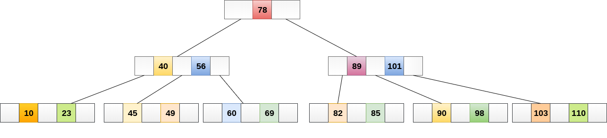
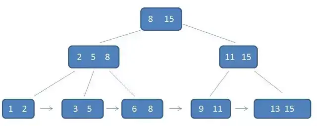
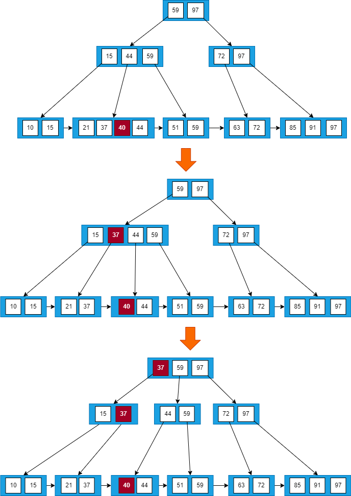
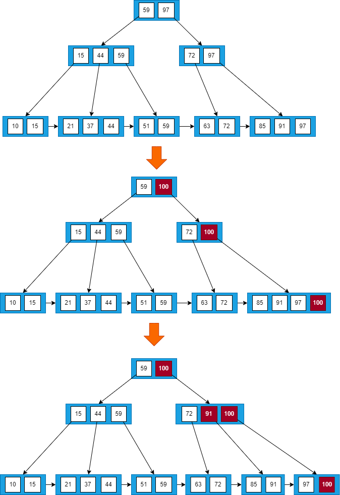

# 接口幂等性

接口任意多次调用所产生的影响均与一次调用的影响相同。

实现接口幂等性

1. 防重Token: 调用方在调用接口的时候先向后端请求一个全局ID，请求的时候携带这个全局 ID一起请求，后端用这个ID到Redis中进行校验，如果存在就删除这个ID；如果不存在就是重复执行。
2. 调用方传递唯一ID: 每次向服务端请求时候附带一个短时间内唯一的ID，当服务器收到请求信息后拿该 ID到Redis中查询是否存在，如果存在就是重复执行；如果不存在就把这个ID存储到Redis中。
3. 数据库乐观锁: 在对应的数据表中多添加一个字段，充当当前数据的版本标识。每次调用都会传递版本号，并将该版本标识作为where条件，如果重复执行SQL语句，会因为版本不一致而不生效。

# JWT令牌结构

一个JWT由三部分组成，各部分以`.`分割：
- Header（头部）: base64编码的Json字符串，Header通常由两部分组成：令牌的类型，即JWT，以及使用的签名算法，例如HMAC SHA256或RSA。
- Payload（载荷） : base64编码的Json字符串，payload由声明（ claims）组成。声明就是保存的数据。
- Signature（签名）: 使用指定算法对Header和Payload加盐计算得到的字符串，保证token在传输的过程中没有被篡改或者损坏。

# JWT工作原理

客户端将用户名和密码传给服务端进行登陆，服务端核对成功后将用户信息作为jwt的payload生成jwt字符串，后端将这段字符串作为登陆成功的返回结果返回给前端。前端将其保存，退出登录时，删除JWT字符串就可以。

每次请求，前端都会把JWT作为请求头传给后端进行检查。

# try中有return时finally还会执行吗

try中有return, 会先将值暂存，无论finally语句中对该值做什么处理，最终返回的都是try语句中的暂存值。当try与finally语句中均有return语句，会忽略try中的return。

#  == 和 equals 的区别是什么

`==`对基本类型是值比较，对引用类型是引用比较。equals默认继承Object类使用`==`比较，但是可以重写。

# StringBuffer 和 StringBuilder 区别

StringBuffer 是线程安全的，而 StringBuilder 是非线程安全的，但 StringBuilder 的性能却高于 StringBuffer（因为stringbuffer加锁了），所以在单线程环境下推荐使用 StringBuilder，多线程环境下推荐使用 StringBuffer。

# String str="i"与 String str=new String("i")一样吗

不一样，因为内存的分配方式不一样。String str="i"的方式，Java 虚拟机会将其分配到常量池中（常量池保存在方法区中）；而 String str=new String("i") 则会被分到堆内存中。

# 如何将字符串反转？

使用 StringBuilder 或者 stringBuffer 的 reverse() 方法。

或者对撞指针
```java
String reverseString(String str) {
    char [] s = str.toCharArray();
    int l = 0;
    int r = s.length - 1;
    while (l < r) {
        swap(s, l++, r--);
    }
    return new String(s);
}
void swap(char[] arr, int i, int j){
    char t = arr[i];
    arr[i] = arr[j];
    arr[j] = t;
}
```

# HashMap 和 Hashtable 有什么区别？

- HashMap允许key和value为null，而Hashtable不允许。
- Hashtable是线程安全的，而HashMap是非线程安全的。
- Hashtable是保留类不建议使用。推荐使用HashMap和ConcurrentHashMap替代。

# ArrayList 和 Vector 的区别是什么？

- Vector使用了Synchronized实现线程同步，是线程安全的。而ArrayList是非线程安全的。
- ArrayList在性能方面要优于Vector。（因为Synchronized）
- Vector扩容每次会增加1倍，而ArrayList只会增加50%。

# 怎么确保一个集合不能被修改

可以使用`Collections.unmodifiableCollection(Collection c)`方法来创建一个只读集合，这样改变集合的任何操作都会抛出异常。

# 并行和并发有什么区别

- 并行：多个处理器或多核处理器同时处理多个任务。
- 并发：多个任务在同一个 CPU 核上，按细分的时间片轮流执行，从逻辑上来看那些任务是同时执行。

# 创建线程有哪几种方式？

- 继承Thread重写run方法；
- 实现Runnable接口；
- 实现Callable接口。

# runnable 和 callable 有什么区别？

runnable没有返回值，callable可以拿到返回值和捕获异常

# sleep() 和 wait() 有什么区别？

- sleep()来自Thread。wait()来自Object。
- sleep()只让出了CPU，而并不会释放资源的同步锁。wait()会释放锁。
- sleep()时间到会自动恢复。wait()只能使用notify()或notifyAll()唤醒。

# notify()和 notifyAll()有什么区别？

notifyAll()会唤醒所有的线程，notify()只会唤醒一个线程，具体唤醒哪一个线程由虚拟机控制。

# synchronized 锁升级的原理

在上锁对象的对象头里有一个ThreadId字段，在第一次被线程访问的时候ThreadId为空，jvm让其持有偏向锁，并将ThreadId设置为访问的线程id。之后有线程再次访问的时候会先判断ThreadId是否与这个线程id一致，如果一致则可以直接使用此对象，如果不一致则升级偏向锁为轻量级锁。访问的线程通过自旋一定次数来获取锁，循环一定次数之后，如果还没有获取到要使用的对象，就会把锁升级为重量级锁。

锁的升级的目的：锁升级是为了降低锁带来的性能消耗。

- 偏向锁: 指一段同步代码一直被一个线程所访问，那么该线程会自动获取锁，降低获取锁的代价。
- 轻量级锁: 当锁是偏向锁的时候，被另外的线程所访问，偏向锁就会升级为轻量级锁，其他线程会通过自旋的形式尝试获取锁，不会阻塞，从而提高性能。
- 重量级锁: 因为使用自旋的方式非常消耗CPU，当一定时间内通过自旋的方式无法获取到锁，或者一个线程在持有锁，一个在自旋，又有第三个来访时，轻量级锁升级为重量级锁，此时等待锁的线程都会进入阻塞状态。
- 自旋: 循环等待，然后不断的判断锁是否能够被成功获取，直到获取到锁才会退出循环。

# 什么是死锁

当线程A持有独占锁a，并尝试去获取独占锁b的同时，线程B持有独占锁b，并尝试获取独占锁a的情况下，就会发生A、B两个线程由于互相持有对方需要的锁，而发生的阻塞现象，称为死锁。

# 怎么防止死锁

- 尽量使用ReentrantLock、ReentrantReadWriteLock，设置超时时间。
- 尽量使用`java.util.concurrent`中的并发类代替自己手写锁。
- 尽量降低锁的使用粒度，尽量不要几个功能用同一把锁。
- 尽量减少同步的代码块。

# ThreadLocal 是什么？有哪些使用场景？

ThreadLocal为每个使用该变量的线程提供独立的变量副本，所以每一个线程都可以独立地改变自己的副本，而不会影响其它线程所对应的副本。

ThreadLocal的经典使用场景是数据库连接和session管理等。

# 说一下 synchronized 底层实现原理？

synchronized底层是通过monitor对象的monitorenter和monitorexit指令实现的。在Java 6之前，monitor的实现是依靠操作系统内部的同步原语，需要进行用户态到内核态的切换，所以同步操作的性能很低。但在Java 6的时候，Java虚拟机提供了三种不同的monitor实现：偏向锁、轻量级锁和重量级锁，大大改进了性能。

# synchronized 和 volatile 的区别是什么？

- volatile修饰变量。synchronized修饰类、方法、代码段。
- volatile仅能实现变量的修改可见性，不能保证原子性。synchronized可以保证变量的修改可见性和原子性。
- volatile不会造成线程的阻塞。synchronized可能会造成线程的阻塞。

## 变量的修改可见性

Java 内存模型规定所有的共享变量都存储于主内存。每一个线程还存在自己的工作内存，保留了被线程使用的变量的副本。线程对变量的所有的操作都必须在工作内存中完成，而不能直接读写主内存中的变量。不同线程之间也不能直接访问对方工作内存中的变量，线程间变量的值的传递需要通过主内存中转来完成。所以可能会导致线程对共享变量的修改没有即时更新到主内存，从而使得线程在使用共享变量的值时，该值并不是最新的。

当一个线程进入synchronized代码块后，线程获取到锁，会清空工作内存，然后从主内存中拷贝共享变量的最新值到工作内存作为副本，执行代码，又将修改后的副本值刷新到主内存中，最后线程释放锁。除了synchronized外，其它锁也能保证变量的内存可见性。

使用volatile修饰共享变量后，当线程操作变量副本并写回主内存后，会通过CPU总线嗅探机制告知其他线程该变量副本已经失效，需要重新从主内存中读取。

# synchronized 和 lock 有什么区别？

- synchronized可以给类、方法、代码块加锁。而lock只能给代码块加锁。
- synchronized不需要手动获取锁和释放锁，发生异常会自动释放锁，不会造成死锁。而lock需要自己加锁和释放锁，如果没有释放锁就可能造成死锁。
- 通过lock可以知道有没有成功获取锁，而synchronized不能。

# 如何实现对象克隆？

- 实现Cloneable接口并重写Object类中的clone()方法。
- 实现Serializable接口，通过对象的序列化和反序列化实现克隆，可以实现真正的深度克隆。

# 深拷贝和浅拷贝区别是什么？

- 浅拷贝：当对象被复制时只复制它本身和其中包含的值类型的成员变量，而引用类型的成员对象并没有复制。
- 深拷贝：除了对象本身被复制外，对象所包含的所有成员变量也将复制。

# session 和 cookie 有什么区别？

- session存储在服务器端。cookie存储在浏览器端。
- cookie在浏览器存储，可以被伪造和修改。
- cookie有容量限制，每个站点下的cookie也有个数限制。
- session可以存储在Redis、数据库、应用程序中。而cookie只能存储在浏览器中。

# 说一下 session 的工作原理？

客户端完成登录后，服务器会创建对应的session，并把sessionId发送给客户端，客户端再存储到浏览器中。客户端每次访问服务器时，都会带着sessionId，服务器拿到sessionId之后，在内存找到与之对应的session。

# 如果客户端禁止 cookie， session 还能用吗？

可以用，sessionId不是只能存储在cookie中。

# 如何避免 SQL 注入？

- 使用PreparedStatement。
- 使用正则表达式过滤掉特殊字符。

# 什么是 XSS 攻击，如何避免？

跨站脚本攻击，攻击者往Web页面里插入恶意的脚本代码，当用户浏览该页面时，嵌入其中的脚本代码会被执行，从而达到恶意攻击用户的目的，如盗取用户 cookie、破坏页面结构、重定向到其他网站等。

预防XSS的核心是必须对输入的数据做过滤处理。

# 什么是 CSRF 攻击，如何避免？

跨站请求伪造，攻击者盗用了你的身份，以你的名义发送恶意请求。

防御手段：

- 验证请求来源地址；
- 关键操作添加验证码；
- 在请求添加token并验证。

# OSI 的七层模型都有哪些？

物理层、数据链路层、网络层、传输层、会话层、表示层、应用层。

# get 和 post 请求有哪些区别？

- get请求会被浏览器主动缓存，而post不会。
- get传递参数有大小限制，而post没有。
- get的参数会明文显示在url上，post不会。

# 如何实现跨域？

- 服务器端设置响应头中的`Access-Control-Allow-Origin`。
- 在Controller中使用`@CrossOrigin`注解。
- 使用jsonp。

# 说一下 JSONP 实现原理？

利用script标签的src属性可以访问不同源的特性，加载远程返回的JS函数来执行。

# 说一下你熟悉的设计模式？

- 单例模式：保证被创建一次，节省系统开销。
- 工厂模式：解耦代码。
- 观察者模式：定义了对象之间的一对多的依赖，当一个对象改变时，它的所有的依赖者都会收到通知并自动更新。
- 外观模式：提供一个统一的接口，用来访问子系统中的一群接口，外观定义了一个高层的接口，让子系统更容易使用。
- 模版方法模式：定义了一个算法的骨架，而将一些步骤延迟到子类中，模版方法使得子类可以在不改变算法结构的情况下，重新定义算法的步骤。

# 观察者模式

发布者发布信息，订阅者获取信息。定义了对象之间的一对多的依赖，当一个对象改变时，它的所有的依赖者都会收到通知并自动更新。

```java
/**
 * 被观察者接口
 */
public interface Observerable {
    // 订阅
    void registerObserver(Observer o);
    // 取消订阅
    void removeObserver(Observer o);
    // 通知观察者
    void notifyObserver();
}
/**
 * 观察者接口
 * 当被观察者调用notifyObserver()方法时，
 * 观察者的update()方法会被回调。
 */
public interface Observer {
    public void update(String message);
}
/**
 * 被观察者实现
 */
public class WechatServer implements Observerable {
    
    private List<Observer> list = new ArrayList<Observer>();
    private String message;
    
    @Override
    public void registerObserver(Observer o) {
        list.add(o);
    }
    
    @Override
    public void removeObserver(Observer o) {
        if(!list.isEmpty())
            list.remove(o);
    }

    @Override
    public void notifyObserver() {
        for(Observer oserver : this.list) {
            oserver.update(this.message);
        }
    }
    
    public void setInfomation(String s) {
        this.message = s;
        // 消息更新，通知所有观察者
        notifyObserver();
    }
}
```

# 外观模式

外观模式提供一个统一的接口，用来访问子系统中的一群接口，外观定义了一个高层的接口，让子系统更容易使用。

```java
/**
 * 子系统1
 */
public class DrinkableWater {
    public void getWater(){
        System.out.println("煮水");
    }
}
/**
 * 子系统2
 */
public class Tea {
    public void getTea(){
        System.out.println("取茶");
    }
}
/**
 * 子系统3
 */
public class TeaCup {
    public void getTeaCup(){
        System.out.println("泡茶");
    }
}
/**
 * 外观对象
 */
public class Waiter {
    // 对外的统一接口
    public void getTea(){
        // 内部实现会调用多个子系统
        new DrinkableWater().getWater();
        new TeaCup().getTeaCup();
        new Tea().getTea();
    }
}
/**
 * 客户端
 */
public class Customer {
    public static void main(String[] args) {
        new Waiter().getTea();
    }
}
```

# 模版方法模式

定义一个操作中的算法的骨架，而将一些步骤延迟到子类中。子类可以置换掉父类的可变部分，但是子类却不可以改变模板方法所代表的顶级逻辑。

```java
// 抽象模板类
public abstract class AbstractTemplate {
    // 模板方法, 可以有任意多个
    public void templateMethod(){
        //调用基本方法
        abstractMethod();
        hookMethod();
        concreteMethod();
    }
    // 抽象方法, 由具体子类实现
    protected abstract void abstractMethod();
    // 钩子方法(空方法), 子类可选择实现，不是必须实现
    protected void hookMethod(){}
    // 具体方法, 由抽象类声明并实现
    private final void concreteMethod(){
        System.out.println("do");
    }
}

// 具体模板类，实现了父类所声明的基本方法
public class ConcreteTemplate extends AbstractTemplate{
    // 基本方法的实现
    @Override
    public void abstractMethod() {
        System.out.println("do1");
    }
    // 重写父类的方法
    @Override
    public void hookMethod() {
        System.out.println("do2");
    }
}
```

### 应用

Servlet

HttpServlet是抽象模板
- 由service()方法担任模板方法。
- Servlet并非完全按照模板方法定义的那样，而是做了变通，提供了默认doGet、doPost的实现

自己实现的TestServlet是具体模板
- TestServlet置换掉了父类HttpServlet中七个基本方法中的其中两个，分别是doGet和doPost

# 解释一下什么是 aop

aop 是面向切面编程，通过动态代理实现统一处理某一类问题的编程思想，比如统一处理日志、异常等。

# 解释一下什么是 ioc

对于 spring 框架来说，就是由 spring 来负责控制对象的生命周期和对象间的关系。控制反转指的是，这种控制权不由当前对象管理了，由第三方容器来管理。

# spring 中的 bean 是线程安全的吗

spring并没有对单例的bean做线程安全的处理，但是大部分时候bean不会保存数据，所以某种程度上来说bean也是安全的。但如果bean保存了数据的话（比如 view model对象），那就要开发者自己去保证线程安全，最简单的就是把singleton变更为prototype，这样请求bean相当于new Bean()，所以就可以保证线程安全。

# 说一下 spring 的事务隔离级别

- ISOLATION_DEFAULT（默认值）：用底层数据库的设置隔离级别。
- ISOLATION_READ_UNCOMMITTED：未提交读，事务未提交前，就可被其他事务读取（会出现幻读、脏读、不可重复读）。
- ISOLATION_READ_COMMITTED：已提交读，事务提交后才能被其他事务读取到（会造成幻读、不可重复读）。
- ISOLATION_REPEATABLE_READ：可重复读，保证多次读取同一个数据时，其值都和事务开始时候的内容是一致，禁止读取到别的事务未提交的数据（会造成幻读），MySQL 的默认级别。
- ISOLATION_SERIALIZABLE：序列化，代价最高最可靠的隔离级别，该隔离级别能防止脏读、不可重复读、幻读。

- 脏读：表示一个事务读到了另一个事务中还未提交或回滚的数据。
- 不可重复读：事务A首先读取了一条数据，然后执行逻辑的时候，事务B将这条数据改变了，然后事务A再次读取的时候，发现数据不匹配了。
- 幻读：当前事务第一次取到的数据和后来读取到数据条目不同。比如事务A首先根据条件索引得到N条数据，然后事务B改变了这N条数据之外的M条或者增添了M条符合事务A搜索条件的数据，导致事务A再次搜索发现有N+M条数据了，就产生了幻读。

# Spring中的事务传播行为

- Propagation.REQUIRED（默认）: 如果当前存在事务, 则加入该事务, 如果当前不存在事务, 则创建一个新的事务。
- Propagation.SUPPORTS: 如果当前存在事务, 则加入该事务；如果当前不存在事务, 则以非事务的方式继续运行。
- Propagation.MANDATORY: 如果当前存在事务, 则加入该事务；如果当前不存在事务, 则抛出异常。
- Propagation.REQUIRES_NEW: 重新创建一个新的事务, 如果当前存在事务, 挂起当前的事务。外层事务不会影响内部事务的提交/回滚, 内部事务的异常, 会影响外部事务的回滚
- Propagation.NOT_SUPPORTED: 以非事务的方式运行, 如果当前存在事务, 暂停当前的事务。
- Propagation.NEVER: 以非事务的方式运行, 如果当前存在事务, 则抛出异常。
- Propagation.NESTED: 如果没有, 就新建一个事务；如果有, 就在当前事务中嵌套其他事务。

# spring boot 核心配置文件是什么

- bootstrap.yml（或者properties）：boostrap比applicaton优先加载，且boostrap里面的属性不能被覆盖；
- application.yml（或者properties）：用于spring boot项目的自动化配置。

# spring cloud 的核心组件有哪些

- Eureka：服务注册与发现。
- Feign：基于动态代理机制，根据注解和选择的机器，拼接请求 url 地址，发起请求。
- Ribbon：实现负载均衡，从一个服务的多台机器中选择一台。
- Hystrix：资源隔离，不同的服务走不同的线程池，实现了不同服务调用的隔离，避免了服务雪崩的问题。断路器机制，当后端服务失败数量超过一定比例, 断路器会切换到开路状态. 这时所有请求会直接失败而不会发送到后端服务，断路器有自我检测并恢复的能力。Fallback，降级操作，当请求后端服务出现异常的时候, 可以使用自定义的fallback方法返回的值
- Zuul：网关管理，由 Zuul 网关转发请求给对应的服务。

# MyBatis延迟加载的原理是什么

调用的时候触发加载，而不是在初始化的时候就加载信息。比如调用a.getB()时发现a.getB()的值为null，此时会单独触发事先保存好的关联B对象的SQL，先查询出来B，然后再调用a.setB(b)，而这时候再调用a.getB()就有值了。

# MyBatis 的一级缓存和二级缓存

- 一级缓存：HashMap 本地缓存，它的生命周期是和 SQLSession 一致的，有多个 SQLSession 或者分布式的环境中数据库操作，可能会出现脏数据。当 Session flush 或 close 之后，该 Session 中的所有 Cache 就将清空，默认一级缓存是开启的。
- 二级缓存：也是HashMap 本地缓存，不同在于其存储作用域为 Mapper 级别的，如果多个SQLSession之间需要共享缓存，则需要使用到二级缓存，并且二级缓存可自定义存储源，如 redis。默认不打开二级缓存，要开启二级缓存，使用二级缓存属性类需要实现 Serializable 序列化接口(可用来保存对象的状态)。
- 数据查询流程：二级缓存 -> 一级缓存 -> 数据库。
- 缓存更新机制：当某一个作用域(一级缓存 Session/二级缓存 Mapper)进行了C/U/D 操作后，默认该作用域下所有 select 中的缓存将被 clear。

# RabbitMQ 的使用场景有哪些

- 抢购活动，削峰填谷，防止系统崩塌。
- 延迟信息处理，比如 10 分钟之后给下单未付款的用户发送邮件提醒。
- 解耦系统，对于新增的功能可以单独写模块扩展，比如用户确认评价之后，新增了给用户返积分的功能，这个时候不用在业务代码里添加新增积分的功能，只需要把新增积分的接口订阅确认评价的消息队列即可，后面再添加任何功能只需要订阅对应的消息队列即可。

# RabbitMQ 有哪些重要的组件

- ConnectionFactory（连接管理器）：应用程序与Rabbit之间建立连接的管理器，程序代码中使用。
- Channel（信道）：消息推送使用的通道。
- Exchange（交换器）：用于接受、分配消息。
- Queue（队列）：用于存储生产者的消息。
- RoutingKey（路由键）：用于把生成者的数据分配到交换器上。
- BindingKey（绑定键）：用于把交换器的消息绑定到队列上。

# RabbitMQ 怎么实现延迟消息队列

- rabbitmq_delayed_message_exchange 插件
- DLX 实现延迟队列。把死信队列就当成延迟队列，假如一条消息需要延迟 30 分钟执行，我们就设置这条消息的有效期为 30 分钟，同时为这条消息配置死信交换机和死信 routing_key，并且不为这个消息队列设置消费者，那么 30 分钟后，这条消息由于没有被消费者消费而进入死信队列，此时我们有一个消费者监听这个死信队列，消息一进入死信队列，就立马被消费了。

# RabbitMQ的消息模型

## 基本消息模型


生产者向消息队列中投递消息，消费者从其中取出消息。 

## work消息模型


两个消费者共同消费同一个队列中的消息，但是一个消息只能被一个消费者获取。work模型通过手动确认机制实现能者多劳

## 发布-订阅模型 Fanout(广播)


广播模式有多个消费者，每个消费者有自己的队列，生产者发送的消息，只能发送到交换机，交换机把消息发送给绑定的所有队列，实现一条消息被多个消费者消费

## 发布-订阅模型 Direct


生产者向交换机发送消息时，会指定一个routing key。交换机把生产者的消息交给与routing key完全匹配的队列

## 发布-订阅模型 Topic


Topic类型的Exchange与Direct相比，都是可以根据RoutingKey把消息路由到不同的队列。只不过Topic类型Exchange可以让队列在绑定Routing key 的时候使用通配符，`#`匹配一个或多个词，`*`匹配一个词

# 消息可靠性投递

## 消息落库方案

1. 业务数据和消息数据入库（此时消息状态为未成功0）后向MQ发送消息。
3. MQ收到消息后，发送确认消息Ack。
4. 生产者接收到服务器发送的确认消息 Ack，修改数据库中消息的状态为成功（1）。
5. 定时任务查询数据库中消息状态为未成功（0）的数据并重新发送。当重新发送的次数，大于一定的值时，修改该条消息状态为发送失败（2）。

## 延迟投递方案

1. 生产者将业务数据入库并向MQ发送消息。
3. 生产者在发送消息的指定时间后发送延迟投递消息。
4. 消费者对消息进行消费后，生成一条消息，投递到MQ中用作确认。
6. Callback 服务监听消费者发送的确认消息，如果收到消息则对消息状态做记录。
7. Callback 服务收到生产者的延迟消息后去检查数据库中是否存在消费者发送的确认消息，如果存在，则不需要做任何处理。如果不存在或者消费失败了，那么Callback 服务就需要通知生产者需要重新发送，生产者收到信息后就会重新查询业务数据然后将消息发送出去。

这种方案不一定能保障百分百投递成功，主要目的是为了减少数据库操作，提高并发量

# kafka 可以脱离 zookeeper 单独使用吗

kafka 不能脱离 zookeeper 单独使用，因为 kafka 使用 zookeeper 管理和协调 kafka 的节点服务器。

# kafka 有几种数据保留的策略

kafka 有两种数据保存策略：按照过期时间保留和按照存储的消息大小保留。 kafka 同时设置了 7 天和 10G 清除数据，到第五天的时候消息达到了 10G，这个时候 kafka会执行数据清除工作，时间和大小不论那个满足条件，都会清空数据。

# 什么情况会导致 kafka 运行变慢

- cpu 性能瓶颈
- 磁盘读写瓶颈
- 网络瓶颈

# 使用 kafka 集群需要注意什么

集群的数量不是越多越好，最好不要超过 7 个，因为节点越多，消息复制需要的时间就越长，整个群组的吞吐量就越低。
集群数量最好是单数，因为超过一半故障集群就不能用了，设置为单数容错率更高。

# zookeeper 都有哪些功能

- 集群管理：监控节点存活状态、运行请求等。
- 主节点选举：主节点挂掉了之后可以从备用的节点开始新一轮选主
- 分布式锁：zookeeper 提供两种锁：独占锁、共享锁。独占锁即一次只能有一个线程使用资源，共享锁是可以有多个线程同时读同一个资源，如果要使用写锁也只能有一个线程使用。
- 命名服务：在分布式系统中，通过使用命名服务，客户端应用能够根据指定名字来获取资源或服务的地址，提供者等信息。

# 说一下 zookeeper 的通知机制

Zookeeper维护一个类似文件系统的树形数据结，树的节点称为znode，对Zookeeper的操作主要是对znode的操作。客户端会对某个 znode 建立一个 watcher 事件，当该 znode 发生变化时，这些客户端会收到 zookeeper 的通知，然后客户端可以根据 znode 变化来做出业务上的改变。

# 一张自增表里面总共有 7 条数据，删除了最后 2 条数据，重启 MySQL 数据库，又插入了一条数据，此时 id 是几

- 表类型如果是 MyISAM ，那 id 就是 8。
- 表类型如果是 InnoDB，那 id 就是 6。InnoDB 表只会把自增主键的最大 id 记录在内存中，所以重启之后会导致最大 id 丢失。

# B树

## 一棵m阶的B-Tree有如下特性
1. 每个节点最多m个子节点。
2. 除了根节点和叶子节点外，每个节点最少有`m/2`（向上取整）个子节点。
3. 如果根节点不是叶子节点，那根节点至少包含两个子节点。
4. 所有的叶子节点都位于同一层。
5. 每个节点都包含k个元素，且`m/2≤k<m`（`m/2`向下取整）。
6. 每个节点中的元素从小到大排列。
7. 每个元素左节点的值都小于或等于该元素。右节点的值都大于或等于该元素。

## 搜索



搜索数据项：49

- 将49与根节点中的元素78进行比较。因为49<78，移动到78的左子树。
- 将49与元素40进行比较，因为49>40，将49与下一个元素56进行比较，因为49<56，移动到40的右子树（56的左子树）。
- 将49与元素45进行比较，因为49>45，将49与下一个元素49进行比较，找到。

## 插入

如果插入后节点少于m个元素，则按递增顺序插入元素。否则，如果等于或多于m个元素，则按照以下步骤操作。

- 按元素的递增顺序插入新元素。
- 将该节点拆成两个节点，并将中间的元素（m/2向上取整）放到其父节点
- 如果父节点等于或多于m个元素，则按照相同的步骤将其拆分。


将节点8插入到5阶B树中。


按照搜索的步骤，将8插入5的右侧


该节点现在包含5个元素，等于m。因此，将中间元素8推到其父节点

## 删除

如果删除的元素不在叶子节点中，则用直接前驱（左子树中最大的元素）或直接后继（右子树中最小的元素）与要删除的元素交换位置，此时问题转化为删除叶子节点中的元素。

如果删除的元素在叶子节点中，如果删除后节点中有多于或等于`m/2`个元素，则直接从节点中删除元素。如果删除后节点不多于`m/2`个元素，则按照以下步骤操作。

- 如果左侧兄弟节点中多于m/2个元素，则将父节点中的最小元素下移到这个节点，并将兄弟节点中最大元素推送到父节点。
- 如果右侧兄弟节点中多于m/2个元素，则将父节点中的最小元素下移到这个节点，并将兄弟节点中最小元素推送到父节点。
- 如果兄弟节点都不包含多于m/2个元素，则将删除元素后的节点与左（或右）兄弟节点及父节点的最小元素进行合并，形成新的节点。

如果父节点中不多于m/2个元素，则按照相同的步骤处理。


从5阶B树中删除60，删除后节点中有3个元素，直接从节点中删除元素


删除80，用直接前驱77与要删除的元素80交换位置，删除后节点中有3个元素，直接删除80


删除38，右侧兄弟节点中多于2个元素，则将父节点中的最小元素49下移到这个节点，并将兄弟节点中最小元素70推送到父节点。


删除49，兄弟节点都不多于2个元素，则将删除元素后的节点与右兄弟节点及父节点的最小元素进行合并，形成新的节点。此时父节点中不足2个元素，按照相同的步骤处理。

# B+树

## 一个m阶的B+树具有如下几个特征

- 有k个子树的中间节点包含有k个元素，每个元素不保存数据，只用来索引，所有数据都保存在叶子节点。
- 所有的叶子节点中包含了全部元素的信息，及指向含这些元素记录的指针，且叶子节点本身依关键字的大小自小而大顺序链接。
- 所有的中间节点的元素都同时存在于其子节点，在子节点元素中是最大（或最小）元素。



上面的这颗树中：

- 根节点元素8是子节点`[2,5,8]`的最大元素，也是叶子节点`[6,8]`的最大元素；
- 根节点元素15是子节点`[11,15]`的最大元素，也是叶子节点`[13,15]`的最大元素；
- 根节点的最大元素也就是整个B+树的最大元素，以后无论插入删除多少元素，始终要保持最大的元素在根节点当中。
- 由于父节点的元素都出现在子节点中，因此所有的叶子节点包含了全部元素信息，并且每一个叶子节点都带有指向下一个节点的指针，形成了一个有序链表。

## 查询单个元素


查询 59

- 访问根节点`[59,97]`，发现 59 小于等于`[59,97]`中的 59 ，则访问根节点的第一个子节点
- 访问节点`[15,44,59]`，发现 59 大于 44 且小于等于 59 ，则访问当前节点的第三个子节点
- 访问叶子节点`[51,59]`，顺序遍历节点内部，找到要查找的元素 59

## 区间查询


查询区间`[21~63]`

- 访问根节点`[59,97]`, 发现区间的左端点 21 小于 59，则访问第一个子节点
- 访问节点`[15,44,59]`，发现 21 大于 15 且小于 44 ，则访问第二个子节点
- 访问节点`[21,37,44]`，找到了左端点 21 ，此时只需要进行单链表的遍历，直接从左端点 21 开始一直遍历到右端点 63 即可

## 插入

设B+树的阶数 M = 3

### 情况1

若被插入元素所在的节点，其含有元素数小于阶数 M，则直接插入


插入元素12 ，按查找的步骤找到要插入的节点，插入元素所在的节点的`[10,15]`包含2个元素，小于3，则直接插入元素12

### 情况2

若插入元素所在的节点，其含有元素数目等于阶数 M，则需要将该节点分裂为两个节点，左节点包含（`M/2`向上取整）个元素，右节点包含（`M/2`向下取整）个元素。同时，将`M/2`向上取整节点的最大元素上移至其父节点。假设其父节点中包含的元素个数小于 M，则插入操作完成。


插入元素 95 ，插入元素所在节点`[85,91,97]`包含 3 个元素，等于阶数 M ，则将`[85,91,97]`分裂为两个节点`[85,91]`和节点`[97]`, 元素 95 插入到节点`[97]`中，并将元素 91 上移至其父节点中，发现其父节点`[72,97]`中包含的元素的个数 2 小于阶数 M ，插入操作完成。

### 情况3

在情况2中，如果上移操作导致其双亲节点中元素个数大于M，则应继续分裂其双亲节点。



插入元素40，按照第2种情况将节点分裂，并将元素37上移到父节点，发现父节点`[15,37,44,59]`包含的元素的个数大于M ，所以将节点`[15,37,44,59]`分裂为两个节点`[15,37]`和节点`[44,59]`，并将元素37上移到父节点`[59,97]`中. 父节点包含元素个数没有超过M，插入结束。

### 情况4

若插入的元素比当前节点中的最大值还大，破坏了B+树中从根节点到当前节点的所有索引值，此时需要修正后，再做其他操作。



插入元素100，由于其值比最大值97还大，插入之后，从根节点到该节点经过的所有节点中的所有值都要由97改为100。改完之后再做分裂操作。

## 删除

设B+树的阶数 M = 3

### 情况1

找到要删除的元素所在的节点时，由于该节点中元素个数大于`M/2`向上取整，删除操作不会破坏B+树的结构，则可以直接删除。


删除元素 91，包含91的节点 `[85,91,97]`中元素的个数3大于2（`M/2`向上取整），做删除操作不会破坏 B+树的特性，直接删除。

### 情况2

当删除某节点中最大或者最小的元素，就会涉及到更改其双亲节点一直到根节点中所有索引值的更改。


以删除整颗 B+树中最大的元素97为例，查找并删除元素97，然后向上回溯，将所有元素97替换为次最大的元素91

### 情况3

当删除该元素导致当前节点中元素个数小于`M/2`向上取整，若其兄弟节点中含有多余的元素，可以从兄弟节点中借元素完成删除操作。


删除元素51，由于其左兄弟节点`[21,37,44]`中含有3个元素，所以可以选择借最大的元素44，同时将父节点中的索引值44修改成37

### 情况4

第3种情况中，如果其兄弟节点没有多余的元素，则需要同其兄弟节点进行合并。


删除元素59，首先找到元素59所在节点`[44,59]`，发现该节点的兄弟节点`[21,37]`包含的元素个数等于2（`M/2`向上取整），所以删除元素59后，将节点`[21,37]`和`[44]`进行合并，然后向上回溯，将所有元素59替换为次最大的元素44

### 情况5

当进行合并时，可能会产生因合并使其父节点破坏B+树的结构，需要依照以上规律处理其父节点。


删除元素63，当删除元素后，该节点中只剩元素72，且其兄弟节点`[85,91]`中只有2个元素，所以将`[72]`和`[85,91]`进行合并，向上回溯，删除节点`[72,91]`当中的元素72，此时节点中只有元素91，不满足B+树中节点元素个数要求，但其兄弟节点`[15,44,59]`中包含3个元素，所以从其兄弟节点当中借一个元素59，再对其兄弟节点的父节点中的元素进行调整，将元素59替换为44

# 怎么验证 MySQL 的索引是否满足需求

使用 explain 查看 SQL 是如何执行查询语句的，从而分析你的索引是否满足需求。

explain 语法：`explain select * from table where type=1`

# 说一下 MySQL 常用的引擎

- InnoDB 引擎：mysql 5.1 后默认的数据库引擎，提供了事务的支持，并且还提供了行级锁和外键的约束，它的设计的目标就是处理大数据容量的数据库系统。MySQL 运行的时候，InnoDB 会在内存中建立缓冲池，用于缓冲数据和索引。但是该引擎是不支持全文搜索，同时启动也比较的慢，它是不会保存表的行数的，所以当进行 select count(*) from table 指令的时候，需要进行扫描全表。由于锁的粒度小，写操作不会锁定全表,所以在并发度较高的场景下使用会提升效率。
- MyIASM 引擎：不提供事务的支持，也不支持行级锁和外键。因此当执行插入和更新语句时，即执行写操作的时候需要锁定这个表，所以会导致效率会降低。不过和 InnoDB 不同的是，MyIASM 引擎是保存了表的行数，于是当进行 select count(*) from table 语句时，可以直接的读取已经保存的值而不需要进行扫描全表。所以，如果表的读操作远远多于写操作时，并且不需要事务的支持，可以将 MyIASM 作为数据库引擎的首选。

# 如何做 MySQL 的性能优化

- 为搜索字段创建索引。
- 避免使用 select *，列出需要查询的字段。
- 垂直分割分表。
- 选择正确的存储引擎。

# mysql水平切割和垂直切割

- 纵向分表: 将本来可以在同一个表的字段，人为划分成多个表。变化频率慢、查询次数多的数据使用MyISAM，可以有更好的查询数据。变化频率比较高的数据使用InnoDB，可以有更好的更新速度。 
- 横向分表: 如用户信息表分成user_1,user_2等。根据数据量的规模来划分，保证单表的容量不会太大，从而来保证单表的查询等处理能力。 

# 说一下乐观锁和悲观锁

- 乐观锁：每次去拿数据的时候都认为别人不会修改，所以不会上锁，但是在提交更新的时候会判断一下在此期间别人有没有去更新这个数据。
- 悲观锁：每次去拿数据的时候都认为别人会修改，所以每次在拿数据的时候都会上锁，这样别人想拿这个数据就会阻止，直到这个锁被释放。数据库的乐观锁需要自己实现，在表里面添加一个 version 字段，每次修改成功值加 1，这样每次修改的时候先对比一下，自己拥有的 version 和数据库现在的 version 是否一致，如果不一致就不修改，这样就实现了乐观锁。

# Redis 为什么是单线程的

因为 cpu 不是 Redis 的瓶颈，Redis 的瓶颈最有可能是机器内存或者网络带宽。既然单线程容易实现，而且 cpu 又不会成为瓶颈，那就顺理成章地采用单线程的方案了。

# jedis 和 Redisson 有哪些区别

- jedis：提供了比较全面的 Redis 命令的支持。
- Redisson：实现了分布式和可扩展的 Java 数据结构，与 jedis 相比 Redisson 的功能相对简单，不支持排序、事务、管道、分区等 Redis 特性。

# Redis 持久化有几种方式

- RDB（Redis Database）：指定的时间间隔能对你的数据进行快照存储。
- AOF（Append Only File）：每一个收到的写命令都通过write函数追加到文件中。

# Redis 怎么实现分布式锁

使用setnx（set if not exists）
```
setnx lock true
# 逻辑处理
del lock
```
当执行 setnx 命令之后返回值为 1 的话，则表示创建锁成功，否则就是失败

但是以上代码有一个问题，就是没有设置锁的超时时间，因此如果出现异常情况，会导致锁未被释放，而其他线程又在排队等待此锁就会导致程序不可用。

而`setnx lock true` 和 `expire lock 30` 命令是两条命令，也就是一个执行完另一个才能执行。但如果在 setnx 命令执行完之后，发生了异常情况，那么就会导致 expire 命令不会执行，因此依然没有解决死锁的问题。

这个问题在 Redis 2.6.12 版本中得到了有效的处理。

在 Redis 2.6.12 中我们可以使用一条 set 命令来执行键值存储，并且可以判断键是否存在以及设置超时时间
```
set lock true ex 30 nx
```
ex 是用来设置超时时间的，而 nx 是 not exists 的意思，用来判断键是否存在。如果返回的结果为“OK”则表示创建锁成功，否则表示此锁有人在使用。

# Redis 分布式锁有什么缺陷

Redis 分布式锁不能解决超时的问题，分布式锁有一个超时时间，程序的执行如果超出了锁的超时时间就会出现问题。

# Redis 如何做内存优化

尽量使用 Redis 的散列表，把相关的信息放到散列表里面存储，而不是把每个字段单独存储，这样可以有效的减少内存使用。比如将 Web 系统的用户对象，应该放到散列表里面再整体存储到 Redis，而不是把用户的姓名、年龄、密码、邮箱等字段分别设置 key 进行存储。

# Redis数据类型

string（字符串）、list（列表）、hash（字典）、set（集合）、zset（有序集合）。

# Redis缓存过期处理

- 定时删除: 定时随机的检查过期的key，如果过期则清理删除。
- 惰性删除: 当客户端请求一个key的时候，redis会检查这个key是否过期，如果过期了，则删除，然后返回一个nil。

# Redis缓存穿透缓存击穿缓存雪崩

- 缓存穿透: 用户不断请求缓存和数据库中都没有的数据，导致数据库压力过大。解决方案: 将数据库中没有取到的key缓存为null
- 缓存击穿: 用户大量请求缓存中没有但数据库中有的数据（一般是缓存时间到期），导致数据库压力过大。解决方案: 1、直接将缓存设置为不过期，然后由定时任务去异步加载数据，更新缓存。2、加互斥锁。在并发的多个请求中，只有第一个请求线程能拿到锁并执行数据库查询操作，等到第一个线程将数据写入缓存后，其他的线程直接走缓存。
- 缓存雪崩: 缓存中不同的数据大批过期，导致数据库压力过大。解决方案: 1、过期时间设置随机。2、设置热点数据永远不过期。
