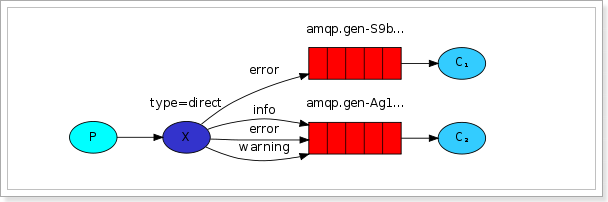

# Redis缓存穿透缓存击穿缓存雪崩

# # Redis哨兵

# Redis数据类型

# Redis缓存过期处理与内存淘汰机制

# Spring中的事务传播行为

# 接口幂等性

# JWT令牌结构

一个JWT由三部分组成：
- Header（头部）: base64编码的Json字符串，Header通常由两部分组成：令牌的类型，即JWT，以及使用的签名算法，例如HMAC SHA256或RSA。
- Payload（载荷） : base64编码的Json字符串，payload是有效载荷，其中包含声明（ claims）。声明包含实体（通常是用户）和其他自定义信息。
- Signature（签名）: 使用指定算法，通过Header和Payload加盐计算的字符串, 保证token在传输的过程中没有被篡改或者损坏

各部分以`.`分割

# JWT工作原理

客户端通过请求将用户名和密码传给服务端，服务端将用户名和密码进行核对，核对成功后将用户id等其他信息作为jwt的有效载荷（payload）与头部进行base64编码形成jwt（字符串），后端将这段字符串作为登陆成功的返回结果返回给前端。前端将其保存在localstroage或sessionstroage里，退出登录时，删除JWT字符串就可以。

每次请求，前端都会把JWT作为authorization请求头传给后端，后端进行检查。

# try中有return时finally还会执行吗

try中有return, 会先将值暂存，无论finally语句中对该值做什么处理，最终返回的都是try语句中的暂存值。当try与finally语句中均有return语句，会忽略try中return。

#  == 和 equals 的区别是什么

== 对基本类型是值比较，对引用类型是引用比较。equals 默认情况下是引用比较，只是 String、Integer 等类重写了 equals 方法，把它变成了值比较，所以一般情况下 equals 比较的是值是否相等。

# Math.round(-1.5) 等于多少

等于-1，因为在数轴上取值时是向右取整

# StringBuffer 和 StringBuilder 区别

StringBuffer 是线程安全的，而 StringBuilder 是非线程安全的，但 StringBuilder 的性能却高于 StringBuffer（因为stringbuffer加锁了），所以在单线程环境下推荐使用 StringBuilder，多线程环境下推荐使用 StringBuffer。

# String str="i"与 String str=new String("i")一样吗

不一样，因为内存的分配方式不一样。String str="i"的方式，Java 虚拟机会将其分配到常量池中（常量池保存在方法区中）；而 String str=new String("i") 则会被分到堆内存中。

# 如何将字符串反转？

使用 StringBuilder 或者 stringBuffer 的 reverse() 方法。

或者对撞指针
```java
void reverseString(char[] s) {
    int l = 0;
    int r = s.length - 1;
    while (l < r) {
        swap(s, l++, r--);
    }
}
void swap(char[] arr, int i, int j){
    char t = arr[i];
    arr[i] = arr[j];
    arr[j] = t;
}
```

# BIO、NIO、AIO 有什么区别

- BIO：Block IO 同步阻塞式 IO，就是我们平常使用的传统 IO，它的特点是模式简单使用方便，并发处理能力低。
- NIO：Non IO 同步非阻塞 IO，是传统 IO 的升级，客户端和服务器端通过 Channel（通道）通讯，实现了多路复用。
- AIO：Asynchronous IO 是 NIO 的升级，也叫 NIO2，实现了异步非堵塞 IO ，异步 IO 的操作基于事件和回调机制。

# HashMap 和 Hashtable 有什么区别？

- 存储：HashMap 运行 key 和 value 为 null，而 Hashtable 不允许。
- 线程安全：Hashtable 是线程安全的，而 HashMap 是非线程安全的。
- Hashtable 是保留类不建议使用，推荐在单线程环境下使用 HashMap 替代，多线程使用 ConcurrentHashMap 替代。

# 说一下 HashMap 的实现原理

HashMap 基于 Hash 算法实现的，我们通过 put(key,value)存储，get(key)来获取。当传入 key 时，HashMap 会根据 key. hashCode() 计算出 hash 值，根据 hash 值将 value 保存在 bucket 里。当计算出的 hash 值相同时，我们称之为 hash 冲突，HashMap 的做法是用链表和红黑树存储相同 hash 值的 value。当 hash 冲突的个数比较少时，使用链表否则使用红黑树。

# 说一下 HashSet 的实现原理

HashSet 是基于 HashMap 实现的，HashSet 底层使用 HashMap 来保存所有元素

# ArrayList 和 Vector 的区别是什么？

- 线程安全：Vector 使用了 Synchronized 来实现线程同步，是线程安全的，而 ArrayList 是非线程安全的。
- 性能：ArrayList 在性能方面要优于 Vector。（因为Synchronized）
- 扩容：ArrayList 和 Vector 都会根据实际的需要动态的调整容量，只不过在 Vector 扩容每次会增加 1 倍，而 ArrayList 只会增加 50%。

# 怎么确保一个集合不能被修改

可以使用 Collections. unmodifiableCollection(Collection c) 方法来创建一个只读集合，这样改变集合的任何操作都会抛出 Java. lang. UnsupportedOperationException 异常。

# 并行和并发有什么区别

- 并行：多个处理器或多核处理器同时处理多个任务。
- 并发：多个任务在同一个 CPU 核上，按细分的时间片轮流(交替)执行，从逻辑上来看那些任务是同时执行。

# 创建线程有哪几种方式？

- 继承 Thread 重写 run 方法；
- 实现 Runnable 接口；
- 实现 Callable 接口。

# runnable 和 callable 有什么区别？

runnable 没有返回值，callable 可以拿到返回值和捕获异常

# 线程的5种状态

- 新建(NEW)：新创建了一个线程对象。
- 可运行(RUNNABLE)：线程对象创建后，其他线程调用了该对象的start()方法。该状态的线程位于可运行线程池中，等待被线程调度选中，获取cpu 的使用权 。
- 运行(RUNNING)：可运行状态(runnable)的线程获得了cpu 时间片（timeslice） ，执行程序代码。
- 阻塞(BLOCKED)：阻塞状态是指线程因为某种原因放弃了cpu 使用权，也即让出了cpu timeslice，暂时停止运行。直到线程进入可运行(runnable)状态，才有机会再次获得cpu timeslice 转到运行(running)状态。
- 死亡(DEAD)：线程run()、main() 方法执行结束，或者因异常退出了run()方法，则该线程结束生命周期。死亡的线程不可再次复生。

# sleep() 和 wait() 有什么区别？

- 类的不同：sleep() 来自 Thread，wait() 来自 Object。
- 释放锁：sleep() 不释放锁；wait() 释放锁。
- 用法不同：sleep() 时间到会自动恢复；wait() 可以使用 notify()/notifyAll()直接唤醒。

# notify()和 notifyAll()有什么区别？

notifyAll()会唤醒所有的线程，notify()之后唤醒一个线程。notifyAll() 调用后，会将全部线程由等待池移到锁池，然后参与锁的竞争，竞争成功则继续执行，如果不成功则留在锁池等待锁被释放后再次参与竞争。而 notify()只会唤醒一个线程，具体唤醒哪一个线程由虚拟机控制。

# 创建线程池有哪几种方式？

线程池创建有七种方式，最核心的是最后一种：

- newSingleThreadExecutor()：它的特点在于工作线程数目被限制为 1，操作一个无界的工作队列，所以它保证了所有任务的都是被顺序执行，最多会有一个任务处于活动状态，并且不允许使用者改动线程池实例，因此可以避免其改变线程数目；
- newCachedThreadPool()：它是一种用来处理大量短时间工作任务的线程池，具有几个鲜明特点：它会试图缓存线程并重用，当无缓存线程可用时，就会创建新的工作线程；如果线程闲置的时间超过 60 秒，则被终止并移出缓存；长时间闲置时，这种线程池，不会消耗什么资源。
- newFixedThreadPool(int nThreads)：重用指定数目（nThreads）的线程，其背后使用的是无界的工作队列，任何时候最多有 nThreads 个工作线程是活动的。这意味着，如果任务数量超过了活动队列数目，将在工作队列中等待空闲线程出现；如果有工作线程退出，将会有新的工作线程被创建，以补足指定的数目 nThreads；
- newSingleThreadScheduledExecutor()：创建单线程池，返回 ScheduledExecutorService，可以进行定时或周期性的工作调度；
- newScheduledThreadPool(int corePoolSize)：和newSingleThreadScheduledExecutor()类似，创建的是个 ScheduledExecutorService，可以进行定时或周期性的工作调度，区别在于单一工作线程还是多个工作线程；
- newWorkStealingPool(int parallelism)：这是一个经常被人忽略的线程池，Java 8 才加入这个创建方法，其内部会构建ForkJoinPool，利用Work-Stealing算法，并行地处理任务，不保证处理顺序；
- ThreadPoolExecutor()：是最原始的线程池创建，上面1-3创建方式都是对ThreadPoolExecutor的封装。

# 线程池都有哪些状态？

- RUNNING：这是最正常的状态，接受新的任务，处理等待队列中的任务。
- SHUTDOWN：不接受新的任务提交，但是会继续处理等待队列中的任务。
- STOP：不接受新的任务提交，不再处理等待队列中的任务，中断正在执行任务的线程。
- TIDYING：所有的任务都销毁了，workCount 为 0，线程池的状态在转换为 TIDYING 状态时，会执行钩子方法 terminated()。
- TERMINATED：terminated()方法结束后，线程池的状态就会变成这个。

# 线程池中 submit() 和 execute() 方法有什么区别

- execute()：只能执行 Runnable 类型的任务。
- submit()：可以执行 Runnable 和 Callable 类型的任务。

# synchronized 锁升级的原理

synchronized 锁升级原理：在锁对象的对象头里面有一个 threadid 字段，在第一次访问的时候 threadid 为空，jvm 让其持有偏向锁，并将 threadid 设置为其线程 id，再次进入的时候会先判断 threadid 是否与其线程 id 一致，如果一致则可以直接使用此对象，如果不一致，则升级偏向锁为轻量级锁，通过自旋循环一定次数来获取锁，执行一定次数之后，如果还没有正常获取到要使用的对象，此时就会把锁从轻量级升级为重量级锁。

锁的升级的目的：锁升级是为了减低了锁带来的性能消耗。

- 偏向锁: 指一段同步代码一直被一个线程所访问，那么该线程会自动获取锁，降低获取锁的代价
- 轻量级锁: 当锁是偏向锁的时候，被另外的线程所访问，偏向锁就会升级为轻量级锁，其他线程会通过自旋的形式尝试获取锁，不会阻塞，从而提高性能
- 重量级锁: 因为使用自旋的方式非常消耗CPU，当一定时间内通过自旋的方式无法获取到锁，或者一个线程在持有锁，一个在自旋，又有第三个来访时，轻量级锁升级为重量级锁，此时等待锁的线程都会进入阻塞状态。

自旋: 循环等待，然后不断的判断锁是否能够被成功获取，直到获取到锁才会退出循环

# 什么是死锁

当线程 A 持有独占锁a，并尝试去获取独占锁 b 的同时，线程 B 持有独占锁 b，并尝试获取独占锁 a 的情况下，就会发生 AB 两个线程由于互相持有对方需要的锁，而发生的阻塞现象，我们称为死锁。

# 怎么防止死锁

- 尽量使用 tryLock(long timeout, TimeUnit unit)的方法(ReentrantLock、ReentrantReadWriteLock)，设置超时时间，超时可以退出防止死锁。
- 尽量使用 Java. util. concurrent 并发类代替自己手写锁。
- 尽量降低锁的使用粒度，尽量不要几个功能用同一把锁。
- 尽量减少同步的代码块。

# ThreadLocal 是什么？有哪些使用场景？

ThreadLocal 为每个使用该变量的线程提供独立的变量副本，所以每一个线程都可以独立地改变自己的副本，而不会影响其它线程所对应的副本。

ThreadLocal 的经典使用场景是数据库连接和 session 管理等。

# 说一下 synchronized 底层实现原理？

synchronized 是由一对 monitorenter/monitorexit 指令实现的，synchronized的底层是通过一个monitor的对象来完成。在 Java 6 之前，monitor 的实现完全是依靠操作系统内部的互斥锁，因为需要进行用户态到内核态的切换，所以同步操作是一个无差别的重量级操作，性能也很低。但在 Java 6 的时候，Java 虚拟机 对此进行了大刀阔斧地改进，提供了三种不同的 monitor 实现，也就是常说的三种不同的锁：偏向锁（Biased Locking）、轻量级锁和重量级锁，大大改进了其性能。

每个对象有一个监视器锁（monitor）。当monitor被占用时就会处于锁定状态，线程执行monitorenter指令时尝试获取monitor的所有权，过程如下：

1. 如果monitor的进入数为0，则该线程进入monitor，然后将进入数设置为1，该线程即为monitor的所有者。
2. 如果线程已经占有该monitor，只是重新进入，则进入monitor的进入数加1.
3. 如果其他线程已经占用了monitor，则该线程进入阻塞状态，直到monitor的进入数为0，再重新尝试获取monitor的所有权。

线程执行monitorexit指令时，monitor的进入数减1，如果减1后进入数为0，那线程退出monitor，不再是这个monitor的所有者。其他被这个monitor阻塞的线程可以尝试去获取这个 monitor 的所有权。 

# synchronized 和 volatile 的区别是什么？

- volatile 是变量修饰符；synchronized 是修饰类、方法、代码段。
- volatile 仅能实现变量的修改可见性，不能保证原子性；而 synchronized 则可以保证变量的修改可见性和原子性。
- volatile 不会造成线程的阻塞；synchronized 可能会造成线程的阻塞。

变量的修改可见性: 被volatile关键字修饰的共享变量，如果值发生了变更，其他线程立马可见。

Java 内存模型规定所有的共享变量都存储于主内存。每一个线程还存在自己的工作内存，保留了被线程使用的变量的副本。线程对变量的所有的操作都必须在工作内存中完成，而不能直接读写主内存中的变量。不同线程之间也不能直接访问对方工作内存中的变量，线程间变量的值的传递需要通过主内存中转来完成。所以可能会导致线程对共享变量的修改没有即时更新到主内存，从而使得线程在使用共享变量的值时，该值并不是最新的。

当一个线程进入 synchronized 代码块后，线程获取到锁，会清空本地内存，然后从主内存中拷贝共享变量的最新值到本地内存作为副本，执行代码，又将修改后的副本值刷新到主内存中，最后线程释放锁。除了 synchronized 外，其它锁也能保证变量的内存可见性。

使用 volatile 修饰共享变量后，当线程操作变量副本并写回主内存后，会通过 CPU 总线嗅探机制告知其他线程该变量副本已经失效，需要重新从主内存中读取。

# synchronized 和 Lock 有什么区别？

- synchronized 可以给类、方法、代码块加锁；而 lock 只能给代码块加锁。
- synchronized 不需要手动获取锁和释放锁，使用简单，发生异常会自动释放锁，不会造成死锁；而 lock 需要自己加锁和释放锁，如果使用不当没有 unLock()去释放锁就会造成死锁。
- 通过 Lock 可以知道有没有成功获取锁，而 synchronized 却无法办到。

# synchronized 和 ReentrantLock 区别是什么？

- ReentrantLock 使用起来比较灵活，但是必须有释放锁的配合动作；
- ReentrantLock 必须手动获取与释放锁，而 synchronized 不需要手动释放和开启锁；
- ReentrantLock 只适用于代码块锁，而 synchronized 可用于修饰方法、代码块等。

# 说一下 atomic 的原理？

atomic 主要利用 CAS (Compare And Wwap) 和 volatile 和 native 方法来保证原子操作，从而避免 synchronized 的高开销，执行效率大为提升。

# 如何实现对象克隆？

- 实现 Cloneable 接口并重写 Object 类中的 clone() 方法。
- 实现 Serializable 接口，通过对象的序列化和反序列化实现克隆，可以实现真正的深度克隆。

# 深拷贝和浅拷贝区别是什么？

- 浅拷贝：当对象被复制时只复制它本身和其中包含的值类型的成员变量，而引用类型的成员对象并没有复制。
- 深拷贝：除了对象本身被复制外，对象所包含的所有成员变量也将复制。

# session 和 cookie 有什么区别？

- 存储位置不同：session 存储在服务器端；cookie 存储在浏览器端。
- 安全性不同：cookie 安全性一般，在浏览器存储，可以被伪造和修改。
- 容量和个数限制：cookie 有容量限制，每个站点下的 cookie 也有个数限制。
- 存储的多样性：session 可以存储在 Redis 中、数据库中、应用程序中；而 cookie 只能存储在浏览器中。

# 说一下 session 的工作原理？

session 的工作原理是客户端登录完成之后，服务器会创建对应的 session，session 创建完之后，会把 session 的 id 发送给客户端，客户端再存储到浏览器中。这样客户端每次访问服务器时，都会带着 sessionid，服务器拿到 sessionid 之后，在内存找到与之对应的 session 这样就可以正常工作了。

# 如果客户端禁止 cookie 能实现 session 还能用吗？

可以用，session 只是依赖 cookie 存储 sessionid，如果 cookie 被禁用了，可以使用 url 中添加 sessionid 的方式保证 session 能正常使用。

# 如何避免 SQL 注入？

使用预处理 PreparedStatement。
使用正则表达式过滤掉字符中的特殊字符。

# 什么是 XSS 攻击，如何避免？

XSS 攻击：即跨站脚本攻击，它是 Web 程序中常见的漏洞。原理是攻击者往 Web 页面里插入恶意的脚本代码（css 代码、Javascript 代码等），当用户浏览该页面时，嵌入其中的脚本代码会被执行，从而达到恶意攻击用户的目的，如盗取用户 cookie、破坏页面结构、重定向到其他网站等。

预防 XSS 的核心是必须对输入的数据做过滤处理。

# 什么是 CSRF 攻击，如何避免？

CSRF：Cross-Site Request Forgery（中文：跨站请求伪造），可以理解为攻击者盗用了你的身份，以你的名义发送恶意请求。

防御手段：

- 验证请求来源地址；
- 关键操作添加验证码；
- 在请求地址添加 token 并验证。

# 说一下 tcp 粘包是怎么产生的？

tcp 粘包可能发生在发送端或者接收端，分别来看两端各种产生粘包的原因：

- 发送端粘包：发送端需要等缓冲区满才发送出去，造成粘包；
- 接收方粘包：接收方不及时接收缓冲区的包，造成多个包接收。

# OSI 的七层模型都有哪些？

1. 物理层：利用传输介质为数据链路层提供物理连接，实现比特流的透明传输。
1. 数据链路层：负责建立和管理节点间的链路。
1. 网络层：通过路由选择算法，为报文或分组通过通信子网选择最适当的路径。
1. 传输层：向用户提供可靠的端到端的差错和流量控制，保证报文的正确传输。
1. 会话层：向两个实体的表示层提供建立和使用连接的方法。
1. 表示层：处理用户信息的表示问题，如编码、数据格式转换和加密解密等。
1. 应用层：直接向用户提供服务，完成用户希望在网络上完成的各种工作。

# get 和 post 请求有哪些区别？

- get 请求会被浏览器主动缓存，而 post 不会。
- get 传递参数有大小限制，而 post 没有。
- post 参数传输更安全，get 的参数会明文显示在 url 上，post 不会。

# 如何实现跨域？

- 服务器端设置 CORS 等于 *；
- 在单个接口使用注解 @CrossOrigin 运行跨域；
- 使用 jsonp 跨域；

# 说一下 JSONP 实现原理？

利用script标签的 src 连接可以访问不同源的特性，加载远程返回的“JS 函数”来执行的。

# 说一下你熟悉的设计模式？

- 单例模式：保证被创建一次，节省系统开销。
- 工厂模式（简单工厂、抽象工厂）：解耦代码。
- 观察者模式：定义了对象之间的一对多的依赖，这样一来，当一个对象改变时，它的所有的依赖者都会收到通知并自动更新。
- 外观模式：提供一个统一的接口，用来访问子系统中的一群接口，外观定义了一个高层的接口，让子系统更容易使用。
- 模版方法模式：定义了一个算法的骨架，而将一些步骤延迟到子类中，模版方法使得子类可以在不改变算法结构的情况下，重新定义算法的步骤。

# 观察者模式

发布者发布信息，订阅者获取信息，订阅了就能收到信息，没订阅就收不到信息。

```java
/**
 * 抽象被观察者接口
 * 声明了添加、删除、通知观察者方法
 */
public interface Observerable {
    void registerObserver(Observer o);
    void removeObserver(Observer o);
    void notifyObserver();
}
/**
 * 抽象观察者
 * 当被观察者调用notifyObserver()方法时，观察者的update()方法会被回调。
 */
public interface Observer {
    public void update(String message);
}
/**
 * 被观察者实现
 */
public class WechatServer implements Observerable {
    
    private List<Observer> list;
    private String message;
    
    public WechatServer() {
        list = new ArrayList<Observer>();
    }
    
    @Override
    public void registerObserver(Observer o) {
        list.add(o);
    }
    
    @Override
    public void removeObserver(Observer o) {
        if(!list.isEmpty())
            list.remove(o);
    }

    @Override
    public void notifyObserver() {
        for(int i = 0; i < list.size(); i++) {
            Observer oserver = list.get(i);
            oserver.update(this.message);
        }
    }
    
    public void setInfomation(String s) {
        this.message = s;
        // 消息更新，通知所有观察者
        notifyObserver();
    }
}
```

# 外观模式

外观模式可以很好地解决让子系统外部的客户端在使用子系统的时候，既能简单地使用这些子系统内部的模块，而又不用客户端去与子系统内部的多个模块交互。

外观模式的目的不是给子系统添加新的功能接口，而是为了让外部减少与子系统内多个模块的交互，松散耦合，从而能让外部更简单的使用子系统。

因为外观是当做子系统对外的接口出现的，虽然也可以定义一些子系统没有的功能，但是不建议这么做。外观应该是包装已有的功能，它主要负责组合已有功能来实现客户需要，而不是添加新的实现。

```java
/**
 * 子系统
 */
public class DrinkableWater {
    public void facadeWater(){
        System.out.println("煮水");
    }
}
/**
 * 子系统
 */
public class Tea {
    public void facadeTea(){
        System.out.println("取茶");
    }
}
/**
 * 子系统
 */
public class TeaCup {
    public void facadeTeaCup(){
        System.out.println("泡茶");
    }
}
/**
 * 外观对象
 */
public class Waiter {
    // 示意方法，满足客户需要的功能
    public void getTea(){
        // 内部实现会调用多个子系统
        DrinkableWater drinkableWater = new DrinkableWater();
        TeaCup teaCup = new TeaCup();
        Tea tea = new Tea();
        tea.facadeTea();
        drinkableWater.facadeWater();
        teaCup.facadeTeaCup(tea);
    }
}
/**
 * 客户端
 */
public class Customer {
    public static void main(String[] args) {
        new Waiter().getTea();
    }
}
```

# 模版方法模式

定义一个操作中的算法的骨架，而将一些步骤延迟到子类中。子类可以置换掉父类的可变部分，但是子类却不可以改变模板方法所代表的顶级逻辑。

```java
// 抽象模板角色类
public abstract class AbstractTemplate {
    // 模板方法, 可以有任意多个
    public void templateMethod(){
        //调用基本方法
        abstractMethod();
        hookMethod();
        concreteMethod();
    }
    // 抽象方法, 由具体子类实现
    protected abstract void abstractMethod();
    // 钩子方法(空方法), 子类可选择实现，不是必须实现
    protected void hookMethod(){}
    // 具体方法, 由抽象类声明并实现，而子类并不实现或置换
    private final void concreteMethod(){
        // ...
    }
}

// 具体模板角色类，实现了父类所声明的基本方法
public class ConcreteTemplate extends AbstractTemplate{
    // 基本方法的实现
    @Override
    public void abstractMethod() {
        // ...
    }
    // 重写父类的方法
    @Override
    public void hookMethod() {
        // ...
    }
}
```

### 应用

Servlet

HttpServlet担任抽象模板角色
- 由service()方法担任模板方法。
- Servlet并非完全按照模板方法定义的那样，而是做了变通，提供了默认doGet、doPost的实现

自己实现的TestServlet担任具体模板角色
- TestServlet置换掉了父类HttpServlet中七个基本方法中的其中两个，分别是doGet和doPost

# 解释一下什么是 aop

aop 是面向切面编程，通过动态代理实现统一处理某一类问题的编程思想，比如统一处理日志、异常等。

# 解释一下什么是 ioc

对于 spring 框架来说，就是由 spring 来负责控制对象的生命周期和对象间的关系。控制反转指的是，这种控制权不由当前对象管理了，由第三方容器来管理。

# spring 中的 bean 是线程安全的吗

spring 中的 bean 默认是单例模式，spring 框架并没有对单例 bean 进行多线程的封装处理。
实际上大部分时候 spring bean 无状态的（不会保存数据），所以某种程度上来说 bean 也是安全的，但如果 bean 有状态的话（比如 view model 对象），那就要开发者自己去保证线程安全了，最简单的就是改变 bean 的作用域，把“singleton”变更为“prototype”，这样请求 bean 相当于 new Bean()了，所以就可以保证线程安全了。

# 说一下 spring 的事务隔离级别

- ISOLATION_DEFAULT（默认值）：用底层数据库的设置隔离级别
- ISOLATION_READ_UNCOMMITTED：未提交读，最低隔离级别、事务未提交前，就可被其他事务读取（会出现幻读、脏读、不可重复读）
- ISOLATION_READ_COMMITTED：提交读，一个事务提交后才能被其他事务读取到（会造成幻读、不可重复读），SQL server 的默认级别
- ISOLATION_REPEATABLE_READ：可重复读，保证多次读取同一个数据时，其值都和事务开始时候的内容是一致，禁止读取到别的事务未提交的数据（会造成幻读），MySQL 的默认级别
- ISOLATION_SERIALIZABLE：序列化，代价最高最可靠的隔离级别，该隔离级别能防止脏读、不可重复读、幻读

- 脏读：表示一个事务能够读取另一个事务中还未提交或回滚的数据。比如事务B执行过程中修改了数据X，在未提交前，事务A读取了X，而事务B却回滚了，这样事务A就形成了脏读
- 不可重复读：事务A首先读取了一条数据，然后执行逻辑的时候，事务B将这条数据改变了，然后事务A再次读取的时候，发现数据不匹配了
- 幻读：当前事务第一次取到的数据和后来读取到数据条目不同。比如事务A首先根据条件索引得到N条数据，然后事务B改变了这N条数据之外的M条或者增添了M条符合事务A搜索条件的数据，导致事务A再次搜索发现有N+M条数据了，就产生了幻读

# spring boot 核心配置文件是什么

- bootstrap (. yml 或者 . properties)：boostrap 由父 ApplicationContext 加载的，比 applicaton 优先加载，且 boostrap 里面的属性不能被覆盖；
- application (. yml 或者 . properties)：用于 spring boot 项目的自动化配置。

# spring cloud 的核心组件有哪些

- Eureka：服务注册与发现。
- Feign：基于动态代理机制，根据注解和选择的机器，拼接请求 url 地址，发起请求。
- Ribbon：实现负载均衡，从一个服务的多台机器中选择一台。
- Hystrix：资源隔离，不同的服务走不同的线程池，实现了不同服务调用的隔离，避免了服务雪崩的问题。断路器机制，当后端服务失败数量超过一定比例, 断路器会切换到开路状态. 这时所有请求会直接失败而不会发送到后端服务，断路器有自我检测并恢复的能力。Fallback，降级操作，当请求后端服务出现异常的时候, 可以使用自定义的fallback方法返回的值
- Zuul：网关管理，由 Zuul 网关转发请求给对应的服务。

# MyBatis延迟加载的原理是什么

调用的时候触发加载，而不是在初始化的时候就加载信息。比如调用 a. getB(). getName()，这个时候发现 a. getB() 的值为 null，此时会单独触发事先保存好的关联 B 对象的 SQL，先查询出来 B，然后再调用 a. setB(b)，而这时候再调用 a. getB(). getName() 就有值了

# MyBatis 的一级缓存和二级缓存

- 一级缓存：HashMap 本地缓存，它的生命周期是和 SQLSession 一致的，有多个 SQLSession 或者分布式的环境中数据库操作，可能会出现脏数据。当 Session flush 或 close 之后，该 Session 中的所有 Cache 就将清空，默认一级缓存是开启的。
- 二级缓存：也是HashMap 本地缓存，不同在于其存储作用域为 Mapper 级别的，如果多个SQLSession之间需要共享缓存，则需要使用到二级缓存，并且二级缓存可自定义存储源，如 redis。默认不打开二级缓存，要开启二级缓存，使用二级缓存属性类需要实现 Serializable 序列化接口(可用来保存对象的状态)。
- 数据查询流程：二级缓存 -> 一级缓存 -> 数据库。
- 缓存更新机制：当某一个作用域(一级缓存 Session/二级缓存 Mapper)进行了C/U/D 操作后，默认该作用域下所有 select 中的缓存将被 clear。

# RabbitMQ 的使用场景有哪些

- 抢购活动，削峰填谷，防止系统崩塌。
- 延迟信息处理，比如 10 分钟之后给下单未付款的用户发送邮件提醒。
- 解耦系统，对于新增的功能可以单独写模块扩展，比如用户确认评价之后，新增了给用户返积分的功能，这个时候不用在业务代码里添加新增积分的功能，只需要把新增积分的接口订阅确认评价的消息队列即可，后面再添加任何功能只需要订阅对应的消息队列即可。

# RabbitMQ 有哪些重要的组件

- ConnectionFactory（连接管理器）：应用程序与Rabbit之间建立连接的管理器，程序代码中使用。
- Channel（信道）：消息推送使用的通道。
- Exchange（交换器）：用于接受、分配消息。
- Queue（队列）：用于存储生产者的消息。
- RoutingKey（路由键）：用于把生成者的数据分配到交换器上。
- BindingKey（绑定键）：用于把交换器的消息绑定到队列上。

# RabbitMQ 怎么实现延迟消息队列

- rabbitmq_delayed_message_exchange 插件
- DLX 实现延迟队列。把死信队列就当成延迟队列，假如一条消息需要延迟 30 分钟执行，我们就设置这条消息的有效期为 30 分钟，同时为这条消息配置死信交换机和死信 routing_key，并且不为这个消息队列设置消费者，那么 30 分钟后，这条消息由于没有被消费者消费而进入死信队列，此时我们有一个消费者监听这个死信队列，消息一进入死信队列，就立马被消费了。

# RabbitMQ的消息模型

## 基本消息模型


生产者向消息队列中投递消息，消费者从其中取出消息。 

## work消息模型


两个消费者共同消费同一个队列中的消息，但是一个消息只能被一个消费者获取。work模型通过手动确认机制实现能者多劳

## 发布-订阅模型 Fanout(广播)


广播模式有多个消费者，每个消费者有自己的队列，生产者发送的消息，只能发送到交换机，交换机把消息发送给绑定的所有队列，实现一条消息被多个消费者消费

## 发布-订阅模型 Direct



生产者向交换机发送消息时，会指定一个routing key。交换机把生产者的消息交给与routing key完全匹配的队列

## 发布-订阅模型 Topic


Topic类型的Exchange与Direct相比，都是可以根据RoutingKey把消息路由到不同的队列。只不过Topic类型Exchange可以让队列在绑定Routing key 的时候使用通配符，`#`匹配一个或多个词，`*`匹配一个词

# 消息可靠性投递

## 消息落库方案

1. 业务数据和消息数据入库（此时消息状态为未成功0）后向MQ发送消息。
3. MQ收到消息后，发送确认消息Ack。
4. 生产者接收到服务器发送的确认消息 Ack，修改数据库中消息的状态为成功（1）。
5. 定时任务查询数据库中消息状态为未成功（0）的数据并重新发送。当重新发送的次数，大于一定的值时，修改该条消息状态为发送失败（2）。

## 延迟投递方案

1. 生产者将业务数据入库并向MQ发送消息。
3. 生产者在发送消息的指定时间后发送延迟投递消息。
4. 消费者对消息进行消费后，生成一条消息，投递到MQ中用作确认。
6. Callback 服务监听消费者发送的确认消息，如果收到消息则对消息状态做记录。
7. Callback 服务收到生产者的延迟消息后去检查数据库中是否存在消费者发送的确认消息，如果存在，则不需要做任何处理。如果不存在或者消费失败了，那么Callback 服务就需要通知生产者需要重新发送，生产者收到信息后就会重新查询业务数据然后将消息发送出去。

这种方案不一定能保障百分百投递成功，主要目的是为了减少数据库操作，提高并发量

# kafka 可以脱离 zookeeper 单独使用吗

kafka 不能脱离 zookeeper 单独使用，因为 kafka 使用 zookeeper 管理和协调 kafka 的节点服务器。

# kafka 有几种数据保留的策略

kafka 有两种数据保存策略：按照过期时间保留和按照存储的消息大小保留。 kafka 同时设置了 7 天和 10G 清除数据，到第五天的时候消息达到了 10G，这个时候 kafka会执行数据清除工作，时间和大小不论那个满足条件，都会清空数据。

# 什么情况会导致 kafka 运行变慢

- cpu 性能瓶颈
- 磁盘读写瓶颈
- 网络瓶颈

# 使用 kafka 集群需要注意什么

集群的数量不是越多越好，最好不要超过 7 个，因为节点越多，消息复制需要的时间就越长，整个群组的吞吐量就越低。
集群数量最好是单数，因为超过一半故障集群就不能用了，设置为单数容错率更高。

# zookeeper 都有哪些功能

- 集群管理：监控节点存活状态、运行请求等。
- 主节点选举：主节点挂掉了之后可以从备用的节点开始新一轮选主
- 分布式锁：zookeeper 提供两种锁：独占锁、共享锁。独占锁即一次只能有一个线程使用资源，共享锁是可以有多个线程同时读同一个资源，如果要使用写锁也只能有一个线程使用。
- 命名服务：在分布式系统中，通过使用命名服务，客户端应用能够根据指定名字来获取资源或服务的地址，提供者等信息。

# 说一下 zookeeper 的通知机制

Zookeeper维护一个类似文件系统的树形数据结，树的节点称为znode，对Zookeeper的操作主要是对znode的操作。客户端会对某个 znode 建立一个 watcher 事件，当该 znode 发生变化时，这些客户端会收到 zookeeper 的通知，然后客户端可以根据 znode 变化来做出业务上的改变。

# 一张自增表里面总共有 7 条数据，删除了最后 2 条数据，重启 MySQL 数据库，又插入了一条数据，此时 id 是几

- 表类型如果是 MyISAM ，那 id 就是 8。
- 表类型如果是 InnoDB，那 id 就是 6。InnoDB 表只会把自增主键的最大 id 记录在内存中，所以重启之后会导致最大 id 丢失。

# B树

## 一棵m阶的B-Tree有如下特性
1. 每个节点最多m个子节点。
2. 除了根节点和叶子节点外，每个节点最少有`m/2`（向上取整）个子节点。
3. 如果根节点不是叶子节点，那根节点至少包含两个子节点。
4. 所有的叶子节点都位于同一层。
5. 每个节点都包含k个元素，且`m/2≤k<m`（`m/2`向下取整）。
6. 每个节点中的元素从小到大排列。
7. 每个元素左节点的值都小于或等于该元素。右节点的值都大于或等于该元素。

## 搜索


搜索数据项：49

- 将49与根节点中的元素78进行比较。因为49<78，移动到78的左子树。
- 将49与元素40进行比较，因为49>40，将49与下一个元素56进行比较，因为49<56，移动到40的右子树（56的左子树）。
- 将49与元素45进行比较，因为49>45，将49与下一个元素49进行比较，找到。

## 插入

如果插入后节点少于m个元素，则按递增顺序插入元素。否则，如果等于或多于m个元素，则按照以下步骤操作。

- 按元素的递增顺序插入新元素。
- 将该节点拆成两个节点，并将中间的元素（m/2向上取整）放到其父节点
- 如果父节点等于或多于m个元素，则按照相同的步骤将其拆分。


将节点8插入到5阶B树中。


按照搜索的步骤，将8插入5的右侧


该节点现在包含5个元素，等于m。因此，将中间元素8推到其父节点

## 删除

如果删除的元素不在叶子节点中，则用直接前驱（左子树中最大的元素）或直接后继（右子树中最小的元素）与要删除的元素交换位置，此时问题转化为删除叶子节点中的元素。

如果删除的元素在叶子节点中，如果删除后节点中有多于或等于`m/2`个元素，则直接从节点中删除元素。如果删除后节点不多于`m/2`个元素，则按照以下步骤操作。

- 如果左侧兄弟节点中多于m/2个元素，则将父结点中的最小元素下移到这个结点，并将兄弟节点中最大元素推送到父节点。
- 如果右侧兄弟节点中多于m/2个元素，则将父结点中的最小元素下移到这个结点，并将兄弟节点中最小元素推送到父节点。
- 如果兄弟节点都不包含多于m/2个元素，则将删除元素后的节点与左（或右）兄弟节点及父节点的最小元素进行合并，形成新的节点。

如果父节点中不多于m/2个元素，则按照相同的步骤处理。


从5阶B树中删除60，删除后节点中有3个元素，直接从节点中删除元素


删除80，用直接前驱77与要删除的元素80交换位置，删除后节点中有3个元素，直接删除80


删除38，右侧兄弟节点中多于2个元素，则将父结点中的最小元素49下移到这个结点，并将兄弟节点中最小元素70推送到父节点。


删除49，兄弟节点都不多于2个元素，则将删除元素后的节点与右兄弟节点及父节点的最小元素进行合并，形成新的节点。此时父节点中不足2个元素，按照相同的步骤处理。

# B+树

