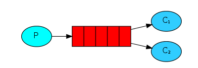
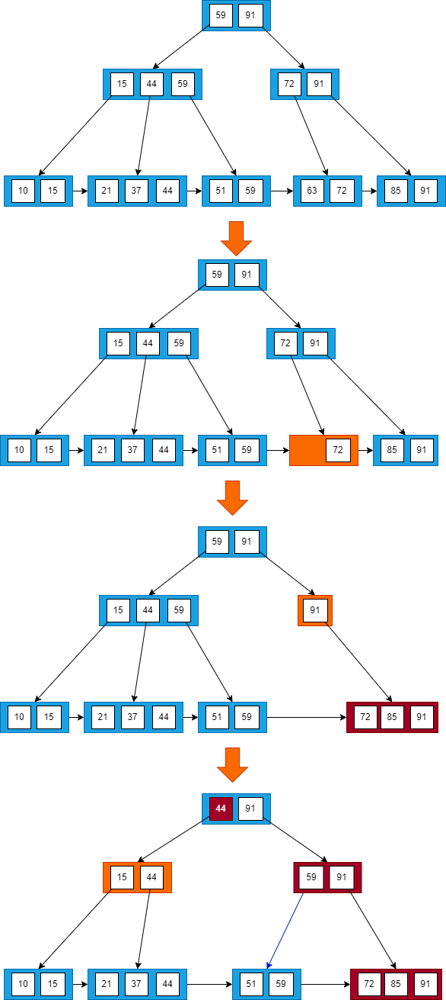

# 接口幂等性

接口任意多次调用所产生的影响均与一次调用的影响相同。

实现接口幂等性

1. 防重Token: 请求前先向后端请求一个全局ID, 请求时携带这个全局ID, 后端用这个ID到Redis中进行校验, 如果存在就删除这个ID；如果不存在就是重复执行。
2. 调用方传递唯一ID: 请求时携带一个短时间内唯一的ID, 服务器收到请求后拿该ID到Redis中查询是否存在, 如果存在就是重复执行；如果不存在就把这个ID存储到Redis中。
3. 数据库乐观锁: 在对应的表中多添加一个版本号字段。每次调用都会传递版本号, 并将该版本号作为where条件, 如果重复执行SQL语句, 会因为版本不一致而不生效。

# JWT+RefreshToken

客户端将用户名和密码传给服务端进行登陆, 服务端核对成功后将用户信息作为jwt的payload生成有效时间较短的JWT字符串作为AccessToken, 并生成有效时间较长的RefreshToken, 一起返回给客户端。客户端将其保存, 每次请求时都会携带AccessToken, 如果AccessToken过期, 则客户端使用RefreshToken向刷新接口申请新的AccessToken。退出登录时, 删除JWT字符串就可以。

由于RefreshToken不会在客户端请求业务接口时验证, 所以将RefreshToken存储在数据库中, 不会对业务接口的响应时间造成影响。当用户需要登出或禁用用户时, 只需要将服务端的RefreshToken禁用或删除, 用户就会在AccessToken过期后无法访问需要认证的接口。这样的方式虽然会有一定的窗口期, 但是结合用户登出时客户端删除AccessToken的操作, 基本上可以适应常规情况下对用户认证鉴权的精度要求。

# HashMap实现原理

HashMap是使用哈希表来存储的。哈希表为解决冲突, 可以采用开放地址法和链地址法等来解决问题, Java中HashMap采用了链地址法。

链地址法, 简单来说, 就是数组加链表的结合。每个数组元素都是一个链表结构, 当数据被Hash后, 得到数组下标, 把数据放在对应下标元素的链表上。


# 如何将字符串反转？

使用StringBuilder的reverse()方法。

或者对撞指针
```java
String reverseString(String str) {
    char [] s = str.toCharArray();
    int l = 0;
    int r = s.length - 1;
    while (l < r) {
        swap(s, l++, r--);
    }
    return new String(s);
}
void swap(char[] arr, int i, int j){
    char t = arr[i];
    arr[i] = arr[j];
    arr[j] = t;
}
```

# String str="i"与 String str=new String("i")一样吗

- 对于直接通过双引号声明字符串的方式, 虚拟机首先会到字符串常量池中查找该字符串是否已经存在. 如果存在会直接返回该引用, 如果不存在则会在堆内存中创建该字符串对象, 然后到字符串常量池中注册该字符串。
- 当使用new关键字创建字符串对象的时候, JVM将不会查询字符串常量池, 它将会直接在堆内存中创建一个字符串对象, 并返回给所属变量。

# synchronized 和 volatile 的区别是什么？

- volatile修饰变量。synchronized修饰类、方法、代码段。
- volatile仅能实现变量的修改可见性, 不能保证原子性。synchronized可以保证变量的修改可见性和原子性。
- volatile不会造成线程的阻塞。synchronized可能会造成线程的阻塞。

## 变量的修改可见性

Java 内存模型规定所有的共享变量都存储于主内存。每一个线程还存在自己的工作内存, 保留了被线程使用的变量的副本。线程对变量的所有的操作都必须在工作内存中完成, 而不能直接读写主内存中的变量。不同线程之间也不能直接访问对方工作内存中的变量, 线程间变量的值的传递需要通过主内存中转来完成。所以可能会导致线程对共享变量的修改没有即时更新到主内存, 从而使得线程在使用共享变量的值时, 该值并不是最新的。

当一个线程进入synchronized代码块后, 线程获取到锁, 会清空工作内存, 然后从主内存中拷贝共享变量的最新值到工作内存作为副本, 执行代码, 又将修改后的副本值刷新到主内存中, 最后线程释放锁。除了synchronized外, 其它锁也能保证变量的内存可见性。

使用volatile修饰共享变量后, 当线程操作变量副本并写回主内存后, 会通过CPU总线嗅探机制告知其他线程该变量副本已经失效, 需要重新从主内存中读取。

# synchronized 和 lock 有什么区别？

- synchronized可以给类、方法、代码块加锁。而lock只能给代码块加锁。
- synchronized不需要手动获取锁和释放锁, 发生异常会自动释放锁, 不会造成死锁。而lock需要自己加锁和释放锁, 如果没有释放锁就可能造成死锁。
- 通过lock可以知道有没有成功获取锁, 而synchronized不能。

# 什么是死锁

当线程A持有独占锁a, 并尝试去获取独占锁b的同时, 线程B持有独占锁b, 并尝试获取独占锁a的情况下, 就会发生A、B两个线程由于互相持有对方需要的锁, 而发生的阻塞现象, 称为死锁。

# 怎么防止死锁

- 尽量使用Lock接口的`tryLock(long time, TimeUnit unit)`方法, 设置超时时间。
- 尽量使用`java.util.concurrent`中的并发类代替自己手写锁。
- 尽量降低锁的使用粒度, 尽量不要几个功能用同一把锁。
- 尽量减少同步的代码块。

# 如何避免 SQL 注入？

- 使用PreparedStatement。
- 使用正则表达式过滤掉特殊字符。

# 什么是 XSS 攻击, 如何避免？

跨站脚本攻击, 攻击者往Web页面里插入恶意的脚本代码, 当用户浏览该页面时, 嵌入其中的脚本代码会被执行, 从而达到恶意攻击用户的目的, 如盗取用户 cookie、破坏页面结构、重定向到其他网站等。

预防XSS的核心是必须对输入的数据做过滤处理。

# 什么是 CSRF 攻击, 如何避免？

跨站请求伪造, 攻击者盗用了用户的身份来发送恶意请求。

用户登录了A网站, 认证信息保存在cookie中。在用户未退出网站A之前, 在同一浏览器中, 打开一个TAB页访问攻击者创建的B网站时, 攻击者通过在B网站发送一个伪造的请求提交到A网站服务器上, 此时浏览器会自动携带cookie访问A网站的这个地址, A网站的服务器就会误以为请求来自于自己的网站。

防御手段: 

- 验证请求来源地址。
- 关键操作添加验证码。
- 在请求添加token并验证。

# MyBatis的一级缓存和二级缓存

- 一级缓存: HashMap本地缓存, 它的生命周期是和SQLSession一致的, 有多个SQLSession或者分布式的环境中数据库操作, 可能会出现脏数据。当Session flush或close之后, 该Session中的所有Cache就将清空, 默认一级缓存是开启的。
- 二级缓存: 也是HashMap本地缓存, 不同在于其存储作用域为Mapper级别的, 如果多个SQLSession之间需要共享缓存, 则需要使用到二级缓存, 并且二级缓存可自定义存储源, 如redis。默认不打开二级缓存, 要开启二级缓存, 使用二级缓存需要实现Serializable序列化接口。

# MyBatis延迟加载的原理是什么

调用的时候触发加载, 而不是在初始化的时候就加载信息。比如调用a.getB()时发现a.getB()的值为null, 此时会单独触发事先保存好的关联B对象的SQL, 先查询出来B, 然后再调用a.setB(b), 而这时候再调用a.getB()就有值了。

# RabbitMQ 怎么实现延迟消息队列

- rabbitmq_delayed_message_exchange插件
- DLX(死信交换机)+TTL(消息超时时间)实现延迟队列。假如一条消息需要延迟30分钟执行, 就设置这条消息的有效期为30分钟, 同时为这条消息配置死信交换机和死信routing_key, 并且不为这个消息队列设置消费者, 那么30分钟后, 这条消息由于没有被消费者消费而进入死信队列, 消息一进入死信队列, 就会被监听这个死信队列的消费者消费了。

# RabbitMQ的消息模型

## 基本消息模型


生产者向消息队列中投递消息, 消费者从其中取出消息。 

## work消息模型



两个消费者共同消费同一个队列中的消息, 但是一个消息只能被一个消费者获取。work模型通过手动确认机制实现能者多劳

## 发布-订阅模型 Fanout(广播)


广播模式有多个消费者, 每个消费者有自己的队列, 生产者发送的消息, 只能发送到交换机, 交换机把消息发送给绑定的所有队列, 实现一条消息被多个消费者消费

## 发布-订阅模型 Direct


生产者向交换机发送消息时, 会指定一个routing key。交换机把生产者的消息交给与routing key完全匹配的队列

## 发布-订阅模型 Topic


Topic类型的Exchange与Direct相比, 都是可以根据RoutingKey把消息路由到不同的队列。只不过Topic类型Exchange可以让队列在绑定Routing key 的时候使用通配符, `#`匹配一个或多个词, `*`匹配一个词

# B+树

## 一个m阶的B+树具有如下几个特征

- 中间节点中的每个元素都有且只有一个子节点。
- 中间节点不保存数据, 只用来索引, 所有数据都保存在叶子节点。
- 所有的中间节点的元素都同时存在于其子节点, 是子节点中的最大元素。
- 所有的叶子节点中包含了全部元素的信息, 且叶子节点本身依元素的大小顺序链接, 形成了一个有序链表。
- 根节点的最大元素也是整个B+树的最大元素。


## 查询单个元素


查询 59

- 访问根节点`[59,97]`, 发现 59 小于等于`[59,97]`中的 59 , 则访问根节点的第一个子节点
- 访问节点`[15,44,59]`, 发现 59 大于 44 且小于等于 59 , 则访问当前节点的第三个子节点
- 访问叶子节点`[51,59]`, 顺序遍历节点内部, 找到要查找的元素 59

## 查询区间


查询区间`[21~63]`

- 访问根节点`[59,97]`, 发现区间的左端点 21 小于 59, 则访问第一个子节点
- 访问节点`[15,44,59]`, 发现 21 大于 15 且小于 44 , 则访问第二个子节点
- 访问节点`[21,37,44]`, 找到了左端点 21 , 此时只需要进行单链表的遍历, 直接从左端点 21 开始一直遍历到右端点 63 即可

## 插入

设B+树的阶数 M = 3

### 情况1

若被插入元素所在的节点, 其含有元素数小于阶数 M, 则直接插入


插入元素12 , 按查找的步骤找到要插入的节点, 插入元素所在的节点的`[10,15]`包含2个元素, 小于3, 则直接插入元素12

### 情况2

若插入元素所在的节点, 其含有元素数目等于阶数M, 则需要将该节点分裂为两个节点, 左节点包含(`ceil(M/2)`)个元素, 右节点包含(`floor(M/2)`)个元素。同时, 将左节点的最大元素上移至其父节点。假设其父节点中包含的元素个数小于等于M, 则插入操作完成。


插入元素95, 插入元素所在节点`[85,91,97]`包含元素个数3等于阶数M, 需要分裂, 将元素95插入到节点`[85,91,97]`中, 将`[85,91,95,97]`分裂为两个节点`[85,91]`和节点`[95,97]`, 并将左节点的最大元素91上移至其父节点中, 发现其父节点`[72,97]`中包含的元素的个数2小于阶数M, 插入操作完成。

### 情况3

在情况2中, 如果上移操作导致其双亲节点中元素个数大于M, 则应继续分裂其双亲节点。


插入元素40, 按照第2种情况将节点分裂, 并将元素37上移到父节点, 发现父节点`[15,44,59]`包含的元素的个数等于M , 所以将插入37后的节点`[15,37,44,59]`分裂为两个节点`[15,37]`和节点`[44,59]`, 并将左节点的最大元素37上移到父节点`[59,97]`中. 父节点`[59,97]`包含元素个数2小于M, 插入结束。

### 情况4

若插入的元素比当前节点中的最大值还大, 破坏了B+树中从根节点到当前节点的所有索引值, 此时需要修正后, 再做其他操作。


插入元素100, 由于其值比最大值97还大, 插入之后, 从根节点到该节点经过的所有节点中的所有值都要由97改为100。改完之后再做分裂操作。

## 删除

设B+树的阶数 M = 3

### 情况1

找到要删除的元素所在的节点时, 如果该节点中元素个数大于`ceil(M/2)`, 删除操作不会破坏B+树的结构, 则可以直接删除。


删除元素 91, 包含91的节点 `[85,91,97]`中元素的个数3大于2(`ceil(M/2)`), 做删除操作不会破坏 B+树的特性, 直接删除。

### 情况2

当删除某节点中最大或者最小的元素, 就会涉及到更改其双亲节点一直到根节点中所有索引值的更改。


以删除整颗 B+树中最大的元素97为例, 查找并删除元素97, 然后向上回溯, 将所有元素97替换为次最大的元素91

### 情况3

当删除该元素导致当前节点中元素个数小于`M/2`时, 若其兄弟节点中含有多余的元素, 可以从兄弟节点中借元素完成删除操作。


删除元素51, 由于其左兄弟节点`[21,37,44]`中含有3个元素, 所以可以选择借最大的元素44, 同时将父节点中的索引值44修改成37

### 情况4

第3种情况中, 如果其兄弟节点没有多余的元素, 则需要同其兄弟节点进行合并。


删除元素59, 首先找到元素59所在节点`[44,59]`, 发现该节点的兄弟节点`[21,37]`包含的元素个数等于2(`ceil(M/2)`), 所以删除元素59后, 将节点`[21,37]`和`[44]`进行合并, 然后向上回溯, 将所有元素59替换为次最大的元素44

### 情况5

当进行合并时, 可能会产生因合并使其父节点破坏B+树的结构, 需要依照以上规律处理其父节点。



删除元素63, 当删除元素后, 该节点中只剩元素72, 且其兄弟节点`[85,91]`中只有2个元素, 所以将`[72]`和`[85,91]`进行合并, 向上回溯, 删除节点`[72,91]`当中的元素72, 此时节点中只有元素91, 不满足B+树中节点元素个数要求, 但其兄弟节点`[15,44,59]`中包含3个元素, 所以从其兄弟节点当中借一个元素59, 再对其兄弟节点的父节点中的元素进行调整, 将元素59替换为44


# mysql水平切割和垂直切割

- 纵向分表: 将本来可以在同一个表的字段, 人为划分成多个表。变化频率慢、查询次数多的数据使用MyISAM, 可以有更好的查询速度。变化频率比较高的数据使用InnoDB, 可以有更好的更新速度。 
- 横向分表: 如用户信息表分成user_1,user_2等。根据数据量的规模来划分, 保证单表的容量不会太大, 从而来保证单表的查询等处理能力。

# spring中的bean是线程安全的吗

spring并没有对bean做线程安全的处理, 但是大部分时候bean不会保存数据, 所以某种程度上来说bean也是安全的。但如果bean保存了数据的话(比如 view model对象), 那就要开发者自己去保证线程安全, 最简单的就是把bean的作用域从singleton变为prototype, 这样请求bean相当于new Bean(), 所以就可以保证线程安全。

# Redis为什么是单线程的

因为cpu不是Redis的瓶颈, Redis的瓶颈最有可能是机器内存或者网络带宽。既然单线程容易实现, 而且cpu又不会成为瓶颈, 那就顺理成章地采用单线程的方案了。

# 观察者模式

发布者发布信息, 订阅者获取信息。定义了对象之间的一对多的依赖, 当一个对象改变时, 它的所有的依赖者都会收到通知并自动更新。

```java
/**
 * 被观察者接口
 */
public interface Observerable {
    // 订阅
    void registerObserver(Observer o);
    // 取消订阅
    void removeObserver(Observer o);
    // 通知观察者
    void notifyObserver();
}
/**
 * 观察者接口
 * 当被观察者调用notifyObserver()方法时, 
 * 观察者的update()方法会被回调。
 */
public interface Observer {
    public void update(String message);
}
/**
 * 被观察者实现
 */
public class WechatServer implements Observerable {
    
    private List<Observer> list = new ArrayList<Observer>();
    private String message;
    
    @Override
    public void registerObserver(Observer o) {
        list.add(o);
    }
    @Override
    public void removeObserver(Observer o) {
        if(!list.isEmpty())
            list.remove(o);
    }
    @Override
    public void notifyObserver() {
        for(Observer oserver : this.list) {
            oserver.update(this.message);
        }
    }
    public void setInfomation(String s) {
        this.message = s;
        // 消息更新, 通知所有观察者
        notifyObserver();
    }
}
```

### 应用

围绕购票会产生不同的其他逻辑, 如: 

1. 购票后记录文本日志
1. 购票后记录数据库日志
1. 购票后发送短信
1. 购票送抵扣卷、兑换卷、积分
1. 其他各类活动等

传统解决方案:

在购票逻辑等类内部增加相关代码, 完成各种逻辑。

存在问题: 

- 紧密耦合, 一旦某个业务逻辑发生改变, 如购票业务中增加其他业务逻辑, 需要修改购票核心文件、甚至购票流程。
- 日积月累后, 文件冗长, 导致后续维护困难。

观察者模式典型实现方式: 

- 定义2个接口: 观察者接口、被观察者接口
- 购票类注册自己需要通知的观察者
- 购票发生时通知观察者对象, 每个观察者执行自己的业务逻辑。

# 外观模式

外观模式提供一个统一的接口, 用来访问子系统中的一群接口, 外观定义了一个高层的接口, 让子系统更容易使用。

```java
/**
 * 子系统1
 */
public class DrinkableWater {
    public void getWater(){
        System.out.println("煮水");
    }
}
/**
 * 子系统2
 */
public class Tea {
    public void getTea(){
        System.out.println("取茶");
    }
}
/**
 * 子系统3
 */
public class TeaCup {
    public void getTeaCup(){
        System.out.println("泡茶");
    }
}
/**
 * 外观对象
 */
public class Waiter {
    // 对外的统一接口
    public void getTea(){
        // 内部实现会调用多个子系统
        new DrinkableWater().getWater();
        new TeaCup().getTeaCup();
        new Tea().getTea();
    }
}
/**
 * 客户端
 */
public class Customer {
    public static void main(String[] args) {
        new Waiter().getTea();
    }
}
```

# 模版方法模式

定义一个操作中的算法的骨架, 而将一些步骤延迟到子类中。子类可以置换掉父类的可变部分, 但是子类却不可以改变模板方法所代表的顶级逻辑。

```java
// 抽象模板类
public abstract class AbstractTemplate {
    // 模板方法, 可以有任意多个
    public void templateMethod(){
        //调用基本方法
        abstractMethod();
        hookMethod();
        concreteMethod();
    }
    // 抽象方法, 由具体子类实现
    protected abstract void abstractMethod();
    // 钩子方法(空方法), 子类可选择实现, 不是必须实现
    protected void hookMethod(){}
    // 具体方法, 由抽象类声明并实现
    private final void concreteMethod(){
        System.out.println("do");
    }
}

// 具体模板类, 实现了父类所声明的基本方法
public class ConcreteTemplate extends AbstractTemplate{
    // 基本方法的实现
    @Override
    public void abstractMethod() {
        System.out.println("do1");
    }
    // 重写父类的方法
    @Override
    public void hookMethod() {
        System.out.println("do2");
    }
}
```

### 应用

Servlet

HttpServlet是抽象模板
- 由service()方法担任模板方法。
- Servlet并非完全按照模板方法定义的那样, 而是做了变通, 提供了默认doGet、doPost的实现

自己实现的TestServlet是具体模板
- TestServlet置换掉了父类HttpServlet中七个基本方法中的其中两个, 分别是doGet和doPost

# 解释一下什么是aop

aop是面向切面编程, 通过动态代理实现统一处理某一类问题的编程思想, 比如统一处理日志、异常等。

# 解释一下什么是ioc

由spring来负责控制对象的生命周期和对象间的关系。控制反转指的是, 这种控制权不由当前对象管理了, 由第三方容器来管理。

# spring cloud的核心组件有哪些

- Eureka: 服务注册与发现。
- Feign: 基于动态代理机制, 根据注解和选择的机器, 拼接url地址, 发起请求。
- Ribbon: 实现负载均衡, 从一个服务的多台机器中选择一台。
- Hystrix: 资源隔离, 为每个接口设置单独的线程池, 当该接口的线程池被占满时, 只是该接口收到影响, 而不会对其他接口造成影响。断路器机制, 当后端服务失败数量超过一定比例, 断路器会切换到开路状态. 这时所有请求会直接失败而不会发送到后端服务, 断路器有自我检测并恢复的能力。降级操作, 当请求后端服务出现异常的时候, 可以使用自定义的fallback方法返回的值。
- Zuul: 网关管理, 由Zuul网关转发请求给对应的服务。

# 脏读、不可重复读和幻读

- 脏读: 表示一个事务读到了另一个事务中还未提交或回滚的数据。
- 不可重复读: 事务A首先读取了一条数据, 然后执行逻辑的时候, 事务B将这条数据改变了, 然后事务A再次读取的时候, 发现数据不匹配了。
- 幻读: 当前事务第一次取到的数据和后来读取到数据条目不同。比如事务A首先根据条件索引得到N条数据, 然后事务B改变了这N条数据之外的M条或者增添了M条符合事务A搜索条件的数据, 导致事务A再次搜索发现有N+M条数据了, 就产生了幻读。

# redis常用的方法

## string

1. redisTemplate.opsForValue().set(key,value)); 设置指定键的值。SET key value
2. redisTemplate.opsForValue().get(key)); 获取指定键的值。GET key
3. redisTemplate.opsForValue().getAndSet(key, value); 设置键的字符串值并返回其旧值。GETSET key value
4. redisTemplate.opsForValue().set(key, value, timeout, unit); 设置值和到期时间。SETEX key seconds value
5. redisTemplate.opsForValue().setIfAbsent(key, value); 设置键的值, 仅当键不存在时。SETNX key value
6. redisTemplate.opsForValue().getOperations().delete(key); 删除键。DEL key

## hash

1. redisTemplate.opsForHash().delete(key, hashKeys); 删除一个或多个哈希字段。HDEL key field1 field2 ...
2. redisTemplate.opsForHash().hasKey(key, hashKey)；判断字段是否存在。HEXISTS key field
3. redisTemplate.opsForHash().get(key, hashKey)；获取指定键的哈希字段的值。HGET key field
4. redisTemplate.opsForHash().entries(key); 获取指定键的所有字段和值。HGETALL key
5. redisTemplate.opsForHash().keys(key)；获取指定键的所有字段。HKEYS key
6. redisTemplate.opsForHash().put(key, hashKey, value); 设置字段的值。HSET key field value
7. redisTemplate.opsForHash().putIfAbsent(key, hashKey, value)；仅当字段不存在时, 才设置字段的值。	HSETNX key field value
