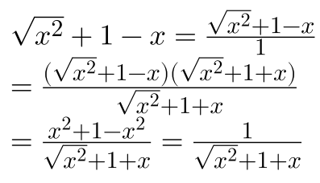
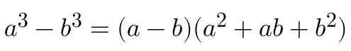
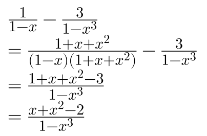
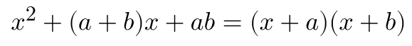
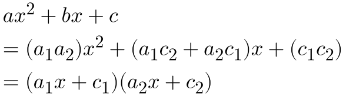

# 根式有理化

若分母 (或分子) 是两个无理数相加 (或相减)，则把分子和分母同乘
这两个无理数的和 (或差)，分母 (或分子) 就变成了有理数

例子：

# 立方差公式

例子：

# 因式分解

十字相乘法：这个方法的关键是把二次项系数a分解成两个因数a1和a2的积，把常数项c分解成两个因数c1和c2的积，并使a1c2+a2c1正好等于一次项的系数b。那么可以直接写成结果:

