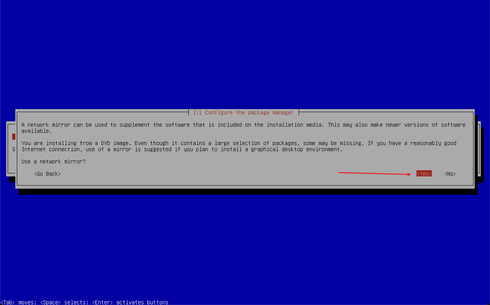
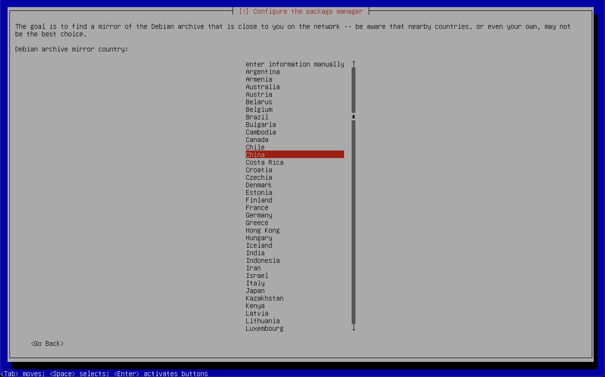
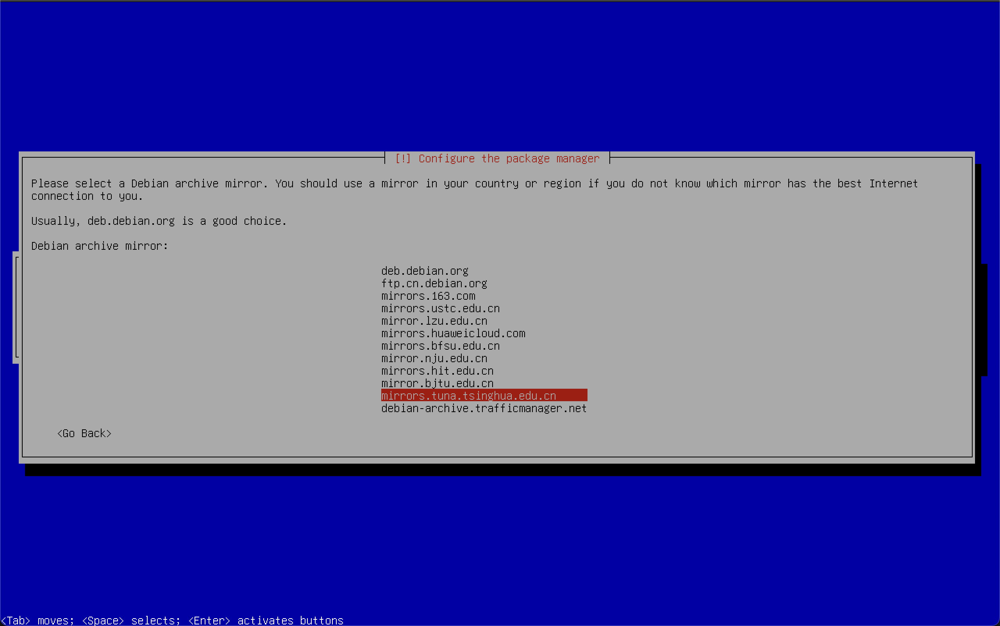
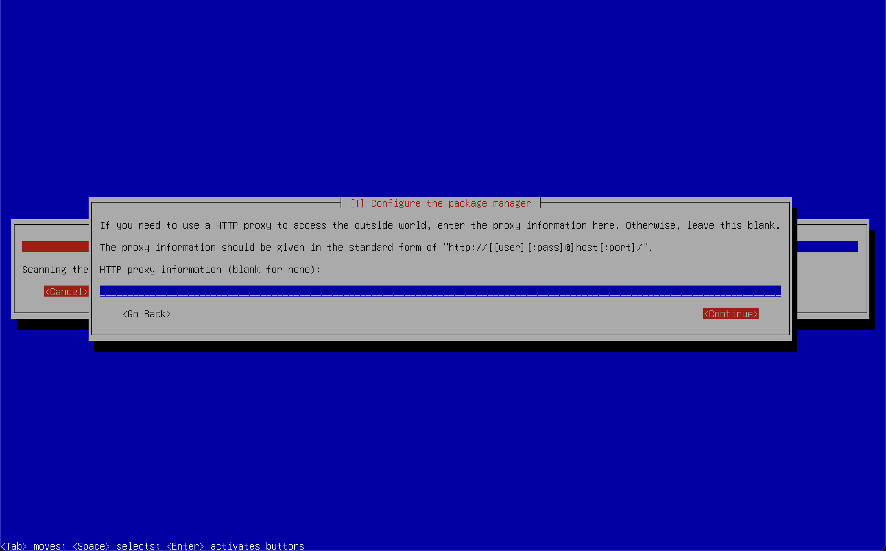
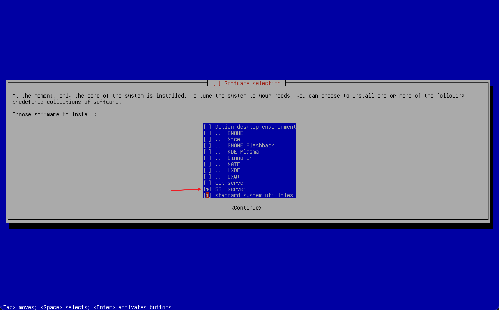

# 安装 debian







## 删除 CD 源

```sh
su
vi /etc/apt/sources.list

# 把下面的内容注释
# deb cdrom:[Debian GNU/Linux 12.6.0 _Bookworm_ - Official arm64 DVD Binary-1 with firmware 20240629-10:19]/ bookworm contrib main non-free-firmware

apt-get update
```

## 安装 sudo

```sh
# 使用root账号
su
apt-get install sudo
apt-get -y install vim

vim /etc/sudoers
# 在%sudo ALL=(ALL:ALL) ALL 这一行底下加入:
# 用户名 ALL=(ALL) ALL
# 保存退出vim

# 退出root
exit

sudo apt-get update
sudo apt-get upgrade
```

## 连接 ssh

启动 ssh:

```sh
sdo systemctl start ssh.service
# 查看ip地址
ip address
```

连接 ssh:

- 端口 -> 22
- 用户 -> 非 root 用户
