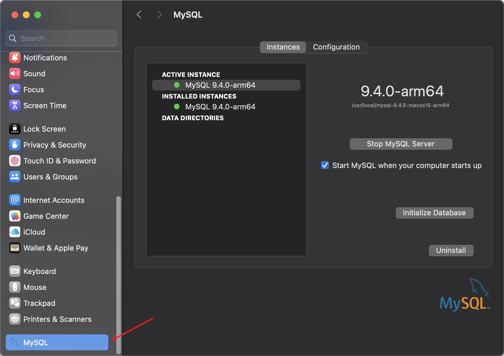
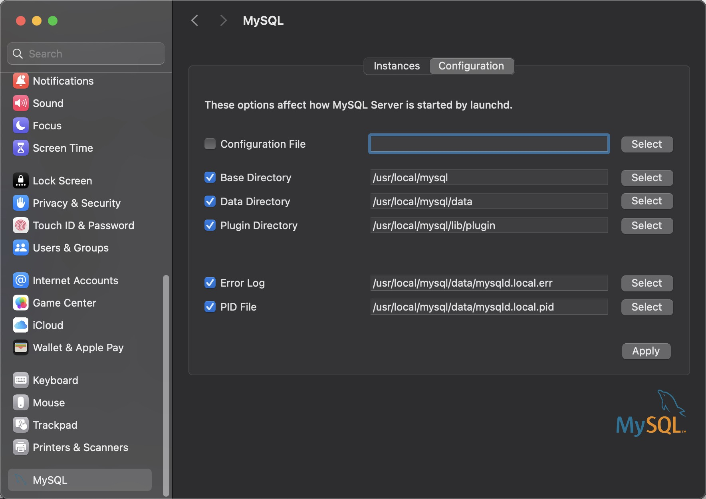

# mysql

### 1. 下载安装包

[https://dev.mysql.com/downloads/mysql/](https://dev.mysql.com/downloads/mysql/)

下载 `DMG Archive` 文件

### 2. 执行安装包

安装完成后系统设置中会增加 mysql 的设置





注意把开机自启关掉

### 3. 配置环境变量

```sh
# 打开配置文件
vim ~/.zshrc

# 在最后一行添加
export PATH=/usr/local/mysql/bin:$PATH

# 使环境变量生效
source ~/.zshrc
```

### 4. 查看 mysql 版本

```sh
mysql --version
```

### 5. 登录 mysql

```sh
mysql -u root -p
```

## 使用终端控制 mysql 服务

```sh
# 停止mysql服务
sudo /usr/local/mysql/support-files/mysql.server stop

# 启动mysql服务
sudo /usr/local/mysql/support-files/mysql.server start
```

注意: 首次安装完成后会默认启动, 此时通过终端停止 mysql 会报错 ` ERROR! MySQL server PID file could not be found!`。只要在系统设置里点击按钮停止 mysql 后, 再通过终端启动就好了。
