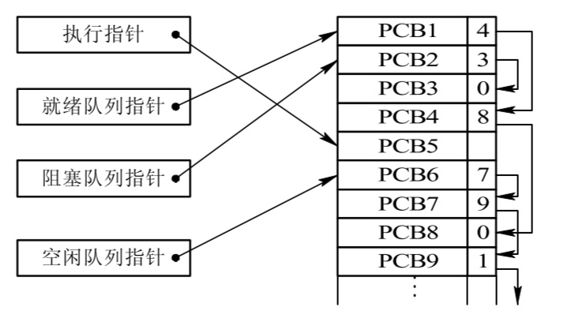
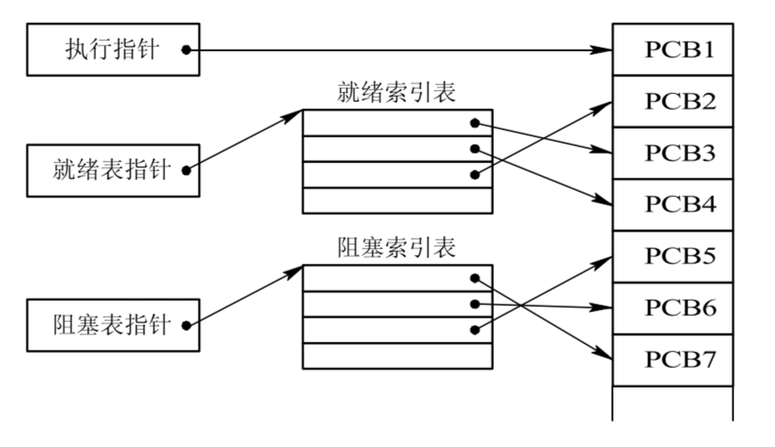

# 进程的状态转换

1. 创建(Create)：进程被创建时处于创建状态。此时操作系统为进程分配资源，初始化进程的数据结构和上下文，并将其加入就绪队列等待执行
2. 就绪(Ready)：进程在创建状态之后进入就绪状态。此时进程已经准备好运行，但由于CPU资源有限，操作系统还未选择该进程执行。进程处于就绪队列中，等待操作系统的调度
3. 运行(Running)：就绪队列中的进程被操作系统选中后，进入运行状态。此时进程占用CPU资源，开始执行指令。进程会一直运行，直到发生阻塞、时间片用完或被其他高优先级进程抢占
4. 阻塞(Blocked)：进程在运行状态中可能由于等待某些事件的发生而暂时无法继续执行，进入阻塞状态。例如，等待用户输入、等待磁盘读写等。进程在阻塞状态中会被移出CPU，不占用CPU资源
5. 终止(Terminate)：进程在执行完任务或被操作系统终止时进入终止状态。此时操作系统会回收进程的资源，并从系统中移除该进程

## PCB的组织方式

进程的PCB中，会有一个变量state来表示进程的当前状态。为了对同一个状态下的各个进程进行统一的管理，操作系统会将各个进程的PCB组织起来。

### 链接方式

按照进程状态将PCB放到不同的队列(链表实现)中，操作系统持有指向各个队列的指针。

- 执行指针：指向当前处于运行态的进程
- 就绪队列指针：指向当前处于就绪态的进程
- 阻塞队列指针：指向当前处于阻塞态的进程，很多操作系统还会根据阻塞原因不同，再分为多个阻塞队列

## 索引方式

根据进程状态的不同，建立不同的索引表(哈希表)，操作系统持有指向各个索引表的指针。

## 实现进程状态转换

操作系统使用原语来完成进程状态的转换。原语是一种特殊的程序，它的执行具有原子性。也就是说，这段程序的运行必须一气呵成，不可中断。

可以用 “关中断指令”和“开中断指令”这两个特权指令实现原子性。正常情况下，CPU每执行完一条指令都会例行检查是否有中断信号需要处理，如果有，则暂停运行当前这段程序，转而执行相应的中断处理程序。但在CPU执行了关中断指令之后，就不再例行检查中断信号，直到执行开中断指令之后才会恢复检查。这样，关中断和开中断之间的这些指令序列就是不可被中断的，这就实现了原子性。

### 创建进程

创建进程时，操作系统使用了创建原语：

1. 创建空白PCB
2. 为进程分配所需资源
3. 初始化PCB
4. 将进程插入就绪队列

创建原语使进程从创建态变为就绪态。

### 终止进程

终止进程时，操作系统使用了撤销原语：

1. 从PCB集合中找到要终止的进程的PCB
2. 若进程正在运行，立即剥夺CPU，将CPU分配给其他进程
3. 终止其所有子进程
4. 将该进程拥有的所有资源归还给其父进程或操作系统
5. 删除PCB

撤销原语使进程从就绪态/阻塞态/运行态变为终止态。

### 阻塞进程

阻塞进程时，操作系统使用了阻塞原语：

1. 找到要阻塞的进程对应的PCB
2. 保护进程运行现场，将PCB状态倌息设置为阻塞态，暫时停止进程运行
3. 将PCB插入相应事件的等待队列

阻塞原语使进程从运行态变为阻塞态。

### 唤醒进程

唤醒进程时，操作系统使用了唤醒原语：

1. 在事件等待队列中找到PCB
2. 将PCB从等待队列移除，设置进程为就绪态
3. 将PCB插入就绪队列，等待被调度

唤醒原语使进程从阻塞态变为就绪态。

### 切换进程

切换进程时，操作系统使用了切换原语：

1. 将要被切换的进程的上下文信息存入PCB
2. 将要被切换的进程的PCB移入相应的就绪队列/阻塞队列
3. 选择另一个进程执行，并更新其PCB
4. 根据PCB恢复新进程所需的运行环境

切换原语使进程从运行态变为就绪态，或者从就绪态变为运行态。

进程的上下文是指进程在运行过程中所包含的所有状态和信息。它包括了进程的程序计数器、寄存器的内容、内存分配和使用情况、打开的文件列表、进程的权限和标识等。当操作系统进行进程切换时，会保存当前进程的上下文，并加载另一个进程的上下文。这样可以确保进程在切换后能够继续执行，而不会丢失其状态和数据。
