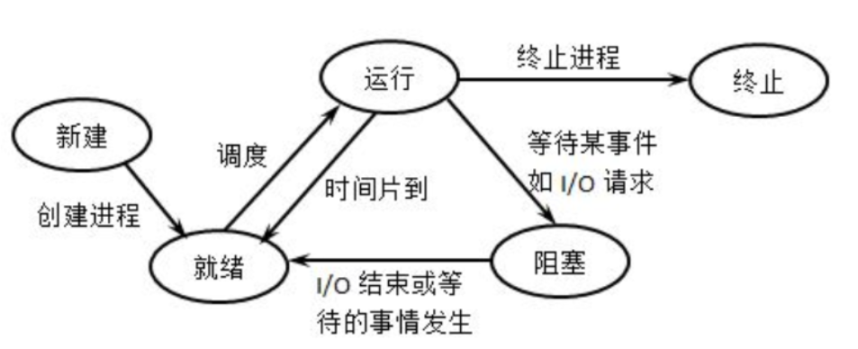

# 进程的状态转换

1. 创建(Create)：进程被创建时处于创建状态。此时操作系统为进程分配资源，初始化进程的数据结构和上下文，并将其加入就绪队列等待执行
2. 就绪(Ready)：进程在创建状态之后进入就绪状态。此时进程已经准备好运行，但由于CPU资源有限，操作系统还未选择该进程执行。进程处于就绪队列中，等待操作系统的调度
3. 运行(Running)：就绪队列中的进程被操作系统选中后，进入运行状态。此时进程占用CPU资源，开始执行指令。进程会一直运行，直到发生阻塞、时间片用完或被其他高优先级进程抢占
4. 阻塞(Blocked)：进程在运行状态中可能由于等待某些事件的发生而暂时无法继续执行，进入阻塞状态。例如，等待用户输入、等待磁盘读写等。进程在阻塞状态中会被移出CPU，不占用CPU资源
5. 终止(Terminate)：进程在执行完任务或被操作系统终止时进入终止状态。此时操作系统会回收进程的资源，并从系统中移除该进程

## PCB的组织方式

进程的PCB中，会有一个变量state来表示进程的当前状态。为了对同一个状态下的各个进程进行统一的管理，操作系统会将各个进程的PCB组织起来。

### 链接方式

按照进程状态将PCB放到不同的队列(链表实现)中，操作系统持有指向各个队列的指针。

- 执行指针：指向当前处于运行态的进程
- 就绪队列指针：指向当前处于就绪态的进程
- 阻塞队列指针：指向当前处于阻塞态的进程，很多操作系统还会根据阻塞原因不同，再分为多个阻塞队列

## 索引方式

根据进程状态的不同，建立不同的索引表(哈希表)，操作系统持有指向各个索引表的指针。

## 实现进程状态转换

操作系统使用原语来完成进程状态的转换。原语是一种特殊的程序，它的执行具有原子性。也就是说，这段程序的运行必须一气呵成，不可中断。

