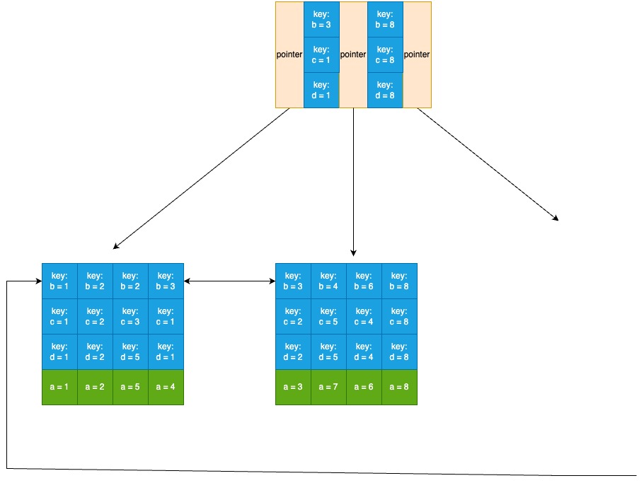

# 联合索引

例如下面的表, a 是主键, b, c, d 一起组成一个联合索引:

| a   | b   | c   | d   | e   |
| --- | --- | --- | --- | --- |
| 4   | 3   | 1   | 1   | ddd |
| 1   | 1   | 1   | 1   | aaa |
| 8   | 8   | 8   | 8   | hhh |
| 2   | 2   | 2   | 2   | bbb |
| 5   | 2   | 3   | 5   | eee |
| 3   | 3   | 2   | 2   | ccc |
| 7   | 4   | 5   | 5   | ggg |
| 6   | 6   | 4   | 4   | fff |

联合索引的结构如下:

对于联合索引来说只不过比单值索引多了几列, 存储引擎会首先根据第一个索引列排序, 如果第一列相等则再根据第二列排序, 依此类推。上图中的 b 列都等于 1 时, 则根据 c 排序, c 列也相等则按 d 列排序。

匹配联合索引的 sql 写法:

1. where 语句的字段名称和联合索引字段完全一样, 且都是基于等号的等值匹配, 那百分百会用上索引。即使你 where 语句里写的字段的顺序和联合索引里的字段顺序不一致, 也没关系, MySQL 会自动优化按联合索引的字段顺序
2. 如果不想把联合索引的所有列都作为查询条件, 就需要遵循最左匹配原则, 比如: `select * from my_table where b = xxx and c = xxx`。 如果写成了 `select * from my_table where c = xxx` 就不会使用索引了, 因为在查找 c 之前需要先查找 b。同理, 写成 `select * from my_table where b = xxx and d = 'xxx'` 也不会使用索引
