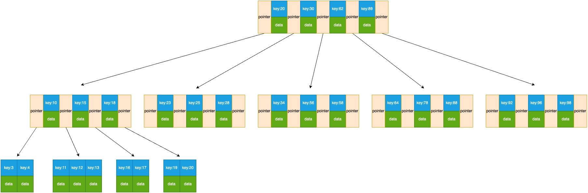
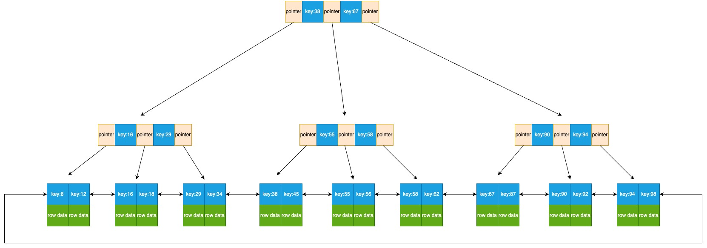
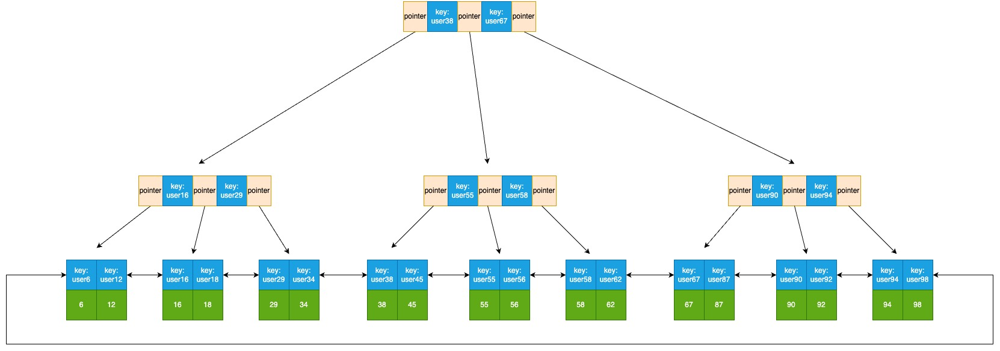

# 索引

索引是数据库表中一个或多个列的值存储的数据结构, 通常用于提高数据库查询的性能。索引可以类比为书籍的目录, 它帮助数据库管理系统快速检索表中的数据, 而无需扫描整个表。

MySQL 的索引使用 B+ 树存储。

# B 树

B 树是一个多叉树, 相比于二叉树有更小的高度。以一个最大度数为 5 阶的 B 树为例, 这个 B 树的每个节点最多可以存储 4 个节点。每个节点有 1 个 key 和对应的数据, 节点之间有指针指向它的子节点。两个父节点之间的所有子节点都大于左边的父节点, 小于右边的父节点。



# B+ 树

B+ 树在 B 树的基础上做了调整, 使其更适合实现外存储索引结构。

区别在于: 非叶子节点不存储数据, 只存储 key, 用来导航到叶子节点。叶子节点存储 key 和数据, 叶子节点包含所有非叶子节点的 key。叶子节点之间互相指向, 可以方便地进行区间查询。


## 创建索引

```sql
alter table student_info add index 索引名(列名);
```

## 聚集索引

聚集索引(聚簇索引): 将数据存储和索引放在一起, 索引结构的叶子节点保存了对应的行数据。

每张表必须有且只有一个聚集索引。

聚集索引的选取规则:

1. 如果存在主键, 主键就是聚集索引
2. 否则, 如果存在唯一索引, 第一个唯一索引作为聚集索引
3. 否则, InnoDB 自动生成一个隐藏的 rowid 作为聚集索引

例如:

| id(主键) | account | role_id |
| -------- | ------- | ------- |
| 6        | user6   | 1       |
| 12       | user12  | 3       |
| 16       | user16  | 1       |
| 18       | user18  | 3       |
| 29       | user29  | 1       |
| 34       | user34  | 1       |
| 38       | user38  | 1       |
| 45       | user45  | 2       |
| 55       | user55  | 1       |
| 56       | user56  | 1       |
| 58       | user58  | 1       |
| 62       | user62  | 2       |
| 67       | user67  | 1       |
| 87       | user87  | 3       |
| 90       | user90  | 1       |
| 92       | user92  | 2       |
| 94       | user94  | 1       |
| 98       | user98  | 1       |

主键作为 key, 每一个叶子节点的数据就是对应的行:



## 二级索引

二级索引(辅助索引): 数据和索引分开存储, 索引结构的叶子节点保存的是对应的主键。二级索引可以有多个。

假如以 account 列作为索引, 那么, account 的数据会作为 key, 每一个叶子节点的数据就是对应的主键:



## 回表查询

```sql
select * from my_table where account = 'user12'
```

这条 sql 语句会先从二级索引中找到 account 为 user12 的 key, key 的数据只有主键 12。所以 mysql 还要去聚集索引中查找 key 为 12 的节点, 最终找到了整行的数据。这个过程称为回表查询。

```sql
select * from my_table where id = 12
```

这条 sql 使用主键查询, mysql 就可以去聚集索引中查找 key 为 12 的节点, 并找到整行的数据, 这样就不需要回表查询。

## 覆盖索引

覆盖索引: 查询时使用了索引, 并且需要返回的列在该索引中全部能找到。

比如:

```sql
select * from my_table where id = 12
select id, account from my_table account = 'user12'
```

非覆盖索引(需要回表查询):

```sql
select id, account, role_id from my_table account = 'user12'
```

## 覆盖索引优化超大分页

```sql
select * from my_table order by id limit 9999900, 10
```

在执行这个分页查询时, 需要线把 9999910 条数据先排序, 再返回 9999900 到 9999910 的数据, 很耗费性能。

优化: 通过覆盖索引 + 子查询:

```sql
select *
from my_table a
inner join (
    -- 覆盖索引, 不用回表
    select id from my_table order by id limit 9999900, 10
) b on a.id = b.id
```

## 索引的创建原则

1. 数据量较大(单表超过 10 万条), 且查询频繁的表建立索引
2. 对常作为查询条件, 排序, 分组的字段建立索引
3. 对数据很少重复的(最好是唯一索引)字段建立索引
4. 如果是很长的字符串, 可以建立前缀索引
5. 尽量使用联合索引, 联合索引很多时候可以覆盖索引, 节省空间, 避免回表
6. 索引太多会影响增删改的效率

## 前缀索引

所谓前缀索引, 说白了就是对文本的前几个字符建立索引, 比如以名称的前 10 位来建索引, 这样建立起来的索引更小, 查询效率更快。
