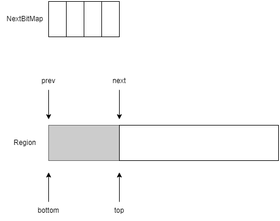
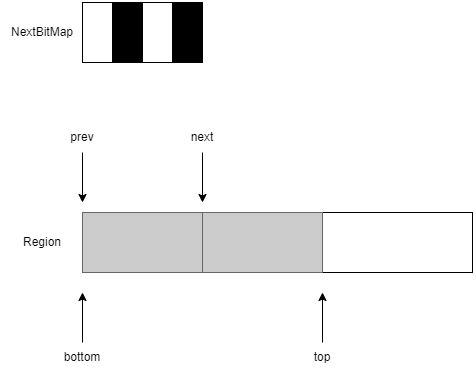
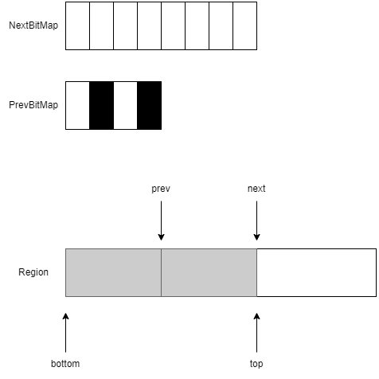
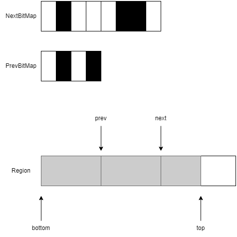
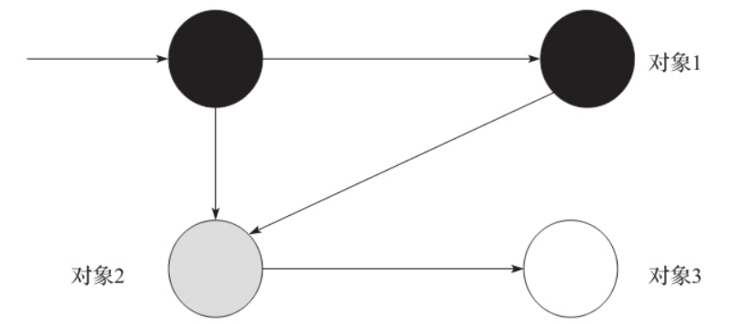
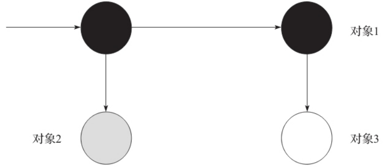
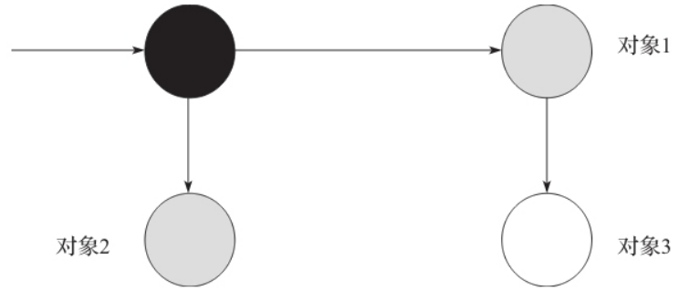
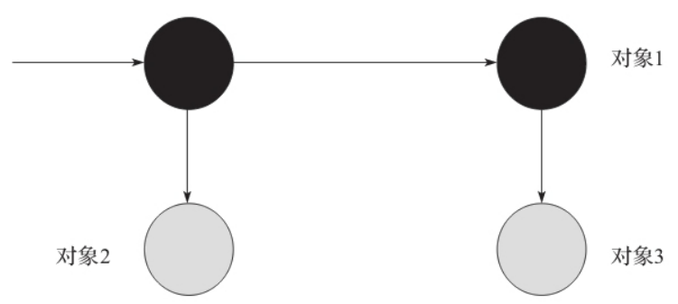

# 并发标记算法

并发标记中用到了几个指针：

1. Bottom：指向 region 的底部
2. Top：指向 region 中已使用的空间的顶部
3. Prev TAMS：上一次并发标记时 Top 指针的位置(Top at Mark Start，TAMS)
4. Next TAMS：新一次并发标记时 Top 指针的位置(Top at Mark Start，TAMS)

当并发标记开始之后，如果有新的对象分配，可以移动 Top 指针，使 Top 指针指向当前内存分配成功的地址。Next 指针和 Top 指针之间的地址就是新的对象被分配的位置。

并发标记引入了两个位图：

1. PrevBitMap：记录 Prev 指针之前内存标记情况、即`[Bottom，Prev]`区间中的对象存活情况
2. NextBitMap：记录 Next 指针之前内存标记情况、即`[Bottom，Next]`区间中的对象存活情况

在并发标记开始之前，GC 线程首先会创建 NextBitMap。位图中的每个比特都对应着关联 Region 内的一个对象,假设 Region 中有 4 个对象，那么 NextBitMap 中就有 4 个比特：

并发标记结束后，NextBitmap 标记了 region 中对象存活的情况，黑色表示堆 region 中对应的对象还活着。在并发标记的同时 Java 线程也会继续运行，所以 Top 会继续增长：

新一轮的并发标记开始，交换位图，重置指针：

第二次并发标记结束：

## 三色标记

并发标记的主要问题是垃圾回收器在标记对象的过程中，Java 线程可能正在改变对象引用关系，从而造成漏标和错标。错标不会影响程序的正确性，只是造成浮动垃圾。但漏标则会导致存活的对象被当做垃圾清理掉，从而影响程序的正确性。为了区别对象的不同状态，引入了三色标记法。

三色标记法是一个逻辑上的抽象，将对象分成三种颜色：

- 白色（white），表示还没有被收集器标记的对象
- 灰色（gray），表示自身已经被标记到，但其字段引用到的其他对象还没有被处理
- 黑色（black），表示自身已经被标记到，且对象本身所有字段引用到的对象也已经被标记

对象在并发标记阶段会被漏标必须满足的两个条件是：

- Java 线程插入了一个从黑色对象到该白色对象的新引用，因为黑色对象已经被标记，如果不对黑色对象重新处理，那么白色对象将被漏标，造成错误
- Java 线程删除了所有从灰色对象到该白色对象的直接或者间接引用，因为灰色对象正在标记，字段引用的对象还没有被标记，如果这个引用的白色对象被删除了，那么这个引用对象也有可能被漏标

因此，要避免对象的漏标，只需要打破上述两个条件中的任何一个即可。所以在并发标记的时候也对应地有两种不同的实现：

- 增量更新算法：关注对象引用插入，把被更新的黑色或者白色对象标记成灰色，打破第一个条件
- SATB：关注引用的删除，即在对象被赋值前，把老的被引用对象记录下来，然后根据这些对象为根重新标记一遍，打破第二个条件

对象 1 和对象 2 都可以通过根对象到达。假定对象 1 已经被标记，所以设置为黑色。处理完对象 1 会把对象 1 的 field 指向的对象地址放入到待标记栈。

当对象 2 已经标记完成，需要把对象 2 的 field 指向的对象，即对象 3 入栈等待处理。如果此时并发标记线程让出 CPU，Java 线程执行并修改了引用关系。对象 2.field=NULL，对象 1.field=对象 3。

这时候并发标记线程重新获得 CPU，对象 1 已经变成黑色，说明 field 都标记完了。对象 2 灰色待处理 field，但是 field 已经为 NULL，所以不需要处理。那么对象 3 如果不进行额外的处理就会导致漏标。

第一种解决方法就是增量更新，它的思路就是当发生了对象 1.field=对象 3 时，就把对象 1 重新标记为灰色，意味着对象 1 的 field 需要被再次处理一遍。

第二种方法就是 SATB，它的思路就是在发生对象 2.field=NULL 之前把对象 2.field 指向的对象 3 放入待标记栈中，相当于把对象 3 设置成灰色。

