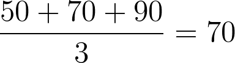
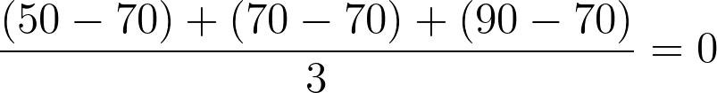
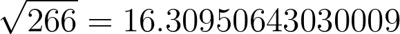
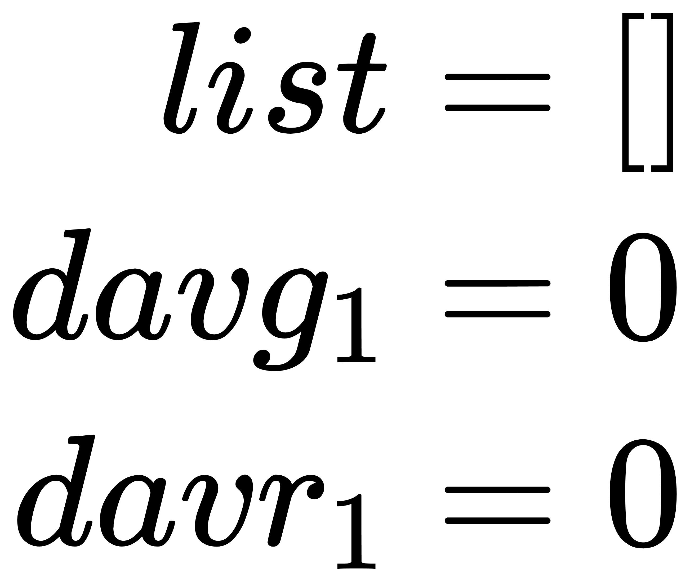
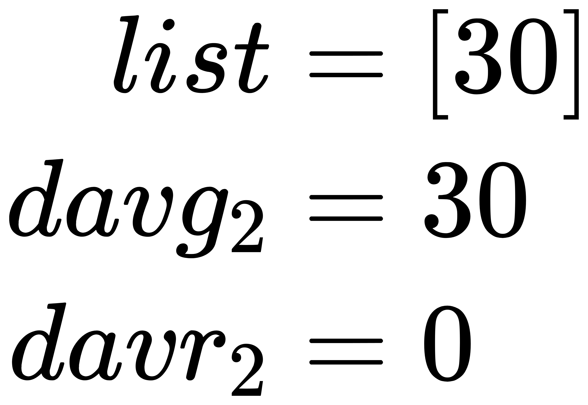
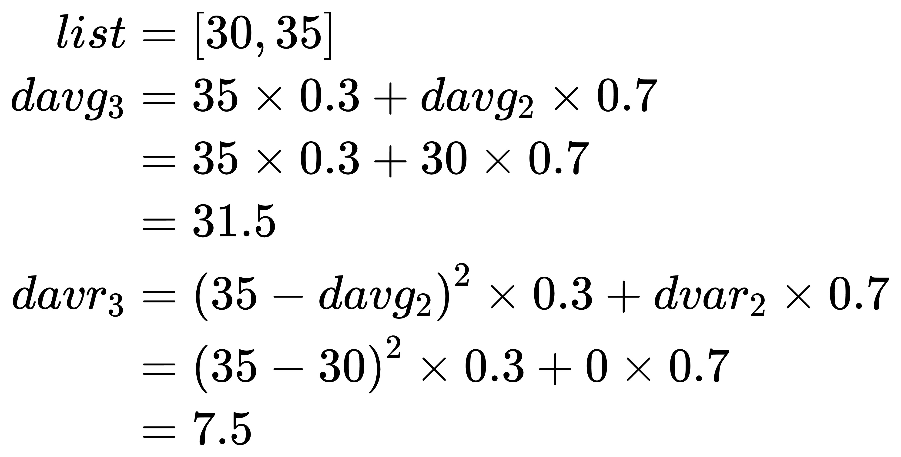
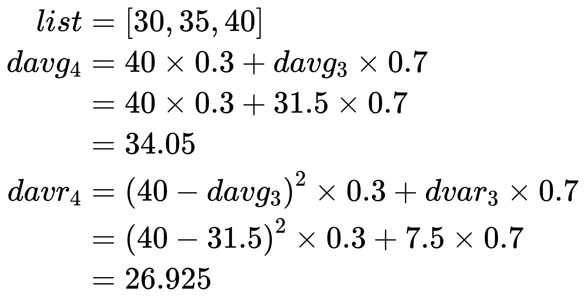
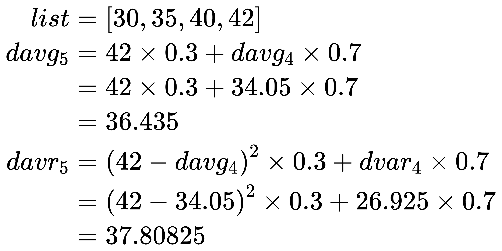
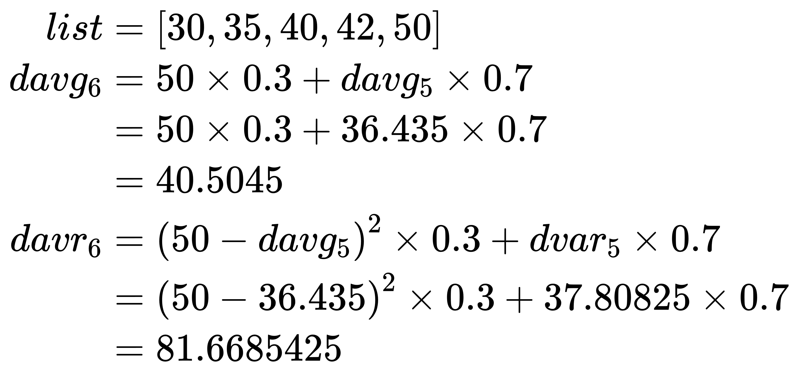
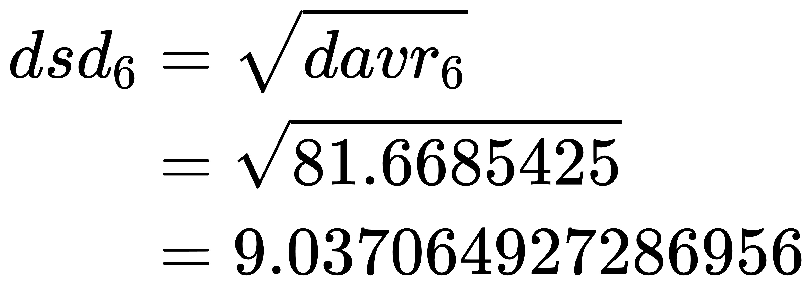

# 停顿预测模型

停顿预测模型是根据历史数据来预测未来的数据, 比如根据暂停时间的历史记录计算下一次的暂停时间。G1 会利用平均值和标准差来预测未来的数据。

## 平均值, 方差和标准差

<!--
\frac{50 + 70 + 90}{3} = 70
\frac{(50 - 70) + (70 - 70) + (90 - 70)}{3} = 0
\frac{(50 - 70)^{2} + (70 - 70)^{2} + (90 - 70)^{2}}{3} = 266
\sqrt{266} = 16.30950643030009
-->

假设 3 位同学的考试成绩分别如下:

- A: 50 分
- B: 70 分
- C: 90 分

那么 A、B、C 这 3 位同学的平均分就是:



像这样将每一项的值相加然后除以所有项的总数就得到了: 平均值。

下面我们来看一看 A、B、C 与基准值的偏差程度各是多少。表示这个偏差程度的值被称为: 标准差。这次我们以平均值作为基准值来尝试计算。

要想知道各项的偏差, 我们首先需要看各项与平均值的差是多少。只要通过各项的值减去平均值先算出差值, 然后将它们相加并除以总数就可以得到偏差:



结果是 0。原因是: 结果中可能存在负数。如果有负数, 就会导致差值被抵消。既然负值的出现会带来不利的影响, 那我们来尝试计算差值的平方:


现在值变成了 266, 可以看到确实有偏差。像这样将"各项减去平均值"的平方相加并除以计总数得到的结果称为: 方差。

因为这个值是通过平方求出来的, 所以还需要计算它的平方根:



去掉小数点后结果是 16。这个值就是前面提到的标准差。标准差表示偏差的幅度。如果标准差很大, 则说明各数据的波动很大；如果标准差为 0, 则说明没有偏差。在本例中, 如果 A、B、C 的分数都为 70, 则标准差为 0。

## 衰减平均值

G1 会根据历史数据来预测下一次数据, 假设 A 过去 5 次的考试成绩如下:

- 第 1 次: 30 分
- 第 2 次: 35 分
- 第 3 次: 40 分
- 第 4 次: 42 分
- 第 5 次: 50 分

那么, 如果要预测第 6 次的考试成绩, 就需要在记录分数的同时时计算衰减平均值(decaying average)。衰减平均值和普通的平均值不同, 它是一种数据越古老, 对平均值的影响就越小的计算方法。我们先来看一看具体的计算方法:

- 第 1 次: 预测成绩: davg_1 = 0, 实际成绩: 30 分
- 第 2 次: 预测成绩: davg_2 = 30, 实际成绩: 35 分
- 第 3 次: 预测成绩: davg_3 = 35 \* 0.3 + davg_2 \* 0.7 = 31.5, 实际成绩: 40 分
- 第 4 次: 预测成绩: davg_4 = 40 \* 0.3 + davg_3 \* 0.7 = 34.05, 实际成绩: 42 分
- 第 5 次: 预测成绩: davg_5 = 42 \* 0.3 + davg_4 \* 0.7 = 36.435, 实际成绩: 50 分
- 第 6 次: 预测成绩: davg_6 = 50 \* 0.3 + davg_5 \* 0.7 = 40.5045 -> 去掉小数 -> 40

在上面这段代码中, 第 6 次成绩的预测值就是 40。衰减平均值的计算方法是将最新考试成绩的 30%, 和上一次衰减平均值的 70% 相加, 然后将结果作为新的衰减平均值。这种计算方法可以减少旧数据对平均值的影响。在历史记录的数据中, 数据越旧, 就越与最新数据没有什么关系。因此, 像衰减平均值那样以减少过去数据对平均值影响的方法来求平均值才是最合适的。

## 衰减方差和衰减标准差

与衰减平均值类似的还有衰减方差(decaying variance)。它的计算方法如下:

预测第 1 次

<!--
\begin{eqnarray}
list & = & [] \\
davg_{1} & = & 0\\
davr_{1} & = & 0
\end{eqnarray}
-->



预测第 2 次

<!--
\begin{eqnarray}
list & = & [30] \\
davg_{2} & = & 30\\
davr_{2} & = & 0
\end{eqnarray}
-->



预测第 3 次

<!--
\begin{eqnarray}
list & = & [30, 35] \\
davg_{3} & = & 35 \times 0.3 + davg_{2} \times 0.7 \\ & = & 35 \times 0.3 + 30 \times 0.7 \\ & = & 31.5 & \\
davr_{3} & = & \left ( 35 - davg_{2} \right ) ^{2}  \times 0.3 + dvar_{2} \times 0.7 \\ & = & \left ( 35 - 30 \right ) ^{2}  \times 0.3 + 0 \times 0.7 \\ & = & 7.5
\end{eqnarray}
-->



预测第 4 次

<!--
\begin{eqnarray}
list & = & [30, 35, 40] \\
davg_{4} & = & 40 \times 0.3 + davg_{3} \times 0.7 \\ & = & 40 \times 0.3 + 31.5 \times 0.7 \\ & = & 34.05 & \\
davr_{4} & = & \left ( 40 - davg_{3} \right ) ^{2}  \times 0.3 + dvar_{3} \times 0.7 \\ & = & \left ( 40 - 31.5 \right ) ^{2}  \times 0.3 + 7.5 \times 0.7 \\ & = & 26.925
\end{eqnarray}
-->



预测第 5 次

<!--
\begin{eqnarray}
list & = & [30, 35, 40, 42] \\
davg_{5} & = & 42 \times 0.3 + davg_{4} \times 0.7 \\ & = & 42 \times 0.3 + 34.05 \times 0.7 \\ & = & 36.435 & \\
davr_{5} & = & \left ( 42 - davg_{4} \right ) ^{2}  \times 0.3 + dvar_{4} \times 0.7 \\ & = & \left ( 42 - 34.05 \right ) ^{2}  \times 0.3 + 26.925 \times 0.7 \\ & = & 37.80825
\end{eqnarray}
-->



预测第 6 次

<!--
\begin{eqnarray}
list & = & [30, 35, 40, 42, 50] \\
davg_{6} & = & 50 \times 0.3 + davg_{5} \times 0.7 \\ & = & 50 \times 0.3 + 36.435 \times 0.7 \\ & = & 40.5045 & \\
davr_{6} & = & \left ( 50 - davg_{5} \right ) ^{2}  \times 0.3 + dvar_{5} \times 0.7 \\ & = & \left ( 50 - 36.435 \right ) ^{2}  \times 0.3 + 37.80825 \times 0.7 \\ & = & 81.6685425
\end{eqnarray}
-->



方差是表示波动与基准值的距离的值。本例中的基准值是: 添加数据时的所有历史记录的衰减平均值。衰减平均值是预测值, 也就是说, 这时的方差表示: 当时的预测值与当时实际的值有多少偏差。方差也采用求衰减均值的方法, 通过慢慢减小过去数值的影响来进行衰减式计算。

然后, 我们再继续算出衰减方差的平方根, 也就是衰减标准差(decaying standard deviation):

<!--
\begin{eqnarray}
dsd_{6} & = & \sqrt{davr_{6}} \\ & = & \sqrt{81.6685425} \\ & = & 9.037064927286956
\end{eqnarray}
-->



这里计算出的衰减标准差就是预测值与实际值之间的偏差。也就是说, 这里可以预测出预测值与实际值的偏差会在 ±9 的范围内。

## 可信度

G1 会考虑某种程度的偏差, 几乎每次都会计算出安全的预测值。具体的计算方法如下:

```
包含偏差的预测值 = 衰减均值 + (可信度/100 * 衰减标准差)
```

这里出现了一个新术语: 可信度。可信度表示通过衰减标准差求出来的波动范围的可信程度。例如当衰减标准差的值是 6 时, 如果可信度是 100%, 则表示将偏差范围设置在 ±9 以内。如果可信度为 50%, 则将偏差范围设置为原范围的一半, 即 ±4.5 以内。G1 中可信度的默认值为 50%。

将可信范围的偏差的最大值和衰减平均值（预测值）相加, 从而求出了安全的预测值:

40 + (50 / 100 \* 9) = 44.5

如果以 A 的考试成绩为例, 那么 G1 会做出预测: A 下次的考试成绩为 44 分

其中衰减方差的计算方法有些问题, 在 JDK 16 修中进行了修改:

[JDK-8252093](https://bugs.openjdk.org/browse/JDK-8252093)
