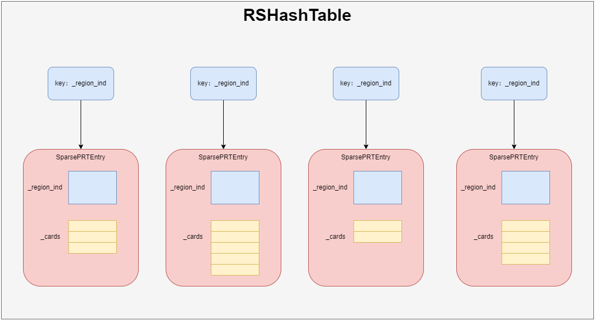

# 稀疏PRT

稀疏PRT通过哈希表的方式来存储，默认长度为4。key是region_index，value是SparsePRTEntry，SparsePRTEntry中存储一个_cards数组，数组的元素对应全局卡表中的卡片索引。



稀疏PRT的定义：

> jdk8u60-master\hotspot\src\share\vm\gc_implementation\g1\sparsePRT.hpp

```cpp
class SparsePRT VALUE_OBJ_CLASS_SPEC {
  //  Iterations are done on the _cur hash table, since they only need to
  //  see entries visible at the start of a collection pause.
  //  All other operations are done using the _next hash table.
  RSHashTable* _cur;
  RSHashTable* _next;

  HeapRegion* _hr;
  // ...
};

class RSHashTable : public CHeapObj<mtGC> {
  // ...
  SparsePRTEntry* _entries;
  // ...
};

class SparsePRTEntry: public CHeapObj<mtGC> {
  // ...
  // typedef int RegionIdx_t;
  RegionIdx_t _region_ind;
  int         _next_index;
  // typedef int CardIdx_t;
  CardIdx_t   _cards[1];
  // ...
};
```

## 添加card

> jdk8u60-master\hotspot\src\share\vm\gc_implementation\g1\sparsePRT.cpp

```cpp
bool SparsePRT::add_card(RegionIdx_t region_id, CardIdx_t card_index) {
  // 扩容
  if (_next->occupied_entries() * 2 > _next->capacity()) {
    expand();
  }
  // 添加到稀疏PRT
  return _next->add_card(region_id, card_index);
}

bool RSHashTable::add_card(RegionIdx_t region_ind, CardIdx_t card_index) {
  // 根据regionId获取SparsePRTEntry
  SparsePRTEntry* e = entry_for_region_ind_create(region_ind);
  // 把card_index存储到SparsePRTEntry中
  SparsePRTEntry::AddCardResult res = e->add_card(card_index);
  if (res == SparsePRTEntry::added) {
    _occupied_cards++;
  }
  return res != SparsePRTEntry::overflow;
}

SparsePRTEntry::AddCardResult SparsePRTEntry::add_card(CardIdx_t card_index) {
#if UNROLL_CARD_LOOPS
  // 这里是循环展开优化的代码
  // 循环展开是一种牺牲程序的尺寸来加快程序的执行速度的优化方法
  // ...
#else
  // 把card_index追加到_cards数组的末尾
  for (int i = 0; i < cards_num(); i++) {
    CardIdx_t c = _cards[i];
    if (c == card_index) {
      return found;
    }
    if (c == NullEntry) { 
      _cards[i] = card_index;
      return added;
    }
  }
#endif
  // 稀疏PRT满了，返回overflow
  return overflow;
}
```
